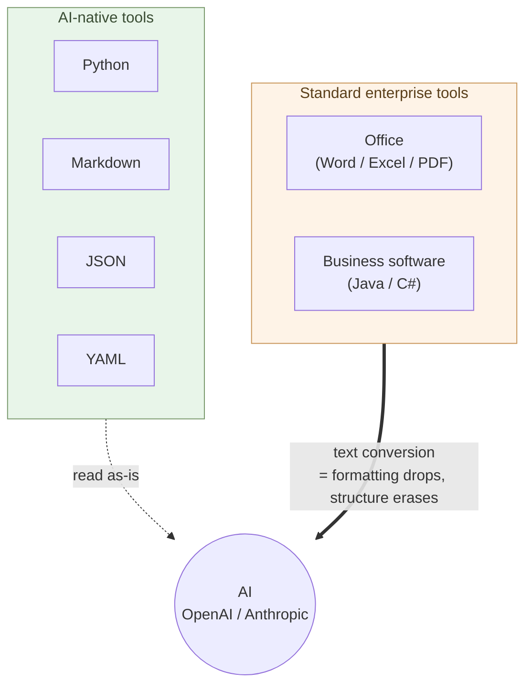
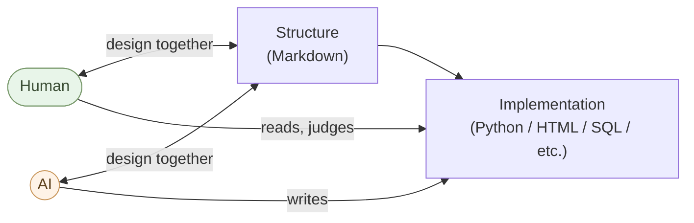

# Prologue — AI's native language is Python and Markdown-style text

Much of corporate paperwork runs on Office. Business systems run on Java and C#. But AI's native language is Python and Markdown-style text.

Right there, in the AI era, runs a decisive divide.

## Change your tools

OpenAI and Anthropic both run on Python. The SDKs are Python. Data is Markdown, JSON, YAML. This is not coincidence — it comes from AI's own structure.

Word files, Excel sheets, PDFs — all require conversion to text before they can be handed to AI. Each conversion drops formatting and erases structure. Existing systems in Java or C# can still be maintained with AI, but **there is little reason left to choose them for new work**. What runs fast in an AI-native environment is the world of Python and Markdown.

> Between AI-native tools and the standard tools of the enterprise, a decisive divide runs through.



## The world is already moving

The move away from Microsoft Office is not just a choice of individuals or companies — it is happening at the level of states.

In 2025, the city of Lyon, France decided to migrate from Microsoft Office to ONLYOFFICE. Germany's digital-affairs ministry announced that all public-sector documents would be in open formats only. In March 2026, a coalition of European companies — IONOS, Nextcloud, Proton, XWiki — announced **Euro-Office**, a project to fork ONLYOFFICE under European governance as a sovereign alternative to Microsoft Office. The first stable release ships in the summer of 2026.

Behind these moves: the U.S. CLOUD Act, geopolitical tensions, and demands for data sovereignty. From the individual to the national level, the move away from Microsoft dependence is proceeding in parallel.

## What to do first

The first step is to **install ONLYOFFICE** and to **externalize the macros, charts, and pivots embedded in Excel** into Python. Order doesn't matter — pick whichever, do them in parallel.

### Install ONLYOFFICE

Install **ONLYOFFICE Desktop Editors** (Word / Excel / PowerPoint–compatible open-source software; the community edition is free).

It installs in minutes, and from the moment it launches you can feel it runs more responsively than Microsoft Office. Word, Excel, PowerPoint all open in ONLYOFFICE. Browsing, formulas, table editing, printing, PDF export — the vast majority of daily work continues to work. Some features (macros, charts, pivots) need the externalization described below — that work proceeds in parallel.

As the first step toward leaving Microsoft Office, build the habit of working in ONLYOFFICE. With Euro-Office's stable release in summer 2026, European users and governance-focused organizations can consider migrating to it too. Both keep compatibility high.

### Macros / VBA → Python (JupyterLab + Polars)

Have Claude rewrite the business logic embedded in Excel and Word as Python. **JupyterLab is a "Python spreadsheet" you run cell by cell** — change a value, hit Shift+Enter, see the result instantly. More readable than VBA, version-controllable in Git, testable, and AI-friendly going forward (VBA is a shrinking technology).

### Charts → matplotlib / Altair

**Draw Excel's charts in Python** (Chapter 1, "Drawing Charts"). Keep the data in Excel; generate the charts in Python as PNG / SVG / interactive HTML. You can also paste them back into the Excel workbook as images.

### Pivots → Polars

Rewrite Excel pivots as **`pivot()` / `group_by().agg()`** (Chapter 1, "Aggregation and Cross-tabulation with Polars"). **A million rows in seconds**, and the result remains as reproducible code.

---

What you need to run this: **install JupyterLab** (`uv tool install jupyterlab` → open `jupyter lab` in the browser), have Claude write the code. That's it.

With just that:

- Monthly aggregation moves from "mouse clicks" to "rerun the script"
- The "secret macro" written in VBA becomes **readable code**
- Data **doesn't freeze the spreadsheet at one million rows**
- When someone leaves, the notebook / script stays

## What comes after — in any order

Once Python + Claude form the base, **there is no required order**. Tackle whichever spot in your work is most painful, most tedious, most expensive.

### Cancel Microsoft 365 and share via Git

Once macros, charts, and pivots are externalized and work runs on ONLYOFFICE, the Microsoft 365 subscription can be cancelled. Collaborative editing in Microsoft 365 becomes much more useful when replaced by Git: change history is preserved, who-changed-what-when is traceable, and conflict resolution is explicit.

### Move substance to structure

Step away from UI; structure the "home" of data and logic. Details follow in later chapters:

- **Word files to Markdown + Mermaid** (Chapters 2 & 3) — convert existing `.docx` in bulk with Claude / pandoc
- **Mutable data to SQLite + Python** (Chapter 4) — migrate customer master / ledger / inventory to SQLite
- **Large-scale analytics to Parquet + DuckDB** (Chapter 4) — tens of millions of rows in seconds
- **Turn workflows into Python apps** (Chapters 1 & 5) — monthly aggregation, invoices, minutes, PowerPoint auto-generation
- **Rewrite business systems via parallel operation** (Chapter 6) — Java/C# → Python, Oracle → PostgreSQL

> What you can do today: install JupyterLab. That alone starts it.

## The core — design structure in Markdown with AI; let AI handle the implementation

Compressed into one line, the practice of this book is:

> **Design structure in Markdown with AI; let AI handle the implementation.**

- **Design the structure** — this is a **joint activity** between human and AI. What to build, how to divide it, what format to hold it in, who the audience is. Write in Markdown while having a conversation with Claude.
- **Implementation** — Python code, HTML/CSS, Mermaid diagrams, SQLite schema, CAD scripts, embedded C/Rust — **all the syntax is written by AI**.

Then: **pick the structure that fits the task, and pick the tool (app / package) that fits the structure**:

- Hierarchy / handoff → **JSON**
- Settings → **YAML**
- Mutable data → **SQLite**
- Columnar large-scale data → **Parquet + DuckDB**
- Human-viewed tables → **OnlyOffice** (`.xlsx`)
- Tabular processing → **Polars** (faster than pandas, easier for AI to write)
- Types / validation → **Pydantic**
- Diagrams → **Mermaid** (structural), **Altair / D3** (visualization), **Blender / Build123d** (3D / CAD)

**This is why the book introduces many apps and packages** — not one all-purpose tool, but the right tool for each structure, combined.

What humans learn is **the eye for structure** and **the eye for tool selection** — that's it. No syntax to memorize. **"Not the skill of writing — the skill of using."** That is the new literacy.



With this alone, **nearly every domain of desk work runs the same way** — writing, software development, data analysis, design, embedded. The era of learning a different tool for each specialty ends (details in Chapter 10, "Knowing What Work to Hand to AI").

## Minimal stack

Independent of occupation, the toolkit you need:

```
Structure         : Markdown
Processing / impl : Python (Claude writes it)
Data              : JSON / YAML / SQLite / Parquet (by use, Chapter 4)
Human-viewed table: OnlyOffice (.xlsx)
Diagrams          : Mermaid
Web               : HTML + CSS + minimal JavaScript
```

Almost all text. AI reads and writes it directly. Still readable in ten years.

## Not efficiency — quality of work and autonomy

Routine work does become several times to several tens of times faster. But that is not the goal.

- **Valuable work** (strategic judgment, customer dialogue, first-time design, responsible decisions) cannot be handed off to AI (Chapter 10). **Redirecting time toward that** is the goal.
- The path the industry pushes is "everyone rides the same vendor's AI" — Microsoft 365 Copilot, ChatGPT Enterprise, Google Workspace AI. This book points the other way: **each person holds their own tools, their own data, their own judgments**.
- One centralized N is fragile; N autonomous units are **strong** (no single point of failure carrying everyone, diversity grows) — survival strategy in the Mythos era.

> Not efficiency. **The quality of work, the autonomy of the individual, and the diversity of society.**

## Closing

Paperwork runs on Office, business systems on Java/C#. But AI's native language is Python and Markdown-style text. Right there, in the AI era, runs a decisive divide.

**Design structure in Markdown with AI; let AI handle the implementation** — keep that one line, and you don't need to relearn a different culture every time the domain changes.

Migration is necessary. **Doing everything in `.docx` and `.xlsx` alone is too inefficient** — formatting redone every time, no code and no history, AI can't read it directly. **Java and C# are the same** — you can't run a single line without piling up class declarations. Drop the idea that "**compiled languages are superior**" — **Python is a tool for running packages**. Type safety **belongs in structured data (JSON Schema, Pydantic, Parquet schema, SQLite constraints) and in the packages themselves (Polars, SQLAlchemy, etc.)** — there is no need to load a heavy type system onto the language itself. **Types are protected at the boundary between data shape and tool** (close to the Linux pipeline philosophy — each part carries its types; the glue stays simple). More importantly, **Java and C# struggle to handle structured data smoothly**. SQLite and Parquet **carry types inside the data itself** (column names, types, constraints) — in Polars, `pl.read_parquet(path)` is one line and the types load from the file. The human **doesn't look up types**.

In Java or C#, by contrast:

- Reading Parquet requires **declaring a `class` matching the schema every time**
- Reading SQLite requires **`rs.getString("name")`, `rs.getDouble("amount")`** — types specified column by column
- Add one column and the code is rewritten

**Maintaining the data's type information as a double-ledger in your code** — how inefficient this is, you stop noticing when you do it every day.

Type safety and performance are **handled inside package implementations** — Polars in Rust, SQLite in C, Pydantic in Rust, DuckDB in C++, NumPy in C / Fortran. **The fast, type-safe compiled languages are alive inside the packages** — Python users receive the benefit in one line of import. **Re-implementing type discipline and performance in your own code every time is the textbook anti-pattern.**

**Doing everything in Excel is exactly the same shape** — aggregation, formatting, pivoting, copy-paste, repeated by hand every time. What should be left to Polars / SQLite, with data types and processing moving as one. **Java and C# express the symptom as a language; Excel expresses it as a spreadsheet** — the disease is the same: **"the work that belongs in the lower layer is being done by the human."**

The depth of the Python package ecosystem is also incomparably greater. In the AI-native era, **both Java/C# and Excel-centric operation are past-tense practices**.

One thing per day, replace your working surface with Python and structured data.

In short — **processing in Python, data in structure**. Because data carries structure, AI knows how to process it, and Python — with structure-aware packages (Polars, Pydantic, SQLAlchemy, etc.) — writes the processing concisely. The triangle of "human ↔ structure ↔ AI" works under exactly this minimal condition.

From the next chapter, we move into specific practices, domain by domain.

---

## Related

- [Structural Analysis 08: Removing the Enterprise IT Tax](/en/insights/enterprise-tax/)
- [Structural Analysis 12: AI and the Individual Business](/en/insights/ai-and-individual/)
- [Are You Still Using Windows and Office?](/en/blog/windows-office-facts/)
- [Learning Debian with Claude](/en/claude-debian/)
