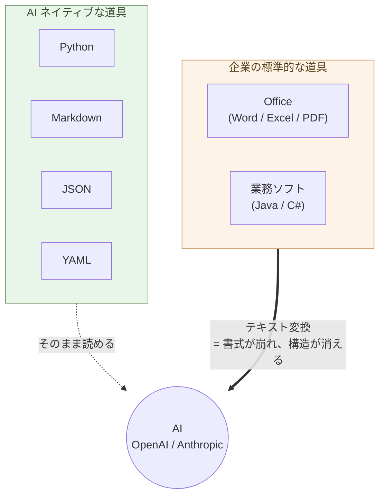

# 序章 — 事務処理はOffice、業務ソフトはJava/C#、しかしAIはPythonとテキスト

事務処理はOffice。業務ソフトはJavaやC#。しかしAIは、Pythonとテキストでできている。

ここに、決定的な断絶がある。

## 道具を変える

OpenAIもAnthropicもPythonで動いている。SDKもPython。データはMarkdown、JSON、YAML。これは偶然ではなく、AIの構造そのものから来ている。

WordファイルもExcelシートもPDFも、AIに渡すにはテキストへの変換が要る。変換するたびに、書式が崩れ、構造が消える。JavaやC#のレガシーコードは、AIに読ませても助言の質が下がる。

> AI ネイティブな道具と、企業の標準的な道具のあいだに、決定的な断絶が走っている。



## 最初にやること

Excel に埋め込まれた以下の三つを、Python に外部化する。**順序は
関係ない、どれからでもいい**。

### マクロ・VBA → Python(JupyterLab + Polars)

Excel に埋め込まれた業務ロジックを、Claude が Python に書き換える。
**JupyterLab はセル単位で実行できる "Python のスプレッドシート"**
── 値を変えて Shift+Enter、即座に結果が出る。VBA より読みやすく、
Git で管理でき、テストでき、AI が今後も書きやすい(VBA は将来縮小
する技術)。

### グラフ → matplotlib / Altair

Excel のチャートを **Python で描く**(第1章「グラフを描く」)。
データだけ Excel に残し、グラフは Python が PNG / SVG /
インタラクティブ HTML として生成。Excel ブックに画像として埋め
戻すこともできる。

### ピボット → Polars

Excel のピボットを **`pivot()` / `group_by().agg()`** に書き換える
(第1章「Polars で集計・クロス集計」)。**100 万行でも秒で集計**、
結果が再現可能なコードとして残る。

---

実行に必要なのは:**JupyterLab を入れる**
(`uv tool install jupyterlab` → ブラウザで `jupyter lab`)、
Claude にコードを書いてもらう、それだけ。

これだけで:

- 月次集計が「マウス操作」から「スクリプト再実行」に変わる
- VBA の「秘伝のマクロ」が **読めるコード** に変わる
- データが **100 万行に増えても固まらない**
- 担当者が辞めても、ノートブック / スクリプトが残る

## その後にできること ── 順序は自由

最初の三つで Python + Claude の基盤ができれば、あとは **順序付けの
必要は無い**。自分の業務で困っているところ、面倒なところ、節約したい
ところから手を付ける。

### Microsoft 365 のサブスクを切る → OnlyOffice

マクロ・グラフ・ピボットが Excel ファイルから外に出ていれば、
**残るのは「データ + 単純なレイアウト + 関数」だけ**。これは
**OnlyOffice**(Excel / Word / PowerPoint 互換の OSS)でほぼ完全
互換で開ける。

- **Microsoft Office → OnlyOffice**:`.xlsx` / `.docx` / `.pptx`
  互換、**サブスク料金ゼロ**(年間数百万〜数千万円が消える)
- **Microsoft 365 共同編集 → OnlyOffice サーバーをセルフホスト**
  (or Nextcloud 等)

逆順だと(外部化せずに OnlyOffice 移行を先にやると)、VBA が動か
ない・ピボットが崩れる・チャートが表示されない、で組織が「やっぱり
Microsoft に戻ろう」となる。**外部化が先**。

### 中身を構造に変える

UI から離れて、データとロジックの「住処」を構造化する。

- **Word ファイルを Markdown + Mermaid に**(第2章・第3章)── 既存
  の `.docx` は Claude / pandoc で Markdown に一括変換、本文中の
  図(フローチャート・組織図・関係図)は Claude に Mermaid 化を
  頼む。新規に書く文書は最初から Markdown + Mermaid。複雑な書式・
  変更履歴・埋め込みオブジェクトを持つ Word は OnlyOffice で運用
- **更新があるデータを SQLite + Python に**(第4章)── Excel 上の
  顧客マスタ・出納帳・在庫を SQLite に移行。**ターミナル + Python
  + SQL の三つを同時に扱う、本書全体で最大の壁**。だが越えれば、
  Excel 運用の事故(編集ミス、書式消失、文字化け、データ破損)から
  解放される
- **大量分析を Parquet + DuckDB に**(第4章)── 数千万行の取引履歴
  を秒で処理
- **Office 形式の入口/出口の変換層を Claude / Polars に**(第5章)

### 業務をアプリ化する

最初に取り組むのは **「人間のための入出力(I/O)を基幹システムや
手作業からローカルの Python に移すこと」**(第1章)。基幹システムは
組織共有のデータ記録元として残し、人間が触れる UI・レポート・帳票
生成・集計はすべて手元に降ろす。基幹システムとは API か
**JSON / Parquet エクスポート** で読み書きするだけ(CSV は届いたら
即変換、手元には持たない ── 第4章)。

毎回手で同じ作業をしているものは、すべて Python アプリ化の対象:

- **Excel ワークフロー**(月次集計・VLOOKUP/ピボットチェーン・
  マクロ込みテンプレート)→ Claude が Polars + 業務ロジックを書く
- **PowerPoint 自動生成**(月次経営報告・週次進捗・顧客提案書・
  営業資料)→ Claude が `python-pptx` でスライドを生成。**100 社
  ぶんの提案書もループで一気に**
- **文書(Word / PDF)自動生成**(請求書・見積書・契約書・月次
  レポート・議事録・商品カタログ)→ Markdown テンプレート + Claude
  が書く Python(`pandoc` / `python-docx` / `weasyprint`)── 請求
  書 100 通がスクリプト一発で
- **議事録自動化** → 録音を Whisper で文字起こし、Claude が Markdown
  に整形、要約とアクションアイテム抽出まで自動化
- **会計 SaaS のサブスクが要らなくなる** ── 請求書発行も上記の
  パターンで完結する(第1章「個人の生産性向上は、基幹システムの
  簡素化につながる」)

新規に自分で書くスライド(社内勉強会・カンファレンス発表)は
Marp(第3章)、**データから自動生成するものは python-pptx /
python-docx / pandoc** ── 用途で使い分ける。

### 組織レベルの業務システム書き換え(第6章)

Java / C# / Oracle / SQL Server で動く業務システムを、Python /
PostgreSQL に **並行稼働で書き換える**。書き換えコストは AI で
10 分の 1 になった ── ベンダーロックインから抜ける最終ステップ。
組織の意思決定が要るが、**ここで身につけた個人の能力があってこそ
成立する**。

> 今日できるのは、JupyterLab を入れる ── それだけで始まる。

## 効率化の限界 ── 定型業務は数倍、価値ある仕事はほぼ変わらない

ここまでの道具立てで、**定型業務の効率は数倍〜数十倍に上がる**。
月次集計、定型 PowerPoint、請求書 100 通、議事録、毎月同じ Excel
操作 ── Python アプリ化で「半日かかっていた作業が数分」になる。

しかし、**それは仕事全体の効率化を意味しない**。

価値がある仕事 ── 戦略判断、顧客の本当のニーズを引き出すこと、
未経験の問題の最初の設計、組織の方向決め、倫理的判断、新しい価値の
創造 ── これらは **AI では肩代わりできない**(第10章で詳述)。
AI が下書きを出すことはあっても、最終判断と責任は人間に残る。

:::compare
| 仕事の種類 | AI で効率化できるか |
| --- | --- |
| 定型業務(月次集計、定型レポート、テンプレ提案書、請求書) | **数倍〜数十倍** |
| 知識処理(調べ物、要約、翻訳、コード生成) | 数倍 |
| 価値ある判断・創造(戦略、顧客対話、新規設計、責任ある決断) | **ほぼ変わらない** |
:::

「AI で全部効率化できる」は誤った期待だ。AI が消す対象は **そもそも
AI に任せれば良かった仕事** であって、**人間にしかできない仕事は
残り続ける**。

しかしこれは悪い話ではない。定型業務に費やしていた時間が解放され、
**人間にしかできない仕事に振り向けられる** ── これこそが本書の
主旨だ。判断、対話、創造、身体性のある仕事に時間を使う。

> AI で効率化できる仕事と、できない仕事を見分ける。
> これが AI ネイティブな働き方の核心だ。

## 全員に関わる

これは技術者だけの話ではない。

事務職のあなたへ。文書は Markdown に変える(ここは比較的簡単)。表は用途で分ける ── 人間が見る集計表は OnlyOffice(Excel 互換の OSS)、更新がある顧客マスタや出納帳は SQLite + Python(本書最大のハードルだが、Claude が書いてくれる)。AI が相談相手になる範囲が、段階的に広がる。

営業のあなたへ。報告書を書式から構造に変える。AIが分析と提案を返してくれる。

現場のあなたへ。手順書をテキストで残す。AIが多言語化し、新人教育を支える。

個人事業主のあなたへ。請求書も契約書もブログもMarkdownで持つ。Claudeが事実上の従業員になる。

開発者のあなたへ。新しく作るものはPython。WebサイトはHTMLとCSSと必要最小限のJavaScript。Reactはいらない。

## Pythonは全員のもの

「Pythonは技術者のもの」という偏見を捨てる。

Excelの変換、メールからの抽出、PDFの整理、ファイル形式の統一。これらは事務職や個人事業主の日常で頻発する作業だ。

Pythonなら数行で終わる。そして書く必要はない。**Claudeに日本語で頼めばコードが返ってくる**。実行するだけ。

書く能力ではなく、使う能力。これが新しいリテラシーである。

## 最小スタック

職種を問わない。

```
文書        : Markdown
図          : Mermaid
処理        : Python
対話的データ作業: JupyterLab + Polars(Excel の代替)
データ      : 用途別 ── JSON / YAML / SQLite / OnlyOffice / Parquet (第4章)
Web         : HTML + CSS + JavaScript
```

ほぼテキスト(SQLite と OnlyOffice の `.xlsx`、JupyterLab の
`.ipynb` だけバイナリ寄りだが、`.ipynb` も中身は JSON で diff が
出る)。それ以外は AI がそのまま読み書きできる。十年後も読める。

## 同じやり方で、全領域に ── Linux + Python + AI

道具立ては多く見えるが、**底に共通する作法は一つ**だ:

> **Linux + Python + AI の補助** ── これだけで、
> 文書も、ソフトウェアも、デザインも、組み込みも、
> **全領域を同じやり方で扱える**。

| 領域 | 同じ作法 |
| --- | --- |
| **ライティング** | Markdown / AsciiDoc / MyST / LaTeX を **テキストで書き、Git で履歴管理、Claude が校正・翻訳** |
| **ソフトウェア開発** | Python / HTML+CSS+JS を **テキストで書き、Git で履歴管理、Claude がコードを書く** |
| **データ作業** | JSON / SQLite / Parquet を **構造で持ち、JupyterLab + Polars + Claude が分析** |
| **デザイン** | Mermaid / Claude デザイン / D3 / Blender / CAD を **スクリプトで書き、Claude が syntax を書く** |
| **組み込み** | Python で設計検証して **Claude が C / C++ に翻訳**(第9章) |

全部、同じ動きだ:**テキストとコードで持つ → Git で履歴 → Claude
が書いて、人間が判断する**。これを身につければ、領域が変わるたび
に **別の道具・別の文化・別のサブスクを学び直す必要が無い**。

### 最初は少し大変、しかし一度きり

正直に言う ── **入口で少し大変**だ:

- Linux に慣れる(ターミナル、ファイルシステム、`ls` / `cd` /
  パーミッション)
- Python の「使い方」を覚える(`uv` のインストール、ライブラリ、
  JupyterLab)
- Git の三つの動作(`add` / `commit` / `push`)
- エディタ(Zed / VSCodium / Neovim のどれか)を選ぶ
- 自分用の miniPC に Forgejo を立てる(第2章)

これだけ越えれば、**全領域で同じ動き方になる**。Word の使い方、
Excel の使い方、Figma の使い方、PowerPoint の使い方、CAD ソフト
ごとの使い方、3D ツールごとの使い方 ── これらを **別々に覚え続け
なくていい**。

> **「入口で少し大変」を一度払えば、「全領域で同じやり方」と
> いう見返りが生涯続く**。Office・Figma・Photoshop・SolidWorks
> など各分野のソフトを別々に習得し続けるコストの **総和** より、
> Linux + Python + AI のほうがはるかに安い。

### Windows / Mac でも作法は揃う

「Linux」と書いたが、**作法そのものは Mac でも Windows でも揃う**:

- **Mac**(macOS): Unix 系で、ターミナル(zsh)・Homebrew・Python
  ── Linux とほぼ同じ感覚で動く
- **Linux**: Ubuntu / Debian / Fedora / Arch、どれでも
- **Windows**: WSL2 + Ubuntu で Linux 互換層が動く ── Microsoft 自身
  が公式に提供している

つまり、**今あるマシンで明日から始められる**。慣れたら miniPC や
Linux マシンに広げる ── 第2章のセルフホストもその先に繋がる。

### AI が syntax を引き受ける ── これが「同じやり方」を成立させる

なぜ「全領域同じ」が成立するのか。理由は **Claude が syntax を書く**
からだ:

- Markdown の記号、Python の文法、HTML/CSS のセレクタ、Mermaid の
  記法、Polars の API、Altair の宣言、D3 の selection、Blender の
  `bpy`、Build123d の幾何、Forgejo の `systemd` ユニット、C の
  ポインタ ── **全部 Claude が書く**
- 人間が学ぶのは:**何を作りたいか、どの構造で持つか、出てきた
  ものが正しいか**
- 一度この作法を身につければ、新しい領域に入るとき
  **「これを Claude に頼めばよい」と分かる**

第3章「AI で簡単になるもの」で見た D3 / Blender / ComfyUI / CAD、
第9章の組み込み ── すべて、この同じ作法の **同じ拡張** だ。
「専門ツールごとに別の使い方を覚える」時代から、「**同じやり方を
全領域に伸ばす**」時代に変わる。

### 要するに ── デスクワークが統一的にできる

文書を書く、表を作る、グラフを描く、図解を組む、コードを書く、
スライドを作る、Web ページを作る、アプリを作る、CAD で部品を設計
する、3D モデルを作る、ハードウェアの制御を書く、レポートを生成
する、メールを返す、契約書を起こす ── **これらが全部、同じやり方
で扱える**。

オフィスソフト・デザインソフト・開発環境・CAD ソフト・各種 SaaS
を **別々に習得する必要が消える**。デスクワーク全体が、Linux +
Python + AI という **一つの作法** に統一される。

> 要するに、**デスクワークが統一的にできてしまう**。
> これが本書の道具立てが目指す到達点だ。

## 細かい作業は AI に任せる ── AI にはその能力がある

「全領域同じやり方」が成立する根拠は、シンプルだ。**細かい作業を
AI にすべて任せられる** ── そして、**AI にはそれをやり切る能力が
ある**。

これまで人間が時間を使ってきた「細かい作業」は、ほぼ全部 AI に
渡せる:

- **syntax を覚える** ── Markdown の記号、Python の文法、CSS の
  セレクタ、SQL の構文、Mermaid の記法、Polars の API、Altair の
  宣言、D3 の selection、Blender の `bpy`、CAD のスクリプト記法、
  `systemd` のユニット、C のポインタ
- **下書きを書く** ── メール、報告書、契約書、提案書、ブログ、
  ドキュメント、議事録、リリースノート
- **整形・変換する** ── Word を Markdown に、Excel を Parquet に、
  英語を日本語に、PDF をテキストに、画像を文字に、表を箇条書きに
- **ボイラープレートを書く** ── Web のテンプレート、設定ファイル、
  初期化コード、テストの足場、Dockerfile、CI 設定
- **調べる** ── API の使い方、ライブラリの選び方、エラーの意味、
  過去の判例や論文の要約
- **校正・推敲・翻訳・要約**

これらは **全部 Claude に渡せる**。そして渡したものを **やり切る
能力が、Claude には本当にある**:

- 数百種類のプログラミング言語と数十種類のマークアップを **並行で
  書ける**
- ビジネス文書、技術文書、行政書類、学術文書まで **下書きを書ける**
- どんな形式間の変換も、ほぼ **瞬時に**
- 文脈に合わせたボイラープレートを **まとめて**
- 自分で検索するより **速く、構造化して** 応える

### 「AI で本当にできるのか」と疑わなくていい

ここで一番起きやすい間違いは、**「念のため自分でやっておこう」**
と細かい作業を抱え込んでしまうこと。これは古い癖だ。

**AI にはその能力がある**。試して、出てきたものを見て、おかしければ
言葉で直してもらう ── これだけで進む(第1章「動かなかったを
恐れない」)。

- 出来上がりが期待と違っていたら → 言葉で修正を頼む
- エラーが出たら → エラー文を貼って原因と修正を頼む
- 何度か往復しても解決しないなら → 設計を見直す合図

「細かい作業を渡しきる」ことに **慣れる** ── これが本書の作法の
土台だ。

### 残るのは判断

細かい作業を AI に渡したあと、人間に残るのは:

- **何を作るか** を決めること
- **どの構造で持つか** を選ぶこと(第4章)
- **出てきたものが正しいか** を判断すること
- **誰に、どう届けるか** を考えること
- **責任を取る** こと

これらは AI には任せられない領域だ(前述「効率化の限界」で詳述)。

> **細かい作業は AI に。判断は人間に。**
> この線を引けば、働き方そのものが変わる。

## 道具は、思考をかたちづくる

Wordで書くと、書式に気を取られる。Markdownで書くと、構造が前に出る。

Excelで考えると、表に収まる発想ばかりになる。JSONで持つと、関係が明示される。

Javaで設計すると、クラス階層を先に作りたくなる。Pythonで書くと、やりたいことを最短で書ける。

Reactで作ると、ビルド設定とバンドルサイズに悩む。HTMLで書くと、内容そのものに集中できる。

> 道具を変えることは、思考を変えることだ。

## 実例: 数字で見る

Word ファイル(50 KB、5,000 文字)を Claude に渡すと、約 8,000 トークン消費する。同じ内容を Markdown にすると 4,000 トークン。**ほぼ半減**。AI 利用料も同じ比率で下がる。

100 個の Word から「肥料」を含む段落を抽出する作業: VBA で 30 分かけてコードを書く。同じデータが Markdown なら、`grep -A 3 肥料 *.md` の 1 行で 0.1 秒。

Excel `.xlsx` 1.2 MB のファイル(10,000 行の売上データ)を **Parquet にすると 60 KB**。**20 分の 1**。書式と冗長な行情報が消える。Claude に渡す時、転送も解析も速くなる。

Excel で運用していた顧客マスタ(5,000 件)を **SQLite に移行した事務職の事例**:
編集中の保存ミスで月 1〜2 回データ破損、その都度バックアップから復元 → SQLite に移行後 **0 件**(トランザクションで保護)。**運用の心理負荷が下がる**。

Excel ピボットで月別売上集計: マウス操作で 5 分、再現性ゼロ(操作の記録は残らない)。同じ集計を **JupyterLab + Polars** で書くと **3 行・0.05 秒**、ノートブックがそのまま記録に残るので翌月も使える(Claude がコードを書く)。VBA で同じ自動化を書くと 30 分〜数時間、しかも一度書いたら誰も読めない「秘伝のマクロ」になる。

Office、Java、C# を使い続けることは、毎日 AI 利用料を 2 倍以上払い続けることでもある。さらに、Microsoft 365 のサブスク料金が組織全体で年間数百万円〜数千万円。OnlyOffice に移行すれば **ライセンス料はゼロ円**。

## 実例: 生み出せるもの

Markdown 1 ファイルから、**印刷品質の PDF・美しい Web ページ・プレゼンスライド・EPUB 電子書籍・AI への入力**が同時に生成できる。同じ原稿が、全媒体に展開する。

`pandoc + xelatex` を使えば、Markdown から **書籍出版品質の PDF** が作れる。表紙、目次、ヘッダー、ページ番号、参考文献、図表番号 ── 学術論文や商業出版の体裁が、コマンド 1 行で生成される。

過去 10 年の社内文書を Markdown 化すれば、Claude が **組織の意思決定パターン**を分析できる。「過去 5 年で同じ議論を何度繰り返したか」「どの方針が定着し、どれが消えたか」が定量化できる。**組織の集合知が、検索可能な財産になる**。

Pythonとテキストの組み合わせは、節約のためだけにあるのではない。**個人や小組織が、これまで大企業や専門家チームにしかできなかった仕事を生み出せる**ようにする道具立てだ。

## もう一つの主旨 ── 自立と分散化、多様性

ここに書く作法には、効率化と並ぶ、もう一つの主旨がある。

「全員が同じ AI を使えば効率がいい」── AI を **集中化と効率化の道具**
としてだけ捉える視点が、いま社会に強い。Microsoft 365 Copilot、
ChatGPT Enterprise、Google Workspace AI ── 業界が押すのはこの方向だ。
組織全体が同じベンダーの AI に乗れば、確かに統一感は出る。サポート
コストも下がる。

しかし、その AI が間違うと、**組織全体が同じ方向に間違える**。
データポリシーが変われば、全員のデータが同じ方向に流れる。
価格が上がれば、全員が同じだけ払う。判断基準が画一化されれば、
**組織から多様性が消える**。Mythos 時代の単一障害点(SPOF)に、
全員が同時に乗ることになる。

本書の作法は逆向きだ。**1 人ずつが、自分の道具・自分のデータ・
自分の判断を持つ**。AI を使うが、AI を **自分の延長** として使う ──
ベンダーの延長になるのではない。Markdown は自分のもの、JSON / YAML /
SQLite は自分のもの、Python のスクリプトは自分のもの、決断は自分のもの。

これは効率の話ではない。**個人の自立と、組織の多様性、社会全体の
レジリエンス**の話だ。分散していれば、誰か一つが倒れても、他は
動き続ける。それぞれが固有の文脈で固有の判断を育てる。
**多様性そのものが強さ**になる。

> AI ネイティブな道具は、効率化のためだけのものではない。
> **個人の自立と、社会の多様性のための**道具でもある。

## 結びに

事務処理はOffice、業務ソフトはJavaやC#、しかしAIはPythonとテキスト。

AI時代に何が変わるか。**情報の処理は、AIでもやれる簡単な仕事になる**。

書式を整える、表を作る、メールを書く、コードを書く、報告書をまとめる——これらは、AIに任せればいい仕事になった。人間がやる必要はない。

Office、Java、C#は、人間が情報処理を担っていた時代の道具である。AIでもやれる仕事を、人間がわざわざ重い道具で抱え込む。これが、いま多くの職場で起きていることだ。

人間の側に残る仕事は、**何をするか、なぜするか、結果をどう判断するか**を決めることだけだ。そこに集中するために、情報処理はAIに渡す。そのための道具が、Pythonとテキストである。

**移行は簡単ではない**。Excel 運用を SQLite に切り替えるには、ターミナルと Python と SQL を同時に学ぶ必要がある。Java / C# のシステムは並行稼働で書き換える必要がある。一晩では済まない。

しかし、**方向は明確** だ。一気にやらなくていい。一日一つ、自分の作業領域を Markdown / SQLite / OnlyOffice / Python に置き換えていく。それだけで、AI が同僚になる範囲が、段階的に広がる。

次の章から、領域ごとに具体的な作法を見ていく。

---

## 関連記事

- [構造分析08: 企業ITの税を引く](/insights/enterprise-tax/)
- [構造分析12: AIと個人事業](/insights/ai-and-individual/)
- [それでも Windows と Office を使い続けますか?](/blog/windows-office-facts/)
- [Claudeと一緒に学ぶDebian](/claude-debian/)
