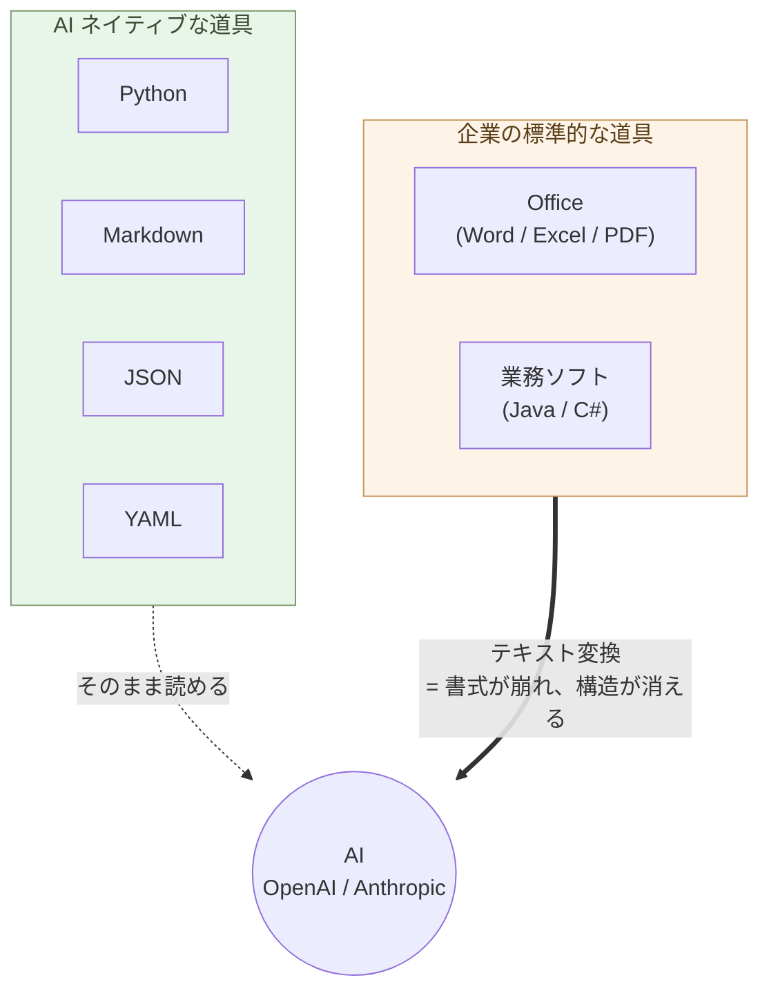

# 序章 — 事務処理はOffice、業務ソフトはJava/C#、しかしAIはPythonとテキスト

事務処理はOffice。業務ソフトはJavaやC#。しかしAIは、Pythonとテキストでできている。

ここに、決定的な断絶がある。

## 道具を変える

OpenAIもAnthropicもPythonで動いている。SDKもPython。データはMarkdown、JSON、YAML。これは偶然ではなく、AIの構造そのものから来ている。

WordファイルもExcelシートもPDFも、AIに渡すにはテキストへの変換が要る。変換するたびに、書式が崩れ、構造が消える。JavaやC#のレガシーコードは、AIに読ませても助言の質が下がる。

> AI ネイティブな道具と、企業の標準的な道具のあいだに、決定的な断絶が走っている。



## すぐ消す ── 方向は明確に

**Office、Java、C#は、最終的には消してしまう**。

これらの道具で行っていた作業——書式を整える、表を作る、画面を作る、コードを書く——は、AIに任せればいい簡単な仕事になった。

AIでもやれる仕事のために、人間が重い道具を抱え込む。それが、いま多くの職場で起きていることだ。

道具を変えれば、思考が変わる。思考が変われば、人間にしかできない仕事に時間を使えるようになる。

## ただし、移行は簡単ではない

「すぐ消す」と言い切ったが、**現実の移行はそこまで簡単ではない**。
正直に書いておく。

- 組織がライセンスを持っているうちは、Word・Excel・PowerPoint
  ファイルが届き続ける ── 自分の作業領域を変えても、入口は閉じない
- Excel 上で運用している顧客マスタや出納帳を SQLite に移すには、
  **ターミナル + Python + SQL の三つを同時に学ぶ** 必要がある ──
  本書全体で最大のハードル(第4章)
- 数十年動いている Java / C# の業務システムは、**並行稼働で書き
  換える** 必要がある(第6章)── 一晩では済まない
- 共同作業者が変わらない限り、PowerPoint で資料を渡してくる相手は
  消えない

それでも、**方向は明確** だ。AI 時代に効率と自立を両立する側に立つ
には、自分の作業領域を Markdown / SQLite / OnlyOffice / Python に
揃えていくしかない。**組織との境界では従来の形式に変換する**(入口
/出口の互換層、第5章)── 中身を変えれば、徐々に世界が変わる。

一気にやらなくていい。一日一つ、Markdown に書いてみる。一週間後、
SQLite を入れてみる。一ヶ月後、Excel を OnlyOffice で開いてみる。
**段階的に進む** ── これが現実的な移行の姿だ。

## 全員に関わる

これは技術者だけの話ではない。

事務職のあなたへ。文書は Markdown に変える(ここは比較的簡単)。表は用途で分ける ── 人間が見る集計表は OnlyOffice(Excel 互換の OSS)、更新がある顧客マスタや出納帳は SQLite + Python(本書最大のハードルだが、Claude が書いてくれる)。AI が相談相手になる範囲が、段階的に広がる。

営業のあなたへ。報告書を書式から構造に変える。AIが分析と提案を返してくれる。

現場のあなたへ。手順書をテキストで残す。AIが多言語化し、新人教育を支える。

個人事業主のあなたへ。請求書も契約書もブログもMarkdownで持つ。Claudeが事実上の従業員になる。

開発者のあなたへ。新しく作るものはPython。WebサイトはHTMLとCSSと必要最小限のJavaScript。Reactはいらない。

## Pythonは全員のもの

「Pythonは技術者のもの」という偏見を捨てる。

Excelの変換、メールからの抽出、PDFの整理、ファイル形式の統一。これらは事務職や個人事業主の日常で頻発する作業だ。

Pythonなら数行で終わる。そして書く必要はない。**Claudeに日本語で頼めばコードが返ってくる**。実行するだけ。

書く能力ではなく、使う能力。これが新しいリテラシーである。

## 最小スタック

職種を問わない。

```
文書       : Markdown
図         : Mermaid
処理       : Python
データ     : 用途別 ── JSON / YAML / SQLite / OnlyOffice / Parquet (第4章)
Web        : HTML + CSS + JavaScript
```

ほぼテキスト(SQLite と OnlyOffice の `.xlsx` だけバイナリ)。
それ以外は AI がそのまま読み書きできる。十年後も読める。

## 道具は、思考をかたちづくる

Wordで書くと、書式に気を取られる。Markdownで書くと、構造が前に出る。

Excelで考えると、表に収まる発想ばかりになる。JSONで持つと、関係が明示される。

Javaで設計すると、クラス階層を先に作りたくなる。Pythonで書くと、やりたいことを最短で書ける。

Reactで作ると、ビルド設定とバンドルサイズに悩む。HTMLで書くと、内容そのものに集中できる。

> 道具を変えることは、思考を変えることだ。

## 実例: 数字で見る

Word ファイル(50 KB、5,000 文字)を Claude に渡すと、約 8,000 トークン消費する。同じ内容を Markdown にすると 4,000 トークン。**ほぼ半減**。AI 利用料も同じ比率で下がる。

100 個の Word から「肥料」を含む段落を抽出する作業: VBA で 30 分かけてコードを書く。同じデータが Markdown なら、`grep -A 3 肥料 *.md` の 1 行で 0.1 秒。

Excel `.xlsx` 1.2 MB のファイル(10,000 行の売上データ)を **Parquet にすると 60 KB**。**20 分の 1**。書式と冗長な行情報が消える。Claude に渡す時、転送も解析も速くなる。

Excel で運用していた顧客マスタ(5,000 件)を **SQLite に移行した事務職の事例**:
編集中の保存ミスで月 1〜2 回データ破損、その都度バックアップから復元 → SQLite に移行後 **0 件**(トランザクションで保護)。**運用の心理負荷が下がる**。

Office、Java、C# を使い続けることは、毎日 AI 利用料を 2 倍以上払い続けることでもある。さらに、Microsoft 365 のサブスク料金が組織全体で年間数百万円〜数千万円。OnlyOffice に移行すれば **ライセンス料はゼロ円**。

## 実例: 生み出せるもの

Markdown 1 ファイルから、**印刷品質の PDF・美しい Web ページ・プレゼンスライド・EPUB 電子書籍・AI への入力**が同時に生成できる。同じ原稿が、全媒体に展開する。

`pandoc + xelatex` を使えば、Markdown から **書籍出版品質の PDF** が作れる。表紙、目次、ヘッダー、ページ番号、参考文献、図表番号 ── 学術論文や商業出版の体裁が、コマンド 1 行で生成される。

過去 10 年の社内文書を Markdown 化すれば、Claude が **組織の意思決定パターン**を分析できる。「過去 5 年で同じ議論を何度繰り返したか」「どの方針が定着し、どれが消えたか」が定量化できる。**組織の集合知が、検索可能な財産になる**。

Pythonとテキストの組み合わせは、節約のためだけにあるのではない。**個人や小組織が、これまで大企業や専門家チームにしかできなかった仕事を生み出せる**ようにする道具立てだ。

## もう一つの主旨 ── 自立と分散化、多様性

ここに書く作法には、効率化と並ぶ、もう一つの主旨がある。

「全員が同じ AI を使えば効率がいい」── AI を **集中化と効率化の道具**
としてだけ捉える視点が、いま社会に強い。Microsoft 365 Copilot、
ChatGPT Enterprise、Google Workspace AI ── 業界が押すのはこの方向だ。
組織全体が同じベンダーの AI に乗れば、確かに統一感は出る。サポート
コストも下がる。

しかし、その AI が間違うと、**組織全体が同じ方向に間違える**。
データポリシーが変われば、全員のデータが同じ方向に流れる。
価格が上がれば、全員が同じだけ払う。判断基準が画一化されれば、
**組織から多様性が消える**。Mythos 時代の単一障害点(SPOF)に、
全員が同時に乗ることになる。

本書の作法は逆向きだ。**1 人ずつが、自分の道具・自分のデータ・
自分の判断を持つ**。AI を使うが、AI を **自分の延長** として使う ──
ベンダーの延長になるのではない。Markdown は自分のもの、CSV は
自分のもの、Python のスクリプトは自分のもの、決断は自分のもの。

これは効率の話ではない。**個人の自立と、組織の多様性、社会全体の
レジリエンス**の話だ。分散していれば、誰か一つが倒れても、他は
動き続ける。それぞれが固有の文脈で固有の判断を育てる。
**多様性そのものが強さ**になる。

> AI ネイティブな道具は、効率化のためだけのものではない。
> **個人の自立と、社会の多様性のための**道具でもある。

## 結びに

事務処理はOffice、業務ソフトはJavaやC#、しかしAIはPythonとテキスト。

AI時代に何が変わるか。**情報の処理は、AIでもやれる簡単な仕事になる**。

書式を整える、表を作る、メールを書く、コードを書く、報告書をまとめる——これらは、AIに任せればいい仕事になった。人間がやる必要はない。

Office、Java、C#は、人間が情報処理を担っていた時代の道具である。AIでもやれる仕事を、人間がわざわざ重い道具で抱え込む。これが、いま多くの職場で起きていることだ。

人間の側に残る仕事は、**何をするか、なぜするか、結果をどう判断するか**を決めることだけだ。そこに集中するために、情報処理はAIに渡す。そのための道具が、Pythonとテキストである。

**移行は簡単ではない**。Excel 運用を SQLite に切り替えるには、ターミナルと Python と SQL を同時に学ぶ必要がある。Java / C# のシステムは並行稼働で書き換える必要がある。一晩では済まない。

しかし、**方向は明確** だ。一気にやらなくていい。一日一つ、自分の作業領域を Markdown / SQLite / OnlyOffice / Python に置き換えていく。それだけで、AI が同僚になる範囲が、段階的に広がる。

次の章から、領域ごとに具体的な作法を見ていく。

---

## 関連記事

- [構造分析08: 企業ITの税を引く](/insights/enterprise-tax/)
- [構造分析12: AIと個人事業](/insights/ai-and-individual/)
- [それでも Windows と Office を使い続けますか?](/blog/windows-office-facts/)
- [Claudeと一緒に学ぶDebian](/claude-debian/)
