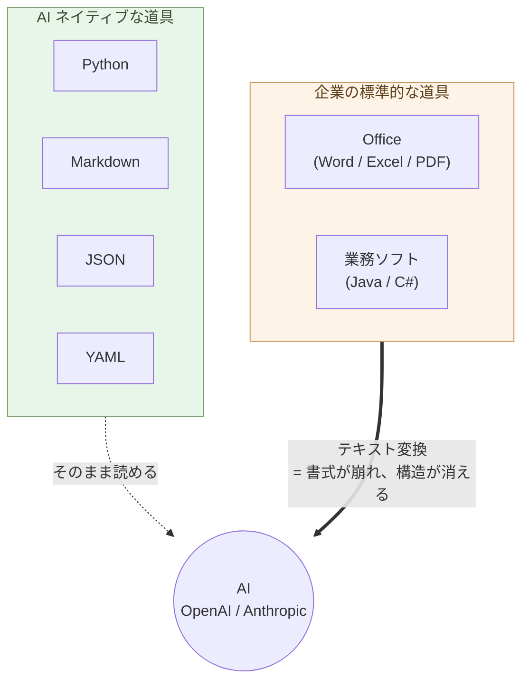
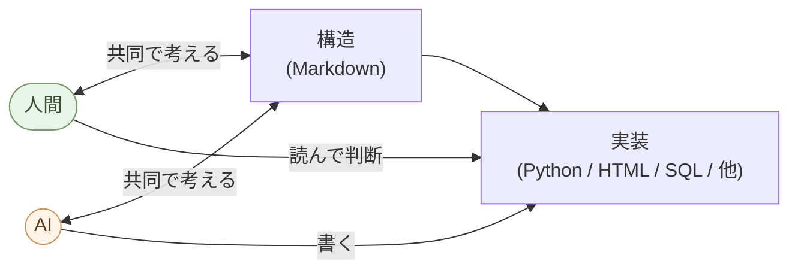

# 序章 — AIの母国語は、PythonとMarkdown形式のテキスト

企業の事務処理の多くはOffice。業務ソフトはJavaやC#。しかしAIは、PythonとMarkdown形式のテキストが母国語である。

ここに、AI時代の決定的な断絶がある。

> **しかし、警告がある**。Microsoft はその Office に AI を組み込み、
> 業務そのものを「自動運転」させようとしている。**人間の「楽をしたい
> 欲望」をつかって儲けに変える** ── これは AI の本来の使い方ではない。
> **Office と AI を切り離してくれていれば済む話だ。だが Microsoft に
> その気はない** ── AI は Office に縛り付ける方向に統合されている。
> だから本書は、まず **Office から離れる** ところから始める。

## 道具を変える

OpenAIもAnthropicもPythonで動いている。SDKもPython。データはMarkdown、JSON、YAML。これは偶然ではなく、AIの構造そのものから来ている。

WordファイルもExcelシートもPDFも、AIに渡すにはテキストへの変換が要る。変換するたびに、書式が崩れ、構造が消える。JavaやC#で書かれた既存システムは、AIで保守はできるが、**新規開発で選ぶ理由はもはや薄い**。AIネイティブな環境で素早く動かせるのは、PythonとMarkdownの世界である

> AI ネイティブな道具と、企業の標準的な道具のあいだに、決定的な断絶が走っている。



## 世界はもう動いている
Microsoft Office からの離脱は、個人や企業の選択だけではない。国家レベルで動いている。

フランスのリヨン市は2025年、Microsoft Officeから ONLYOFFICE への移行を決めた。ドイツのデジタル化省は、公共部門の文書をすべてオープン形式のみにすると発表した。2026年3月、IONOS、Nextcloud、Proton、XWiki など欧州企業の連合が Euro-Office を発表。これはONLYOFFICEを欧州ガバナンスの下にフォークし、Microsoft Officeに対する主権的な代替として提供するプロジェクトで、2026年夏に最初の安定版がリリースされる。

これらの動きの背景には、米国のCLOUD法、地政学的緊張、データ主権の要求がある。個人レベルから国家レベルまで、Microsoft 依存からの離脱は同時並行で進んでいる。

## 最初にやること

最初の一歩は、ONLYOFFICE のインストールと、Excel に埋め込まれたマクロ・グラフ・ピボットの Python への外部化。順序は関係ない、どれからでもいい。並行して進められる。

これと並行して、もう一つ ── **AI を 1 人、手元に置く**。ClaudeかChatGPTの有料プランを1つ契約する。月20ドル(約3000円)で、「とても優秀な、新人の書記」が常時手元で動く。電気や水道と同じ「暮らしのインフラ」だ。

使い方に専門の勉強は要らない。「この領収書、表にまとめて」「このメール、丁寧な言葉で下書きして」── 普段の言葉で頼むだけ。写真も PDF も音声も、ドラッグして渡す。詰まったら AI 自身に聞く ── **AI の使い方を一番よく知っているのは、AI 自身だ**。

そして月3000円の書記が来ると、いろいろなものが要らなくなる ── Microsoft 365(年1.5万円)、ノウハウ本・ビジネス書、業界の定期購読、特化型 SaaS、業務委託、一般論のコンサル。月3000円で月に何万円・何十万円が浮くか、計算してみればいい。データも知識も仕事も、書記と一緒に自分の手元に戻ってくる。

### ONLYOFFICE をインストールする

ONLYOFFICE Desktop Editors(Word / Excel / PowerPoint 互換のOSS、コミュニティ版は無料)をインストールする。

数分でインストールできて、起動した瞬間にMicrosoft Officeより軽快に動くことが分かる。Word も Excel も PowerPoint も、ONLYOFFICEで開ける。データ閲覧、数式、表の編集、印刷、PDF出力など、日常業務の大半はそのまま動く。マクロ・グラフ・ピボットなど一部の機能は、後述の外部化と並行して進めればいい。

Microsoft Office をやめるための最初の一歩として、まずONLYOFFICEで作業する習慣をつける。2026年夏には Euro-Office の安定版もリリースされるので、欧州ユーザーやガバナンスを重視する組織はそちらへの移行も視野に入れられる。どちらも互換性は高い。

### マクロ・VBA → Python(JupyterLab + Polars)

ExcelやWordに埋め込まれた業務ロジックを、Claude が Python に書き換える。
**JupyterLab はセル単位で実行できる "Python のスプレッドシート"**
── 値を変えて Shift+Enter、即座に結果が出る。VBA より読みやすく、
Git で管理でき、テストでき、AI が今後も書きやすい(VBA は将来縮小
する技術)。

### グラフ → matplotlib / Altair

Excel のチャートを **Python で描く**(第1章「グラフを描く」)。
データだけ Excel に残し、グラフは Python が PNG / SVG /
インタラクティブ HTML として生成。Excel ブックに画像として埋め
戻すこともできる。

### ピボット → Polars

Excel のピボットを **`pivot()` / `group_by().agg()`** に書き換える
(第1章「Polars で集計・クロス集計」)。**100 万行でも秒で集計**、
結果が再現可能なコードとして残る。

---

実行に必要なのは:**JupyterLab を入れる**
(`uv tool install jupyterlab` → ブラウザで `jupyter lab`)、
Claude にコードを書いてもらう、それだけ。

これだけで:

- 月次集計が「マウス操作」から「スクリプト再実行」に変わる
- VBA の「秘伝のマクロ」が **読めるコード** に変わる
- データが **100 万行に増えても固まらない**
- 担当者が辞めても、ノートブック / スクリプトが残る

## その後にできること ── 順序は自由

最初の作業で Python + Claude の基盤ができれば、あとは **順序付けの必要は無い**。
自分の業務で困っているところ、面倒なところ、節約したい
ところから手を付ける。　

### Microsoft 365 の解約と Git 共有

マクロ・グラフ・ピボットが外部化され、ONLYOFFICEで業務が回ることが確認できたら、Microsoft 365のサブスクを解約できる。Microsoft 365の共同編集は、Gitを使うようにした方がずっと便利になる。変更履歴が残り、誰がいつ何を変えたかが追え、競合解決も明示的にできる。

### 中身を構造に変える

UI から離れて、データとロジックの「住処」を構造化する。詳細は後続章で扱う:

- **Word ファイルを Markdown + Mermaid に**(第2章・第3章)── 既存の `.docx` は Claude / pandoc で一括変換
- **更新があるデータを SQLite + Python に**(第4章)── 顧客マスタ・出納帳・在庫を SQLite へ
- **大量分析を Parquet + DuckDB に**(第4章)── 数千万行を秒で
- **業務をアプリ化する**(第1章・第5章)── 月次集計・請求書・議事録・PowerPoint 自動生成
- **業務システムを並行稼働で書き換える**(第6章)── Java/C# → Python、Oracle → PostgreSQL

> 今日できるのは、JupyterLab を入れる ── それだけで始まる。

## 核心 ── AI と共同で構造を Markdown で作って、実装は AI に任せる

ここまでの作法を、一行に圧縮するとこうなる:

> **AI と共同で構造を Markdown で作って、実装は AI に任せる**

- **構造を考える** ── 人間と AI の **共同作業**。何を作るか、どう
  分けるか、どの形式で持つか、相手は誰か。Markdown で書きながら
  Claude と対話する。
- **実装** ── Python のコード、HTML/CSS、Mermaid 図、SQLite
  スキーマ、CAD スクリプト、組み込みの C/Rust まで、
  **文法は全部 AI が書く**。

そして、**それぞれの処理に適した構造を選び、その構造に適した道具
(アプリ・パッケージ)を使う**:

- 階層・受け渡し → **JSON**
- 設定 → **YAML**
- 更新があるデータ → **SQLite**
- 列指向の大量データ → **Parquet + DuckDB**
- 人間が見る表 → **OnlyOffice**(`.xlsx`)
- 表データ処理 → **Polars**(pandas より速く、AI が書きやすい)
- 型・検証 → **Pydantic**
- 図 → **Mermaid**(構造図)、**Altair / D3**(可視化)、**Blender
  / Build123d**(3D / CAD)

**本書が多くのアプリ・パッケージを紹介しているのは、この理由だ**
── 1 つの万能ツールではなく、構造ごとの最適道具を組み合わせる。

人間が学ぶのは **構造を見る目** と **道具を選ぶ目** だけ。文法は要らない。
「書く能力ではなく、使う能力」── これが新しいリテラシーである。

AI の得意と苦手も、はっきりしている。**プログラムを書くこと** ── 文法が決まっていて曖昧さがない、AI にとって一番扱いやすい言語 ── と、**事実の調べもの** が得意。苦手なのは「組み立て」── あなたの土地、お客さん、事情を踏まえて全体を設計する仕事は、AI に渡さない。そしてもう一つ、AI は **時々もっともらしい嘘をつく**(「ハルシネーション」)。法律や医療など正確さが要るものは、必ず一次資料で裏を取る ── Web 検索機能をオンにしてソース付きで返してもらい、その元ページを確認する。AI の答えは「材料」として、冷静に見て直して使う。

> **自分は組み立てを考える。AI は事実を集めて、プログラムを書く。**



これだけで、**デスクワークの殆どが同じやり方で扱える** ── ライティ
ング、ソフトウェア開発、データ分析、デザイン、組み込みまで。専門
ソフトごとに別の使い方を覚える時代は、終わる(詳細は第10章「AI に
任せる仕事を見極める」)。

## 最小スタック

職種を問わず、必要な道具立て:

```
構造        : Markdown
処理・実装   : Python(Claude が書く)
データ      : JSON / YAML / SQLite / Parquet(用途別、第4章)
人間が見る表 : OnlyOffice(.xlsx)
図          : Mermaid
Web         : HTML + CSS + 最小限の JavaScript
```

ほぼテキスト。AI がそのまま読み書きできる。10 年後も読める。

## 効率化ではなく、仕事の質と自立

定型業務は数倍〜数十倍に速くなる。だが、それが目的ではない。

- **価値ある仕事**(戦略判断、顧客対話、新規設計、責任ある決断)は
  AI では肩代わりできない(第10章)。浮いた時間は、AI には絶対に
  できない「**ごまかしのきかない現実**」── 土と作物、自分の
  システムとデータ、家族・仲間・若い世代との実地の関わり ── に
  注ぎ込む。**そこに時間を振り向ける** のが目的。
- 業界が押す道は「全員が同じベンダーの AI に乗る」── Microsoft 365
  Copilot、ChatGPT Enterprise、Google Workspace AI。本書はその逆向き
  ── **1 人ずつが、自分の道具・自分のデータ・自分の判断を持つ**。
- 集中化された 1 つより、自立した N が **強い**(単一障害点に全員
  が乗らない、多様性が育つ)── Mythos 時代の生存戦略。
- **データも手元に置く**。クラウドの AI に渡したものは、インターネット
  を通って AI 会社のサーバーに届く ── 顧客の個人情報、家計、健康、
  写真や日記をそのまま貼り付けない。**クラウドの AI には考え方と
  仕組みを聞き、実データは自分のパソコンで扱う**。「顧客名簿を整理
  する手順を教えて」は OK、名簿そのものを貼るのは NG。扱う量が増えて
  きたら、**自分のパソコンの中だけで動く AI**(ローカル LLM、手の
  ひらサイズの計算機でも動く)へ進む ── 停電や通信障害があっても
  動く。これが「自分のデータを持つ」の具体形だ。

### なぜ「ベンダー集中の AI」は大きな問題になるか

Microsoft の **ナデラ**(サティア・ナデラ CEO)が打ち出している方向
を見れば、構造は明快だ ── 「**AI に任せれば人手を減らして儲けが
増える**」という売り方を、Copilot を中核に展開している。これは
**人間の「楽して儲けたい欲望」をレバレッジに AI を売る** 構造だ。

問題は、その売り口が **判断のアウトソース** まで含意していることだ。
コードを書く、文書を下書きする、データを整理する ── ここまでは AI
に任せられる。だが、**何を作るか・何を譲れない条件にするか・結果の
責任を誰が負うか** は、AI には任せられない。**AI は責任を取らない**
── 技術的にも、倫理的にも、法律的にも、責任を引き受ける主体ではない。

それでも「AI に任せれば自動で…」と売られると、買い手(組織)は
判断もアウトソースした気になる。結果として、**ありふれた業務システム
や凡庸な意思決定が大量に作られ、誰も責任を負わない構造**ができあがる。
失敗時のコストは買い手側(組織・社会)に集中し、売り手は subscription
売上を確保し続ける ── これは **産業規模のモラルハザード** だ。

本書はその逆を行く ── AI を **実行の道具** として使い、**判断と責任
は手元に残す**。これが「AI ネイティブな仕事の作法」の倫理的な核だ。

**始めるのも、確認するのも、責任を取るのも、自分** ── AI は下ごしらえ
と仕組み化はしてくれるが、最後は必ず自分の目で確認して OK を出す。
**処理は AI に、責任は自分に**。この線引きさえ守れば、AI は強力な
書記のまま居てくれる。

> 効率化ではない。**仕事の質と、個人の自立と、社会の多様性**の話だ。

## AI 時代の自由人

ここまで本書が説いてきた「**1 人ずつが、自分の道具・自分のデータ・
自分の判断を持つ**」は、新しい思想ではない。中世ヨーロッパで領主
から離れて立ち上がった「自由人」── 自由都市の市民・商人・職人、
そして自分の土地を耕した自由農民 ── が、千年以上前に獲得していた
姿の **AI 時代版** だ。

**なぜ今、それが戻るのか**。歴史教科書では 1450 年代の活版印刷が
宗教改革・科学革命・国民国家の前提を準備したとされる。LLM はその
**数桁上の強度** を持つ ── 印刷術が民主化したのは「読むこと」
(既存の知識へのアクセス)だったが、LLM が民主化したのは「作る
こと」(知識生成・判断・実装)だ。識字という訓練の壁もなく、自然
言語で誰でも使える。**印刷術が個人を「読む者」に変えたように、
LLM は個人を「作る者・判断する者」に変える** ── これが「自由人
の再来」を可能にする物質的基盤だ。

中世の自由人が成立するときに揃った条件は、四つあった。

| 次元 | 中世の自由 | AI 時代の自由 |
|---|---|---|
| 経済的自立 | 自分の土地、独立商売 | 月数千円の AI で事務・開発を自前化、SaaS・SIer 依存からの離脱 |
| 政治的自治 | 領主から自治権を獲得した自由都市 | 自分のデータ・判断・システムを手元に持つ、クラウドベンダー依存からの離脱 |
| 実体に触れる力 | 武装、自ら耕作 | ローカル LLM、OSS、自前サーバー、停電・通信障害でも動くインフラ |
| 教養 | リベラルアーツ(自由七科)── 文法・論理・修辞・算術・幾何・天文・音楽 | リベラルアーツの現代版 ── 判断・言語化・論理・体系的思考・倫理 |

中世のリベラルアーツが「教養だけ」では成立しなかったように、現代
のリベラルアーツも単独では成立しない。**経済的自立・政治的自治・
実体に触れる力、この三つが揃って初めて、リベラルアーツが意味を
持つ**。これが本書の各章が分担している主題でもある ──
**Office と Java/C# を離れる**(道具)、**データを手元に持つ**
(政治的自治)、**Python と Markdown で実体に触れる**(武装)、
そして **構造を見る目と道具を選ぶ目**(リベラルアーツ)。

aiseed.dev のサブシリーズが二本立てになっているのも、この対応で
理解できる ── **ソフトウェア開発編は AI 時代の自由市民・商人・
職人**、**自然農法のシリーズは AI 時代の自由農民**。中世の自由
人が二類型を持っていたように、AI 時代の自由人にも二類型がある
── そして両者を橋渡しする **中間層** が立ち上がる(後述)。

> 本書が説いてきたのは「効率化」や「節約」の話ではない。
> **中世の自由人が獲得した「自由」の、AI 時代における再獲得**だ。

ベンダー集中型 AI(Copilot、ChatGPT Enterprise、Google Workspace
AI)が描く未来は、その逆 ── **領主の屋敷で快適に暮らす農奴の
現代版**だ。本書はその対極を行く。

### 中間層 ── 物理現実を持つビルダー

中世にも、純粋な自由市民と純粋な自由農民の **あいだ** にいた人々
がいた ── 石工・大工・鍛冶屋・織工。ギルドを持ち、都市にも農村
にも仕事を持ち、**都市の自治と土地の現実の両方に足をかけた**
職人層だ。彼らは後にルネサンスを準備する技術蓄積を担った。

AI 時代の中間層も、同じ構造的位置にいる ── **入力は物理現実**
(センサー、観察、材料)、**出力も物理現実**(モノ、収穫物、修理
された機械、建物)、AI は **媒介** として設計と分析を肩代わり
するが、現実に触れる手は人間に残る。

含まれる人々:

- **メイカー・デジタルファブリケーション** ── AI 設計 + 3D プリント、
  レーザー、CNC
- **組み込みエンジニア・ロボット設計者** ── マイコン、PLC、ROS2
- **精密農業・アグリテック** ── センサー、ドローン、畑で動かす
  ローカル LLM
- **製造業の現場技術者** ── 工場の自動化を AI に書き直してもらう
- **AI 診断・画像を併用する医師、整備士、修理工**
- **AI 設計を使う大工・建築家・職人**

この中間層は、**純粋ソフトの抽象性と、純粋物理の直接性をブリッジ
する**。本書の第8章「組み込み」、第9章「農業・自然と AI」が扱う
のは、まさにこの層だ。

> 中間層は、**実体に触れることで力を獲得する**者の現代型である。
> AI 時代の自由人の最も強い型は、ここに現れる可能性が高い。

日本は、製造業・町工場・自然農法・電子工作・修理文化の土壌が厚く、
中間層への移行で **構造的有利** を持つ。純粋ソフトと純粋物理から
こちらへ流入する人々が、AI 時代の新しい層の主力になる。

### これは第二次ルネサンスの始まりだ

「自由人の再来」を別の言い方をすれば、**第二次ルネサンス** だ。
リベラルアーツの復活、ポリマス(万能人)の再来、自然言語による知の
解放、自由都市とギルドの再生、ベンダー集中からの離脱 ── 第一次
ルネサンス(14〜17世紀)が中世の終わりに起こした構造変化と、AI 時代
に起きつつある変化は、項目を並べると一致する。第一次が **印刷術**
によって本格化したように、第二次は **LLM によって本格化する局面に
入った**。

本書の各章で扱う具体的な作法 ── Office を離れる、Python と
Markdown で構造を作る、ローカル AI を持つ、データを手元に保つ、
浮いた時間を自然農法や現場の関わりに振り向ける ── は、いずれも
**第二次ルネサンスの実装の手引き** である。

## 結びに

事務処理は Office、業務ソフトは Java/C#。しかし AI の母国語は
Python と Markdown 形式のテキスト。ここに、AI 時代の決定的な
断絶がある。

**AI と共同で構造を Markdown で作って、実装は AI に任せる** ──
この一行を持っていれば、領域を変えるたびに別の文化を学び直す
必要は無い。

移行は必要だ。**`.docx` と `.xlsx` だけで何でもやるのは効率が
悪すぎる** ── 書式を毎回整え、コードと履歴は残らず、AI が直接
読めない。**Java や C# も同じ** ── 何をするにもクラスを並べない
と一行も動かない。「**コンパイル言語だから優れている**」という
考えは捨てる ── **Python はパッケージを動作させるためのツール**
だ。型安全は **構造型データ(JSON Schema、Pydantic、Parquet
スキーマ、SQLite の制約)とパッケージ側(Polars、SQLAlchemy 等)
で対応すべき問題** ── 言語そのものに重い型システムを載せる必要は
無い。**型はデータの形と道具の境界で守る**(Linux のパイプライン
哲学に近い ── 各部品が型を持ち、繋ぎ役の Python は素朴に保つ)。
何より、**Java や C# はその構造型データを素直に扱うのが難しい**。
SQLite や Parquet には **データ自体が型を持っている**(列名・
型・制約)── Polars なら `pl.read_parquet(path)` の一行で、
型はファイルから読み込まれる。人間は **型を調べない**。

一方 Java や C# では、

- Parquet を読むのに **スキーマに合わせた `class` を毎回宣言**
- SQLite を読むのに **`rs.getString("name")`、`rs.getDouble("amount")`
  と列ごとに型を指定**
- 列が一つ増えるたびに、コードも書き直す

**データの型情報を、コード側で二重帳簿として管理し続ける** ──
これがどれだけ非効率か、毎日それをやっている人は気づかなくなる。

型安全も高速性も、**パッケージ実装の中で対応されている** ──
Polars は Rust、SQLite は C、Pydantic は Rust、DuckDB は C++、
NumPy は C / Fortran。**高速・型安全なコンパイル言語は、パッケージ
実装の側で活きている** ── Python ユーザは一行で恩恵を受け取る。
**人間が毎回、型と性能を自分のコードで再実装するのは、ダメな処理
の典型**だ。

**Excel で何でもやっているのも、まったく同じ構造**だ ── 集計・
整形・ピボット・コピペを毎回手作業で繰り返す。本来 Polars /
SQLite に任せれば、データの型と処理が一体で動く。**Java や C# は
症状が言語、Excel は症状が表計算** ── 病は同じだ:
**「下層に任せるべき仕事を、人間がやり続けている」**。

パッケージ生態系の厚みも Python と桁違い。AI ネイティブな時代に
おいて、**Java や C# も、Excel 中心の運用も、もう過去の作法**。

一日一つ、自分の作業領域を Python と構造型データに置き換えていく。

要するに ── **処理は Python、データは構造型**。データが構造を
持っているから AI も処理の仕方が分かるし、Python も構造型データ
の処理に適したパッケージ(Polars、Pydantic、SQLAlchemy 等)を
使うことで簡潔に書ける。「人間 ↔ 構造 ↔ AI」の三角が機能する
最小条件は、ここに集約される。

次の章から、領域ごとに具体的な作法を見ていく。

---

## 関連記事

- [構造分析08: 企業ITの税を引く](/insights/enterprise-tax/)
- [構造分析12: AIと個人事業](/insights/ai-and-individual/)
- [それでも Windows と Office を使い続けますか?](/blog/windows-office-facts/)
- [Claudeと一緒に学ぶDebian](/claude-debian/)
