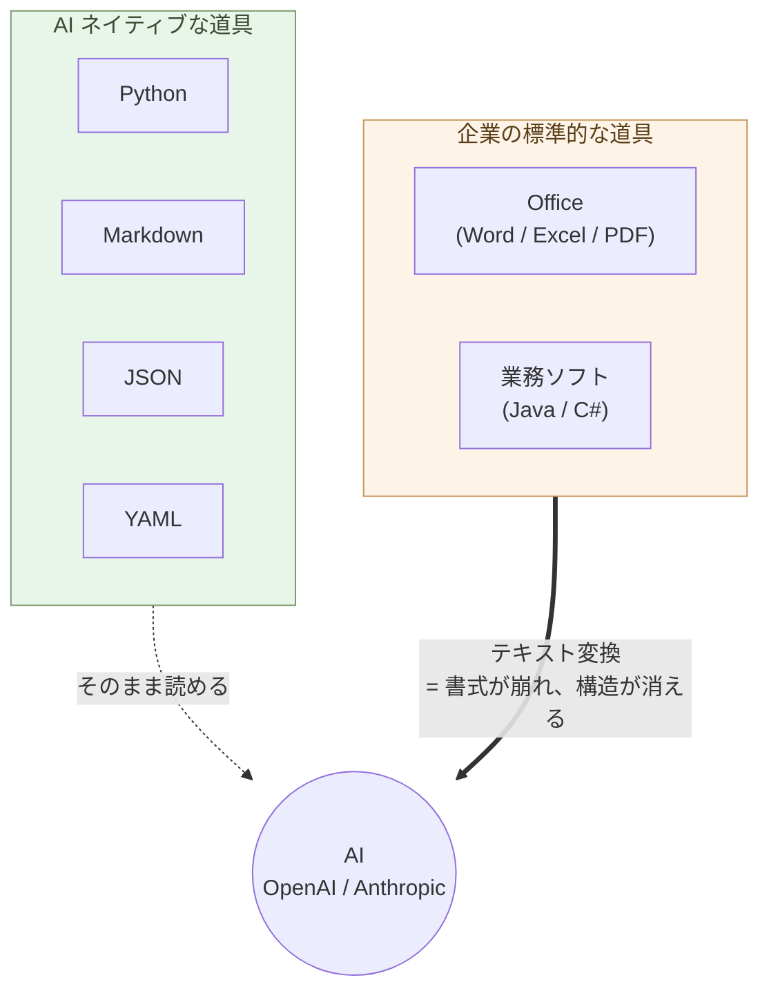

# 序章 — 事務処理はOffice、業務ソフトはJava/C#、しかしAIはPythonとテキスト

事務処理はOffice。業務ソフトはJavaやC#。しかしAIは、Pythonとテキストでできている。

ここに、決定的な断絶がある。

## 道具を変える

OpenAIもAnthropicもPythonで動いている。SDKもPython。データはMarkdown、JSON、YAML。これは偶然ではなく、AIの構造そのものから来ている。

WordファイルもExcelシートもPDFも、AIに渡すにはテキストへの変換が要る。変換するたびに、書式が崩れ、構造が消える。JavaやC#のレガシーコードは、AIに読ませても助言の質が下がる。

> AI ネイティブな道具と、企業の標準的な道具のあいだに、決定的な断絶が走っている。



## すぐ消す ── 方向は明確に

**Office、Java、C#は、最終的には消してしまう**。

これらの道具で行っていた作業——書式を整える、表を作る、画面を作る、コードを書く——は、AIに任せればいい簡単な仕事になった。

AIでもやれる仕事のために、人間が重い道具を抱え込む。それが、いま多くの職場で起きていることだ。

道具を変えれば、思考が変わる。思考が変われば、人間にしかできない仕事に時間を使えるようになる。

## 三段階の移行 ── 簡単ではないが、方向は明確

「すぐ消す」と言い切ったが、**現実の移行は一晩では済まない**。
難易度が違う三段階を、段階的に進む。

### 第一段階 ── Office UI を残したまま、ベンダーから抜ける

最も実行しやすい段階だが、**順序が重要**。
**VBA・グラフ・ピボットを Python で外部化してから、OnlyOffice に
移行する**。逆順だと、OnlyOffice 移行時にこれらが動かず詰まる
(OnlyOffice は VBA・複雑なピボット・一部チャートの完全互換は
提供していない)。

#### Step 1:VBA / マクロ を JupyterLab + Polars に外部化

Excel に埋め込まれていた業務ロジックを、Claude が Python(Polars)
に書き換える。**JupyterLab はセル単位で実行できる "Python の
スプレッドシート"** ── 値を変えて Shift+Enter、即座に結果が出る。
Excel ファイルとは `pl.read_excel` / `write_excel` で連携。定期
実行が必要なら cron で Python スクリプトを動かす。

VBA は OnlyOffice ではほぼ動かない(将来縮小する技術)── 先に
**外に出してしまう** のが正解。Git で管理でき、テストでき、AI が
今後も書きやすい。

#### Step 2:グラフを matplotlib / Altair に外部化

Excel のチャートを **matplotlib / Altair で再現**(第3章「グラフを
描く」)。データだけ Excel に残し、**グラフは Python が生成**
(PNG / SVG / HTML)。Excel ブックに画像として埋め戻すこともできる。
これで Excel ファイル側のグラフ依存が消える ── OnlyOffice 移行時の
グラフ表示崩れの心配がなくなる。

#### Step 3:ピボットテーブルを Polars に外部化

Excel のピボットを **Polars の `pivot()` / `group_by().agg()`** に
書き換える(第3章「Polars で集計・クロス集計」)。集計結果を Excel
に書き戻すか、別シートに静的なクロス表として置く。**ピボットの
"動く部分" が外に出ると、Excel 側は単純な表だけになる** ── OnlyOffice
互換性の心配が消える。

#### Step 4:OnlyOffice に移行

VBA・グラフ・ピボットが外部化されると、Excel ファイルに残るのは
**「データ + 単純なレイアウト + 関数」だけ**。これは OnlyOffice
でほぼ完全互換で開ける。Microsoft 365 のサブスクを切る:

- **Microsoft Office → OnlyOffice**:`.xlsx` / `.docx` / `.pptx`
  互換の OSS。**サブスク料金ゼロ**(年間数百万〜数千万円が消える)
- **Microsoft 365 共同編集 → OnlyOffice サーバーをセルフホスト**
  (or Nextcloud 等)

UI が変わらないので、**組織への説得が比較的しやすい**。「同じ画面、
ライセンス料ゼロ円、複雑な部分は Python で読める形になっている」
── これが第一段階の到達点。

> 順序を間違えると(OnlyOffice 移行を先にやると)、VBA が動かない・
> ピボットが崩れる・チャートが表示されない、で組織が「やっぱり
> Microsoft に戻ろう」となる。**外部化が先、移行は最後**。

### 第二段階 ── 中身を構造に変える(本書全体で最大のハードル)

UI から離れて、データとロジックの「住処」を構造化する。

- **Word ファイルで可能なものを Markdown + Mermaid に**(第1章・第2章)
  ── 既存の `.docx` は Claude / pandoc で Markdown に一括変換、
  本文中の図(フローチャート・組織図・関係図)は Claude に
  Mermaid 化を頼む。自分が新規に書く文書は最初から Markdown +
  Mermaid で書く。複雑な書式・変更履歴・埋め込みオブジェクトを
  持つ Word は Markdown 化できないので、そのまま OnlyOffice で
  運用する
- **図 → Mermaid + Claude デザイン**(第2章)
- **処理 → Python + Claude**(第3章)
- **更新があるデータ → SQLite + Python**(第4章)
- **大量分析 → Parquet + DuckDB**(第4章)
- **Office 形式の入口/出口は Claude / Polars が変換層を書く**
  (第5章)

ここで **ターミナル + Python + SQL** の三つを同時に扱う必要が出
てくる。正直に言って、**本書全体で最大の壁**。だが越えれば、Excel
運用の事故(編集ミス、書式消失、文字化け、データ破損)から解放
される。

### 第三段階 ── 業務をアプリ化する

第二段階で中身を構造化したら、次は **業務をアプリとして固定する**
段階。属人化と手作業を消す。

ここで **最初にやるべきは、人間のための入出力(I/O)を基幹システムや
手作業からローカルの Python に移すこと** だ。基幹システム(ERP、
業務システム)は組織共有のデータ記録元として残すが、人間が触れる
UI・レポート・帳票生成・集計はすべて手元に降ろす。基幹システムとは
API か CSV エクスポートで読み書きするだけ。

**個人レベル ── Excel・PowerPoint・文書の手作業を Python アプリに**

事務職や個人事業主の現場には、長年の運用で複雑化したファイルが
残っている。**毎回手で同じ作業をしているもの** は、すべて Python
アプリ化の対象だ:

- **Excel**:月次集計を毎月手作業で繰り返している、複雑な
  VLOOKUP / INDEX MATCH / ピボットのチェーン、マクロ込みの
  テンプレートが部署間で受け渡されている
- **PowerPoint**:月次経営報告、週次の進捗報告、顧客提案書、
  営業資料 ── 毎回データを差し替えて作る定型スライド
- **文書(Word / PDF)**:請求書、見積書、契約書、月次レポート、
  議事録、商品カタログ ── 毎月数十〜数百通、テンプレートに数字や
  宛名を差し込んで作っているもの
- 担当者が辞めると操作手順が分からなくなる「秘伝のファイル」

これらを **AI に Python アプリとして自動生成させる**:

- **Excel ワークフロー** → Claude が Polars + 業務ロジックを書く。
  入力(SQLite / OnlyOffice / CSV / Excel)、出力(OnlyOffice の
  `.xlsx` / PDF / Web 表示)
- **PowerPoint 自動生成** → Claude が `python-pptx` でスライドを
  プログラム的に生成。データ(数字・グラフ・顧客名)が変わっても、
  スクリプトを再実行するだけで **最新版の `.pptx` が一瞬で出る**
- **文書(Word / PDF)自動生成** → Markdown テンプレート + データ
  + Claude が書く Python(`pandoc` / `python-docx` / `weasyprint`)
  → 請求書 100 通・顧客提案書 50 件・月次レポートが **スクリプト
  一発で生成**。書式は LaTeX / CSS で制御、中身は Markdown と数字
- **議事録自動化** → 録音を Whisper で文字起こし、Claude が
  Markdown に整形、要約とアクションアイテム抽出まで自動化

一回限りの手作業がスクリプト化され、来月も来年も使える。担当者が
辞めても、**コードと README が残る** ── 「秘伝」が消える。

第3章「処理を書く」と第4章「データを持つ」で身につけた作法の応用。
新規に自分で書くスライド(社内勉強会・カンファレンス発表)は
Marp(Markdown → スライド、第2章)、**データから自動生成するもの
は python-pptx / python-docx / pandoc** ── 用途で使い分ける。

**組織レベル ── 業務システム書き換え**(第6章)

Java / C# / Oracle / SQL Server で動く業務システムを、Python /
PostgreSQL に **並行稼働で書き換える**。書き換えコストは AI で
10 分の 1 になった ── ベンダーロックインから抜ける最終ステップ。
組織の意思決定が要る。

> 一気にやらなくていい。**今日できるのは第一段階の一歩目** ──
> Excel の代わりに OnlyOffice を入れる、これだけで始まる。

## 効率化の限界 ── 定型業務は数倍、価値ある仕事はほぼ変わらない

ここまでの三段階で、**定型業務の効率は数倍〜数十倍に上がる**。
月次集計、定型 PowerPoint、請求書 100 通、議事録、毎月同じ Excel
操作 ── Python アプリ化で「半日かかっていた作業が数分」になる。

しかし、**それは仕事全体の効率化を意味しない**。

価値がある仕事 ── 戦略判断、顧客の本当のニーズを引き出すこと、
未経験の問題の最初の設計、組織の方向決め、倫理的判断、新しい価値の
創造 ── これらは **AI では肩代わりできない**(第10章で詳述)。
AI が下書きを出すことはあっても、最終判断と責任は人間に残る。

:::compare
| 仕事の種類 | AI で効率化できるか |
| --- | --- |
| 定型業務(月次集計、定型レポート、テンプレ提案書、請求書) | **数倍〜数十倍** |
| 知識処理(調べ物、要約、翻訳、コード生成) | 数倍 |
| 価値ある判断・創造(戦略、顧客対話、新規設計、責任ある決断) | **ほぼ変わらない** |
:::

「AI で全部効率化できる」は誤った期待だ。AI が消す対象は **そもそも
AI に任せれば良かった仕事** であって、**人間にしかできない仕事は
残り続ける**。

しかしこれは悪い話ではない。定型業務に費やしていた時間が解放され、
**人間にしかできない仕事に振り向けられる** ── これこそが本書の
主旨だ。判断、対話、創造、身体性のある仕事に時間を使う。

> AI で効率化できる仕事と、できない仕事を見分ける。
> これが AI ネイティブな働き方の核心だ。

## 全員に関わる

これは技術者だけの話ではない。

事務職のあなたへ。文書は Markdown に変える(ここは比較的簡単)。表は用途で分ける ── 人間が見る集計表は OnlyOffice(Excel 互換の OSS)、更新がある顧客マスタや出納帳は SQLite + Python(本書最大のハードルだが、Claude が書いてくれる)。AI が相談相手になる範囲が、段階的に広がる。

営業のあなたへ。報告書を書式から構造に変える。AIが分析と提案を返してくれる。

現場のあなたへ。手順書をテキストで残す。AIが多言語化し、新人教育を支える。

個人事業主のあなたへ。請求書も契約書もブログもMarkdownで持つ。Claudeが事実上の従業員になる。

開発者のあなたへ。新しく作るものはPython。WebサイトはHTMLとCSSと必要最小限のJavaScript。Reactはいらない。

## Pythonは全員のもの

「Pythonは技術者のもの」という偏見を捨てる。

Excelの変換、メールからの抽出、PDFの整理、ファイル形式の統一。これらは事務職や個人事業主の日常で頻発する作業だ。

Pythonなら数行で終わる。そして書く必要はない。**Claudeに日本語で頼めばコードが返ってくる**。実行するだけ。

書く能力ではなく、使う能力。これが新しいリテラシーである。

## 最小スタック

職種を問わない。

```
文書        : Markdown
図          : Mermaid
処理        : Python
対話的データ作業: JupyterLab + Polars(Excel の代替)
データ      : 用途別 ── JSON / YAML / SQLite / OnlyOffice / Parquet (第4章)
Web         : HTML + CSS + JavaScript
```

ほぼテキスト(SQLite と OnlyOffice の `.xlsx`、JupyterLab の
`.ipynb` だけバイナリ寄りだが、`.ipynb` も中身は JSON で diff が
出る)。それ以外は AI がそのまま読み書きできる。十年後も読める。

## 道具は、思考をかたちづくる

Wordで書くと、書式に気を取られる。Markdownで書くと、構造が前に出る。

Excelで考えると、表に収まる発想ばかりになる。JSONで持つと、関係が明示される。

Javaで設計すると、クラス階層を先に作りたくなる。Pythonで書くと、やりたいことを最短で書ける。

Reactで作ると、ビルド設定とバンドルサイズに悩む。HTMLで書くと、内容そのものに集中できる。

> 道具を変えることは、思考を変えることだ。

## 実例: 数字で見る

Word ファイル(50 KB、5,000 文字)を Claude に渡すと、約 8,000 トークン消費する。同じ内容を Markdown にすると 4,000 トークン。**ほぼ半減**。AI 利用料も同じ比率で下がる。

100 個の Word から「肥料」を含む段落を抽出する作業: VBA で 30 分かけてコードを書く。同じデータが Markdown なら、`grep -A 3 肥料 *.md` の 1 行で 0.1 秒。

Excel `.xlsx` 1.2 MB のファイル(10,000 行の売上データ)を **Parquet にすると 60 KB**。**20 分の 1**。書式と冗長な行情報が消える。Claude に渡す時、転送も解析も速くなる。

Excel で運用していた顧客マスタ(5,000 件)を **SQLite に移行した事務職の事例**:
編集中の保存ミスで月 1〜2 回データ破損、その都度バックアップから復元 → SQLite に移行後 **0 件**(トランザクションで保護)。**運用の心理負荷が下がる**。

Excel ピボットで月別売上集計: マウス操作で 5 分、再現性ゼロ(操作の記録は残らない)。同じ集計を **JupyterLab + Polars** で書くと **3 行・0.05 秒**、ノートブックがそのまま記録に残るので翌月も使える(Claude がコードを書く)。VBA で同じ自動化を書くと 30 分〜数時間、しかも一度書いたら誰も読めない「秘伝のマクロ」になる。

Office、Java、C# を使い続けることは、毎日 AI 利用料を 2 倍以上払い続けることでもある。さらに、Microsoft 365 のサブスク料金が組織全体で年間数百万円〜数千万円。OnlyOffice に移行すれば **ライセンス料はゼロ円**。

## 実例: 生み出せるもの

Markdown 1 ファイルから、**印刷品質の PDF・美しい Web ページ・プレゼンスライド・EPUB 電子書籍・AI への入力**が同時に生成できる。同じ原稿が、全媒体に展開する。

`pandoc + xelatex` を使えば、Markdown から **書籍出版品質の PDF** が作れる。表紙、目次、ヘッダー、ページ番号、参考文献、図表番号 ── 学術論文や商業出版の体裁が、コマンド 1 行で生成される。

過去 10 年の社内文書を Markdown 化すれば、Claude が **組織の意思決定パターン**を分析できる。「過去 5 年で同じ議論を何度繰り返したか」「どの方針が定着し、どれが消えたか」が定量化できる。**組織の集合知が、検索可能な財産になる**。

Pythonとテキストの組み合わせは、節約のためだけにあるのではない。**個人や小組織が、これまで大企業や専門家チームにしかできなかった仕事を生み出せる**ようにする道具立てだ。

## もう一つの主旨 ── 自立と分散化、多様性

ここに書く作法には、効率化と並ぶ、もう一つの主旨がある。

「全員が同じ AI を使えば効率がいい」── AI を **集中化と効率化の道具**
としてだけ捉える視点が、いま社会に強い。Microsoft 365 Copilot、
ChatGPT Enterprise、Google Workspace AI ── 業界が押すのはこの方向だ。
組織全体が同じベンダーの AI に乗れば、確かに統一感は出る。サポート
コストも下がる。

しかし、その AI が間違うと、**組織全体が同じ方向に間違える**。
データポリシーが変われば、全員のデータが同じ方向に流れる。
価格が上がれば、全員が同じだけ払う。判断基準が画一化されれば、
**組織から多様性が消える**。Mythos 時代の単一障害点(SPOF)に、
全員が同時に乗ることになる。

本書の作法は逆向きだ。**1 人ずつが、自分の道具・自分のデータ・
自分の判断を持つ**。AI を使うが、AI を **自分の延長** として使う ──
ベンダーの延長になるのではない。Markdown は自分のもの、CSV は
自分のもの、Python のスクリプトは自分のもの、決断は自分のもの。

これは効率の話ではない。**個人の自立と、組織の多様性、社会全体の
レジリエンス**の話だ。分散していれば、誰か一つが倒れても、他は
動き続ける。それぞれが固有の文脈で固有の判断を育てる。
**多様性そのものが強さ**になる。

> AI ネイティブな道具は、効率化のためだけのものではない。
> **個人の自立と、社会の多様性のための**道具でもある。

## 結びに

事務処理はOffice、業務ソフトはJavaやC#、しかしAIはPythonとテキスト。

AI時代に何が変わるか。**情報の処理は、AIでもやれる簡単な仕事になる**。

書式を整える、表を作る、メールを書く、コードを書く、報告書をまとめる——これらは、AIに任せればいい仕事になった。人間がやる必要はない。

Office、Java、C#は、人間が情報処理を担っていた時代の道具である。AIでもやれる仕事を、人間がわざわざ重い道具で抱え込む。これが、いま多くの職場で起きていることだ。

人間の側に残る仕事は、**何をするか、なぜするか、結果をどう判断するか**を決めることだけだ。そこに集中するために、情報処理はAIに渡す。そのための道具が、Pythonとテキストである。

**移行は簡単ではない**。Excel 運用を SQLite に切り替えるには、ターミナルと Python と SQL を同時に学ぶ必要がある。Java / C# のシステムは並行稼働で書き換える必要がある。一晩では済まない。

しかし、**方向は明確** だ。一気にやらなくていい。一日一つ、自分の作業領域を Markdown / SQLite / OnlyOffice / Python に置き換えていく。それだけで、AI が同僚になる範囲が、段階的に広がる。

次の章から、領域ごとに具体的な作法を見ていく。

---

## 関連記事

- [構造分析08: 企業ITの税を引く](/insights/enterprise-tax/)
- [構造分析12: AIと個人事業](/insights/ai-and-individual/)
- [それでも Windows と Office を使い続けますか?](/blog/windows-office-facts/)
- [Claudeと一緒に学ぶDebian](/claude-debian/)
