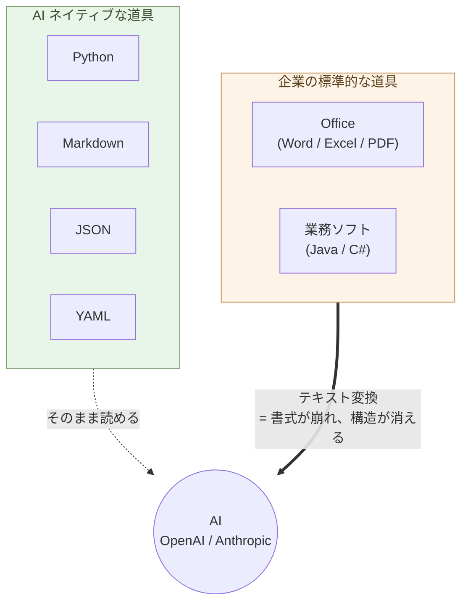

# 序章 — AIの母国語は、PythonとMarkdown形式のテキスト

企業の事務処理の多くはOffice。業務ソフトはJavaやC#。しかしAIは、PythonとMarkdown形式のテキストが母国語である。

ここに、AI時代の決定的な断絶がある。

## 道具を変える

OpenAIもAnthropicもPythonで動いている。SDKもPython。データはMarkdown、JSON、YAML。これは偶然ではなく、AIの構造そのものから来ている。

WordファイルもExcelシートもPDFも、AIに渡すにはテキストへの変換が要る。変換するたびに、書式が崩れ、構造が消える。JavaやC#で書かれた既存システムは、AIで保守はできるが、**新規開発で選ぶ理由はもはや薄い**。AIネイティブな環境で素早く動かせるのは、PythonとMarkdownの世界である

> AI ネイティブな道具と、企業の標準的な道具のあいだに、決定的な断絶が走っている。



## 世界はもう動いている
Microsoft Office からの離脱は、個人や企業の選択だけではない。国家レベルで動いている。

フランスのリヨン市は2025年、Microsoft Officeから ONLYOFFICE への移行を決めた。ドイツのデジタル化省は、公共部門の文書をすべてオープン形式のみにすると発表した。2026年3月、IONOS、Nextcloud、Proton、XWiki など欧州企業の連合が Euro-Office を発表。これはONLYOFFICEを欧州ガバナンスの下にフォークし、Microsoft Officeに対する主権的な代替として提供するプロジェクトで、2026年夏に最初の安定版がリリースされる。

これらの動きの背景には、米国のCLOUD法、地政学的緊張、データ主権の要求がある。個人レベルから国家レベルまで、Microsoft 依存からの離脱は同時並行で進んでいる。

## 最初にやること

最初の一歩は、ONLYOFFICE のインストールと、Excel に埋め込まれたマクロ・グラフ・ピボットの Python への外部化。順序は関係ない、どれからでもいい。並行して進められる。

### ONLYOFFICE をインストールする

ONLYOFFICE Desktop Editors(Word / Excel / PowerPoint 互換のOSS、コミュニティ版は無料)をインストールする。

数分でインストールできて、起動した瞬間にMicrosoft Officeより軽快に動くことが分かる。Word も Excel も PowerPoint も、ONLYOFFICEで開ける。データ閲覧、数式、表の編集、印刷、PDF出力など、日常業務の大半はそのまま動く。マクロ・グラフ・ピボットなど一部の機能は、後述の外部化と並行して進めればいい。

Microsoft Office をやめるための最初の一歩として、まずONLYOFFICEで作業する習慣をつける。2026年夏には Euro-Office の安定版もリリースされるので、欧州ユーザーやガバナンスを重視する組織はそちらへの移行も視野に入れられる。どちらも互換性は高い。

### マクロ・VBA → Python(JupyterLab + Polars)

ExcelやWordに埋め込まれた業務ロジックを、Claude が Python に書き換える。
**JupyterLab はセル単位で実行できる "Python のスプレッドシート"**
── 値を変えて Shift+Enter、即座に結果が出る。VBA より読みやすく、
Git で管理でき、テストでき、AI が今後も書きやすい(VBA は将来縮小
する技術)。

### グラフ → matplotlib / Altair

Excel のチャートを **Python で描く**(第1章「グラフを描く」)。
データだけ Excel に残し、グラフは Python が PNG / SVG /
インタラクティブ HTML として生成。Excel ブックに画像として埋め
戻すこともできる。

### ピボット → Polars

Excel のピボットを **`pivot()` / `group_by().agg()`** に書き換える
(第1章「Polars で集計・クロス集計」)。**100 万行でも秒で集計**、
結果が再現可能なコードとして残る。

---

実行に必要なのは:**JupyterLab を入れる**
(`uv tool install jupyterlab` → ブラウザで `jupyter lab`)、
Claude にコードを書いてもらう、それだけ。

これだけで:

- 月次集計が「マウス操作」から「スクリプト再実行」に変わる
- VBA の「秘伝のマクロ」が **読めるコード** に変わる
- データが **100 万行に増えても固まらない**
- 担当者が辞めても、ノートブック / スクリプトが残る

## その後にできること ── 順序は自由

最初の作業で Python + Claude の基盤ができれば、あとは **順序付けの必要は無い**。
自分の業務で困っているところ、面倒なところ、節約したい
ところから手を付ける。　

### Microsoft 365 の解約と Git 共有

マクロ・グラフ・ピボットが外部化され、ONLYOFFICEで業務が回ることが確認できたら、Microsoft 365のサブスクを解約できる。Microsoft 365の共同編集は、Gitを使うようにした方がずっと便利になる。変更履歴が残り、誰がいつ何を変えたかが追え、競合解決も明示的にできる。

### 中身を構造に変える

UI から離れて、データとロジックの「住処」を構造化する。詳細は後続章で扱う:

- **Word ファイルを Markdown + Mermaid に**(第2章・第3章)── 既存の `.docx` は Claude / pandoc で一括変換
- **更新があるデータを SQLite + Python に**(第4章)── 顧客マスタ・出納帳・在庫を SQLite へ
- **大量分析を Parquet + DuckDB に**(第4章)── 数千万行を秒で
- **業務をアプリ化する**(第1章・第5章)── 月次集計・請求書・議事録・PowerPoint 自動生成
- **業務システムを並行稼働で書き換える**(第6章)── Java/C# → Python、Oracle → PostgreSQL

> 今日できるのは、JupyterLab を入れる ── それだけで始まる。

## 核心 ── AI と共同で構造を Markdown で作って、実装は AI に任せる

ここまでの作法を、一行に圧縮するとこうなる:

> **AI と共同で構造を Markdown で作って、実装は AI に任せる**

- **構造を考える** ── 人間と AI の **共同作業**。何を作るか、どう
  分けるか、どの形式で持つか、相手は誰か。Markdown で書きながら
  Claude と対話する。
- **実装** ── Python のコード、HTML/CSS、Mermaid 図、SQLite
  スキーマ、CAD スクリプト、組み込みの C/Rust まで、
  **文法は全部 AI が書く**。

そして、**それぞれの処理に適した構造を選び、その構造に適した道具
(アプリ・パッケージ)を使う**:

- 階層・受け渡し → **JSON**
- 設定 → **YAML**
- 更新があるデータ → **SQLite**
- 列指向の大量データ → **Parquet + DuckDB**
- 人間が見る表 → **OnlyOffice**(`.xlsx`)
- 表データ処理 → **Polars**(pandas より速く、AI が書きやすい)
- 型・検証 → **Pydantic**
- 図 → **Mermaid**(構造図)、**Altair / D3**(可視化)、**Blender
  / Build123d**(3D / CAD)

**本書が多くのアプリ・パッケージを紹介しているのは、この理由だ**
── 1 つの万能ツールではなく、構造ごとの最適道具を組み合わせる。

人間が学ぶのは **構造を見る目** と **道具を選ぶ目** だけ。文法は要らない。
「書く能力ではなく、使う能力」── これが新しいリテラシーである。


これだけで、**デスクワークの殆どが同じやり方で扱える** ── ライティ
ング、ソフトウェア開発、データ分析、デザイン、組み込みまで。専門
ソフトごとに別の使い方を覚える時代は、終わる(詳細は第10章「AI に
任せる仕事を見極める」)。

## 最小スタック

職種を問わず、必要な道具立て:

```
構造        : Markdown
処理・実装   : Python(Claude が書く)
データ      : JSON / YAML / SQLite / Parquet(用途別、第4章)
人間が見る表 : OnlyOffice(.xlsx)
図          : Mermaid
Web         : HTML + CSS + 最小限の JavaScript
```

ほぼテキスト。AI がそのまま読み書きできる。10 年後も読める。

## 効率化ではなく、仕事の質と自立

定型業務は数倍〜数十倍に速くなる。だが、それが目的ではない。

- **価値ある仕事**(戦略判断、顧客対話、新規設計、責任ある決断)は
  AI では肩代わりできない(第10章)。**そこに時間を振り向ける** の
  が目的。
- 業界が押す道は「全員が同じベンダーの AI に乗る」── Microsoft 365
  Copilot、ChatGPT Enterprise、Google Workspace AI。本書はその逆向き
  ── **1 人ずつが、自分の道具・自分のデータ・自分の判断を持つ**。
- 集中化された 1 つより、自立した N が **強い**(単一障害点に全員
  が乗らない、多様性が育つ)── Mythos 時代の生存戦略。

> 効率化ではない。**仕事の質と、個人の自立と、社会の多様性**の話だ。

## 結びに

事務処理は Office、業務ソフトは Java/C#。しかし AI の母国語は
Python と Markdown 形式のテキスト。ここに、AI 時代の決定的な
断絶がある。

**AI と共同で構造を Markdown で作って、実装は AI に任せる** ──
この一行を持っていれば、領域を変えるたびに別の文化を学び直す
必要は無い。

移行は必要だ。**`.docx` と `.xlsx` だけで何でもやるのは効率が
悪すぎる** ── 書式を毎回整え、コードと履歴は残らず、AI が直接
読めない。**Java や C# も同じ** ── 何をするにもクラスを並べない
と一行も動かない。「**コンパイル言語だから優れている**」という
考えは捨てる ── **Python はパッケージを動作させるためのツール**
だ。型安全は **構造型データ(JSON Schema、Pydantic、Parquet
スキーマ、SQLite の制約)とパッケージ側(Polars、SQLAlchemy 等)
で対応すべき問題** ── 言語そのものに重い型システムを載せる必要は
無い。**型はデータの形と道具の境界で守る**(Linux のパイプライン
哲学に近い ── 各部品が型を持ち、繋ぎ役の Python は素朴に保つ)。
何より、**Java や C# はその構造型データを素直に扱うのが難しい**
── パッケージ生態系の厚みが Python と桁違いだ。AI ネイティブな
時代において、**Java や C# はもう過去の言語**。

一日一つ、自分の作業領域を Python と構造型データに置き換えていく。

要するに ── **処理は Python、データは構造型**。データが構造を
持っているから AI も処理の仕方が分かるし、Python も構造型データ
の処理に適したパッケージ(Polars、Pydantic、SQLAlchemy 等)を
使うことで簡潔に書ける。「人間 ↔ 構造 ↔ AI」の三角が機能する
最小条件は、ここに集約される。

次の章から、領域ごとに具体的な作法を見ていく。

---

## 関連記事

- [構造分析08: 企業ITの税を引く](/insights/enterprise-tax/)
- [構造分析12: AIと個人事業](/insights/ai-and-individual/)
- [それでも Windows と Office を使い続けますか?](/blog/windows-office-facts/)
- [Claudeと一緒に学ぶDebian](/claude-debian/)
