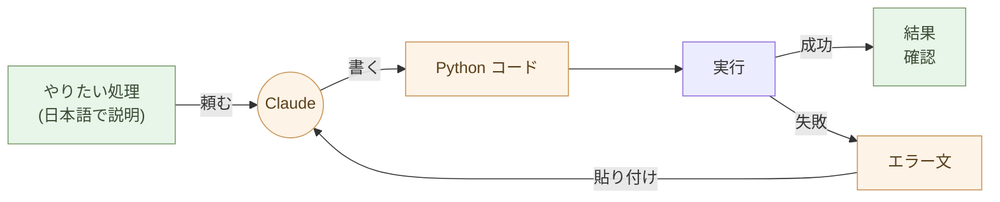

# 処理を書く ── AIにPythonで書いてもらう

**AI ネイティブな働き方への最初の一歩は、ここで決まる**。

序章で挙げた「最初にやること」── **Excel(と Word)に埋め込まれた
マクロ・VBA・グラフ・ピボットを、Python に外部化する** ── を、この
章で実際にやる。三つを Python に出してしまえば、あとは順序自由で
何でも進められる。

道具を変えるのは Python に。**書くのは Claude**、実行するのは人間。
AI が手伝うから、これまで「難しい」とされていたことはほぼ消えた。
**Office を使い続けるよりも遥かにパワーアップする** ── 月次集計が
マウス操作からスクリプト再実行に変わり、データが 100 万行でも
固まらず、グラフはコードで再生成可能、マクロは読めるコードに変わる。
**今すぐやるべきだ**。

繰り返しの作業が一回限りの作業に変わる。Excel の整形、メールの集計、
PDF の抽出、ファイルの一括リネーム ── 「人間が手作業で 30 分かかる」
事務処理は、ほとんどが Python の 10 行で終わる。

## Python は全員のものだ

「Python は技術者のもの」という偏見を捨てる。

Python は、AI が書ける言語の中で最も読みやすい。Java や C# のように長いクラス定義や型注釈が要らない。書きたい処理がそのまま並ぶ。

```python
import json

with open("orders.json") as f:
    rows = json.load(f)

total = sum(r["qty"] * r["price"] for r in rows)
print(f"合計: {total} 円")
```

これだけで JSON を読んで合計を出す。事前知識は要らない。「JSON を開いて、qty と price を掛けて、足し合わせる」── そのままだ。**JSON は型を持つので、`int()` の変換すら要らない**(第4章で扱う ── CSV を捨てて JSON / SQLite を選ぶ理由の一つだ)。

このコードを書く能力は要らない。**読める能力**で十分だ。読めれば、Claude が出してきたコードが正しそうかどうかは判断できる。

## 「書く能力」ではなく「使う能力」

ここに新しいリテラシーがある。

これまでの常識: プログラミングを学ぶ = 言語の文法を覚える、アルゴリズムを設計する、コードを書ける。

新しい常識: プログラミングを使う = 何を処理したいかを言葉にする、Claude にコードを書いてもらう、実行する、結果を確認する。

Excel の関数を覚える時間と、Python を Claude に書いてもらえるようになる時間を比べたら、後者のほうが圧倒的に短い。Excel の関数は Excel の中だけで使えるが、Python はあらゆるデータに使える。

> 書く能力ではなく、使う能力。これが新しいリテラシーである。

「どうコードを書くか」を学ぶ必要はない。「何を処理したいかをどう言語化するか」を学べばいい。これは技術ではなく、思考の整理だ。



## Claude に頼むときの作法

Claude に Python を書いてもらうコツは三つだけだ。

**一: 入力と出力を明示する**

「Excel ファイル `orders.xlsx` を読んで、商品ごとの売上合計を JSON `summary.json` に書き出して」── 入力ファイルと出力ファイル、それぞれの形式が明確なら、Claude は迷わない。

**二: 一つずつ頼む**

「全部やって」ではなく「まずデータを読み込むコードを」「次に集計するコードを」「最後に JSON / SQLite に書き出すコードを」と段階的に頼む。途中で動作を確認できるし、間違いに気づいたときに戻りやすい。

**三: 結果を見て直す**

最初のコードで完璧なものが出ることは少ない。実行して、出力を見て、「これが違う」「ここを変えて」と返す。**会話の往復で正解に近づく**。これがコードを「書く」のではなく「使う」スタイルだ。

## どんな処理が Python になるか

事務職や個人事業主の日常作業のほとんどだ。

- Excel ファイル 100 個から特定のシートだけ集めて結合
- メールの本文から金額を抜き出して JSON / SQLite にする
- PDF を全文テキスト化して検索可能にする
- 画像のサイズを一括で揃える、リネームする
- Web サイトから商品情報をスクレイピングする
- 請求書 PDF を月ごとにフォルダ分けする
- Markdown ファイルを集めて目次を作る

「人間が手作業で繰り返している」作業は、ほぼ全部 Python になる。一度書いてしまえば、来月も再来月も使える。

## 実行環境は JupyterLab ── Excel の関数を書く感覚で Python が動く

Python を使うには、実行環境が要る。事務職や個人事業主に **最も合う
入口は JupyterLab** ── ブラウザで動く「Python のスプレッドシート」。

### Excel のセルに関数を書くのと、同じ感覚

Excel のセルに `=SUM(A1:A100)` と書いて Enter を押すと、答えが
返る。**JupyterLab はこれと同じ感覚で Python が動く** ── セルに
Python を書いて Shift+Enter、その場で結果が出る。

```python
import polars as pl

df = pl.read_excel("orders.xlsx")
df.group_by("item").agg(pl.col("qty").sum(), pl.col("price").sum())
```

これを JupyterLab のセルに貼って Shift+Enter。**下に表形式で結果が
表示される**。Excel のピボットテーブルと同じ操作感だ。ただし、

- 実行手順が **コード(数行)に残る** ── 再現可能、翌月も同じ作業が一瞬で済む
- 「なぜこの計算をしたか」を **Markdown セルで隣に書ける** ── 業務知識が消えない
- グラフもセルの中に描ける(`matplotlib` / `plotly`)
- **数千万行のデータでも遅くならない**(Polars は Excel の数十倍速い)
- ノートブック(`.ipynb`)として保存、Git で履歴管理できる
- 担当者が辞めても、ノートブックを開けば誰でも続きから作業できる

インストールは 2 行(`uv` が入っていれば):

```bash
$ uv tool install jupyterlab
$ jupyter lab
```

ブラウザが開いて、新しいノートブックを作って、セルに書いて、
Shift+Enter。**それだけ**。

### その他の実行環境

JupyterLab で十分でない場面のために、選択肢も挙げておく。

- **Claude のコード実行機能** ── 簡単な処理を、Claude のチャット内
  で即座に試したい時(セットアップ不要)
- **Google Colab** ── ブラウザだけで動く、無料、GPU 利用可能。
  重い処理や AI モデル実験に向く
- **コマンドラインで `python script.py`** ── 自動化スクリプト
  として cron で定期実行したい時、サーバーで動かす時
- **VS Code / Cursor の Notebook 機能** ── JupyterLab と同じ
  `.ipynb` を開ける。コード補完が効く

迷ったら **JupyterLab で始める**。Excel と同じ感覚で入れる。

### Python 環境の入れ方 ── 標準は uv、DS/科学計算は Miniforge

Python そのものとライブラリ群をどう入れるか。**用途で二択**:

:::compare
| 入れ方 | 適している用途 | 特徴 |
| --- | --- | --- |
| **`uv`**(標準) | 日常の Python、CLI ツール、Web、業務スクリプト、Polars / FastAPI / Markdown 周り | 圧倒的に速い、Rust 製、PyPI を素直に扱う、`uv tool install` で配布可 |
| **Miniforge**(DS/科学計算) | データ分析、機械学習、画像処理、科学計算、GPU(`numpy` / `scipy` / `scikit-learn` / `pytorch` / `tensorflow` / `gdal` など) | conda-forge をデフォルトに使う FLOSS 版 conda。複雑な C/C++/Fortran 依存を **コンパイル済みバイナリ** で配る |
:::

**まず `uv`** から入れる。ほとんどの場面はこれで足りる。

```bash
# Mac / Linux / Windows(WSL):公式インストーラ
$ curl -LsSf https://astral.sh/uv/install.sh | sh

# 以後はこれで Python ツールが入る
$ uv tool install jupyterlab
$ uv tool install polars
```

**DS/科学計算で `uv` がうまくいかない場合は Miniforge** に切り替える。
具体的には:

- `numpy` / `scipy` / `pytorch` / `tensorflow` のビルドが手元で
  失敗する(BLAS / LAPACK / CUDA との結合)
- GIS 系(`gdal`、`rasterio`)・天文系・生物系のライブラリで C/C++
  依存が膨大
- GPU を使う深層学習で、CUDA バージョンを揃える必要がある
- Anaconda の有償化を避けつつ、conda の依存解決の強さは欲しい

```bash
# Miniforge(完全 FLOSS、Anaconda の商用条項に縛られない)
$ curl -L -O https://github.com/conda-forge/miniforge/releases/latest/download/Miniforge3-$(uname)-$(uname -m).sh
$ bash Miniforge3-*.sh

# 以後はこれで環境を作る
$ conda create -n ds python=3.12 jupyterlab polars numpy scipy scikit-learn
$ conda activate ds
```

> **迷ったら uv。`uv` のエラーが続いたら Miniforge**。
> どちらも **AI が同じように扱える** ── Claude に「`uv` で入れて」
> 「`conda` で入れて」と頼めば、それぞれの作法でコマンドが返る。
> 「書く能力ではなく使う能力」(本章冒頭)はパッケージマネージャに
> も同じく適用される。

(本書のサンプルコードは原則 `uv` 前提だが、Miniforge でも `conda
install` に置き換えれば同じものが動く。)

## マクロ・VBA を Python に外部化する

Excel(と Word)に埋め込まれた **マクロ・VBA を Python に書き換える**
── これが「最初にやること」三つのうちの一つ目。

### Excel の VBA → Python(Polars + JupyterLab)

Excel に埋め込まれた業務ロジックは、たいていが「セルからデータを
読む → 何か計算する → 別のセルに書く / シートを増やす / 報告書を
作る」の組み合わせだ。これは Polars + Python で素直に書き換えら
れる。

Claude に渡す手順:

1. Excel の VBA エディタ(Alt + F11)を開く
2. モジュールのコードを **コピペで Claude に渡す**
3. 「これを Polars + Python に書き換えて」と頼む
4. 返ってきたコードを JupyterLab のセルに貼って Shift+Enter

```python
# Claude が返した例(イメージ)
import polars as pl

df = pl.read_excel("orders.xlsx", sheet_name="raw")
result = (
    df.filter(pl.col("status") == "確定")
      .group_by("customer")
      .agg(total=(pl.col("qty") * pl.col("price")).sum())
      .sort("total", descending=True)
)
result.write_excel("monthly_summary.xlsx")
```

### Word でも VBA は使われている

VBA は **Excel だけでなく Word にも埋め込まれている** ことを忘れ
ないでほしい。Word の VBA でよくあるのは:

- **差し込み印刷の自動化**(顧客リストから 100 通の通知を生成)
- **テンプレートからの文書生成**(見積書、契約書、報告書)
- **書式の一括変換**(社内フォーマットへの整形)
- **添付されたフォームの集計**(配布した Word を回収して中身を抽出)
- **マクロボタンによる業務メニュー**

これらも全部 Python に外部化できる。

- **差し込み印刷・テンプレート文書生成** → `python-docx` + Jinja2
  + Polars(顧客マスタ)。**100 通の Word / PDF を一発で**
- **書式の一括変換** → `python-docx` で全文走査、必要な置換・整形
- **配布フォームの集計** → `python-docx` で各 Word を読んで中身を
  抽出、Polars に集約

PowerPoint の VBA(プレゼンテーションの自動加工)も同様 ──
`python-pptx` で外部化できる。

### なぜ「最初に」やるのか

VBA は、**OnlyOffice ではほぼ動かない**。Excel/Word/PowerPoint の
ベンダーロックインを解く一番の障害が、この「VBA で組まれた業務
ロジック」だ。これを Python に出してしまえば、Office ファイル本体は
「データ + レイアウト」だけになり、OnlyOffice にも自由に乗り換え
られる。

しかも:

- VBA は **将来縮小する技術** ── Microsoft 自身が新規開発の重点を
  置いていない
- VBA を書ける人材は **減り続けている**
- Python + AI は **逆に書ける人が爆発的に増えている**(Claude が
  書く)
- 書き換えれば **Git で管理でき、テストでき、レビューできる**

「VBA を Python に書き換えるのは大変では?」── 答えは違う。**Claude
にコピペで渡す、それだけ**。10 年前なら半年がかりだった作業が、
今は 1 日で終わる。

## Polars で集計・クロス集計 ── ピボットテーブルがコードになる

JupyterLab に Polars を組み合わせると、**Excel でピボットテーブル・
VLOOKUP・IF・フィルタでやっていた操作が、すべてコードで書ける**。
Excel ユーザーの日常操作との対応:

:::compare
| Excel で | Polars で |
| --- | --- |
| ピボットテーブル(行・列・値) | `df.pivot(...)` または `df.group_by(...).agg(...)` |
| VLOOKUP / XLOOKUP | `df.join(other, on="...")` |
| IF / IFS(計算列) | `df.with_columns(...)` + `pl.when().then().otherwise()` |
| フィルタ | `df.filter(...)` |
| ソート | `df.sort(...)` |
| 重複削除 | `df.unique(...)` |
| 累積合計・前月比 | ウィンドウ関数(`cum_sum`、`shift`、`pct_change`) |
:::

### 例 1:月別商品別のクロス集計

Excel でやるなら、ピボットテーブルを開いて、行に「商品」、列に
「月」、値に「売上」をドラッグ。マウス操作で数分、**翌月もう一度
同じマウスを動かす**。

Polars なら:

```python
import polars as pl

df = pl.read_excel("orders.xlsx")
df.pivot(values="price", index="item", on="month", aggregate_function="sum")
```

セルで Shift+Enter、下にクロス集計表が表示される。**翌月は再実行
するだけ**。100 万行でも一瞬。

### 例 2:VLOOKUP の代替

商品マスタ(`products.xlsx`)から商品名を引いて、注文表
(`orders.xlsx`)に付け加える ── Excel なら `VLOOKUP` で列ごとに
書く、行が多いと固まる。

```python
orders = pl.read_excel("orders.xlsx")
products = pl.read_excel("products.xlsx")

orders.join(products, on="item_id", how="left")
```

3 行。**100 万行でも一瞬**。複数列で結合するときも、`on=["item_id",
"date"]` と並べるだけ。

### 例 3:条件分岐で計算列を追加

「売上が 10 万円超なら大口、5 万円超なら中口、それ以下なら小口」
── Excel の IF をネストするやつ。

```python
df.with_columns(
    category=pl.when(pl.col("price") > 100000).then(pl.lit("大口"))
              .when(pl.col("price") > 50000).then(pl.lit("中口"))
              .otherwise(pl.lit("小口"))
)
```

**ネストした IF の地獄から解放される**。条件を増やしても、上から
順に `when().then()` を足すだけ。

### AI に頼めば文法を覚えなくていい

「Polars の文法を覚えるのは大変では?」── 違う。**Claude に日本語
で頼む**:

> orders.xlsx を読んで、商品ごとの月別売上を集計、上位 10 商品
> だけを取り出して、前月比のパーセントも付けて

これだけで Polars のコードが返る。JupyterLab のセルに貼って
Shift+Enter、結果が表で出る。**文法を覚える必要は無い**。

> ピボットテーブルでやっていたことが、コードに変わる。
> マウス操作は消えるが、結果は同じか、それ以上。
> 翌月は再実行するだけ。

## グラフを描く ── Excel より強力、AI が複雑さを引き受ける

JupyterLab + Polars にグラフ描画を加えると、データ可視化の表現力は
Excel を大きく超える。Python の主要なグラフライブラリは二つ。

### matplotlib ── 何でも描ける事実上の標準

折れ線・棒・散布・ヒストグラム・ヒートマップ・3D・地図・独自
レイアウト・書籍出版品質の図 ── 30 年近い歴史で、論文・書籍・
新聞記事の図はほぼすべて matplotlib で描ける。**機能は最大、API
は冗長**。複雑な図だと 20〜50 行のコードになる。

### Altair ── 宣言的に書ける、インタラクティブが標準

「この列を X 軸、この列を Y 軸、この列で色分け」と **宣言的に書く**
モダンなライブラリ。Vega-Lite ベース。出力は自動的に
**インタラクティブな HTML**(ズーム・ホバー・選択)。

```python
import altair as alt
import polars as pl

df = pl.read_excel("orders.xlsx")
alt.Chart(df).mark_bar().encode(
    x="item",
    y="qty:Q",
    color="month",
)
```

JupyterLab のセルで Shift+Enter、下にインタラクティブな積み上げ
棒グラフ。Excel で同じことをしようとすると、ピボット → グラフ →
凡例調整 …… で数分。**Altair なら数秒、コード 6 行**。

### 人間が書くと複雑、AI に任せれば消える

matplotlib の API も Altair の独自文法も、**人間が syntax を
覚えるのは確かに辛い**。だが AI ネイティブな働き方では、これは
問題にならない:

> あなた:orders.xlsx の月別売上を、商品ごとに色分けした積み上げ
> 棒グラフで描いて。凡例は右上、Y 軸は 100 万単位で。
>
> Claude:(matplotlib なり Altair なりのコードが返る)
>
> あなた:色合いをもっと落ち着いた色に。タイトルは「2026 年度
> 月次売上(商品別)」で。
>
> Claude:(修正版が返る)

人間が **ライブラリを覚える必要は無い**。意図を言葉にすれば、Claude
がコードを書く。Excel のグラフメニューを延々とクリックするより
速く、はるかに細かい制御ができる。

### Excel のグラフ機能と比べると

:::compare
| 項目 | Excel | matplotlib / Altair(+ Claude) |
| --- | --- | --- |
| 単発のグラフ | ◎ マウスでサクッと | ◎ 言葉で Claude に頼む |
| 毎月の再生成 | △ マクロが必要、保守困難 | ◎ スクリプト再実行 |
| 数百万行のデータ | × Excel が固まる | ◎ Polars がストリーミング |
| 細かいカスタマイズ | △ メニューに限界 | ◎ ほぼ無制限 |
| インタラクティブ(zoom / hover) | × ほぼ不可 | ◎ Altair が標準対応 |
| 再現性(他人が同じ図を描ける) | × マウス操作は記録なし | ◎ コードが記録 |
| バージョン管理 | × バイナリ | ◎ コードを Git で |
| 出力(PNG / SVG / HTML) | △ コピペ | ◎ プログラム的に保存 |
:::

「使い方を覚えるコスト」を AI が肩代わりした時点で、**定型の集計
グラフを Excel のメニューで作る理由は消える**。

## 次期見込み(予測・計画)の資料は、AI と一緒に作る

ここまでは「過去のデータをどう見るか」── 集計、クロス集計、可視化。
ここからは **「未来をどう見立てるか」** に入る。

「次月の売上見込み」「来期の事業計画」「半年後の在庫予測」「年次
予算」── 業務の現場で日常的に求められる **予測・計画** は、過去
データの集計とは性質が違う:

- **唯一の正解がない**(仮定の置き方で結果が変わる)
- **判断が伴う**(成長率を 5% と置くか 10% と置くか)
- **ストーリーが必要**(数字 + なぜそう予測したか)
- **複数シナリオを並べる**(楽観・標準・悲観)

これは Polars の集計だけでは出せない。**AI と人間が対話しながら
作る** 領域だ。

### AI との対話の流れ

> あなた:過去 24 ヶ月の月次売上データから、次の 6 ヶ月を予測したい。
> 三つのシナリオで:楽観(年率 +15%)、標準(直近トレンド延長)、
> 悲観(年率 -5%)。
>
> Claude:(Polars + 線形回帰のコードが返る)
>
> あなた:標準シナリオが季節変動を取り込めていない。Prophet で
> 季節性を入れて。
>
> Claude:(Prophet 版のコード)
>
> あなた:Altair で 3 シナリオを重ねたグラフにして。標準は実線、
> 楽観・悲観は破線で。
>
> Claude:(グラフコード)
>
> あなた:この予測の前提を Markdown でまとめて。仮定とリスク要因を
> 明示して、経営会議に出せる形に。
>
> Claude:(Markdown レポート)

最終的に、過去データ + 予測 + シナリオ別グラフ + 仮定の説明 +
リスク要因 ── 一式が **JupyterLab のノートブック一つに収まる**。
PDF として出せば経営会議の資料に、HTML として出せば社内共有に。

### 人間がやること、AI がやること

:::compare
| AI に任せていい | 人間が判断する |
| --- | --- |
| 予測モデルの選択肢を出す(線形・指数・季節調整・Prophet) | どのモデルが業務実態に合うか |
| コードを書く・修正する | 仮定の置き方(成長率、シナリオ前提) |
| グラフを描く | グラフのどこを強調するか |
| Markdown レポートの草稿 | 経営判断・最終決裁 |
| 「もしこうだったら」の試算 | リスク要因の重み付け |
:::

> 過去データの集計は AI がほぼ完結できる。
> 未来の見立ては、AI が下書き・試算、**人間が判断** ── 対話で作る。

これは序章「効率化の限界」で書いた **「価値ある判断」の領域** に
近い。AI で時間を節約しつつ、最終判断と責任は人間が持つ
── 第10章「AI に任せる仕事を見極める」の作法そのままだ。

## 「動かなかった」を恐れない

最初の頃、Python のコードを実行して、エラーが出ることが多い。

それで普通だ。エラー文を Claude にコピペして「これが出た」と渡せば、原因を特定して修正コードを返してくれる。**エラーは終わりではなく、次の指示の入力**だ。

> エラー文をそのまま Claude に貼る。Claude が直す。これで進む。

「自分にはプログラミングは無理」と思う必要はない。エラー文を貼れる能力があれば、それで十分だ。

これが、序章で挙げた **「信頼して頼む + 結果はきちんとチェック」**
の作法そのものだ ── Claude にコードを書かせ、動かして結果を見て、
おかしければ言葉で直してもらう。**コードを書いたのが自分でも、Claude
でも、テストの作法は変わらない**。

## 10年後も読める

Python は 30 年以上前からある。Python 2 から 3 への移行で一部のコードが動かなくなったが、Python 3 のコードはこの先 10 年・20 年は動き続けるだろう。

Excel の VBA マクロは、Office のバージョンが上がるたびに動かなくなる可能性がある。Python のコードはテキストで、外部ライブラリへの依存が明示的で、AI が読み直せる。

> 処理も、構造で持て。

VBA は今の Excel を動かす。Python は時間を超えて動き続ける。

## 実例: 数字で見る

100 個の請求書 PDF から金額を抽出する月次作業: 手作業で **4 時間**。Claude が書いた Python で **3 秒**。翌月も同じスクリプトで 3 秒。**4,800 倍**の差(初回)、来月以降は無限大。

50 個の Excel ファイルから月次集計を作る事務作業: 1 ファイル 5 分 × 50 = **4 時間**。**Polars** の Python スクリプトを一回書けば、`python aggregate.py` で **10 秒**。

Excel ピボットで月別売上集計: マウス操作で **5 分・再現性ゼロ**(操作の記録は残らない、来月もう一度マウスを動かす必要がある)。同じ集計を **JupyterLab + Polars** で書く: セルに 3 行、Shift+Enter で **0.05 秒**、ノートブックがそのまま記録に残るので翌月は **再実行するだけ**。

Python の習得期間: 「使う能力」だけなら、Claude が書いたコードを読む練習を 1 週間 ── これで仕事に使える。「書く能力」を従来通り独学で身につけるなら 6 ヶ月。**24 倍の差**。

エラーが出た時の対処: 自力でググって試行錯誤すると 30 分〜2 時間。エラー文を Claude にコピペすると、原因と修正コードが 30 秒で返る。**60 倍以上の速さ**。

## 誰の生産性が確実に上がるか

JupyterLab + Polars + matplotlib/Altair の道具立ては、**Excel で
日常的に集計・クロス集計・グラフ作りをしている人** に最も効く。
事務職、経理、営業、マーケティング、研究者、個人事業主 ──
データの「見える化」と「定型集計」を毎月繰り返している人。

これらは序章で「定型業務」に分類した領域だ。**数倍〜数十倍の生産性
向上が、確実に得られる**:

- 月次集計のマウス操作 → コードの再実行(0.05 秒)
- 数千行で固まる Excel → 100 万行を秒で(Polars)
- 「秘伝のピボット」 → 読めるコードとして残る(担当者が辞めても続けられる)
- 手作りグラフを毎月コピペ → スクリプトが PNG / SVG を自動生成

戦略判断・顧客対話・新規設計のような「価値ある仕事」の生産性は
ここでは上がらない(序章「効率化の限界」)。それでいい。
**ここで時間を取り戻して、価値ある仕事に振り向ける** ── これが
本書の主旨だ。

## 個人の生産性向上は、基幹システムの簡素化につながる

**最初にやるべきは、人間のための入出力(I/O)を基幹システムから
ローカルに移すこと** だ。

基幹システム(ERP、業務システム、データウェアハウス)は、組織
共有のデータの **記録元** として残す ── そこは触らない。しかし、

- データを入力するための UI
- レポート・ダッシュボードを生成する仕組み
- 集計を作る仕組み
- 帳票・請求書・通知メールを出す仕組み

── これらは「**人間にとっての入出力**」であって、基幹システムの
本来の役割(整合性ある記録)ではない。これを基幹システムから
**剥がして、個人の JupyterLab + SQLite + Python に降ろす**。
基幹システムとは API か JSON / Parquet エクスポートで読み書きするだけになる(CSV は届いたら即変換、手元には持たない ── 第4章)。

### 負荷の観点からも、分離が正解

基幹システム(ERP、業務システム)は **記録元として最適化** されて
いる ── 小さく速いトランザクション、インデックスで 1 行を引く処理
が中心(**OLTP**)。一方、帳票・グラフ・集計は **真逆の特性** ──
数百万行をスキャンして集約、複数テーブルを結合、長く重いクエリ
(**OLAP**)。

これを基幹システム上で動かすと:

- 通常の業務処理と **CPU・メモリを取り合う**
- ロック競合で **トランザクションが遅くなる**
- 「月末の帳票実行で営業システムが固まる」ような事故が起きる

逆に、必要なデータを基幹システムから定期的に **SQLite / Parquet
にエクスポート**(または API で読み出し)、ローカルで集計・帳票化
すれば、基幹システムは **読み出しだけの軽い負荷** で済む。集計は
手元で何度でも自由に回せる(基幹システムに影響なし)。Polars /
DuckDB が大量データを **秒で返す**。

**「人間のための I/O をローカルに」は、生産性向上だけでなく、
基幹システムを守る負荷分離** でもある。

### 個人の手元に降りるもの

これだけで、組織が抱えていた **「基幹システム」としての複雑さの
一部が要らなくなる**:

- 「営業データを月別商品別に見たい」 → IT 部門に依頼 → BI ツール
  でレポート → 数日後にメール だった作業が、**JupyterLab で 5 分**
- 顧客マスタを更新するための ERP 画面と権限管理が、**SQLite +
  Python** に降りる(第4章)
- ダッシュボードのための Tableau / Power BI のライセンスと専門家
  が要らない ── **Altair で十分**(自分で書ける、HTML で配れる)
- 月次レポート用のレポーティングサーバーが、**cron + Python
  スクリプト** に降りる
- BI 用のデータマートが、**SQLite / Parquet ファイル** に降りる

**個人が手元で動かせる範囲** が広がれば、**組織で抱える複雑さ**
が減る。第6章「業務システムと付き合う」で扱う組織レベルの書き
換え(Java/C# → Python、Oracle → PostgreSQL の並行稼働)は、
**ここで身につけた個人の能力があってこそ成立する**。基幹システム
が抱えていた仕事の多くは、もはや「個人 + AI」で完結する範囲に
入る。

### 例:請求書発行 ── 会計ソフトのサブスクが消える

請求書発行も同じパターンだ。これまで会計ソフト(freee、
MoneyForward など、月額数千〜数万円)、ERP、ベンダーロックイン
された業務システムが担っていた領域:

- **顧客マスタ・取引データ** → SQLite(第4章)
- **請求書テンプレート** → Markdown / HTML(第2章)
- **生成スクリプト** → Python + Claude(本章)+ pandoc /
  weasyprint で PDF 化

100 通の請求書 PDF を月末に一括生成、メール送信まで Python で
書ける。cron でスケジュール実行。**会計ソフトのサブスクは要らない、
データは自分の手元に残る**。

見積書、契約書、月次レポート、商品カタログ、納品書、督促状 ──
同じ構造で書けるものはすべて、基幹システムから個人の手元へ降りる。
これは序章「その後にできること」で挙げた **業務をアプリ化する** 領域そのものだ。

> 個人の生産性向上は、組織の単純化に直結する。
> 1 人 + AI が、これまで基幹システムと専門部門で支えていた仕事
> を、徐々に置き換えていく。

## まとめ

道具を変えれば、処理の仕方が変わる。

Excel の手作業から、Python と Claude へ。一歩で、繰り返しの仕事が一回限りの仕事になる。書く能力は要らない。**使う能力**だけでいい。

次の章では、文書を書く話に進む。Word から Markdown へ。Python で道具立てが整った今、文書の中身も「書式」から「構造」へ移せる。

---

## 関連記事

- [第2章: 文書を書く ── Markdownという最小の選択](/ai-native-ways/markdown/)
- [第3章: デザインをする ── Mermaid と Claude デザインで作る](/ai-native-ways/design/)
- [第4章: データを持つ ── JSONとYAMLで考える](/ai-native-ways/data-formats/)
- [構造分析12: AIと個人事業](/insights/ai-and-individual/)
