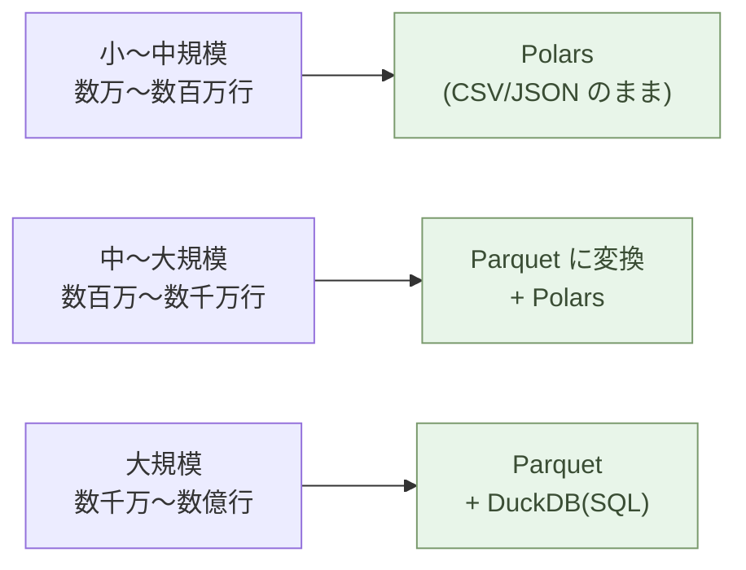

# データを持つ ── JSON/CSV/YAMLで考える

データを持つ道具を、JSON・CSV・YAML に変える。

それだけで、データは AI が読み書きできる「構造」になる。Excel の中で見栄え良く整列されていたデータは、ほとんどの場合、書式の檻に閉じ込められている。剥き出しにすれば、AI は同僚として動き出す。

## Excel は表ではない

Excel ファイルを開く。罫線、セル結合、色分け、太字、フォントサイズ、コメント、フィルタ、ピボットテーブル。これらすべてが「データ」と一緒に保存されている。

「2026年度の売上」を集計するつもりが、気づけばセルの配色を整えている。「青は確定、赤は仮、黄色は要確認」── このルールは、ファイル名にも、コメントにも、別ドキュメントにも、どこにも書かれていない。**作った本人の頭の中にだけある**。

その人が辞めたら、ルールも消える。Excel は、構造を書式で表現するために、構造そのものをファイルから消す。

これは Excel の欠陥ではない。Excel は人間が表を整えるための道具だ。書式が前面に出るのは設計通りである。

しかし、データの本質は書式ではない。本質は構造だ。「これが日付」「これが金額」「これが顧客 ID」── データを成り立たせているのはこの定義である。書式は表示のための装飾にすぎない。

## JSON は構造をそのまま持つ

JSON はテキストだ。データの形をそのまま書く。

```json
{
  "customer": "山田農園",
  "orders": [
    { "date": "2026-04-01", "item": "キャベツ", "qty": 12, "price": 180 },
    { "date": "2026-04-08", "item": "玉葱", "qty": 24, "price": 95 }
  ]
}
```

これだけで、顧客と注文が階層を持って表現できる。「顧客に複数の注文がぶら下がる」という構造は、ファイルを開いた瞬間に分かる。**書式情報は一切ない**。色も罫線もフォントもない。それは、必要ないからだ。

書式が要るのは表示のとき。データを保存するときには要らない。

## CSV は表をそのまま持つ

純粋な「表」── 行と列だけのデータには CSV が向く。

```csv
date,item,qty,price
2026-04-01,キャベツ,12,180
2026-04-08,玉葱,24,95
```

罫線も色分けもフィルタもない。最初の行が列名、それ以降が値。それだけ。

CSV は古い。30年以上前から存在する。だからこそ、ほぼあらゆるソフトウェアが読める。AI も問題なく読む。Excel ですら CSV を開ける(逆に、Excel ファイルを CSV にすると書式は消えるが、データは残る)。

> 表で持ちたいデータは CSV で保存する。Excel で開きたければ Excel で開けばいい。

中身は CSV、入口だけ Excel。これだけで、データは AI が読める形に保たれる。

## YAML は設定をそのまま持つ

設定ファイル ── システムの動作を決めるパラメータには YAML が向く。

```yaml
site:
  name: aiseed.dev
  language: ja
  features:
    - markdown
    - rss
    - sitemap

build:
  output: html/
  cache: true
  threads: 4
```

JSON より人間に読みやすく、コメントも書ける。`#` で始まる行はコメント。「この設定は何のためか」を、設定そのものに書き残せる。

YAML は Markdown 記事のフロントマター(冒頭の `---` で囲まれた部分)にも使われる。

## AI が読むのは構造

ここが決定的に重要な点だ。

Claude に Excel ファイルを渡すと、まず .xlsx を解凍して XML を読む。書式情報をすべて剥がして、セルの値だけを取り出す。**AI が必要としているのは、最初から剥き出しの構造だ**。

JSON・CSV・YAML を渡せば、変換は要らない。直接読める。直接書ける。

> データを構造で持てば、AI は同僚になる。

これは比喩ではない。技術的事実だ。AI とテキストでやり取りする限り、JSON・CSV・YAML はデータの共通語である。

## どれを使うか

選び方はシンプルだ。

```mermaid
flowchart TD
  Q{データの形と規模}
  Q -->|行と列<br/>(数万〜数百万行)| CSV["CSV<br/>商品マスタ・売上明細<br/>取引履歴"]
  Q -->|階層・入れ子| JSON["JSON<br/>請求書・顧客+注文<br/>API レスポンス"]
  Q -->|設定値+コメント| YAML["YAML<br/>システム設定<br/>Markdown frontmatter"]
  Q -->|大量・分析用<br/>(数千万〜数億行)| PARQ["Parquet<br/>列指向・高圧縮<br/>+ DuckDB で SQL 直接"]
  classDef opt fill:#e8f5e9,stroke:#7a9a6d,color:#3a4d34
  class CSV,JSON,YAML,PARQ opt
```

一つのプロジェクトで全部使ってもいい。請求書のデータは JSON、商品マスタは CSV、システム設定は YAML、大量の取引履歴は Parquet、というふうに使い分ける。

迷ったら、Claude に「このデータをどの形式で持つべきか」と聞けば、データの性質を見て答えてくれる。

## 大量のデータには Parquet と DuckDB

CSV と JSON は人間が直接読める利点がある一方、サイズが大きくなると
処理が遅くなる。**数千万行を超えるデータには、Parquet と DuckDB を
組み合わせる**。

### Parquet ── 列指向の保存形式

Parquet は、Apache が開発した **列指向(columnar)** のバイナリ
保存形式だ。CSV が「行ごと」にデータを並べるのに対して、Parquet は
「列ごと」に並べる。

```text
CSV(行ごと):
  date, item, qty, price
  2026-04-01, キャベツ, 12, 180
  2026-04-08, 玉葱,    24,  95

Parquet(列ごと):
  [date]:  2026-04-01, 2026-04-08, ...
  [item]:  キャベツ,    玉葱,        ...
  [qty]:   12,          24,          ...
  [price]: 180,         95,          ...
```

これによって、

- **圧縮率が高い** ── 同じ列のデータは似ているので、辞書圧縮や
  ランレングス符号化が効く。CSV の **1/5 〜 1/10** のサイズ
- **必要な列だけ読める** ── 100 列のうち 3 列だけ集計したいとき、
  3 列分のデータだけディスクから読む(I/O が劇的に減る)
- **スキーマがファイル内にある** ── 列名と型がファイル自身に保存
  されており、CSV のような型推測の罠が消える
- **業界標準** ── Polars、DuckDB、Spark、BigQuery、Athena ── ほぼ
  すべての解析ツールが直接読める

### DuckDB ── ファイルに SQL を直接かける

**DuckDB は「分析のための SQLite」** だ。サーバーが要らない、
インストールは `pip install duckdb` 一行、そして **CSV や Parquet
のファイルそのものに対して SQL クエリを書ける**。

```bash
$ duckdb -c "
    SELECT date, SUM(qty * price) AS sales
    FROM 'orders.parquet'
    WHERE date >= '2026-01-01'
    GROUP BY date
    ORDER BY date
"
```

データベースに「インポート」する必要すらない。**Parquet がそのまま
テーブルとして扱える**。1 億行のデータでも、必要な列と必要な行だけを
読み込んで、数秒で集計が返る。

### Polars ── pandas より速く、AI が書きやすい

Python 側でデータを加工するときの第一選択は **Polars**(Rust 実装、
列指向、遅延評価)だ。pandas より **数倍〜数十倍速く**、メモリ消費も
少なく、API も読みやすい。Parquet とも完全に相性が良い。

```python
import polars as pl

# Parquet を直接読む(必要な列だけ)
df = pl.read_parquet("orders.parquet", columns=["date", "qty", "price"])

# 月別売上を集計
monthly = (
    df.with_columns(month=pl.col("date").dt.strftime("%Y-%m"))
      .group_by("month")
      .agg(sales=(pl.col("qty") * pl.col("price")).sum())
      .sort("month")
)
print(monthly)
```

### 三つの組み合わせ

実際の使い分けは、規模で決まる。



CSV を一度 Parquet に変換しておけば、以後の集計が劇的に速くなる:

```bash
# CSV を Parquet に一回変換(DuckDB が両方を扱える)
$ duckdb -c "COPY (FROM 'orders.csv') TO 'orders.parquet' (FORMAT PARQUET)"

# 以後はすべて Parquet で処理(数千万行でも秒単位)
$ duckdb -c "SELECT item, SUM(qty) FROM 'orders.parquet' GROUP BY item"
```

### なぜ jq や awk より Python なのか

「ターミナルで `jq` と `awk` を組み合わせれば速い」── これは部分
的には正しい。しかし、

- **構造が複雑になると jq の式が読めなくなる** ── 三段以上ネスト
  すると、書いた本人も翌日には解読できない
- **AI が書きにくい** ── jq / awk の独特な構文は、Claude も他の
  AI も Polars / DuckDB ほど安定して書けない(訓練データが少ない)
- **再現性と可搬性** ── Python スクリプトはチームで共有できる、
  Git で管理できる、テストできる、import で部品化できる
- **大量データで頭打ち** ── awk は 1 GB を超えると遅くなる。
  Polars / DuckDB は 100 GB 級まで普通に動く

ワンライナーで済むなら shell でよい。**少しでも複雑なら Python
(Polars / DuckDB)に切り替える**。Claude が書きやすい、読みやすい、
保守できる。

## Excel ファイルが届いたら

組織の中で働く限り、Excel ファイルは届き続ける。来た Excel をどうするか。

簡単だ。Claude に渡して「CSV にして」「JSON にして」と頼む。

その CSV / JSON を読んで、考えて、加工する。応答に Excel が要るなら、CSV / JSON を Excel に変換する(これも Claude に頼める)。

**自分の作業領域は構造化データに保つ**。組織が要求する形式は、入口と出口の変換だけで吸収する。中身は構造として保たれる。

## 10年後も読める

20年前の Excel ファイル(.xls 形式)は、今の Excel で開くとレイアウトが崩れることがある。マクロが動かない。フォントが置換される。

CSV は、ただのテキストファイルだ。10年後も20年後も、テキストエディタがあれば読める。AI ならもっと簡単に読める。JSON も YAML も同じだ。

> 構造を残せ。書式は捨てろ。

書式は今を飾る。構造は時間を超える。

## 実例: 数字で見る

10,000 行の売上データ。Excel `.xlsx` で 1.2 MB、CSV で 280 KB、
**Parquet で 60 KB**。Excel の **20 分の 1**、CSV の **5 分の 1**。
書式と冗長な行情報が消える。

Excel ピボットテーブルで月別売上集計: マウス操作で 5 分、再現性
ゼロ(操作の記録は残らない)。同じ集計を **Polars** で書くと 3 行、
実行 0.05 秒、Python スクリプトとして残るので翌月も使える。

100 個の `.xlsx` から特定列を抽出する月次作業: Excel VBA で半日。
**Polars** で `glob` を使って一気に処理すれば **15 秒**(pandas より
2〜3 倍速い)。**Claude に頼めばコードはすぐ出る**。

1 億行の取引履歴から月別の商品別売上を集計: pandas で読み込み中に
メモリ枯渇 → 不可能。**DuckDB なら Parquet ファイルに直接 SQL を
かけて 数秒で完了**(必要な列・必要な行だけストリーム読み)。

JSON / CSV を Claude に渡したときの認識率: ほぼ 100%(構造が
剥き出し)。Excel `.xlsx` を渡したときの認識率: 形式によっては
70〜80%(セル結合・書式があると劣化)。**データを構造で持つほど、
AI が間違わない**。

## まとめ

道具を変えれば、データの扱い方が変わる。

Excel から JSON・CSV・YAML へ。一歩で、データが「画面上の見栄え」から「処理できる構造」に変わる。AI が同僚になる。10年後も読める。

次の章では、図を描く話に進む。PowerPoint から、Mermaid へ。

---

## 関連記事

- [第1章: 文書を書く ── Markdownという最小の選択](/ai-native-ways/markdown/)
- [序章: 事務処理はOffice、業務ソフトはJava/C#、しかしAIはPythonとテキスト](/ai-native-ways/prologue/)
- [構造分析08: 企業ITの税を引く](/insights/enterprise-tax/)
