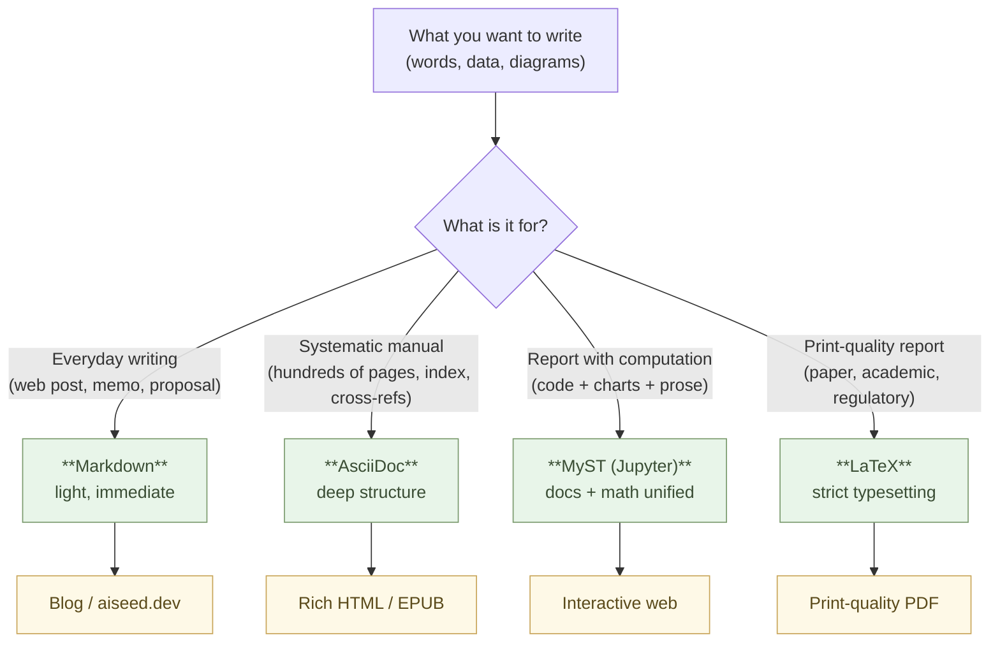

# Writing Documents — Markdown as the Minimal Choice

Switch the tool you write documents in to Markdown.

That single change turns AI into a colleague. Searching, summarizing, translating, analyzing, rewriting — every kind of work on documents becomes something you can hand to Claude.

## Word is a cage of formatting

When you open Word, you first pick a font. Then you adjust margins. Set heading styles. Choose colors. Match line spacing.

By the time you finally start writing, what you wanted to say has gone slightly out of focus.

Time spent on formatting steals time from thinking. **While you're shaping the surface, the substance gets thinner.** This is not a flaw in Word. Word is designed to be a tool for arranging visuals; formatting comes to the front because that is what it is for.

But the essence of a document is not formatting. The essence is structure. "This is the conclusion. This is the reason. This is supporting detail. This is a quotation." The skeleton is what makes a document a document. Formatting is just decoration to make the skeleton easier to see.

Change the tools, and the way you think changes. Word puts decoration up front. Markdown puts structure up front.

## Markdown is just text

Markdown is plain text. Symbols express structure.

```markdown
# Heading 1

## Heading 2

This is a paragraph. Wrap **emphasis** in two asterisks.

- A bullet starts with a hyphen.
- The next item also starts with a hyphen.

> A blockquote is written like this.
```

That is enough to express headings, paragraphs, emphasis, lists, and quotations. Tables, links, and code blocks are also there. **But there is no font picker. No color selector.** Because they are not needed.

Formatting is needed at display time. It is not needed at writing time. While writing, the only thing that should occupy your attention is "is this a heading or a paragraph, a list or a quotation?" — structure alone.

## What AI reads is structure

This is the decisive point.

When you hand Claude a Word file, it first unzips the .docx, reads the XML, strips the formatting metadata, and pulls out the text. **What AI needs is plain text from the start.**

Hand Claude Markdown, and there is no conversion. It reads it directly. It writes it directly.

> Change your tools and your thinking changes. Choose tools that share AI's language, and AI becomes a colleague.

This is not a metaphor. It is a technical fact. As long as your interaction with AI is text-based, Markdown is the shared language between humans and AI.

## What kind of writing should be in Markdown?

All of it.

Memos. Meeting minutes. Internal documents. Proposals. Reports. Manuals. Specifications. Procedures. Study notes. Diaries. Draft invoices. Draft contracts. Presentation scripts. Blog posts. Book chapters.

There are very few documents that genuinely "have to be Word." If they need to be distributed as PDF or Word in the end, convert from Markdown at distribution time. **Separate writing from distribution.**

You write in Markdown. When the time comes to distribute, you convert if needed. That alone gives you back time to think.

## Don't write Markdown — have Claude write it

Take this one step further.

Markdown can be created on demand by Claude. Tell Claude "organize this in Markdown," and it does. Talk through what you want and have it transcribed as Markdown. Photograph a handwritten note and have it converted. Hand over a long Word document and have it Markdown-ified.

In other words, **you don't even need to memorize the symbols**. If the content is clear in your head, Claude will apply the symbols correctly.

Learning Markdown is not required. What you need is to be able to **read** Markdown. Once you can read it, you can check what Claude produced and correct it if needed. That takes only a few hours to acquire.

## Which editor — Zed / VSCodium / Neovim

Markdown is a text file — any text editor can write it. Even Notepad
works. But pick an **editor that fits Markdown and AI-native work**,
and writing gets a step faster.

Three options. Pick by **familiarity, taste, and environment**.

:::compare
| Editor | Notes | Suits |
| --- | --- | --- |
| **Zed** | Fast launch (0.3 s), modern, lightweight, AI built-in | First-time pickers, people who want to choose one and start |
| **VSCodium** | **FLOSS build of VS Code** (no Microsoft telemetry), rich extensions | People used to VS Code, people who want to compose via extensions |
| **Neovim** | Runs in the terminal, keyboard-only, config-as-text | Command-line-centric people, people working over SSH |
:::

What all three share:

- **Open-source, free** — no vendor lock-in, no subscription
- **Markdown syntax highlighting** out of the box
- **Git integration** built in or via extension
- **Claude Code / Claude API integration** is possible

> **If you're new** — pick **Zed**. Download it, open it, and you can
> write the same day. Move on to VSCodium or Neovim once you're used
> to writing. The "skill of reading" is all you need to enter any of
> them.

### Zed — the easy default

For starting out, **Zed**. Download, open, and Markdown displays with
readable syntax coloring. Sidebar for files, Cmd+P for file search,
Cmd+Shift+F for project-wide search — a VS Code-like feel, but
**Rust-built and dramatically faster** (`.md` opens in 0.3 s — Word
takes 3–10 s).

Zed has **built-in AI integration with Claude / GPT and others**.
While writing, you can ask "proofread this section" or "summarize
this paragraph" (called explicitly from an assistant panel — not the
kind that streams every keystroke).

Get it: [zed.dev](https://zed.dev) (Mac / Linux / Windows)

### VSCodium — the free build of VS Code

For "I'm used to VS Code but want to cut off the Microsoft
telemetry," there is **VSCodium**. The same source as VS Code, built
**without Microsoft's telemetry and proprietary marketplace bits**.
(Nearly) the same extensions, the same UI, no Microsoft account
required.

Markdown preview, Mermaid preview, AsciiDoc / MyST / LaTeX support,
AI extensions like Claude / Cline / Continue — almost everything
works.

Get it: [vscodium.com](https://vscodium.com) (Mac / Linux / Windows)

> Why VSCodium over VS Code — same "vendor concentration" issue as
> Microsoft 365 / Copilot (Chapter 5). The contents are the same,
> but the data flow and the licensing land on your side with
> VSCodium.

### Neovim — terminal-centric, for the hacker

For command-line-centric work — SSH into a server and write there,
all-Linux workflows, keyboard-only operation — there is **Neovim**.
The successor to Vim, configured in Lua, with plugins for AI
(`avante.nvim`, `codecompanion.nvim`, etc.), LSP, Markdown preview,
Mermaid preview.

Learning cost is the highest of the three (you need to get used to
modal editing with `hjkl`). But once you are, **your typing speed
exceeds what the editor can bottleneck**. Long-term stability is a
draw too — configurations from ten years ago still run.

Get it: [neovim.io](https://neovim.io) (Mac / Linux / Windows / BSD)

### Shared practice — Markdown + Git + AI

Whichever editor, the practice in this book is the same:

- Files in **Markdown (`.md`)**
- History in **Git** (integrated in the editor)
- AI is called **explicitly** (assistant panel, Claude Code CLI,
  Claude chat) — avoid the Copilot-style constant-streaming
  integration where the editor sends every keystroke to a vendor
  (Chapter 10).

> Change the editor and the principle does not change.
> **Keep the text on your side; choose what you hand to AI.**

## For serious work — Forgejo / Gitea

So far this has been about "writing on your own desk."

The moment you decide to use this for serious work — **even solo,
the moment you think about backups, off-machine history, eventual
sharing** — you need a **Git hosting target**. GitHub and GitLab
are well known, but in this book's practice the natural choice is
a server **you (or a community) can run**.

Two options:

:::compare
| Tool | Character | Recommended |
| --- | --- | --- |
| **Forgejo** | Community-run FLOSS, governed by the non-profit Codeberg e.V. | ◎ First choice |
| **Gitea** | The original; now governed by the commercial Gitea Ltd. | ○ (keep using it if you already do) |
:::

Both provide:

- **Git hosting** (push / pull / clone)
- **Markdown and Mermaid rendered in READMEs and wikis**
- **Issues / Pull Requests** for review and discussion
- **Webhooks and built-in CI** (Forgejo Actions / Gitea Actions,
  compatible with GitHub Actions)
- **A single binary** — fits on a small VPS (1 GB RAM)
- **Open-source, no subscription**

> **If you're new** — "writing solo" and "needs no backup" are
> **different things**. `git init` for a local history is fine, but
> **when the disk dies, everything dies with it**. Even solo, from
> day one, have **a `git push` target somewhere**.
>
> The smallest form is fine: **a miniPC or old PC at home running
> Forgejo** (~US$200–400 one time, zero monthly cost); another
> machine or NAS; an external drive you `git push` to nightly. **"An
> internet-facing server feels scary"?** Run it LAN-only at first.
> **Sooner or later, you need a server on your side — a miniPC is
> the easiest entry.**

## Privacy-sensitive content — self-host by default

The **first axis** in choosing where to host is privacy. "Can the
content be public?" decides the destination:

:::compare
| Content | Recommended hosting |
| --- | --- |
| Public open-source, blog drafts, educational content | **Codeberg** (or GitHub public repos) |
| Personal notes (jotting, research) | **Self-host** (home Forgejo or NAS works) |
| Business data, internal docs, meeting notes | **Self-host** (required) |
| Contracts, quotations, customer lists | **Self-host** (required) |
| Customer PII, health data, financial data | **Self-host** (legally required, often) |
| Company / team code (non-public) | **Self-host** (or a paid private plan) |
:::

> Principle — **anything where privacy or ownership matters,
> self-host by default**. Codeberg is a non-profit, but it is still
> **someone else's server**. **If you can keep it on your side,
> keep it on your side.** This is the Git version of Chapter 5:
> "keep your own system on your own side."

"Self-host feels hard." The next section shows **a path from a
small self-host to a real one**. Claude writes the configuration,
so it's easier than it looks.

### Why Forgejo — the governance story

Gitea and Forgejo are **nearly the same codebase** (Forgejo is a
fork of Gitea). The difference is **who runs it**:

- **Gitea**: started as a community project; in late 2022, trademark
  and governance moved to the commercial **Gitea Ltd.** Decisions
  now depend on the company.
- **Forgejo**: the community that disagreed with that move forked
  it. Governance sits with **Codeberg e.V., a German non-profit**.
  **Company interests do not enter the structure.**

Feature-wise Forgejo keeps pace, so **if you're choosing, choose
Forgejo**. The structure is the same as Microsoft Office vs.
OnlyOffice (Chapter 5) — "same contents, governance on the
community side."

### Three places to put it — pick by use

**(1) Self-host** — the default for anything privacy-sensitive

**A single miniPC is enough.** Intel NUC, Mac mini, Beelink, GMKtec,
a small ARM board — a US$200–400 box, Linux on it, Forgejo running
on it. **Zero monthly fee, data stays in your house, low power draw
(5–15 W; running 24/7 costs roughly a few dollars of electricity a
month).** Forgejo is a single binary; 1 GB RAM is plenty.

Add one domain and an HTTPS reverse proxy and you can push/pull from
outside as well — **your own Git platform, complete**. **Business
data, contracts, customer information, personal notes — anything
whose contents you don't want leaving your side goes here.**

```bash
# Drop Forgejo onto Linux running on the miniPC
$ wget https://codeberg.org/forgejo/forgejo/releases/download/v8.0.0/forgejo-8.0.0-linux-amd64
$ chmod +x forgejo-8.0.0-linux-amd64
$ ./forgejo-8.0.0-linux-amd64 web
```

The detailed setup (`systemd` unit, HTTPS, automatic backups, SSH
key auth, security for internet exposure — fail2ban, Tailscale,
Cloudflare Tunnel) can be left to Claude — also a "skill of using,
not writing" (Chapter 1) territory.

**A Raspberry Pi, a NAS, or an old PC at home also works** — if
you've already got one, start there. Run it LAN-only and you don't
have to expose anything (sufficient for personal use). **You don't
need a new "server."**

**A VPS is a fallback** — if you want frequent access from outside,
don't want your home network exposed, or your home power/network is
unstable, a small VPS (a few dollars a month) is fine. But on
privacy grounds, **the miniPC is the cleaner choice** (a VPS is
someone else's data center). **Start with a miniPC; add a VPS only
if you need it.**

**(2) Inside an organization** — company / team scale

Run Forgejo on your internal VPS or Kubernetes cluster. **Every
repository sits inside the organization's physical boundary.** The
Microsoft / GitHub / Atlassian subscriptions stop. You're no longer
buffeted by data-policy shifts, and the source code and business
documents become **yours** (same structure as Chapter 5's Office
discussion). This is still **self-hosting**, at a larger scale.

**(3) Codeberg.org** — for content you're willing to publish

[Codeberg.org](https://codeberg.org) is **Forgejo hosted by a
non-profit as a public forge**. Free, account-based. Ideal for
**open-source projects, blog drafts, educational content** — the
hosting vendor is a non-profit.

**But this is still "someone else's server."** **Don't put business
data or personal information here.** Codeberg is for "things you
are willing to publish" — keep that line.

### Where does GitHub fit

GitHub isn't forbidden. **Public OSS still has strong reach there**:

- **Public open-source projects** → GitHub's reach and ecosystem are
  strong.
- **Notes intended to be public** → GitHub is fine.
- **Business data, internal docs, contracts, personal information**
  → **don't put these on GitHub *or* Codeberg. Self-host.**

GitHub joined **Microsoft in 2018**. It sits in the same
"centralization" context as Microsoft 365 / Copilot. **Anything
privacy-sensitive does not belong on GitHub or Codeberg** — that is
the privacy principle, carried through.

### Markdown and Mermaid render directly

Forgejo, Gitea, and Codeberg **render `README.md` and `.md` files
directly in the web UI**. `` ```mermaid `` blocks are rendered as
standard. **What you wrote is what is visible on the web** — without
running a separate static-site generator, the forge **doubles as an
internal wiki**.

> To handle Markdown for serious work, you need both wheels:
> **a place to write (the editor)** and **a place to put it
> (Forgejo)**. Even solo, backup is required; anything
> privacy-sensitive is self-hosted by default — this is the Git
> version of Chapter 5's "keep your own system on your own side."

## Pick the format that fits the job — four text formats are enough

Markdown is the **everyday default**, but it does not cover every case.
For each job, pick the **text format** that suits it best.

:::compare
| Format | Role | Output |
| --- | --- | --- |
| **Markdown** | Short fragments of thought, drafts of web articles | Blogs, aiseed.dev |
| **AsciiDoc** | Systematic structural analyses, technical manuals | Rich HTML, e-books |
| **MyST (Jupyter)** | Data-analysis reports with embedded computation | Interactive web pages |
| **LaTeX** | Reports that demand strict typesetting | Print-quality PDF |
:::

All four are **text files**. Not binary. Versionable in Git. Readable
directly by AI. The only difference is "how much structure and how
much expressive range the format gives you."



### Markdown — the everyday default

Eight out of ten things you want to write fit in Markdown. The chapters
of this book are Markdown. Blog posts, meeting notes, memos, proposals,
draft reports, internal wikis — all Markdown. **The lightest format**,
opens in any text editor, converts anywhere with `pandoc` (HTML / PDF /
Word / EPUB / slides).

### AsciiDoc — when structure runs deep

A **technical manual of several hundred pages**, a **systematic
structural analysis** with chapters / sections / subsections, a document
that needs indexes / bibliography / cross-references — when Markdown's
structural vocabulary is not enough, reach for **AsciiDoc**. Conditional
content (differences by edition), automatic cross-references across
files, expressive tables, footnotes, indexes — all **standard
features**. O'Reilly's technical books are written in AsciiDoc. Outputs
are **rich HTML, EPUB, PDF**.

### MyST (Jupyter) — documents and computation, together

Data-analysis reports mix **formulas, code, charts, and prose
interpretation**. MyST is an extension of Markdown that **embeds
Jupyter notebook computation cells inside the document**. Manage
outputs from `polars` / `matplotlib` / `altair` alongside the prose —
**re-run and the results refresh**. The format for reports where
"document" and "computation" are not separated — directly continuous
with the JupyterLab world from Chapter 1. Output is **an interactive
web page** (zoomable charts, expandable code).

### LaTeX — when it goes to paper, when typesetting must be strict

**Academic papers, official internal reports, book publishing,
government submissions** — documents that are "read on paper" or
"demand typesetting quality." Equations, chemical formulas, figure /
table numbering, auto-numbered references, page references, table of
contents, indexes — all automatic. Final output is **a print-quality
PDF** (`xelatex` handles non-Latin scripts). A technology that has run
for fifty years and will keep running for another fifty.

### AI writes them, so the syntax is not yours to memorize

"AsciiDoc, MyST, LaTeX — each has its own syntax. The learning cost
sounds high." That used to be true. In an AI-native workflow, it is
not a problem.

> You: Convert this proposal to AsciiDoc. Keep the chapter and section
> structure. Add cross-references and an index. Output for HTML and
> EPUB.
>
> Claude: (AsciiDoc comes back)
>
> You: Convert this analysis to MyST. Embed the aggregation code and
> the Altair charts inline. Make it buildable by Jupyter Book.
>
> Claude: (MyST comes back)
>
> You: This report in LaTeX. Cover page, table of contents,
> bibliography, index, A4 for print.
>
> Claude: (LaTeX comes back)

The human only needs to **be able to read it**. If you can read it, you
can judge whether Claude's output is right. **You do not need to be
able to write it.** Whether Markdown, AsciiDoc, MyST, or LaTeX, the
principle is the same — **not the skill of writing, but the skill of
using**.

If in doubt, **start with Markdown**. Write it; if the structure grows
too deep, move to AsciiDoc; if computation creeps in, move to MyST; if
you need print quality, move to LaTeX. **Just ask Claude to convert.**

## When a Word file lands in your inbox

As long as you work inside an organization, Word files will keep arriving. What do you do with them?

It is easy. Hand them to Claude and have them turned into Markdown.

Read the Markdown. Think. Respond. Write your response in Markdown too. If sending it back as Word is required, convert the Markdown to Word (Claude can do that as well).

**Keep your own working surface in Markdown.** Absorb the formats your organization demands at the entry and exit only. The substance — the structure — stays intact.

## Readable in ten years

Word's .doc format from twenty years ago sometimes will not open correctly today. Layouts break. Fonts get substituted. The current Word's interpretation no longer matches.

Markdown is just a text file. In ten years, in twenty years, any text editor can read it. AI can read it even more easily.

> Save the structure. Throw away the formatting.

Formatting decorates the present. Structure crosses time.

## In numbers

50 Word meeting-note files (totaling 5 MB) become 250 KB as Markdown. **One-twentieth.** Git tracks history, `grep` searches, and the cost of handing it to Claude drops proportionally.

"Pull the decisions from last month's meeting notes" — opening 50 Word files and extracting by hand: half a day. With Markdown, hand it all to Claude; the answer returns in seconds.

Word launch: 3–10 seconds. Opening `*.md` in Zed: 0.3 seconds. Opening 30 times a day saves more than 30 hours per year.

Token consumption of a Word file: 5,000 characters consume about 8,000 tokens (formatting metadata inflates it). The same content in Markdown: about 4,000 tokens. **If you keep handing files to Claude, dropping formatting drops cost.**

## In summary

Change your tools, and the way you think changes.

From Word to Markdown. **For everyday writing, that is enough.** For a
long manual, AsciiDoc; for reports with embedded computation, MyST;
for print-quality reports, LaTeX — **pick by role**. What they share
is just three things: "save the structure, not the formatting," "they
are text files so AI reads them directly," "AI writes them, so the
syntax is not yours to memorize."

A single step that shifts the object of your attention from
"appearance" to "substance." AI becomes a colleague. Documents that
are still readable in ten years.

The next chapter moves on to drawing diagrams — from PowerPoint to Mermaid and Claude Design.

---

## Related

- [Chapter 01: Writing Logic — Have AI Write Python For You](/en/ai-native-ways/python/)
- [Chapter 03: Designing — With Mermaid and Claude Design](/en/ai-native-ways/design/)
- [Prologue: Office for paperwork, Java/C# for business systems — but AI runs on Python and text](/en/ai-native-ways/prologue/)
- [Structural Analysis 08: Removing the Enterprise IT Tax](/en/insights/enterprise-tax/)
- [Are You Still Using Windows and Office?](/en/blog/windows-office-facts/)
