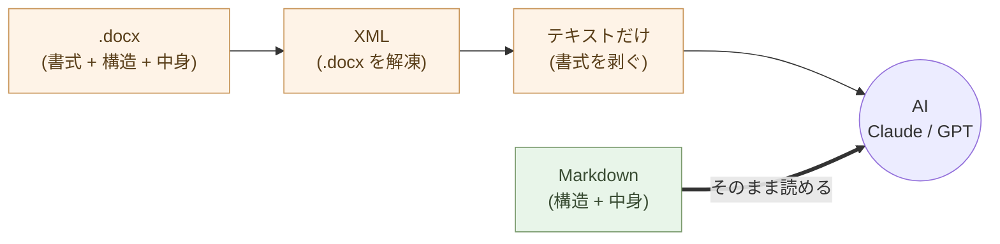
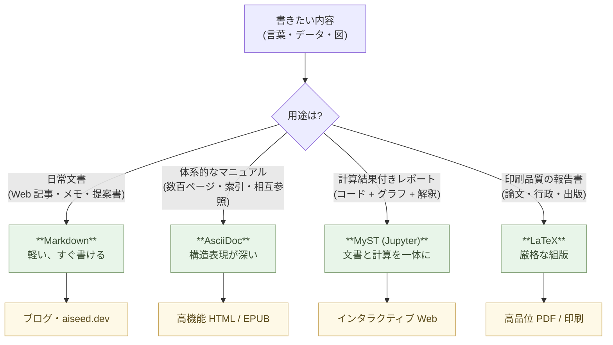

# 文書を書く ── Markdownという最小の選択

文書を書く道具を、Markdown に変える。

それだけで、AI が同僚になる。文書の検索、要約、翻訳、分析、書き換え、すべてが Claude に頼める仕事になる。

## Word は書式の檻だ

Word を開くと、まずフォントを選ぶ。次に余白を調整する。見出しのスタイルを決める。色を選ぶ。空白行の高さを揃える。

ようやく書き始めるころには、本当に書きたかったことが少しぼやけている。

書式を整える時間は、考える時間を奪う。**形を作っているうちに、中身が痩せる**。これは Word の欠陥ではない。Word は書式を整えるための道具として設計されている。書式が前面に出るのが当然だ。

しかし、書類の本質は書式ではない。本質は構造だ。「これが結論」「ここが理由」「ここが補足」「ここが引用」── 文書を成り立たせているのはこの骨格である。書式は、骨格を見やすくするための装飾にすぎない。

道具を変えると、考え方が変わる。Word で書くと装飾が前に出る。Markdown で書くと構造が前に出る。

## Markdown はテキストでしかない

Markdown はプレーンテキストだ。記号で構造を表現する。

```markdown
# 見出し1

## 見出し2

これは段落。**強調**したい部分は二重アスタリスクで囲む。

- 箇条書きはハイフン
- 続く項目もハイフン

> 引用はこのように書く。
```

これだけで、見出し・段落・強調・箇条書き・引用が表現できる。テーブルもリンクもコードブロックもある。**しかし、フォントを選ぶ書式はない。色を変える書式もない。** それは、必要ないからだ。

書式が要るのは表示する時。書く時には要らない。書くときに気にすべきは「これは見出しか段落か、リストか引用か」── 構造だけだ。

## AI が読むのは構造

ここが決定的に重要な点だ。

Claude に Word ファイルを渡すと、まず .docx を解凍して XML を読む。書式情報をすべて剥がして、テキストだけを取り出す。**AI が必要としているのは、最初から剥き出しのテキストだ**。

Markdown を Claude に渡せば、変換は要らない。直接読める。直接書ける。

> 道具を変えれば、思考が変わる。AI が同じ言語で思考する道具を選べば、AI は同僚になる。

これは比喩ではない。技術的事実だ。AI とテキストでやり取りする限り、Markdown は AI と人間の共通語である。



## 何を書く時に Markdown を使うか

全部だ。

メモ。議事録。社内文書。提案書。報告書。マニュアル。仕様書。手順書。学習ノート。日記。請求書のドラフト。契約書のドラフト。プレゼン資料の原稿。ブログ記事。本の章。

「これは Word でないと…」と感じる文書は、ほとんどない。最終的に PDF や Word 形式で配布する必要があるなら、Markdown から変換すればいい。**書く段階と配布する段階を分ける**。

書くのは Markdown。配布するときに必要なら他の形式に変換する。これだけで、考える時間が増える。

## Markdown を「書く」より「Claude に書いてもらう」

ここで一段階先に進む。

Markdown は Claude に「これを Markdown で整理して」と頼めば、勝手に整形してくれる。話したことを Markdown にしてもらう。手書きメモを写真で撮って Markdown にしてもらう。長い Word 文書を渡して Markdown 化してもらう。

つまり、**自分で記号を覚える必要すらない**。書きたい内容が頭の中にあれば、Claude が記号を正しく当てて整形する。

Markdown を学ぶことは、必須ではない。Markdown が**読める** ようになっておけばいい。読める人なら、Claude が出してきた Markdown をチェックして、必要なら修正できる。これは数時間で身につく。

## 用途で使い分ける ── テキスト形式は四つで足りる

Markdown は **日常の標準** だが、これだけで全部を賄うわけではない。
用途に応じて、より適した **テキスト形式** を選ぶ。

:::compare
| 形式 | 役割 | 出力先 |
| --- | --- | --- |
| **Markdown** | 短い思考の断片、Web 記事の草案 | ブログ、aiseed.dev |
| **AsciiDoc** | 体系的な構造分析、技術マニュアル | 高機能 HTML、電子書籍 |
| **MyST (Jupyter)** | データ分析レポート(計算結果付き) | インタラクティブな Web ページ |
| **LaTeX** | 厳格な形式が求められる報告書 | 高品位 PDF、印刷物 |
:::

四つとも **テキストファイル**。バイナリではない。Git で履歴管理できる。
AI が直接読める。違うのは「どこまでの構造と表現力を持つか」だけ。



### Markdown ── 日常の標準

書きたいものの 8 割は Markdown で書ける。本書の各章も Markdown。
ブログ記事、議事録、メモ、提案書、報告書の下書き、社内 Wiki ──
すべて Markdown。**最も軽い形式**、テキストエディタで開ける、
変換先は `pandoc` で何でも(HTML / PDF / Word / EPUB / スライド)。

### AsciiDoc ── 構造が深い時

数百ページの **技術マニュアル**、複数の章節項を持つ **体系的な構造
分析**、索引・参考文献・相互参照が要る文書 ── Markdown では構造の
表現力が足りない場面で **AsciiDoc**。条件付きの本文(版による違い)、
ファイルを跨ぐ自動相互参照、表現力の高い表組み・脚注・索引が
**標準機能**で揃う。O'Reilly の技術書も AsciiDoc で書かれている。
出力は **高機能 HTML、EPUB 電子書籍、PDF**。

### MyST (Jupyter) ── データと文章を一体に

データ分析レポートには、**計算式・コード・グラフ・文章による解釈**
が混ざる。MyST は Markdown の拡張で、**Jupyter Notebook の計算セル
を文書に埋め込める**。`polars` / `matplotlib` / `altair` の出力を
本文と一緒に管理、**再実行すれば結果が更新される**。「文書」と
「計算」が分離していないレポートを作るための形式 ── 第1章で扱った
JupyterLab の世界と直結する。出力は **インタラクティブな Web ページ**
(ズーム可能なグラフ・展開可能なコード)。

### LaTeX ── 紙に印刷する時、厳格な体裁が要る時

**学術論文、社内公式報告書、書籍出版、行政提出書類** ── 「紙で
読まれる」「組版品質が要求される」文書。数式、化学式、図表番号、
参考文献の自動採番、ページ参照、目次、索引 ── すべて自動。
最終出力は **印刷品質の PDF**(`xelatex` で日本語も)。
50 年動いている技術で、これからも 50 年動く。

### AI が書くので、文法を覚える必要はない

「AsciiDoc も MyST も LaTeX も独自の記号があって、学習コストが
高そう」── 旧来はそうだった。だが AI ネイティブな働き方では、
これは問題にならない。

> あなた:この提案書を AsciiDoc にして。章節構造はそのまま、
> 相互参照と索引を付けて、HTML と EPUB に出せる形にして。
>
> Claude:(AsciiDoc が返る)
>
> あなた:この分析を MyST にして。集計コードと Altair のグラフを
> 本文に埋め込んで、Jupyter Book でビルドできる形に。
>
> Claude:(MyST が返る)
>
> あなた:この報告書を LaTeX で。表紙、目次、参考文献、索引付き、
> A4 で印刷できる形に。
>
> Claude:(LaTeX が返る)

人間は **読めればいい**。読めれば、Claude が出した出力が正しいか
判断できる。**書ける必要は無い**。Markdown でも AsciiDoc でも MyST
でも LaTeX でも、原則は同じ ── **書く能力ではなく、使う能力**。

迷ったら **Markdown で始める**。書いてみて、構造が深くなりすぎたら
AsciiDoc に、計算が増えてきたら MyST に、印刷品質が要るなら LaTeX
に ── **Claude に変換を頼むだけで移れる**。

## Word ファイルが届いたら

組織の中で働く限り、Word ファイルは届き続ける。来た Word をどうするか。

簡単だ。Claude に渡して Markdown にしてもらう。

その Markdown を読んで、考えて、応答する。応答も Markdown で書く。送り返すときに Word が要るなら、Markdown を Word に変換する(これも Claude に頼める)。

**自分の作業領域を Markdown に保つ**。組織が要求する形式は、入口と出口の変換だけで吸収する。中身は構造として保たれる。

## 10年後も読める

Word の .doc 形式は、20年前のファイルを今開けないことがある。書式情報が現在の Word の解釈と合わなくなり、レイアウトが崩れる。フォントが置換される。

Markdown は、ただのテキストファイルだ。10年後も20年後も、テキストエディタがあれば読める。AI ならもっと簡単に読める。

> 構造を残せ。書式は捨てろ。

書式は今を飾る。構造は時間を超える。

## 実例: 数字で見る

Word の議事録 50 ファイル(計 5 MB)を Markdown にすると、合計 250 KB。**20 分の 1**。Git で履歴管理、`grep` で検索、Claude に渡すコストも比例して下がる。

「先月の議事録から決定事項を抜き出して」── Word 50 ファイルを開いて手作業で抽出すれば半日。同じデータを Markdown にしておけば、Claude に丸ごと渡して数秒で返ってくる。

Word 起動時間: 3〜10 秒。Zed で `*.md` を開く時間: 0.3 秒。1 日 30 回開くと、年間 30 時間以上の節約。

Word ファイルの token 消費: 5,000 文字で約 8,000 トークン(書式情報を含むため水増しされる)。同じ内容の Markdown は約 4,000 トークン。**Claude に渡し続けるなら、書式は捨てるほどコストが下がる**。

## まとめ

道具を変えれば、思考が変わる。

Word から Markdown へ。**日常文書はこれで十分**。長大なマニュアル
なら AsciiDoc、計算付きレポートなら MyST、印刷品質の報告書なら
LaTeX ── **用途で使い分ける**。共通するのは「書式ではなく構造を
残す」「テキストファイルだから AI が直接読める」「AI が書くので
文法を覚えなくていい」── この三つだけ。

たった一歩で、書く対象が「見栄え」から「中身」に移る。AI が同僚に
なる。10 年後も読める文書ができる。

次の章では、図を描く話に進む。PowerPoint から、Mermaid と Claude デザインへ。

---

## 関連記事

- [第1章: 処理を書く ── AIにPythonで書いてもらう](/ai-native-ways/python/)
- [第3章: デザインをする ── Mermaid と Claude デザインで作る](/ai-native-ways/design/)
- [序章: 事務処理はOffice、業務ソフトはJava/C#、しかしAIはPythonとテキスト](/ai-native-ways/prologue/)
- [構造分析08: 企業ITの税を引く](/insights/enterprise-tax/)
- [それでも Windows と Office を使い続けますか?](/blog/windows-office-facts/)
