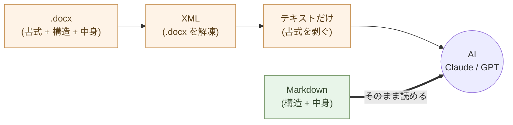
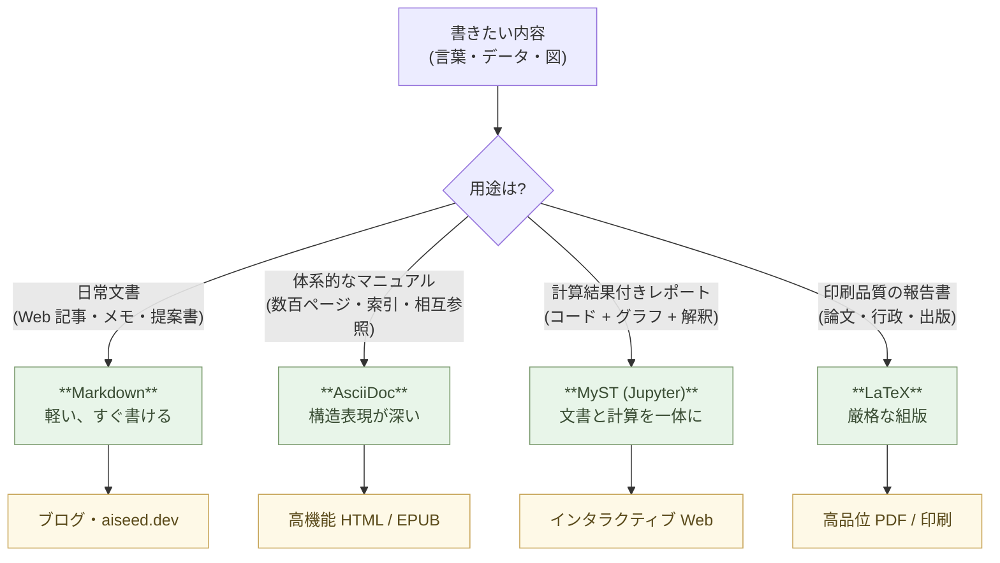

# 文書を書く ── Markdownという最小の選択

文書を書く道具を、Markdown に変える。

それだけで、AI が同僚になる。文書の検索、要約、翻訳、分析、書き換え、すべてが Claude に頼める仕事になる。

## Word は書式の檻だ

Word を開くと、まずフォントを選ぶ。次に余白を調整する。見出しのスタイルを決める。色を選ぶ。空白行の高さを揃える。

ようやく書き始めるころには、本当に書きたかったことが少しぼやけている。

書式を整える時間は、考える時間を奪う。**形を作っているうちに、中身が痩せる**。これは Word の欠陥ではない。Word は書式を整えるための道具として設計されている。書式が前面に出るのが当然だ。

しかし、書類の本質は書式ではない。本質は構造だ。「これが結論」「ここが理由」「ここが補足」「ここが引用」── 文書を成り立たせているのはこの骨格である。書式は、骨格を見やすくするための装飾にすぎない。

道具を変えると、考え方が変わる。Word で書くと装飾が前に出る。Markdown で書くと構造が前に出る。

## Markdown はテキストでしかない

Markdown はプレーンテキストだ。記号で構造を表現する。

```markdown
# 見出し1

## 見出し2

これは段落。**強調**したい部分は二重アスタリスクで囲む。

- 箇条書きはハイフン
- 続く項目もハイフン

> 引用はこのように書く。
```

これだけで、見出し・段落・強調・箇条書き・引用が表現できる。テーブルもリンクもコードブロックもある。**しかし、フォントを選ぶ書式はない。色を変える書式もない。** それは、必要ないからだ。

書式が要るのは表示する時。書く時には要らない。書くときに気にすべきは「これは見出しか段落か、リストか引用か」── 構造だけだ。

## AI が読むのは構造

ここが決定的に重要な点だ。

Claude に Word ファイルを渡すと、まず .docx を解凍して XML を読む。書式情報をすべて剥がして、テキストだけを取り出す。**AI が必要としているのは、最初から剥き出しのテキストだ**。

Markdown を Claude に渡せば、変換は要らない。直接読める。直接書ける。

> 道具を変えれば、思考が変わる。AI が同じ言語で思考する道具を選べば、AI は同僚になる。

これは比喩ではない。技術的事実だ。AI とテキストでやり取りする限り、Markdown は AI と人間の共通語である。



## 何を書く時に Markdown を使うか

全部だ。

メモ。議事録。社内文書。提案書。報告書。マニュアル。仕様書。手順書。学習ノート。日記。請求書のドラフト。契約書のドラフト。プレゼン資料の原稿。ブログ記事。本の章。

「これは Word でないと…」と感じる文書は、ほとんどない。最終的に PDF や Word 形式で配布する必要があるなら、Markdown から変換すればいい。**書く段階と配布する段階を分ける**。

書くのは Markdown。配布するときに必要なら他の形式に変換する。これだけで、考える時間が増える。

## Markdown を「書く」より「Claude に書いてもらう」

ここで一段階先に進む。

Markdown は Claude に「これを Markdown で整理して」と頼めば、勝手に整形してくれる。話したことを Markdown にしてもらう。手書きメモを写真で撮って Markdown にしてもらう。長い Word 文書を渡して Markdown 化してもらう。

つまり、**自分で記号を覚える必要すらない**。書きたい内容が頭の中にあれば、Claude が記号を正しく当てて整形する。

Markdown を学ぶことは、必須ではない。Markdown が**読める** ようになっておけばいい。読める人なら、Claude が出してきた Markdown をチェックして、必要なら修正できる。これは数時間で身につく。

## どのエディタで書くか ── Zed / VSCodium / Neovim

Markdown はテキストファイル ── テキストエディタなら何でも書ける。
メモ帳でも書ける。だが、**Markdown と AI ネイティブな働き方に合う
エディタ**を選ぶと、書く時間が一段速くなる。

選択肢は三つ。**自分の慣れ・好み・環境**で選ぶ。

:::compare
| エディタ | 特徴 | 向く人 |
| --- | --- | --- |
| **Zed** | 起動が速い(0.3 秒)、モダン、軽い、AI 統合内蔵 | これから始める人、まずは一つ選びたい人 |
| **VSCodium** | VS Code の **FLOSS 版**(Microsoft テレメトリ無し)、拡張機能が豊富 | VS Code に慣れている / 拡張機能で組み上げたい人 |
| **Neovim** | ターミナルで動く、キーボードだけで完結、設定をテキストで管理 | コマンドライン中心 / SSH で作業する人 |
:::

三つに共通するのは:

- **オープンソース・無料** ── ベンダーロックインなし、サブスク不要
- **Markdown のシンタックスハイライト**が標準で効く
- **Git 統合**が組み込みまたは拡張で入る
- **Claude Code / Claude API との連携**が可能

> **初心者の方へ** ── 迷ったら **Zed**。ダウンロードして開けば
> その日から使える。慣れてから VSCodium や Neovim に進めばよい。
> 「読める能力」さえあれば、どのエディタでも入れる。

### Zed ── 入りやすい標準

これから始めるなら **Zed**。ダウンロードして開けば、Markdown が
読みやすく色付けされて表示される。サイドバーでファイルを開き、
Cmd+P でファイル検索、Cmd+Shift+F で全文検索 ── VS Code に似た
操作感だが、**Rust 製で圧倒的に速い**(`.md` を 0.3 秒で開く ──
Word は 3〜10 秒)。

Zed には **Claude / GPT などの AI 統合が内蔵** されている。書きながら
「ここを校正して」「この段落を要約して」と頼める(アシスタント
パネルから明示的に呼ぶ ── キー入力を常時送るタイプではない)。

入手: [zed.dev](https://zed.dev)(Mac / Linux / Windows)

### VSCodium ── VS Code の自由版

「VS Code を使い慣れているが、Microsoft への通信を切りたい」
という人には **VSCodium**。VS Code のソースコードから **Microsoft
のテレメトリと商用ライセンス部分を除いてビルドした版**。同じ拡張
機能(ほぼ)、同じ UI、Microsoft アカウント不要。

Markdown プレビュー、Mermaid プレビュー、AsciiDoc / MyST / LaTeX
サポート、Claude / Cline / Continue などの AI 拡張 ── ほとんど
すべて使える。

入手: [vscodium.com](https://vscodium.com)(Mac / Linux / Windows)

> なぜ VS Code ではなく VSCodium か ── Microsoft 365 / Copilot と
> 同じ「ベンダー集中」の話だ(第5章)。中身は同じだが、データの
> 流れと著作権は VSCodium のほうが自分の側にある。

### Neovim ── ターミナル中心、ハッカー向け

コマンドライン中心で作業する人 ── サーバーに SSH して書く、Linux
で完結したい、キーボードだけで動かしたい ── には **Neovim**。
Vim の後継、Lua で設定、プラグインで AI(`avante.nvim`、
`codecompanion.nvim` など)・LSP・Markdown プレビュー・Mermaid
プレビューも組める。

学習コストは三つの中で一番高い(`hjkl` のモーダル編集に慣れる必要
がある)。しかし、慣れたら **タイピング速度がエディタの限界を
超える**。10 年前の設定が今も動く長期安定性も魅力。

入手: [neovim.io](https://neovim.io)(Mac / Linux / Windows / BSD)

### 共通する作法 ── Markdown + Git + AI

どのエディタでも、本書の作法は同じ:

- ファイルは **Markdown(`.md`)** で持つ
- 履歴は **Git** で管理(エディタに統合)
- AI に渡すのは **明示的に**(アシスタントパネル、Claude Code CLI、
  Claude のチャット)── エディタが入力を逐次クラウドへ送る Copilot
  型の常時連携は避ける(第10章「AI に任せる仕事を見極める」)

> エディタを変えても、原則は変わらない。
> **テキストを自分の手元で持ち、AI には選んで渡す**。

## 本格的に仕事として使うなら ── Forgejo / Gitea

ここまでは「自分の手元で書く」話だった。

**本格的に仕事として** ── 一人でもチームでも、**バックアップを持つ・
履歴を遠くにも置く・将来チームで共有する**ことを考えた瞬間、Git の
**ホスティング先** が必要になる。GitHub や GitLab がよく知られて
いるが、本書の作法に沿うと、**自分(またはコミュニティ)で動かせ
るサーバー** に置くのが本筋だ。

選択肢は二つ:

:::compare
| ツール | 性格 | 推奨度 |
| --- | --- | --- |
| **Forgejo** | コミュニティが運営する FLOSS、非営利の Codeberg e.V. がガバナンス | ◎ 第一選択 |
| **Gitea** | Forgejo の元。現在は商用会社 Gitea Ltd. が管理 | ○(以前から運用している場合は継続でよい) |
:::

両方とも:

- **Git ホスティング**(push / pull / clone)
- **Markdown と Mermaid を README / Wiki でレンダリング**
- **Issue / Pull Request**(レビュー、議論)
- **Webhook と組み込みの CI**(Forgejo Actions / Gitea Actions、
  GitHub Actions と互換)
- **単一バイナリ**で動く ── 小さな VPS(1 GB RAM)でも余裕
- **OSS、サブスク不要**

> **初心者の方へ** ── 「一人で書いている」と「バックアップが要らな
> い」は **別物** です。`git init` でローカルに履歴を残しても、
> **ディスクが壊れたら全部消える**。一人でも、最初から
> **どこかに `git push` する先**を持つ ── これは必須。
>
> 一番小さい形でいい:小さな VPS(月数百円)に Forgejo を立てて
> push する、別マシンや NAS に push する、外付けディスクに毎日
> `git push` する。**「いきなり VPS は怖い」場合**は、外付け
> ディスクや家の中の別マシンから始めて、後で Forgejo に移行で
> いい。**遅かれ早かれ、自分のサーバーが要る**。

## プライバシーが要るものは、セルフホストを基本に

Git ホスティングを選ぶときの **第一の判断軸はプライバシー** だ。
「中身を公開していいか」で、置き場所が変わる:

:::compare
| 中身 | 推奨ホスティング |
| --- | --- |
| 公開 OSS、ブログ原稿、教育コンテンツ | **Codeberg**(または GitHub の公開リポジトリ) |
| 個人ノート(雑記・調べ物) | **セルフホスト**(または家庭内の Forgejo / NAS) |
| 業務データ・社内ドキュメント・議事録 | **セルフホスト**(必須) |
| 契約書・見積書・顧客リスト | **セルフホスト**(必須) |
| 顧客の個人情報・健康情報・金融情報 | **セルフホスト**(法的にも必須) |
| 会社・チームのコード(非公開) | **セルフホスト**(または有償の私設プラン) |
:::

> 原則 ── **プライバシーや所有権が問題になるものは、セルフホスト
> が基本**。Codeberg は非営利だが「**他人のサーバー** にデータを
> 置く」ことには変わりない。**自分の手元に置けるなら、自分の手元
> に置く**。これが第5章「自分のシステムを自分の側に置く」の Git
> 版だ。

「セルフホストは難しそう」と感じるかもしれない。次のセクションで
**小さなセルフホストから始める** 道筋を示す。AI(Claude)が設定を
書いてくれるので、思っているより簡単だ。

### なぜ Forgejo か ── ガバナンスの話

Gitea と Forgejo は **コードベースとしてはほぼ同じ**(Forgejo は
Gitea のフォーク)。違いは **誰が運営しているか**:

- **Gitea**: 元はコミュニティプロジェクトだったが、2022 年末に
  商用会社 **Gitea Ltd.** に商標とガバナンスが移った。判断は会社
  に依存する。
- **Forgejo**: その移行に反対したコミュニティが分岐、**Codeberg
  e.V.(ドイツの非営利)** がガバナンスを担う。**会社の利害が
  入り込まない構造**。

機能としては Forgejo が追随しているので、**選ぶなら Forgejo**。
Microsoft Office と OnlyOffice の関係(第5章)と同じ構造だ ──
「中身は同じだが、ガバナンスがコミュニティ側にある」方を選ぶ。

### 三つの置き場所 ── 用途で選ぶ

**(1) 自分でセルフホスト** ── プライバシーが要るものの基本

VPS 1 台(月 500〜2,000 円程度の小さなもの)、Forgejo の単一バイナリ、
ドメイン一つ、HTTPS のリバースプロキシ。これで **自分の Git
プラットフォームが完成**。**業務データ・契約書・顧客情報・個人ノート
── 中身が外に出てほしくないものは、すべてここに置く**。

```bash
# 小さな VPS に Forgejo を入れる例
$ wget https://codeberg.org/forgejo/forgejo/releases/download/v8.0.0/forgejo-8.0.0-linux-amd64
$ chmod +x forgejo-8.0.0-linux-amd64
$ ./forgejo-8.0.0-linux-amd64 web
```

詳しい設定(`systemd` ユニット、HTTPS、バックアップ、SSH 公開鍵
認証、自動バックアップ)は Claude に頼めばよい ── これも
「書く能力ではなく使う能力」(第1章)の領域だ。

**「いきなり VPS は怖い」入口** ── 家の中の Linux マシン、Mac mini、
ラズパイ、NAS でも Forgejo は動く。LAN の中だけで運用すれば、最初
は外に晒さずに済む。慣れてきたら VPS に移す。

**(2) 組織内に立てる** ── 会社・チーム規模

社内の VPS / Kubernetes クラスタに Forgejo を立てる。**全リポジトリ
が組織の物理境界の中にある**。Microsoft / GitHub / Atlassian の
サブスクが切れる、データポリシーの変更に振り回されない、ソース
コードと業務文書が **自分たちのもの** になる(第5章の Office 議論
と同じ構造)。これも実体は **セルフホスト**。

**(3) Codeberg.org** ── 公開してよいものを置く

[Codeberg.org](https://codeberg.org) は **Forgejo を非営利が
ホストしている公共のフォージ**。アカウントを作れば誰でも使える、
無料。**OSS プロジェクトの公開、ブログ原稿、教育コンテンツ**に最適。
ベンダーは非営利。

**ただし、これは「他人のサーバー」だ**。**業務データや個人情報は
置かない**。あくまで「公開してよいもの」専用 ── これを忘れない。

### GitHub との関係

GitHub を使ってはいけない、という話ではない。**公開 OSS には今も
有力**:

- **公開 OSS プロジェクト** → GitHub の知名度とエコシステムが強い
- **公開を前提とする個人ノート** → GitHub でも十分
- **業務データ・社内ドキュメント・契約書・個人情報** → **GitHub
  にも Codeberg にも置かない。セルフホストする。**

GitHub は **2018 年に Microsoft の傘下** に入った。Microsoft 365 /
Copilot と同じ「集中化」の文脈にある。**プライバシーが要るものは、
GitHub にも Codeberg にも置かない** ── これがプライバシー原則の
徹底だ。

### Markdown と Mermaid もそのままレンダリングされる

Forgejo / Gitea / Codeberg は、リポジトリの `README.md` や `.md`
ファイルを **Web 画面でそのままレンダリング** する。`` ```mermaid ``
ブロックも標準でレンダリングされる。**書いたものがそのまま Web で
見られる** ── 別途静的サイトジェネレータをビルドしなくても、
**社内 Wiki として機能する**。

> 本格的に仕事として Markdown を扱うなら、
> **書く道具(エディタ)** と **置く場所(Forgejo)** の両輪が要る。
> 一人でもバックアップは必須、プライバシーが要るものはセルフ
> ホストが基本 ── これが「自分のシステムを自分の側に置く」の
> Git 版だ(第5章)。

## 用途で使い分ける ── テキスト形式は四つで足りる

Markdown は **日常の標準** だが、これだけで全部を賄うわけではない。
用途に応じて、より適した **テキスト形式** を選ぶ。

:::compare
| 形式 | 役割 | 出力先 |
| --- | --- | --- |
| **Markdown** | 短い思考の断片、Web 記事の草案 | ブログ、aiseed.dev |
| **AsciiDoc** | 体系的な構造分析、技術マニュアル | 高機能 HTML、電子書籍 |
| **MyST (Jupyter)** | データ分析レポート(計算結果付き) | インタラクティブな Web ページ |
| **LaTeX** | 厳格な形式が求められる報告書 | 高品位 PDF、印刷物 |
:::

四つとも **テキストファイル**。バイナリではない。Git で履歴管理できる。
AI が直接読める。違うのは「どこまでの構造と表現力を持つか」だけ。



### Markdown ── 日常の標準

書きたいものの 8 割は Markdown で書ける。本書の各章も Markdown。
ブログ記事、議事録、メモ、提案書、報告書の下書き、社内 Wiki ──
すべて Markdown。**最も軽い形式**、テキストエディタで開ける、
変換先は `pandoc` で何でも(HTML / PDF / Word / EPUB / スライド)。

### AsciiDoc ── 構造が深い時

数百ページの **技術マニュアル**、複数の章節項を持つ **体系的な構造
分析**、索引・参考文献・相互参照が要る文書 ── Markdown では構造の
表現力が足りない場面で **AsciiDoc**。条件付きの本文(版による違い)、
ファイルを跨ぐ自動相互参照、表現力の高い表組み・脚注・索引が
**標準機能**で揃う。O'Reilly の技術書も AsciiDoc で書かれている。
出力は **高機能 HTML、EPUB 電子書籍、PDF**。

### MyST (Jupyter) ── データと文章を一体に

データ分析レポートには、**計算式・コード・グラフ・文章による解釈**
が混ざる。MyST は Markdown の拡張で、**Jupyter Notebook の計算セル
を文書に埋め込める**。`polars` / `matplotlib` / `altair` の出力を
本文と一緒に管理、**再実行すれば結果が更新される**。「文書」と
「計算」が分離していないレポートを作るための形式 ── 第1章で扱った
JupyterLab の世界と直結する。出力は **インタラクティブな Web ページ**
(ズーム可能なグラフ・展開可能なコード)。

### LaTeX ── 紙に印刷する時、厳格な体裁が要る時

**学術論文、社内公式報告書、書籍出版、行政提出書類** ── 「紙で
読まれる」「組版品質が要求される」文書。数式、化学式、図表番号、
参考文献の自動採番、ページ参照、目次、索引 ── すべて自動。
最終出力は **印刷品質の PDF**(`xelatex` で日本語も)。
50 年動いている技術で、これからも 50 年動く。

### AI が書くので、文法を覚える必要はない

「AsciiDoc も MyST も LaTeX も独自の記号があって、学習コストが
高そう」── 旧来はそうだった。だが AI ネイティブな働き方では、
これは問題にならない。

> あなた:この提案書を AsciiDoc にして。章節構造はそのまま、
> 相互参照と索引を付けて、HTML と EPUB に出せる形にして。
>
> Claude:(AsciiDoc が返る)
>
> あなた:この分析を MyST にして。集計コードと Altair のグラフを
> 本文に埋め込んで、Jupyter Book でビルドできる形に。
>
> Claude:(MyST が返る)
>
> あなた:この報告書を LaTeX で。表紙、目次、参考文献、索引付き、
> A4 で印刷できる形に。
>
> Claude:(LaTeX が返る)

人間は **読めればいい**。読めれば、Claude が出した出力が正しいか
判断できる。**書ける必要は無い**。Markdown でも AsciiDoc でも MyST
でも LaTeX でも、原則は同じ ── **書く能力ではなく、使う能力**。

迷ったら **Markdown で始める**。書いてみて、構造が深くなりすぎたら
AsciiDoc に、計算が増えてきたら MyST に、印刷品質が要るなら LaTeX
に ── **Claude に変換を頼むだけで移れる**。

## Word ファイルが届いたら

組織の中で働く限り、Word ファイルは届き続ける。来た Word をどうするか。

簡単だ。Claude に渡して Markdown にしてもらう。

その Markdown を読んで、考えて、応答する。応答も Markdown で書く。送り返すときに Word が要るなら、Markdown を Word に変換する(これも Claude に頼める)。

**自分の作業領域を Markdown に保つ**。組織が要求する形式は、入口と出口の変換だけで吸収する。中身は構造として保たれる。

## 10年後も読める

Word の .doc 形式は、20年前のファイルを今開けないことがある。書式情報が現在の Word の解釈と合わなくなり、レイアウトが崩れる。フォントが置換される。

Markdown は、ただのテキストファイルだ。10年後も20年後も、テキストエディタがあれば読める。AI ならもっと簡単に読める。

> 構造を残せ。書式は捨てろ。

書式は今を飾る。構造は時間を超える。

## 実例: 数字で見る

Word の議事録 50 ファイル(計 5 MB)を Markdown にすると、合計 250 KB。**20 分の 1**。Git で履歴管理、`grep` で検索、Claude に渡すコストも比例して下がる。

「先月の議事録から決定事項を抜き出して」── Word 50 ファイルを開いて手作業で抽出すれば半日。同じデータを Markdown にしておけば、Claude に丸ごと渡して数秒で返ってくる。

Word 起動時間: 3〜10 秒。Zed で `*.md` を開く時間: 0.3 秒。1 日 30 回開くと、年間 30 時間以上の節約。

Word ファイルの token 消費: 5,000 文字で約 8,000 トークン(書式情報を含むため水増しされる)。同じ内容の Markdown は約 4,000 トークン。**Claude に渡し続けるなら、書式は捨てるほどコストが下がる**。

## まとめ

道具を変えれば、思考が変わる。

Word から Markdown へ。**日常文書はこれで十分**。長大なマニュアル
なら AsciiDoc、計算付きレポートなら MyST、印刷品質の報告書なら
LaTeX ── **用途で使い分ける**。共通するのは「書式ではなく構造を
残す」「テキストファイルだから AI が直接読める」「AI が書くので
文法を覚えなくていい」── この三つだけ。

たった一歩で、書く対象が「見栄え」から「中身」に移る。AI が同僚に
なる。10 年後も読める文書ができる。

次の章では、図を描く話に進む。PowerPoint から、Mermaid と Claude デザインへ。

---

## 関連記事

- [第1章: 処理を書く ── AIにPythonで書いてもらう](/ai-native-ways/python/)
- [第3章: デザインをする ── Mermaid と Claude デザインで作る](/ai-native-ways/design/)
- [序章: 事務処理はOffice、業務ソフトはJava/C#、しかしAIはPythonとテキスト](/ai-native-ways/prologue/)
- [構造分析08: 企業ITの税を引く](/insights/enterprise-tax/)
- [それでも Windows と Office を使い続けますか?](/blog/windows-office-facts/)
