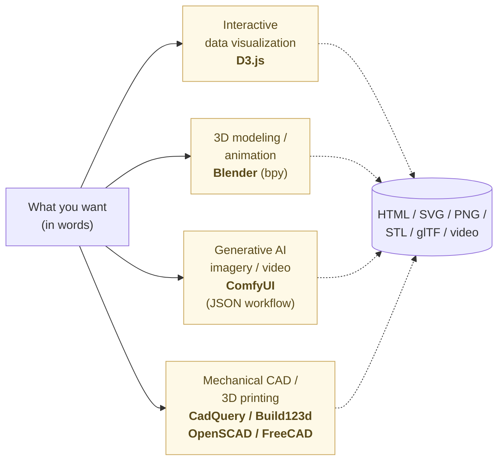

# Designing — With Mermaid and Claude Design

Change the tools you build designs with.

Until now, business design required separate specialized tools by purpose: PowerPoint, Visio, Figma, Sketch, Adobe XD, Canva, Photoshop. Steep learning curves, proprietary file formats, ongoing subscription fees.

The era has changed.

**Design, too, is generated from text.** Structural diagrams in Mermaid. UI and screens in Claude Design. Slides in Markdown. Every output traces back to text or code. **Editable, version-controllable, AI runs alongside as a colleague.**

## Types of design and their tools

Organize the work that "design" covers in business.

| Kind | Tool |
|---|---|
| **Structural diagrams** (flow, ER, sequence, architecture) | Mermaid (generated from text) |
| **UI / screens** (web, app drafts) | Claude Design (HTML+CSS output) |
| **Slides** (presentations) | Markdown → Marp / reveal.js |
| **Inset diagrams / explainers** | Mermaid + Claude Design |
| **Posters, flyers, handouts** | Claude Design / SVG |
| **Logos / serious branding** | Specialist designer (Claude assists with drafts) |

What unites them: **save not the final PDF or PNG, but the text and code that produced it.**

## Structural diagrams in Mermaid

Business systems, organizations, data relationships — every diagram that conveys *structure* can be written in Mermaid.

```
graph TD
  A[User] --> B[Web Server]
  B --> C[(Database)]
  B --> D[Cache]
  C -.->|slow| B
```

Four nodes and the arrows between them, expressed in plain text.

A diagram drawn in PowerPoint becomes an image the moment it's pasted into Word; structure is lost. It cannot be moved. Diffs are invisible. **Mermaid is text.** Git diffs work. AI reads it. You can edit it. It is still readable in ten years.

What you can write:

- Flowcharts (process flow)
- Sequence diagrams (APIs, human interactions)
- ER diagrams (data relationships)
- Class diagrams (object relationships)
- Gantt charts (project planning)
- State diagrams (screen / data state changes)
- Mind maps
- Architecture diagrams (system layout)

GitHub, Notion, Zed — most places render Mermaid natively. There is no need to memorize the syntax. **Ask Claude "draw this structure in Mermaid," and it returns the code.** You only need to read it.

## UI and screens in Claude Design

"Screen drafts," "UI mockups" — these used to live in Figma or Sketch. Steep learning curves, mandatory subscriptions, sealed inside the designer's workspace.

**Claude Design** changed this.

Ask "make a login form" and HTML + CSS + (if needed) JavaScript come back. Open the result in a browser, and there is a working screen. "Make it more refined." "Use a blue palette." "Left-align it." Speak the instruction in words, and the code rewrites itself.

```
You:    Make an inventory management screen UI. Product list, search box, add button.
Claude: (HTML+CSS returns)
You:    More whitespace, three columns.
Claude: (revised version returns)
```

This is not a Figma replacement. **It is faster than Figma, and the output is code-native** — it can be handed straight to development. It maps cleanly onto the HTML+CSS+minimal-JS stack from Chapter 7.

In business, this enables:

- Show "here's the screen idea" instantly during a customer pitch
- Embed a working HTML mockup inside the spec (not just an image)
- Compare multiple design candidates side-by-side before development starts
- Use the finished mockup as the development starting point
- Adjust live during stakeholder discussions

If a specialist designer is involved, **make the draft in Claude Design and hand it to them**: "this direction, polished further." Designers spend their time on what truly requires their expertise — brand consistency, print accuracy, photo selection.

## Slides also in Markdown

Presentation decks, too, written in Markdown.

`Marp` and `reveal.js` convert Markdown into HTML slides. One slide = one `---`-separated section in Markdown.

```markdown
# AI-Native Ways of Working

Change your tools, and the way you think changes

---

## Why now

The era of tools changed with AI

---

## Conclusion

One person + AI can do the work
```

That alone produces three slides exportable to PDF, HTML, and PNG.

Compared to PowerPoint:

- **PowerPoint**: binary format, formatting and content intermixed, no Git diff, AI cannot read it cleanly
- **Markdown + Marp**: text, structure only, Git diffs work, AI reads and writes

For slides that need complex layout, have Claude Design produce the HTML for that slide alone. **Base in Markdown; decoration in Claude.**

The speed of business presentation creation jumps:

- A 30-minute talk: written as 30 lines of Markdown
- Marp instantly produces PDF / HTML
- Edits are edits to Markdown
- Past slides become searchable (all text)
- The proposal document and the deck come from the same Markdown source

## What AI makes easy — specialist tools you used to give up on

Mermaid, Claude Design, and Marp are the **everyday design** set.
What follows is the **specialist tool** set you previously gave up on
because the learning curve was too steep. Because AI writes the
scripts, code, and node configurations, these tools **drop into the
hands of office workers, sole proprietors, and on-the-floor staff**.

> **If you're new** — what follows (D3 / Blender / ComfyUI / CAD) is
> a **preview of what becomes possible later**. To start, Mermaid and
> Claude Design alone are enough. Once everyday design is in your
> hands, come back to this section as needs arise. **The "skill of
> reading" is all you ever need to enter.**



What unites them: **all four are driven by scripts, code, or JSON.**
AI writes that "language." You don't need to memorize the GUI.

### D3.js — interactive data visualization

D3.js is a visualization library that runs in the browser. It builds
**custom interactive visualizations** Excel charts cannot reach —
hierarchy trees, force layouts, map-based views, bespoke layouts,
hover-reactive diagrams, zoomable timelines. The elaborate graphics
you see in newspapers and investigative reporting are usually D3.

The learning cost is high. It has its own concepts ("data binding,"
"selections"); self-taught, it takes months.

Through AI:

> You: With this JSON, draw a D3 force layout. Color the nodes,
> show info on hover, zoom enabled.
>
> Claude: (D3 code comes back)

JavaScript you can paste into a web page comes back. **You don't need
to memorize the D3 grammar.** Reports, web publication, dashboards,
investigative briefs — the territory of "the specialist visualizer"
drops into your hands.

The matplotlib / Altair set from Chapter 1 is for everyday aggregation
charts; **D3 is for elaborate custom visualizations** — pick by
purpose.

### Blender — 3D modeling and animation

Blender is a free, open-source 3D production suite. 3D models,
animation, rendering, video editing — Hollywood-grade features in
total, but the menu is vast and learning the shortcuts alone takes
months.

Blender is, in fact, **fully driveable from Python (`bpy`)**. Without
touching the GUI, a Python script can construct a 3D scene.

Through AI:

> You: In Blender Python, make a cube with a sphere on top. Light
> from upper-left, camera slightly below front, render to PNG.
>
> Claude: (`bpy` script comes back)

Uses in business:

- **Product promotion imagery** (virtual photo shoots of prototypes)
- **Quick architectural / interior layout visualization**
- **Educational animation** (mechanism behavior explanation)
- **Manual-grade assembly / exploded views**
- **Final-check renders before 3D printing**

### ComfyUI — node-based generative AI for images and video

ComfyUI treats generative AI (Stable Diffusion and the like) as
**connected nodes**. Beyond writing prompts, you can combine multiple
models, do conditional generation, generate video, maintain character
consistency — high-end workflows are buildable.

Wiring nodes by hand gets lost easily. Workflows are JSON files, and
writing them by hand is painful.

Through AI:

> You: A ComfyUI workflow as JSON: take a product photo as input,
> replace the background with white, overlay the logo bottom-right.
>
> Claude: (the workflow JSON comes back)

Uses in business:

- **Product image variations** (e-commerce, catalogs)
- **Mass-produce illustrations for blog and social posts**
- **Explainer illustrations for presentation decks**
- **Video assets** (manual / instructional video building blocks)

What used to go to **agencies and production houses** stays **in your
hands**. Publish a ComfyUI web UI internally and the team can use it
together.

### CAD — mechanical design, 3D printing, architectural models

Mechanical design runs on **dedicated CAD software** (SolidWorks,
Inventor, etc.) with steep learning curves and steep license fees.

But there is a parallel path: **CAD written as scripts or code**. AI
writes the code, so you don't need to learn the CAD's UI.

:::compare
| Tool | Language | Notes |
| --- | --- | --- |
| **OpenSCAD** | Its own scripting language | Long-standing, simple, a 3D-printing-community standard |
| **CadQuery** | Python | Pythonic CAD; affinity with industry dimensioning concepts |
| **Build123d** | Python | Successor lineage to CadQuery; more natural Python expression |
| **FreeCAD** | GUI + Python | Full-featured parametric CAD; scriptable in Python |
:::

Example: a bracket with screw holes, written in Build123d.

> You: A bracket 50mm wide × 30mm tall × 3mm thick. Two ø4mm holes
> 10mm from the top edge, symmetric left and right. In Build123d.
>
> Claude: (Python code comes back)

Run it and an STL file is produced. **Feed that directly to a 3D
printer; the part is printed.**

Uses in business:

- **Design of prototypes for 3D printing**
- **Jigs and fixtures** (small parts for production lines)
- **Mechanical parts** (motor mounts, sensor housings)
- **Architectural models, exhibition pieces**
- **Educational teaching materials**

Combined with embedded (Chapter 9), the loop closes: **design the
hardware yourself, 3D-print it yourself, write the control code
yourself**. Solo launches of hardware products — what used to require
a large organization — become realistic.

### The common principle — AI erases the "learning-curve wall"

D3, Blender, ComfyUI, CAD — these were "specialist tools whose
learning curves kept you out." They share one property:
**all are driven by scripts, code, or JSON.**

AI-native work uses this property to the maximum. **Instead of
memorizing the GUI, have AI write the code, look at the result, and
adjust.** Territory previously the exclusive domain of designers, 3D
artists, data visualizers, and mechanical engineers **drops into the
hands of someone who has only the "skill of using"** from Chapter 1.

> You don't need to become a specialist.
> **You need to become "someone who handles specialist tools with AI
> alongside."** This is the concrete shape of Chapter 12's "from
> silos to individual autonomy."

## Build business documents while keeping structure intact

Proposals, reports, specifications, internal documents, press releases — all are built with **Markdown as the body, Mermaid for diagrams, Claude Design for any decorative graphics**.

Concrete arrangement:

```
articles/proposal-2026/
  ├── ja.md              # Body (Markdown)
  ├── architecture.mmd   # Structural diagram (Mermaid)
  ├── ui-mockup.html     # Screen example (Claude Design output)
  └── cover.svg          # Cover page (SVG)
```

Python assembles these into a PDF (`pandoc`, `weasyprint` both work). Each component is independent and reusable elsewhere:

- The same Markdown can also generate an internal-wiki HTML version
- The same structural diagram can be pasted into another deck
- The UI mockup can go directly to the development side
- The same source materials produce PDF, HTML, print, and AI input — convert by purpose

"Design" and "content" are separated. **Editing does not become hell.** Fix one place; every output reflects it. This is exactly the principle from Chapter 7: "content in Markdown+Mermaid, frame only in HTML/CSS."

## The division of work with designers also changes

Claude Design cannot do everything. Serious branding, complex printed pieces, visual production involving photography — these remain the specialist designer's territory.

But **you can produce the draft yourself**, and that changes the division of work.

Before:

- Convey requirements verbally or in writing
- Designer interprets and produces a design
- The result differs from what was imagined
- Many round trips

After:

- You produce three screen drafts in Claude Design
- Hand to the designer
- "This direction, polished further"
- Intent transmitted in one round

**Designer expertise concentrates on what truly demands expertise.** Time stops being spent on the draft phase. This is the same shape as Chapter 6's "stop outsourcing business-system rewrites; the floor + Claude completes the loop." **The floor produces the draft; specialists focus on the finish.**

## You don't need to draw it yourself

Common to everything above: **humans don't really need to "draw."**

- No need to memorize Mermaid syntax. Ask Claude "draw this structure in Mermaid."
- No need to learn CSS. Ask Claude "make this kind of screen."
- No need to think about slide layout. Ask Claude "lay out this content as five Marp slides."

What humans do is **articulate intent in words, judge what comes back, instruct revisions**. That's it. The work of "drawing" passes to AI. The time spent thinking about *what to convey* increases.

> Don't memorize design symbols and rules. Acquire the ability to convey intent to Claude. That is the new literacy.

## Still readable in ten years

20-year-old PowerPoint files sometimes have substituted fonts, shifted shapes, or won't open at all. Old Adobe Illustrator `.ai` files may not open in newer versions. Figma designs disappear when the service ends.

Mermaid, Markdown, SVG, HTML+CSS — these are text. A file from 20 years ago renders fine today. 20 years from now will be the same. **AI reads them even more easily.**

> Hold design as structure too.

Formatting decorates display. Structure crosses time.

## In numbers

30-page slide deck in PowerPoint: prose and layout intermixed, **4 hours**. Same content in Marp: 30 lines of Markdown, 1-second build, edits are just Markdown changes — total **30 minutes**. **8x faster.**

UI mockup in Figma: $15/month subscription, 1 hour of shape manipulation, image-exported (not interactive) when handed to development. Claude Design "make a login form" returns HTML+CSS instantly, runs in the browser, ready for development. **Zero subscription.**

A one-line Mermaid diagram change in Git: 1 added, 1 removed, reviewed in 30 seconds. The same change in PowerPoint: file shows "binary changed," not reviewable.

A 20-year-old `.ppt` file: substituted fonts, shifted shapes, hard to reproduce. A Markdown / Mermaid file from the same era renders perfectly today.

## In summary

Move design tools to be text-centric.

Everyday design:

- Structural diagrams: **Mermaid**
- UI and screens: **Claude Design** (HTML+CSS output)
- Slides: **Markdown + Marp / reveal.js**
- Inset diagrams and handouts: **Mermaid + Claude Design**
- Business documents: **Markdown as body, diagrams and screens as separate files**

Specialist territory now reachable through AI:

- Data visualization (elaborate custom charts) → **D3.js**
- 3D modeling and animation → **Blender** (Python `bpy`)
- Generative AI images and video → **ComfyUI** (JSON workflows)
- Mechanical CAD and 3D printing → **CadQuery / Build123d / OpenSCAD / FreeCAD**

Step away from specialized tools — Figma, Sketch, Adobe XD,
PowerPoint, Visio, SolidWorks, Illustrator. Hold designs as text and
code that AI can write. Subscription fees disappear, learning curves
shrink, editing stops being hell, and AI runs alongside as a
colleague.

**The common principle is one: instead of learning the GUI, have AI
write the code, look at the result, adjust.** The learning-curve
wall comes down. Territory previously held only by specialists drops
into the hands of those with only the "skill of using" from
Chapter 1.

Specialists remain necessary. **But their time goes to specialist
territory, not drafts** — you take the draft work over with Claude.

The next chapter moves to how you hold data — from Excel to JSON / YAML, with SQLite + Python for mutable data and Parquet + DuckDB for large-scale data. CSV is dropped — its structuring is too weak.

---

## Related

- [Chapter 02: Writing Documents — Markdown as the Minimal Choice](/en/ai-native-ways/markdown/)
- [Chapter 04: Holding Data — Think in JSON and YAML](/en/ai-native-ways/data-formats/)
- [Chapter 07: Building for the Web — Back to HTML+CSS+JavaScript](/en/ai-native-ways/web/)
- [Prologue: Office for paperwork, Java/C# for business systems — but AI runs on Python and text](/en/ai-native-ways/prologue/)
