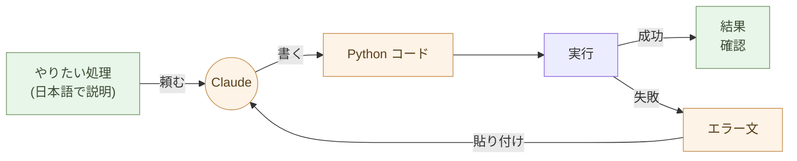

# 処理を書く ── AIにPythonで書いてもらう

処理を書く道具を、Python に変える。

それだけで、繰り返しの作業が一回限りの作業になる。Excel の整形、メールの集計、PDF の抽出、ファイルの一括リネーム。「人間が手作業で 30 分かかる」事務処理は、ほとんどが Python の 10 行で終わる。**書くのは Claude**。実行するのは人間。

## Python は全員のものだ

「Python は技術者のもの」という偏見を捨てる。

Python は、AI が書ける言語の中で最も読みやすい。Java や C# のように長いクラス定義や型注釈が要らない。書きたい処理がそのまま並ぶ。

```python
import csv

with open("orders.csv") as f:
    rows = list(csv.DictReader(f))

total = sum(int(r["qty"]) * int(r["price"]) for r in rows)
print(f"合計: {total} 円")
```

これだけで CSV を読んで合計を出す。事前知識は要らない。「CSV を開いて、qty と price を掛けて、足し合わせる」── そのままだ。

このコードを書く能力は要らない。**読める能力**で十分だ。読めれば、Claude が出してきたコードが正しそうかどうかは判断できる。

## 「書く能力」ではなく「使う能力」

ここに新しいリテラシーがある。

これまでの常識: プログラミングを学ぶ = 言語の文法を覚える、アルゴリズムを設計する、コードを書ける。

新しい常識: プログラミングを使う = 何を処理したいかを言葉にする、Claude にコードを書いてもらう、実行する、結果を確認する。

Excel の関数を覚える時間と、Python を Claude に書いてもらえるようになる時間を比べたら、後者のほうが圧倒的に短い。Excel の関数は Excel の中だけで使えるが、Python はあらゆるデータに使える。

> 書く能力ではなく、使う能力。これが新しいリテラシーである。

「どうコードを書くか」を学ぶ必要はない。「何を処理したいかをどう言語化するか」を学べばいい。これは技術ではなく、思考の整理だ。



## Claude に頼むときの作法

Claude に Python を書いてもらうコツは三つだけだ。

**一: 入力と出力を明示する**

「Excel ファイル `orders.xlsx` を読んで、商品ごとの売上合計を CSV `summary.csv` に書き出して」── 入力ファイルと出力ファイル、それぞれの形式が明確なら、Claude は迷わない。

**二: 一つずつ頼む**

「全部やって」ではなく「まずデータを読み込むコードを」「次に集計するコードを」「最後に CSV に書き出すコードを」と段階的に頼む。途中で動作を確認できるし、間違いに気づいたときに戻りやすい。

**三: 結果を見て直す**

最初のコードで完璧なものが出ることは少ない。実行して、出力を見て、「これが違う」「ここを変えて」と返す。**会話の往復で正解に近づく**。これがコードを「書く」のではなく「使う」スタイルだ。

## どんな処理が Python になるか

事務職や個人事業主の日常作業のほとんどだ。

- Excel ファイル 100 個から特定のシートだけ集めて結合
- メールの本文から金額を抜き出して CSV にする
- PDF を全文テキスト化して検索可能にする
- 画像のサイズを一括で揃える、リネームする
- Web サイトから商品情報をスクレイピングする
- 請求書 PDF を月ごとにフォルダ分けする
- Markdown ファイルを集めて目次を作る

「人間が手作業で繰り返している」作業は、ほぼ全部 Python になる。一度書いてしまえば、来月も再来月も使える。

## 実行環境は JupyterLab ── Excel の関数を書く感覚で Python が動く

Python を使うには、実行環境が要る。事務職や個人事業主に **最も合う
入口は JupyterLab** ── ブラウザで動く「Python のスプレッドシート」。

### Excel のセルに関数を書くのと、同じ感覚

Excel のセルに `=SUM(A1:A100)` と書いて Enter を押すと、答えが
返る。**JupyterLab はこれと同じ感覚で Python が動く** ── セルに
Python を書いて Shift+Enter、その場で結果が出る。

```python
import polars as pl

df = pl.read_excel("orders.xlsx")
df.group_by("item").agg(pl.col("qty").sum(), pl.col("price").sum())
```

これを JupyterLab のセルに貼って Shift+Enter。**下に表形式で結果が
表示される**。Excel のピボットテーブルと同じ操作感だ。ただし、

- 実行手順が **コード(数行)に残る** ── 再現可能、翌月も同じ作業が一瞬で済む
- 「なぜこの計算をしたか」を **Markdown セルで隣に書ける** ── 業務知識が消えない
- グラフもセルの中に描ける(`matplotlib` / `plotly`)
- **数千万行のデータでも遅くならない**(Polars は Excel の数十倍速い)
- ノートブック(`.ipynb`)として保存、Git で履歴管理できる
- 担当者が辞めても、ノートブックを開けば誰でも続きから作業できる

インストールは 2 行(`uv` が入っていれば):

```bash
$ uv tool install jupyterlab
$ jupyter lab
```

ブラウザが開いて、新しいノートブックを作って、セルに書いて、
Shift+Enter。**それだけ**。

### その他の実行環境

JupyterLab で十分でない場面のために、選択肢も挙げておく。

- **Claude のコード実行機能** ── 簡単な処理を、Claude のチャット内
  で即座に試したい時(セットアップ不要)
- **Google Colab** ── ブラウザだけで動く、無料、GPU 利用可能。
  重い処理や AI モデル実験に向く
- **コマンドラインで `python script.py`** ── 自動化スクリプト
  として cron で定期実行したい時、サーバーで動かす時
- **VS Code / Cursor の Notebook 機能** ── JupyterLab と同じ
  `.ipynb` を開ける。コード補完が効く

迷ったら **JupyterLab で始める**。Excel と同じ感覚で入れる。

## 「動かなかった」を恐れない

最初の頃、Python のコードを実行して、エラーが出ることが多い。

それで普通だ。エラー文を Claude にコピペして「これが出た」と渡せば、原因を特定して修正コードを返してくれる。**エラーは終わりではなく、次の指示の入力**だ。

> エラー文をそのまま Claude に貼る。Claude が直す。これで進む。

「自分にはプログラミングは無理」と思う必要はない。エラー文を貼れる能力があれば、それで十分だ。

## 10年後も読める

Python は 30 年以上前からある。Python 2 から 3 への移行で一部のコードが動かなくなったが、Python 3 のコードはこの先 10 年・20 年は動き続けるだろう。

Excel の VBA マクロは、Office のバージョンが上がるたびに動かなくなる可能性がある。Python のコードはテキストで、外部ライブラリへの依存が明示的で、AI が読み直せる。

> 処理も、構造で持て。

VBA は今の Excel を動かす。Python は時間を超えて動き続ける。

## 実例: 数字で見る

100 個の請求書 PDF から金額を抽出する月次作業: 手作業で **4 時間**。Claude が書いた Python で **3 秒**。翌月も同じスクリプトで 3 秒。**4,800 倍**の差(初回)、来月以降は無限大。

50 個の Excel ファイルから月次集計を作る事務作業: 1 ファイル 5 分 × 50 = **4 時間**。**Polars** の Python スクリプトを一回書けば、`python aggregate.py` で **10 秒**。

Excel ピボットで月別売上集計: マウス操作で **5 分・再現性ゼロ**(操作の記録は残らない、来月もう一度マウスを動かす必要がある)。同じ集計を **JupyterLab + Polars** で書く: セルに 3 行、Shift+Enter で **0.05 秒**、ノートブックがそのまま記録に残るので翌月は **再実行するだけ**。

Python の習得期間: 「使う能力」だけなら、Claude が書いたコードを読む練習を 1 週間 ── これで仕事に使える。「書く能力」を従来通り独学で身につけるなら 6 ヶ月。**24 倍の差**。

エラーが出た時の対処: 自力でググって試行錯誤すると 30 分〜2 時間。エラー文を Claude にコピペすると、原因と修正コードが 30 秒で返る。**60 倍以上の速さ**。

## まとめ

道具を変えれば、処理の仕方が変わる。

Excel の手作業から、Python と Claude へ。一歩で、繰り返しの仕事が一回限りの仕事になる。書く能力は要らない。**使う能力**だけでいい。

次の章では、データの持ち方の話に進む。Excel から JSON / CSV / YAML へ、大量データなら Parquet と DuckDB へ。Python が書けるようになった今、データ加工の選択肢が広がる。

---

## 関連記事

- [第2章: デザインをする ── Mermaid と Claude デザインで作る](/ai-native-ways/design/)
- [第4章: データを持つ ── JSON/CSV/YAMLで考える](/ai-native-ways/data-formats/)
- [第1章: 文書を書く ── Markdownという最小の選択](/ai-native-ways/markdown/)
- [構造分析12: AIと個人事業](/insights/ai-and-individual/)
