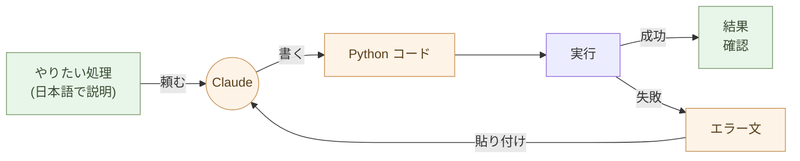

# 処理を書く ── AIにPythonで書いてもらう

処理を書く道具を、Python に変える。

それだけで、繰り返しの作業が一回限りの作業になる。Excel の整形、メールの集計、PDF の抽出、ファイルの一括リネーム。「人間が手作業で 30 分かかる」事務処理は、ほとんどが Python の 10 行で終わる。**書くのは Claude**。実行するのは人間。

## Python は全員のものだ

「Python は技術者のもの」という偏見を捨てる。

Python は、AI が書ける言語の中で最も読みやすい。Java や C# のように長いクラス定義や型注釈が要らない。書きたい処理がそのまま並ぶ。

```python
import csv

with open("orders.csv") as f:
    rows = list(csv.DictReader(f))

total = sum(int(r["qty"]) * int(r["price"]) for r in rows)
print(f"合計: {total} 円")
```

これだけで CSV を読んで合計を出す。事前知識は要らない。「CSV を開いて、qty と price を掛けて、足し合わせる」── そのままだ。

このコードを書く能力は要らない。**読める能力**で十分だ。読めれば、Claude が出してきたコードが正しそうかどうかは判断できる。

## 「書く能力」ではなく「使う能力」

ここに新しいリテラシーがある。

これまでの常識: プログラミングを学ぶ = 言語の文法を覚える、アルゴリズムを設計する、コードを書ける。

新しい常識: プログラミングを使う = 何を処理したいかを言葉にする、Claude にコードを書いてもらう、実行する、結果を確認する。

Excel の関数を覚える時間と、Python を Claude に書いてもらえるようになる時間を比べたら、後者のほうが圧倒的に短い。Excel の関数は Excel の中だけで使えるが、Python はあらゆるデータに使える。

> 書く能力ではなく、使う能力。これが新しいリテラシーである。

「どうコードを書くか」を学ぶ必要はない。「何を処理したいかをどう言語化するか」を学べばいい。これは技術ではなく、思考の整理だ。



## Claude に頼むときの作法

Claude に Python を書いてもらうコツは三つだけだ。

**一: 入力と出力を明示する**

「Excel ファイル `orders.xlsx` を読んで、商品ごとの売上合計を CSV `summary.csv` に書き出して」── 入力ファイルと出力ファイル、それぞれの形式が明確なら、Claude は迷わない。

**二: 一つずつ頼む**

「全部やって」ではなく「まずデータを読み込むコードを」「次に集計するコードを」「最後に CSV に書き出すコードを」と段階的に頼む。途中で動作を確認できるし、間違いに気づいたときに戻りやすい。

**三: 結果を見て直す**

最初のコードで完璧なものが出ることは少ない。実行して、出力を見て、「これが違う」「ここを変えて」と返す。**会話の往復で正解に近づく**。これがコードを「書く」のではなく「使う」スタイルだ。

## どんな処理が Python になるか

事務職や個人事業主の日常作業のほとんどだ。

- Excel ファイル 100 個から特定のシートだけ集めて結合
- メールの本文から金額を抜き出して CSV にする
- PDF を全文テキスト化して検索可能にする
- 画像のサイズを一括で揃える、リネームする
- Web サイトから商品情報をスクレイピングする
- 請求書 PDF を月ごとにフォルダ分けする
- Markdown ファイルを集めて目次を作る

「人間が手作業で繰り返している」作業は、ほぼ全部 Python になる。一度書いてしまえば、来月も再来月も使える。

## 実行環境は JupyterLab ── Excel の関数を書く感覚で Python が動く

Python を使うには、実行環境が要る。事務職や個人事業主に **最も合う
入口は JupyterLab** ── ブラウザで動く「Python のスプレッドシート」。

### Excel のセルに関数を書くのと、同じ感覚

Excel のセルに `=SUM(A1:A100)` と書いて Enter を押すと、答えが
返る。**JupyterLab はこれと同じ感覚で Python が動く** ── セルに
Python を書いて Shift+Enter、その場で結果が出る。

```python
import polars as pl

df = pl.read_excel("orders.xlsx")
df.group_by("item").agg(pl.col("qty").sum(), pl.col("price").sum())
```

これを JupyterLab のセルに貼って Shift+Enter。**下に表形式で結果が
表示される**。Excel のピボットテーブルと同じ操作感だ。ただし、

- 実行手順が **コード(数行)に残る** ── 再現可能、翌月も同じ作業が一瞬で済む
- 「なぜこの計算をしたか」を **Markdown セルで隣に書ける** ── 業務知識が消えない
- グラフもセルの中に描ける(`matplotlib` / `plotly`)
- **数千万行のデータでも遅くならない**(Polars は Excel の数十倍速い)
- ノートブック(`.ipynb`)として保存、Git で履歴管理できる
- 担当者が辞めても、ノートブックを開けば誰でも続きから作業できる

インストールは 2 行(`uv` が入っていれば):

```bash
$ uv tool install jupyterlab
$ jupyter lab
```

ブラウザが開いて、新しいノートブックを作って、セルに書いて、
Shift+Enter。**それだけ**。

### その他の実行環境

JupyterLab で十分でない場面のために、選択肢も挙げておく。

- **Claude のコード実行機能** ── 簡単な処理を、Claude のチャット内
  で即座に試したい時(セットアップ不要)
- **Google Colab** ── ブラウザだけで動く、無料、GPU 利用可能。
  重い処理や AI モデル実験に向く
- **コマンドラインで `python script.py`** ── 自動化スクリプト
  として cron で定期実行したい時、サーバーで動かす時
- **VS Code / Cursor の Notebook 機能** ── JupyterLab と同じ
  `.ipynb` を開ける。コード補完が効く

迷ったら **JupyterLab で始める**。Excel と同じ感覚で入れる。

## Polars で集計・クロス集計 ── ピボットテーブルがコードになる

JupyterLab に Polars を組み合わせると、**Excel でピボットテーブル・
VLOOKUP・IF・フィルタでやっていた操作が、すべてコードで書ける**。
Excel ユーザーの日常操作との対応:

:::compare
| Excel で | Polars で |
| --- | --- |
| ピボットテーブル(行・列・値) | `df.pivot(...)` または `df.group_by(...).agg(...)` |
| VLOOKUP / XLOOKUP | `df.join(other, on="...")` |
| IF / IFS(計算列) | `df.with_columns(...)` + `pl.when().then().otherwise()` |
| フィルタ | `df.filter(...)` |
| ソート | `df.sort(...)` |
| 重複削除 | `df.unique(...)` |
| 累積合計・前月比 | ウィンドウ関数(`cum_sum`、`shift`、`pct_change`) |
:::

### 例 1:月別商品別のクロス集計

Excel でやるなら、ピボットテーブルを開いて、行に「商品」、列に
「月」、値に「売上」をドラッグ。マウス操作で数分、**翌月もう一度
同じマウスを動かす**。

Polars なら:

```python
import polars as pl

df = pl.read_excel("orders.xlsx")
df.pivot(values="price", index="item", on="month", aggregate_function="sum")
```

セルで Shift+Enter、下にクロス集計表が表示される。**翌月は再実行
するだけ**。100 万行でも一瞬。

### 例 2:VLOOKUP の代替

商品マスタ(`products.xlsx`)から商品名を引いて、注文表
(`orders.xlsx`)に付け加える ── Excel なら `VLOOKUP` で列ごとに
書く、行が多いと固まる。

```python
orders = pl.read_excel("orders.xlsx")
products = pl.read_excel("products.xlsx")

orders.join(products, on="item_id", how="left")
```

3 行。**100 万行でも一瞬**。複数列で結合するときも、`on=["item_id",
"date"]` と並べるだけ。

### 例 3:条件分岐で計算列を追加

「売上が 10 万円超なら大口、5 万円超なら中口、それ以下なら小口」
── Excel の IF をネストするやつ。

```python
df.with_columns(
    category=pl.when(pl.col("price") > 100000).then(pl.lit("大口"))
              .when(pl.col("price") > 50000).then(pl.lit("中口"))
              .otherwise(pl.lit("小口"))
)
```

**ネストした IF の地獄から解放される**。条件を増やしても、上から
順に `when().then()` を足すだけ。

### AI に頼めば文法を覚えなくていい

「Polars の文法を覚えるのは大変では?」── 違う。**Claude に日本語
で頼む**:

> orders.xlsx を読んで、商品ごとの月別売上を集計、上位 10 商品
> だけを取り出して、前月比のパーセントも付けて

これだけで Polars のコードが返る。JupyterLab のセルに貼って
Shift+Enter、結果が表で出る。**文法を覚える必要は無い**。

> ピボットテーブルでやっていたことが、コードに変わる。
> マウス操作は消えるが、結果は同じか、それ以上。
> 翌月は再実行するだけ。

## グラフを描く ── Excel より強力、AI が複雑さを引き受ける

JupyterLab + Polars にグラフ描画を加えると、データ可視化の表現力は
Excel を大きく超える。Python の主要なグラフライブラリは二つ。

### matplotlib ── 何でも描ける事実上の標準

折れ線・棒・散布・ヒストグラム・ヒートマップ・3D・地図・独自
レイアウト・書籍出版品質の図 ── 30 年近い歴史で、論文・書籍・
新聞記事の図はほぼすべて matplotlib で描ける。**機能は最大、API
は冗長**。複雑な図だと 20〜50 行のコードになる。

### Altair ── 宣言的に書ける、インタラクティブが標準

「この列を X 軸、この列を Y 軸、この列で色分け」と **宣言的に書く**
モダンなライブラリ。Vega-Lite ベース。出力は自動的に
**インタラクティブな HTML**(ズーム・ホバー・選択)。

```python
import altair as alt
import polars as pl

df = pl.read_excel("orders.xlsx")
alt.Chart(df).mark_bar().encode(
    x="item",
    y="qty:Q",
    color="month",
)
```

JupyterLab のセルで Shift+Enter、下にインタラクティブな積み上げ
棒グラフ。Excel で同じことをしようとすると、ピボット → グラフ →
凡例調整 …… で数分。**Altair なら数秒、コード 6 行**。

### 人間が書くと複雑、AI に任せれば消える

matplotlib の API も Altair の独自文法も、**人間が syntax を
覚えるのは確かに辛い**。だが AI ネイティブな働き方では、これは
問題にならない:

> あなた:orders.xlsx の月別売上を、商品ごとに色分けした積み上げ
> 棒グラフで描いて。凡例は右上、Y 軸は 100 万単位で。
>
> Claude:(matplotlib なり Altair なりのコードが返る)
>
> あなた:色合いをもっと落ち着いた色に。タイトルは「2026 年度
> 月次売上(商品別)」で。
>
> Claude:(修正版が返る)

人間が **ライブラリを覚える必要は無い**。意図を言葉にすれば、Claude
がコードを書く。Excel のグラフメニューを延々とクリックするより
速く、はるかに細かい制御ができる。

### Excel のグラフ機能と比べると

:::compare
| 項目 | Excel | matplotlib / Altair(+ Claude) |
| --- | --- | --- |
| 単発のグラフ | ◎ マウスでサクッと | ◎ 言葉で Claude に頼む |
| 毎月の再生成 | △ マクロが必要、保守困難 | ◎ スクリプト再実行 |
| 数百万行のデータ | × Excel が固まる | ◎ Polars がストリーミング |
| 細かいカスタマイズ | △ メニューに限界 | ◎ ほぼ無制限 |
| インタラクティブ(zoom / hover) | × ほぼ不可 | ◎ Altair が標準対応 |
| 再現性(他人が同じ図を描ける) | × マウス操作は記録なし | ◎ コードが記録 |
| バージョン管理 | × バイナリ | ◎ コードを Git で |
| 出力(PNG / SVG / HTML) | △ コピペ | ◎ プログラム的に保存 |
:::

「使い方を覚えるコスト」を AI が肩代わりした時点で、**定型の集計
グラフを Excel のメニューで作る理由は消える**。

## 「動かなかった」を恐れない

最初の頃、Python のコードを実行して、エラーが出ることが多い。

それで普通だ。エラー文を Claude にコピペして「これが出た」と渡せば、原因を特定して修正コードを返してくれる。**エラーは終わりではなく、次の指示の入力**だ。

> エラー文をそのまま Claude に貼る。Claude が直す。これで進む。

「自分にはプログラミングは無理」と思う必要はない。エラー文を貼れる能力があれば、それで十分だ。

## 10年後も読める

Python は 30 年以上前からある。Python 2 から 3 への移行で一部のコードが動かなくなったが、Python 3 のコードはこの先 10 年・20 年は動き続けるだろう。

Excel の VBA マクロは、Office のバージョンが上がるたびに動かなくなる可能性がある。Python のコードはテキストで、外部ライブラリへの依存が明示的で、AI が読み直せる。

> 処理も、構造で持て。

VBA は今の Excel を動かす。Python は時間を超えて動き続ける。

## 実例: 数字で見る

100 個の請求書 PDF から金額を抽出する月次作業: 手作業で **4 時間**。Claude が書いた Python で **3 秒**。翌月も同じスクリプトで 3 秒。**4,800 倍**の差(初回)、来月以降は無限大。

50 個の Excel ファイルから月次集計を作る事務作業: 1 ファイル 5 分 × 50 = **4 時間**。**Polars** の Python スクリプトを一回書けば、`python aggregate.py` で **10 秒**。

Excel ピボットで月別売上集計: マウス操作で **5 分・再現性ゼロ**(操作の記録は残らない、来月もう一度マウスを動かす必要がある)。同じ集計を **JupyterLab + Polars** で書く: セルに 3 行、Shift+Enter で **0.05 秒**、ノートブックがそのまま記録に残るので翌月は **再実行するだけ**。

Python の習得期間: 「使う能力」だけなら、Claude が書いたコードを読む練習を 1 週間 ── これで仕事に使える。「書く能力」を従来通り独学で身につけるなら 6 ヶ月。**24 倍の差**。

エラーが出た時の対処: 自力でググって試行錯誤すると 30 分〜2 時間。エラー文を Claude にコピペすると、原因と修正コードが 30 秒で返る。**60 倍以上の速さ**。

## 誰の生産性が確実に上がるか

JupyterLab + Polars + matplotlib/Altair の道具立ては、**Excel で
日常的に集計・クロス集計・グラフ作りをしている人** に最も効く。
事務職、経理、営業、マーケティング、研究者、個人事業主 ──
データの「見える化」と「定型集計」を毎月繰り返している人。

これらは序章で「定型業務」に分類した領域だ。**数倍〜数十倍の生産性
向上が、確実に得られる**:

- 月次集計のマウス操作 → コードの再実行(0.05 秒)
- 数千行で固まる Excel → 100 万行を秒で(Polars)
- 「秘伝のピボット」 → 読めるコードとして残る(担当者が辞めても続けられる)
- 手作りグラフを毎月コピペ → スクリプトが PNG / SVG を自動生成

戦略判断・顧客対話・新規設計のような「価値ある仕事」の生産性は
ここでは上がらない(序章「効率化の限界」)。それでいい。
**ここで時間を取り戻して、価値ある仕事に振り向ける** ── これが
本書の主旨だ。

## 個人の生産性向上は、基幹システムの簡素化につながる

個人レベルで集計・分析・可視化が手元でできるようになると、組織が
**「基幹システム」として抱えていた複雑さの一部が要らなくなる**:

- 「営業データを月別商品別に見たい」 → IT 部門に依頼 → BI ツール
  でレポート → 数日後にメール だった作業が、**JupyterLab で 5 分**
- 顧客マスタを更新するための ERP 画面と権限管理が、**SQLite +
  Python** に降りる(第4章)
- ダッシュボードのための Tableau / Power BI のライセンスと専門家
  が要らない ── **Altair で十分**(自分で書ける、HTML で配れる)
- 月次レポート用のレポーティングサーバーが、**cron + Python
  スクリプト** に降りる
- BI 用のデータマートが、**SQLite / Parquet ファイル** に降りる

**個人が手元で動かせる範囲** が広がれば、**組織で抱える複雑さ**
が減る。第6章「業務システムと付き合う」で扱う組織レベルの書き
換え(Java/C# → Python、Oracle → PostgreSQL の並行稼働)は、
**ここで身につけた個人の能力があってこそ成立する**。基幹システム
が抱えていた仕事の多くは、もはや「個人 + AI」で完結する範囲に
入る。

### 例:請求書発行 ── 会計ソフトのサブスクが消える

請求書発行も同じパターンだ。これまで会計ソフト(freee、
MoneyForward など、月額数千〜数万円)、ERP、ベンダーロックイン
された業務システムが担っていた領域:

- **顧客マスタ・取引データ** → SQLite(第4章)
- **請求書テンプレート** → Markdown / HTML(第1章)
- **生成スクリプト** → Python + Claude(第3章)+ pandoc /
  weasyprint で PDF 化

100 通の請求書 PDF を月末に一括生成、メール送信まで Python で
書ける。cron でスケジュール実行。**会計ソフトのサブスクは要らない、
データは自分の手元に残る**。

見積書、契約書、月次レポート、商品カタログ、納品書、督促状 ──
同じ構造で書けるものはすべて、基幹システムから個人の手元へ降りる。
これは序章「三段階の移行」の **第三段階(業務をアプリ化する)**
そのものだ。

> 個人の生産性向上は、組織の単純化に直結する。
> 1 人 + AI が、これまで基幹システムと専門部門で支えていた仕事
> を、徐々に置き換えていく。

## まとめ

道具を変えれば、処理の仕方が変わる。

Excel の手作業から、Python と Claude へ。一歩で、繰り返しの仕事が一回限りの仕事になる。書く能力は要らない。**使う能力**だけでいい。

次の章では、データの持ち方の話に進む。Excel から JSON / CSV / YAML へ、大量データなら Parquet と DuckDB へ。Python が書けるようになった今、データ加工の選択肢が広がる。

---

## 関連記事

- [第2章: デザインをする ── Mermaid と Claude デザインで作る](/ai-native-ways/design/)
- [第4章: データを持つ ── JSON/CSV/YAMLで考える](/ai-native-ways/data-formats/)
- [第1章: 文書を書く ── Markdownという最小の選択](/ai-native-ways/markdown/)
- [構造分析12: AIと個人事業](/insights/ai-and-individual/)
