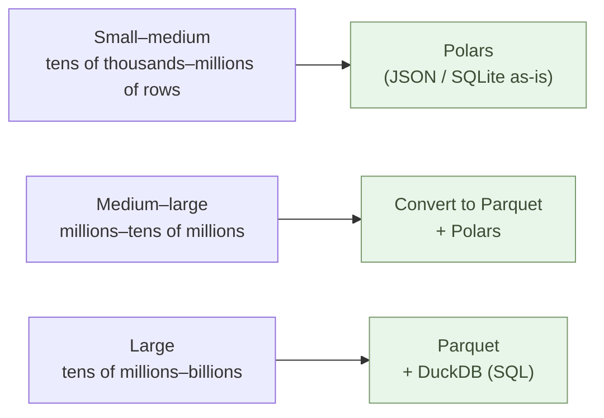

# Holding Data — Think in JSON and YAML

Hold data in **JSON, YAML, SQLite, Parquet** (and `.xlsx` for
human-viewed tables).

The shared principle is one: **store data together with the structure
it needs**. Hierarchy as hierarchy, configuration with comments,
mutable data with schema and transactions, large-scale data with
columnar layout and types. Not "press every value into a flat
typeless table" — pick the structure the data's shape demands.

Note up front: **Excel files (`.xlsx`) are not dropped** — they carry
sheets, types, formulas, formatting. What we drop is **CSV** — it
carries none of that and silently loses information.

## Learn four structures — not the syntax, the kinds of structure

To "match structure to the data's shape," you need to know what's on
offer. That is why this chapter teaches four:

| Format | Structure | Main use |
| --- | --- | --- |
| **JSON** | Hierarchy + arrays + types (number/string/bool/null) | Transfer, APIs, invoices and other nested data |
| **YAML** | Hierarchy + comments, human-edited structure | Configuration, Markdown frontmatter |
| **SQLite** | Tables + schema + transactions | Mutable data (customer master, ledger, inventory) |
| **Parquet** | Columnar + types + compression | Large-scale analytics (millions to billions of rows) |

"Four feels like a lot to learn" — Chapter 1's principle applies:
**not the skill of writing, but the skill of using**.

- **Claude writes the syntax** — `CREATE TABLE`, `SELECT`, JSON
  brackets, YAML indentation, Parquet schemas, all of it
- **You learn only "which structure for which case"** — keep the four
  rows above in mind
- "This is hierarchical," "this has updates," "this is large-scale" —
  once you can name it, Claude returns the right format and the right
  code

> All you need is the **eye to choose structure**. You don't need to
> memorize the syntax. This is the same practice as choosing between
> Markdown / AsciiDoc / MyST / LaTeX for documents (Chapter 2).

And — **CSV is dropped**. It doesn't match any of the four structures
above. It has long been treated as "the default format for tables,"
but its structuring is too weak for AI-native work. This chapter
explains why.

## Excel is not the enemy. The flat-typeless CSV is.

Open an Excel file. Borders, merged cells, color-coding, fonts,
comments, filters, pivot tables, formulas — these all sit alongside
the data. The `.xlsx` file carries **sheets, column types (number /
string / date / currency), formulas, and formatting** inside it.
**Structure is preserved in the file.**

That makes Excel `.xlsx` a perfectly legitimate format for
**human-viewed tables**. The boundary is Microsoft (the subscription
and the vendor lock-in), not the file format. **Use OnlyOffice as the
open-source editor; keep `.xlsx` as the format.** (Details in the
OnlyOffice section below and in Chapter 5.)

What truly loses information is **export to CSV**. The moment an
`.xlsx` becomes CSV, the sheets, types, formulas, and formatting are
all gone.

## JSON — structure as it is

JSON is text. It writes the shape of the data as it is.

```json
{
  "customer": "Yamada Farm",
  "orders": [
    { "date": "2026-04-01", "item": "cabbage", "qty": 12, "price": 180 },
    { "date": "2026-04-08", "item": "onion",   "qty": 24, "price":  95 }
  ]
}
```

A customer with multiple orders, with the hierarchy intact. "A
customer has many orders" is visible the moment you open the file.
**No formatting metadata, no colors, no fonts — they aren't needed.**

Formatting is needed at display time. Not at storage time.

## YAML — settings as they are

For configuration — the parameters that drive a system — YAML fits.

```yaml
site:
  name: aiseed.dev
  language: en
  features:
    - markdown
    - rss
    - sitemap

build:
  output: html/
  cache: true
  threads: 4
```

More readable for humans than JSON, and it supports comments
(`#` starts a comment). You can leave a note inside the configuration
about *why* a setting is what it is.

YAML is also what powers Markdown frontmatter (the block between
`---` at the top of the file).

## CSV is dropped — its structuring is too weak

"For tables, just use CSV" — drop it. The reason is **weak
structuring**. CSV is text that AI can read, but **it has no types,
no schema, no hierarchy, and Excel silently rewrites the data**. It
doesn't belong in an AI-native toolkit.

### You can't tell what the structure is

When handling data, **the structure** — what each column represents,
what the types are, whether nulls differ from empty strings, whether
there's hierarchy — is decisive. **In CSV, you can't tell.**

The same data, "2026-04-01 / 001 / cabbage / 12," written in two
ways:

:::compare
| CSV (structure invisible) | JSON (structure visible) |
| --- | --- |
| <pre>date,id,name,value<br/>2026-04-01,001,cabbage,12</pre> | <pre>{<br/>  "date": "2026-04-01",<br/>  "id": "001",<br/>  "name": "cabbage",<br/>  "value": 12<br/>}</pre> |
| Is `001` a string or a number? **Unclear.** | `"001"` is **explicitly a string** |
| Is `2026-04-01` a string or a date? **Unclear.** | `"2026-04-01"` is a string (the app decides if it's a date) |
| Is `12` a number or a string? **Unclear.** | `12` is **explicitly a number** |
| No distinction between blank, empty string, and `null` | `null`, `""`, and absence are **different things** |
| Hierarchy **cannot be expressed** | Nesting and arrays are written as-is |
:::

> **What the structure is, is important. In CSV, you cannot tell.**
> The reader (human or AI) guesses each time. When the guess is
> wrong, the data corrupts.

This is the same principle as **dropping plain text (`.txt`) in favor
of Markdown** for documents (Chapter 2). Being "text that anything
can read" is not enough — **pick formats that make structure
explicit**.

- Documents: `.txt` → **Markdown / AsciiDoc / MyST / LaTeX**
- Data: `CSV` → **JSON / YAML / SQLite / Parquet**

Weakly-structured formats hurt AI, humans, and long-term life of the
data.

### Structural defects of CSV

- **No type information** (everything is a string on disk) — `001`,
  `2026-04-01`, `123.45` all live as raw characters. Types must be
  *guessed* every time it is read.
- **No schema** — "Is this column required?" "What date format?"
  "What units?" None of it is in the file.
- **No hierarchy** — parent–child relations like customer-and-orders
  force you to split into multiple files and join them yourself.
- **No comments** — you can't record "why this value" or "when this
  row was added."
- **No concurrency protection** — last write wins.
- **One bad row breaks everything** — a stray comma or quote and the
  whole file falls apart.

### Excel silently rewrites the data

The biggest problem: opening CSV in Excel (or OnlyOffice)
**silently rewrites the data**.

:::highlight
**What Excel will quietly change when opening a CSV:**

- IDs with leading zeros like `001`, `007` → become `1`, `7` (employee
  numbers, product codes, account numbers all mangled).
- `2026/04/01` → flipped to `2026/4/1`, `May 1`, serial value `46110`,
  depending on locale.
- `090-1234-5678` (phone number) → interpreted as subtraction,
  exponent notation, or stripped of leading zeros.
- `MAR1`, `SEPT2` (gene names, product codes) → converted to dates
  (`1-Mar`, `2-Sep`) — the famous case that destroyed gene names in
  scientific papers at scale.
- `123E45` (product part number) → exponent notation `1.23E+47`.
- Encoding guessed as something local — UTF-8 Japanese turns into
  mojibake (and vice versa).

**The CSV file itself isn't broken.** Excel "helpfully" guesses types
on read. **Save again and the corruption is committed to disk.** This
is the direct consequence of **CSV having no type information**.
:::

### When existing CSV arrives

CSV won't stop arriving from outside. **Convert it the moment it
arrives** — to JSON, SQLite, or Parquet (Claude writes the Python).
**Don't keep CSV, don't edit CSV, don't open CSV in Excel.**

```python
# Convert incoming CSV immediately to JSON / Parquet
import polars as pl
df = pl.read_csv("received.csv", schema_overrides={"id": pl.Utf8})  # ID as string
df.write_parquet("received.parquet")  # stored with types intact
df.write_json("received.json")        # JSON for handoff
```

The same structure as Office: not "use" but "pass through." CSV is
**only a legacy entry point**; it is not kept on your side.

### Excel (`.xlsx`) is not dropped. CSV is.

To say it once more — **Excel files (`.xlsx`) carry structure**:
sheets, column types, formulas, formatting, all stored inside the
file. **`.xlsx` itself is fine.** Human-viewed tables can live there
(and you don't have to be forced into Microsoft Excel as the editor —
OnlyOffice is enough; see below).

What we drop is **CSV**. Exporting `.xlsx` to CSV is **an
information-losing conversion** — sheets, types, formulas, formatting,
all gone.

### The software-engineer culture that pushed CSV deserves criticism

Let's say it plainly. **The software-engineer culture that said
"keep your data in CSV" was wrong.**

The usual reasons for promoting CSV:

- "It's text — anything can read it." Correct — at the cost of
  **losing type information**.
- "It follows the Unix philosophy." CSV is thirty years older than
  that philosophy.
- "Lightweight and fast." Parquet is smaller *with* types preserved.
- "Machine-readable." JSON / Parquet / SQLite are far more
  machine-readable.
- "Standard export format from databases." Being standard and being
  *appropriate* are different.

These rationalizations have only **prolonged a technical culture that
treats data as a typeless table**. And the cost is paid by **office
workers, researchers, farmers, sole proprietors — anyone who isn't a
software engineer**:

- Employee numbers lose their leading zeros → HR repairs them.
- Gene names turn into dates → researchers rewrite papers (this has
  really happened, at scale).
- Customer phone numbers become exponent notation → sales can't
  reach customers.
- Japanese (or any non-ASCII) text mojibakes → the floor restores it
  by hand.
- `.xlsx` gets "compressed" to CSV → formulas, formatting, sheet
  structure, all gone.

These are **accidents that don't happen when data is stored together
with structure**.

> The engineers who pushed CSV were imposing, as an industry standard,
> "a format that doesn't hurt me, but hurts someone else." In the
> AI-native era, that culture ends.

Instead, choose formats that carry **type and structure**:

- **`.xlsx` (Excel / OnlyOffice)** — human-viewed tables (with
  structure)
- **JSON / YAML** — hierarchy, settings, handoff
- **SQLite** — mutable data
- **Parquet** — large-scale analytics

**Excel files preserve information, so they stay. CSV is what we
drop.**

## What AI reads is structure

When you hand Claude an Excel file, it unzips the `.xlsx`, reads the
XML, strips formatting, and pulls out cell values. **What AI needs
is the structure, exposed.**

Hand Claude JSON, YAML, SQLite, or Parquet — no conversion needed.
It reads them directly. It writes them directly.

> Hold data with its structure, and AI becomes a colleague.

This is not metaphor. It is technical fact. As long as your
interaction with AI is text-based, **structured formats — not flat
CSV — are the shared language for data**.

## Which to use

```mermaid
flowchart TD
  Q{Data shape and use}
  Q -->|Table with <b>updates</b> / programmatic<br/>customer / product master / ledger / inventory| SQL["<b>SQLite</b> + Python<br/>single-file DB<br/>transactions + type guarantee"]
  Q -->|Table <b>for humans</b> to view / touch<br/>formatting and color needed| OO["<b>OnlyOffice / Excel</b><br/>.xlsx with structure<br/>OSS, no Microsoft needed"]
  Q -->|Hierarchy / nesting / handoff| JSON["<b>JSON</b><br/>invoices, customer+orders<br/>API responses, transfer"]
  Q -->|Settings + comments| YAML["<b>YAML</b><br/>system configuration<br/>Markdown frontmatter"]
  Q -->|Large-scale analytics<br/>tens of millions to billions of rows| PARQ["<b>Parquet + DuckDB</b><br/>columnar, compressed<br/>direct SQL"]
  Q -.->|Only arrives from outside<br/>(convert and discard)| CSV["CSV<br/>(legacy entry; don't keep)"]
  classDef opt fill:#e8f5e9,stroke:#7a9a6d,color:#3a4d34
  classDef minor fill:#f4f0e8,stroke:#a89572,color:#5a4a30
  class SQL,OO,JSON,YAML,PARQ opt
  class CSV minor
```

You can use all of them in one project. **Customer master with
updates in SQLite, monthly aggregation table for humans in
OnlyOffice (`.xlsx`), invoice data in JSON, handoff also JSON,
system config in YAML, the historical transaction log in Parquet**
— pick the structure each piece of data needs. CSV is a **legacy
entry point**: when it arrives, convert immediately to JSON / SQLite
/ Parquet; don't keep it on your side.

If unsure, ask Claude "what shape should this data take?" and it
will look at the data and answer.

## OnlyOffice — keep the Excel UI, drop Microsoft

"Tables are for humans to look at and touch. Formatting, color,
column width, formulas — all of it is needed." That use case is
real. Monthly aggregation tables, materials for customers, budget
sheets, shift sheets, quotation sheets.

For these, SQLite or JSON is the wrong choice — a spreadsheet UI is
genuinely needed. But there is no requirement to be tied to
Microsoft Excel. Use **OnlyOffice**.

OnlyOffice is **an Excel-compatible spreadsheet** (with Word and
PowerPoint editors bundled). Open-source, free desktop edition,
community-edition server free as well.

- **Native `.xlsx`** — open files arriving from anywhere, save as
  `.xlsx`, near-complete compatibility.
- **Formatting / formulas / pivots / charts preserved** — borders,
  color, `SUM`, `VLOOKUP`, conditional formatting, pivot tables all
  work.
- **No Microsoft account, no subscription** — out of the monthly-fee
  trap.
- **Browser-based collaboration** — alternative to Google Sheets /
  Microsoft 365, self-hostable.
- **REST API for programmatic integration** — Python ↔ OnlyOffice
  server for `.xlsx` ↔ PDF automation.
- **Runs on Linux** — Mac / Windows / Linux all supported.

> The Excel UI (rows and columns, formatting, formulas) is kept.
> Microsoft, the vendor, is dropped. OnlyOffice is what makes that
> separation possible.

## SQLite — the home for data with updates

JSON and YAML cover hierarchy and settings. But for **frequently
updated data**, neither is ideal:

- Hand-editing a JSON / YAML file can break the whole file with a
  bracket or indentation error.
- Concurrent edits → last write wins.
- The whole file must be read and rewritten — past tens of thousands
  of records, this slows down.
- No indexes, no constraints (UNIQUE, NOT NULL).
- No way to know "who, when, why" from the file alone.

For data with updates — **customer master, product master, ledger,
inventory, reservations, task management** — use **SQLite**.

SQLite is **a database in a single file**. No server. `my_data.db`
holds all tables, schema, indexes, and data. Python's standard
library ships with `sqlite3`, so no extra install needed (Polars
and DuckDB also open SQLite files directly).

```python
import sqlite3

con = sqlite3.connect("customers.db")
con.execute("""
    CREATE TABLE IF NOT EXISTS customers (
        id        INTEGER PRIMARY KEY,
        name      TEXT NOT NULL,
        email     TEXT UNIQUE,
        joined_at DATE NOT NULL
    )
""")
con.execute(
    "INSERT INTO customers (name, email, joined_at) VALUES (?, ?, ?)",
    ("Yamada Farm", "yamada@example.com", "2026-04-01"),
)
con.commit()
```

### SQLite vs JSON/YAML files

:::compare
| Concern | JSON / YAML files | SQLite |
| --- | --- | --- |
| Mid-edit accident | one stray bracket and the file breaks | transactions protect |
| Concurrency | last write wins | locking handles concurrent edits |
| Duplicate / required checks | written in app code | UNIQUE / NOT NULL rejected by the DB |
| Lookup speed | scans the whole file | constant-time via indexes |
| Aggregation | reads everything | SQL touches only what's needed |
| History | git line diff (painful when rows move) | transaction log |
| Scale | up to a few thousand records | up to billions of rows |
:::

JSON/YAML for handoff and settings; SQLite for mutable data — choose
by use.

### The largest hurdle — terminal + Python + SQL

Honest disclosure: **bringing in SQLite is the biggest single
hurdle in this book**.

- You need to open a terminal.
- You write and run Python.
- A new language — SQL — enters the picture.

For someone who has only used Excel, three new things at once is
real weight. **Whether you cross this hurdle is the largest
single fork in adopting an AI-native way of working.**

But in the AI era, **you don't need to write all three yourself**:

- **Schema design** — "Create a SQLite customer master. Name,
  email, registration date are required. Email must be unique." →
  Claude returns `CREATE TABLE`.
- **Insert / update scripts** — Claude writes the Python.
- **Search and aggregation** — Claude writes the `SELECT`. You ask
  in plain language: "list customers who joined last month."

Humans articulate intent, run the code, verify results. Same
practice as Chapter 1 — bringing in SQLite is **just changing
Python's target from "files" to "database"**, same workflow.

### Excel ↔ SQLite via Claude

Inside organizations, Excel files arrive. Claude writes the Python
to move them in and out of SQLite.

```python
# Excel → SQLite (intake)
import polars as pl
df = pl.read_excel("customers_2026Q1.xlsx")
df.write_database("customers", "sqlite:///customers.db")

# SQLite → Excel (export)
df = pl.read_database("SELECT * FROM customers", "sqlite:///customers.db")
df.write_excel("customers_export.xlsx")
```

Intake into SQLite at the entrance, run on SQLite, export to Excel
at the exit. **Your working surface stays SQLite; Excel happens at
the boundary** — the same structure as Chapter 5's
entrance/substance/exit separation.

> JSON / YAML for "holding," SQLite for "growing," Parquet for
> "aggregating." CSV is not used.
> Cross this hurdle and every piece of updating data that was lived
> in Excel becomes structure.

## Large data — Parquet and DuckDB

JSON is human-readable but slows down past hundreds of thousands of
records. **For millions to billions of rows, use Parquet and DuckDB.**

### Parquet — columnar storage

Parquet (Apache) is a **columnar** binary storage format.
Data is arranged column by column, not row by row.

```text
Row-oriented (JSON / legacy CSV mental model):
  { date: 2026-04-01, item: cabbage, qty: 12, price: 180 }
  { date: 2026-04-08, item: onion,   qty: 24, price:  95 }

Parquet (column-oriented):
  [date]:  2026-04-01, 2026-04-08, ...
  [item]:  cabbage,    onion,        ...
  [qty]:   12,          24,          ...
  [price]: 180,         95,          ...
```

Consequences:

- **High compression** — similar values cluster, dictionary and
  run-length encoding work well. **1/5 – 1/10 the size** of
  text-based formats.
- **Read only the columns you need** — sum 3 columns out of 100, read
  just those 3 from disk. I/O drops dramatically.
- **Schema lives in the file** — column names and types stored
  inside the file. No CSV-style type-guessing.
- **Industry standard** — Polars, DuckDB, Spark, BigQuery, Athena
  all read Parquet directly.

### DuckDB — SQL straight at files

**DuckDB is "SQLite for analytics."** No server. `pip install
duckdb` is the install. And you can **run SQL queries directly
against Parquet or JSON files**.

```bash
$ duckdb -c "
    SELECT date, SUM(qty * price) AS sales
    FROM 'orders.parquet'
    WHERE date >= '2026-01-01'
    GROUP BY date
    ORDER BY date
"
```

No "import into a database" step. **Parquet acts as the table.**
Even a 100M-row file: only the required columns and rows are
streamed in; results come back in seconds.

### Polars — faster than pandas, easier for AI

Python-side first choice is **Polars** (Rust, columnar, lazy
evaluation). Several-to-tens-of-times faster than pandas, less
memory, more readable API. Pairs cleanly with Parquet.

```python
import polars as pl

# Read Parquet directly, only what you need
df = pl.read_parquet("orders.parquet", columns=["date", "qty", "price"])

# Aggregate monthly sales
monthly = (
    df.with_columns(month=pl.col("date").dt.strftime("%Y-%m"))
      .group_by("month")
      .agg(sales=(pl.col("qty") * pl.col("price")).sum())
      .sort("month")
)
print(monthly)
```

### Choose by scale



Convert an incoming CSV once to Parquet, and everything downstream
speeds up — the original CSV can then be discarded:

```bash
# Convert incoming CSV to Parquet; from then on, Parquet
$ duckdb -c "COPY (FROM 'received.csv') TO 'orders.parquet' (FORMAT PARQUET)"

# Now all aggregation runs over Parquet (tens of millions in seconds)
$ duckdb -c "SELECT item, SUM(qty) FROM 'orders.parquet' GROUP BY item"
```

## When an Excel file lands — two branches

Excel files keep arriving. What you do branches by use.

**For human viewing / hand-editing → open in OnlyOffice directly.**
Edit with formatting, color, pivots intact; save back as `.xlsx`.
No Microsoft 365 subscription needed.

**For programmatic processing or continued updates → take it in,
then operate.** Polars / Claude reads the Excel once, then by use:

- Mutable master data → **load into SQLite**.
- One-off aggregation → **process in memory with Polars** (output
  to OnlyOffice `.xlsx` or JSON).
- Large transaction history → **write to Parquet** (analyze
  thereafter with DuckDB).
- Handoff to another system → **export as JSON**.

**Keep your working surface in structure.** Convert at entrance and
exit to whatever the organization demands. Substance is SQLite /
Parquet / JSON / YAML; only the human-viewed pieces live in
OnlyOffice. **CSV is not kept in the middle.**

## Readable in ten years

`.xls` files from twenty years ago sometimes break layout in today's
Excel. Macros stop. Fonts get substituted.

JSON and YAML are just text (with structure). Ten years from now,
twenty years from now, any text editor reads them. AI reads them
even more easily. SQLite is an open specification, and the U.S.
Library of Congress lists it as a recommended long-term preservation
format. Parquet is also an open specification, maintained as an
Apache standard.

> Save the structure. Throw away the formatting.

Formatting decorates the present. Structure crosses time.

## In numbers

10,000 rows of sales data: 1.2 MB as `.xlsx`, 800 KB as JSON,
**60 KB as Parquet**. **1/20 of Excel**, **1/13 of JSON**.
Formatting and verbose keys are gone.

Aggregating monthly sales via Excel pivot table: 5 minutes of
clicking, no reproducibility. The same aggregation in **Polars**:
3 lines, 0.05 s to run, Python script reusable next month.

Monthly job extracting columns from 100 `.xlsx` files: a half-day
in Excel VBA. With **Polars** and `glob`, processed in one sweep
in **15 seconds** (2–3× faster than pandas). **Ask Claude; the code
arrives at once.**

Aggregating 100M-row transaction history by month and product:
pandas runs out of memory loading the file → impossible. **DuckDB
runs SQL directly over Parquet — done in seconds** (streams only
the columns and rows needed).

Claude's recognition rate when handed JSON / YAML / SQLite: near
100% (typed, schema'd structure). When handed CSV: trapped by
type-guessing — **leading-zero IDs and dates corrupt**, reliability
drops. When handed `.xlsx`: depending on format, 70–80% (merged
cells and formatting degrade). **The more typed and schema'd the
data, the less AI gets wrong.**

Office worker running a 5,000-row customer master in Excel:
mid-edit save errors corrupting the file once or twice a month,
restored from backup each time → after moving to SQLite, **zero**
(transactions protect). "Reject duplicate emails," "add a
withdrawal-flag column" — ask Claude; the schema-change Python
comes back. **The psychological load drops.**

## In summary

Change your tools, and the way you handle data changes.

- Hierarchy and handoff → **JSON**
- Settings, human-edited structure → **YAML**
- Mutable data → **SQLite + Python** (the biggest hurdle, but Claude
  writes it)
- Human-viewed tables → **OnlyOffice / Excel** (`.xlsx` keeps
  structure; OnlyOffice frees you from Microsoft)
- Large analytics → **Parquet + DuckDB**
- **CSV is dropped** — its structuring is too weak. Convert on
  arrival; do not keep on your side.

This is the same principle as dropping plain text in favor of
Markdown for documents (Chapter 2). **Choose formats that make
structure explicit** — for documents and for data alike. That is
the precondition of the AI-native way of working.

The four chapters so far have laid out the shared practices —
Python, Markdown, Mermaid, structured data formats (JSON / YAML /
SQLite / OnlyOffice / Parquet). These are the minimal AI-native
stack that does not depend on occupation.

From the next chapter, we move into work-type-specific practices.
First, for office workers.

---

## Related

- [Chapter 01: Writing Logic — Have AI Write Python For You](/en/ai-native-ways/python/)
- [Chapter 02: Writing Documents — Markdown as the Minimal Choice](/en/ai-native-ways/markdown/)
- [Prologue: Office for paperwork, Java/C# for business systems — but AI runs on Python and text](/en/ai-native-ways/prologue/)
- [Structural Analysis 08: Removing the Enterprise IT Tax](/en/insights/enterprise-tax/)
