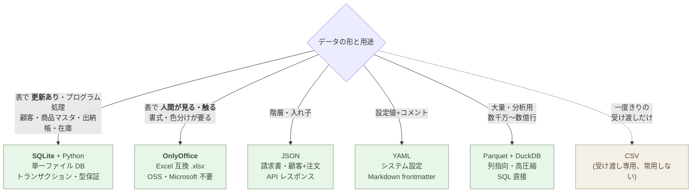
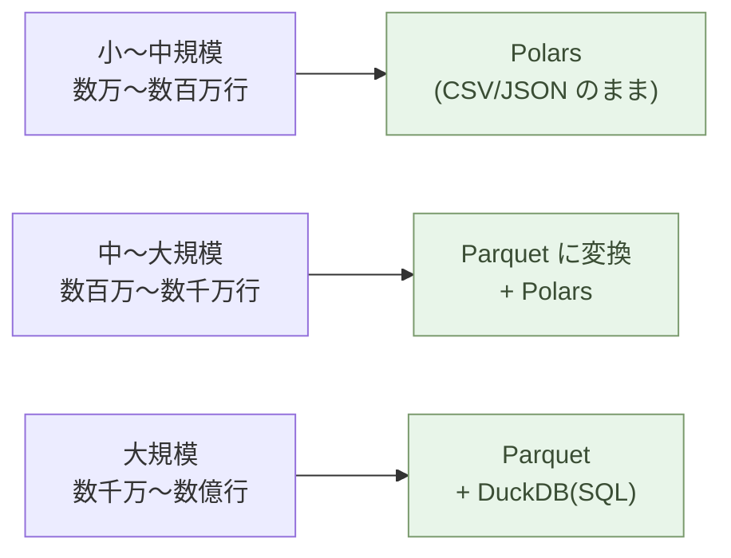

# データを持つ ── JSON/CSV/YAMLで考える

データを持つ道具を、JSON・CSV・YAML に変える。

それだけで、データは AI が読み書きできる「構造」になる。Excel の中で見栄え良く整列されていたデータは、ほとんどの場合、書式の檻に閉じ込められている。剥き出しにすれば、AI は同僚として動き出す。

## Excel は表ではない

Excel ファイルを開く。罫線、セル結合、色分け、太字、フォントサイズ、コメント、フィルタ、ピボットテーブル。これらすべてが「データ」と一緒に保存されている。

「2026年度の売上」を集計するつもりが、気づけばセルの配色を整えている。「青は確定、赤は仮、黄色は要確認」── このルールは、ファイル名にも、コメントにも、別ドキュメントにも、どこにも書かれていない。**作った本人の頭の中にだけある**。

その人が辞めたら、ルールも消える。Excel は、構造を書式で表現するために、構造そのものをファイルから消す。

これは Excel の欠陥ではない。Excel は人間が表を整えるための道具だ。書式が前面に出るのは設計通りである。

しかし、データの本質は書式ではない。本質は構造だ。「これが日付」「これが金額」「これが顧客 ID」── データを成り立たせているのはこの定義である。書式は表示のための装飾にすぎない。

## JSON は構造をそのまま持つ

JSON はテキストだ。データの形をそのまま書く。

```json
{
  "customer": "山田農園",
  "orders": [
    { "date": "2026-04-01", "item": "キャベツ", "qty": 12, "price": 180 },
    { "date": "2026-04-08", "item": "玉葱", "qty": 24, "price": 95 }
  ]
}
```

これだけで、顧客と注文が階層を持って表現できる。「顧客に複数の注文がぶら下がる」という構造は、ファイルを開いた瞬間に分かる。**書式情報は一切ない**。色も罫線もフォントもない。それは、必要ないからだ。

書式が要るのは表示のとき。データを保存するときには要らない。

## CSV は「受け渡し」用 ── 常用しない

純粋な「表」── 行と列だけのデータの最小形が CSV だ。

```csv
date,item,qty,price
2026-04-01,キャベツ,12,180
2026-04-08,玉葱,24,95
```

罫線も色分けもフィルタもない。最初の行が列名、それ以降が値。それだけ。

CSV は 30 年以上前からあり、ほぼあらゆるソフトウェアが読める。
AI も問題なく読む。

しかし、**CSV を日常の作業ファイルとして使うのは辛い**。最大の
理由は、**Excel(や OnlyOffice)で開くと、データが黙って書き換え
られる** ことだ。

:::highlight
**Excel が CSV を開くときに勝手に変えてしまうもの:**

- `001`、`007` のような **先頭ゼロ付きの ID** → `1`、`7` に
  化ける(社員番号、商品コード、口座番号がぐちゃぐちゃになる)
- `2026/04/01` → 環境によって `2026/4/1`、`5月1日`、シリアル値
  `46110` などに変換される
- `090-1234-5678`(電話番号)→ ハイフンが減算と解釈されて指数表記
  に化けたり、ゼロが消えたりする
- `MAR1`、`SEPT2`(遺伝子名・商品コード)→ `1-Mar`、`2-Sep` など
  の日付に変換される(科学論文の遺伝子名が大量に壊れた事件は有名)
- `123E45`(製品型番)→ `1.23E+47` のような指数表記に化ける
- 文字コードが Shift-JIS 推定で読まれ、UTF-8 の日本語が **文字化け**
  する(逆も起きる)

これらは **CSV ファイル自体は壊れていない**。Excel が読むときに
「親切に」型を推測して書き換えている。**保存し直すと壊れたまま
保存される**。
:::

その他の問題:

- 開くたびに **書式設定が消えている**(列幅、罫線、色分け、ヘッダー
  の太字)── 見るたびに整えるのは時間の無駄
- 同時編集すると最後に保存した方が勝つ
- 1 行の編集ミスが全体を壊す

CSV は **「相手に一回だけ送る」「別のシステムに取り込ませる」**
ような **受け渡しの一回限り** に留めるのが正解だ。日常の作業
ファイルとしては:

- **更新があるデータ** → 後段の **SQLite + Python**
- **人間が見て触る表(書式が要る)** → 後段の **OnlyOffice**

CSV は出力フォーマットの一つとしては残るが、**データの「住処」に
してはいけない**。

## YAML は設定をそのまま持つ

設定ファイル ── システムの動作を決めるパラメータには YAML が向く。

```yaml
site:
  name: aiseed.dev
  language: ja
  features:
    - markdown
    - rss
    - sitemap

build:
  output: html/
  cache: true
  threads: 4
```

JSON より人間に読みやすく、コメントも書ける。`#` で始まる行はコメント。「この設定は何のためか」を、設定そのものに書き残せる。

YAML は Markdown 記事のフロントマター(冒頭の `---` で囲まれた部分)にも使われる。

## AI が読むのは構造

ここが決定的に重要な点だ。

Claude に Excel ファイルを渡すと、まず .xlsx を解凍して XML を読む。書式情報をすべて剥がして、セルの値だけを取り出す。**AI が必要としているのは、最初から剥き出しの構造だ**。

JSON・CSV・YAML を渡せば、変換は要らない。直接読める。直接書ける。

> データを構造で持てば、AI は同僚になる。

これは比喩ではない。技術的事実だ。AI とテキストでやり取りする限り、JSON・CSV・YAML はデータの共通語である。

## どれを使うか

選び方はシンプルだ。



一つのプロジェクトで全部使ってもいい。**更新がある顧客マスタは
SQLite、人間が触る月次集計表は OnlyOffice、請求書のデータは JSON、
システム設定は YAML、大量の取引履歴は Parquet** ── というふうに
使い分ける。CSV は **「相手に一回だけ送る」「他のシステムに取り込む
ために書き出す」** 用で、常用しない。

迷ったら、Claude に「このデータをどの形式で持つべきか」と聞けば、データの性質を見て答えてくれる。

## 人間が見る表は OnlyOffice ── Excel UI を捨てずに、Microsoft を捨てる

「表は人間が触るもの。書式・色分け・列幅・関数 ── これら全部要る」
── そういう用途は、確かに残る。月次の集計表、顧客への提示資料、
予算管理表、シフト表、見積もり表。

ここで CSV や SQLite を持ち出すのは間違いだ。**人間が見て触る表
には、表計算 UI がそのまま要る**。ただし、Microsoft Excel に縛ら
れる必要はない。**OnlyOffice** を使う。

### OnlyOffice とは

OnlyOffice は、**Excel と高い互換性を持つ表計算ソフト** だ
(Word / PowerPoint 互換のエディタも同梱)。OSS で、デスクトップ版
は無料、サーバー版もコミュニティエディションは無料で使える。

- **`.xlsx` 形式をネイティブで読み書き** ── 相手から届いた
  Excel ファイルをそのまま開ける、保存も `.xlsx` のまま、ほぼ
  完全な互換性
- **書式・関数・ピボット・グラフを保持** ── 罫線、色分け、
  `SUM`、`VLOOKUP`、条件付き書式、ピボットテーブル ── すべて動く
- **Microsoft アカウント不要・サブスク不要** ── 月額課金から
  解放される
- **ブラウザ版で共同編集** ── Google Sheets / Microsoft 365 の
  代替として、自社ホスティングできる
- **REST API でプログラム連携** ── Python から OnlyOffice の
  サーバーに渡せば、`.xlsx` ↔ PDF 変換などが自動化できる
- **Linux でも動く** ── Mac / Windows / Linux すべてで動作

### Excel との比較

:::compare
| 項目 | Microsoft Excel | OnlyOffice |
| --- | --- | --- |
| ライセンス | Microsoft 365 サブスク必須(月額数千円〜) | 無料(OSS、商用利用可) |
| .xlsx 互換性 | ネイティブ | ネイティブ(高互換) |
| プラットフォーム | Windows / Mac | Windows / Mac / Linux / ブラウザ |
| 共同編集 | OneDrive 経由 | 自社サーバー or ブラウザ |
| ベンダーロックイン | 強い | なし |
| プログラム連携 | VBA / COM | REST API / Python |
:::

### どこで OnlyOffice を選ぶか

- **業務の表計算**(月次集計、シフト、予算)── OnlyOffice デスク
  トップ版で開く、`.xlsx` のまま運用
- **チームでの共同編集** ── OnlyOffice サーバーをセルフホスト、
  Google Sheets / Microsoft 365 を抜ける
- **顧客に渡す表** ── OnlyOffice で作って `.xlsx` で送る、
  相手が Excel で開いても問題ない

### CSV との接続

CSV ファイルを OnlyOffice で開くと、書式情報を **後から付加して
保存** できる(.xlsx として保存)。逆に OnlyOffice の `.xlsx` を
CSV に書き出すこともできる(値だけになる)。

- **CSV → OnlyOffice**:外部システムから来た CSV に、人間用の
  書式と色分けを付けて社内回覧
- **OnlyOffice → CSV**:OnlyOffice で人間が編集した表を、別シス
  テムへの取り込み用に CSV で書き出す

### Excel が届いたら

組織の中では、相手から `.xlsx` が届く。それを **そのまま OnlyOffice
で開く**。Microsoft 365 を購入しなくていい。返信時も `.xlsx` で
保存して送る。**相手は Excel で開く、自分は OnlyOffice で開く**
── 違いはほぼ見えない(ごく一部の高度な機能 ── 一部の VBA、
複雑なピボット、PowerQuery ── を除く)。

> Excel という UI(行と列、書式、関数)は捨てない。
> Microsoft というベンダーは捨てる。
> その分離を可能にするのが OnlyOffice だ。

## SQLite ── 更新があるデータの本命

CSV は「書き出す・受け渡す」のには良い ── しかし **頻繁に更新する
データ** には向かない:

- テキストエディタで開いて手で書き換えると、**カンマやクオートを
  間違えて全行壊しやすい**
- 二人が同時に編集すると、**最後に保存した方が勝つ**(編集衝突を
  検知できない)
- 列の型(数値か文字列か日付か)は **読み込みのたびに推測される**
  ── 「001」が「1」に化けたり、「2026/04/01」が文字列扱いで
  ソート不能になったりする
- インデックスがないので、**1 万行を超えると検索が遅い**
- 「最後に書き換えたのは誰か・いつか・なぜか」が **CSV だけでは
  追えない**

更新があるデータ ── **顧客マスタ、商品マスタ、出納帳、在庫台帳、
予約管理、タスク管理** ── には **SQLite** を使う。

### SQLite とは

SQLite は **単一ファイルのデータベース** だ。サーバーは要らない。
`my_data.db` というファイル一つに、複数のテーブル・スキーマ・
インデックス・データすべてが入る。Python の標準ライブラリに
`sqlite3` が組み込まれているので、追加インストールすら要らない
(Polars や DuckDB からも、SQLite ファイルを直接開ける)。

```python
import sqlite3

con = sqlite3.connect("customers.db")
con.execute("""
    CREATE TABLE IF NOT EXISTS customers (
        id        INTEGER PRIMARY KEY,
        name      TEXT NOT NULL,
        email     TEXT UNIQUE,
        joined_at DATE NOT NULL
    )
""")
con.execute(
    "INSERT INTO customers (name, email, joined_at) VALUES (?, ?, ?)",
    ("山田農園", "yamada@example.com", "2026-04-01"),
)
con.commit()
```

### CSV との違い

:::compare
| 項目 | CSV | SQLite |
| --- | --- | --- |
| 編集中の事故 | カンマ一つで全行壊れる | トランザクションで保護 |
| 同時アクセス | 最後に保存した方が勝つ | ロックで同時編集を捌く |
| 列の型 | 読み込みごとに推測(化ける) | スキーマで保証 |
| 重複・必須チェック | アプリ側で書く | UNIQUE / NOT NULL を DB が拒否 |
| 検索速度 | 全行スキャン | インデックスで定数時間 |
| 集計 | 全行読み込み | SQL で必要な行だけ |
| 履歴 | Git の行 diff(行が動くと地獄) | トランザクションログ |
:::

### 最大のハードル ── 「ターミナル + Python + SQL」の三点セット

正直に言う。**SQLite を使うことは、本書全体で最も大きな壁だ**。

- ターミナル(コマンドライン)を開く必要がある
- Python のスクリプトを書く・実行する
- SQL という新しい言語が出てくる

これまで Excel しか触ってこなかった人にとって、この三つを同時に
扱うのは確かに重い。**ここを越えるかどうかが、AI ネイティブな
仕事の最大の分岐点** である。

しかし AI がいる時代では、**この三つ全部を自分で書く必要はない**:

- **スキーマ設計**(どんな列・型にするか)── 「顧客マスタを
  SQLite で作って。氏名・メール・登録日が必須。メールは重複不可」
  と Claude に頼むと、`CREATE TABLE` 文が返る
- **データ追加・更新のスクリプト** ── Claude が `INSERT` /
  `UPDATE` の Python コードを書く
- **検索・集計** ── Claude が `SELECT` の SQL を書く。自分は
  「先月入ってくれた顧客の一覧」と日本語で投げる

人間がやるのは、**意図を言葉にする・出てきたコードを実行する・
結果を確認する**。これは第1章「Python で書く」とまったく同じ作法
だ。SQLite を入れることは、**Python での処理対象が「ファイル」から
「データベース」に変わるだけ** ── 同じ作法でやれる。

### Excel との接続も Claude が書く

組織の中では、相手から Excel が届く。SQLite に取り込むのも、
SQLite から Excel に書き戻すのも、Claude が Python コードを書く。

```python
# Excel → SQLite(取り込み)
import polars as pl
df = pl.read_excel("customers_2026Q1.xlsx")
df.write_database("customers", "sqlite:///customers.db")

# SQLite → Excel(書き戻し)
df = pl.read_database("SELECT * FROM customers", "sqlite:///customers.db")
df.write_excel("customers_export.xlsx")
```

入口で SQLite に取り込み、中身は SQLite で運用、出口で Excel に
書き戻す。**自分の作業領域は SQLite に保たれ、組織との境界では
Excel に変換する** ── 第5章「事務処理を変える」で見た「入口/中身/
出口の分離」と同じ構造だ。

> CSV は「書き出す」用、SQLite は「育てる」用。混同しない。
> このハードルを越えれば、Excel で運用していたあらゆる更新データが
> 構造に変わる。

## 大量のデータには Parquet と DuckDB

CSV と JSON は人間が直接読める利点がある一方、サイズが大きくなると
処理が遅くなる。**数千万行を超えるデータには、Parquet と DuckDB を
組み合わせる**。

### Parquet ── 列指向の保存形式

Parquet は、Apache が開発した **列指向(columnar)** のバイナリ
保存形式だ。CSV が「行ごと」にデータを並べるのに対して、Parquet は
「列ごと」に並べる。

```text
CSV(行ごと):
  date, item, qty, price
  2026-04-01, キャベツ, 12, 180
  2026-04-08, 玉葱,    24,  95

Parquet(列ごと):
  [date]:  2026-04-01, 2026-04-08, ...
  [item]:  キャベツ,    玉葱,        ...
  [qty]:   12,          24,          ...
  [price]: 180,         95,          ...
```

これによって、

- **圧縮率が高い** ── 同じ列のデータは似ているので、辞書圧縮や
  ランレングス符号化が効く。CSV の **1/5 〜 1/10** のサイズ
- **必要な列だけ読める** ── 100 列のうち 3 列だけ集計したいとき、
  3 列分のデータだけディスクから読む(I/O が劇的に減る)
- **スキーマがファイル内にある** ── 列名と型がファイル自身に保存
  されており、CSV のような型推測の罠が消える
- **業界標準** ── Polars、DuckDB、Spark、BigQuery、Athena ── ほぼ
  すべての解析ツールが直接読める

### DuckDB ── ファイルに SQL を直接かける

**DuckDB は「分析のための SQLite」** だ。サーバーが要らない、
インストールは `pip install duckdb` 一行、そして **CSV や Parquet
のファイルそのものに対して SQL クエリを書ける**。

```bash
$ duckdb -c "
    SELECT date, SUM(qty * price) AS sales
    FROM 'orders.parquet'
    WHERE date >= '2026-01-01'
    GROUP BY date
    ORDER BY date
"
```

データベースに「インポート」する必要すらない。**Parquet がそのまま
テーブルとして扱える**。1 億行のデータでも、必要な列と必要な行だけを
読み込んで、数秒で集計が返る。

### Polars ── pandas より速く、AI が書きやすい

Python 側でデータを加工するときの第一選択は **Polars**(Rust 実装、
列指向、遅延評価)だ。pandas より **数倍〜数十倍速く**、メモリ消費も
少なく、API も読みやすい。Parquet とも完全に相性が良い。

```python
import polars as pl

# Parquet を直接読む(必要な列だけ)
df = pl.read_parquet("orders.parquet", columns=["date", "qty", "price"])

# 月別売上を集計
monthly = (
    df.with_columns(month=pl.col("date").dt.strftime("%Y-%m"))
      .group_by("month")
      .agg(sales=(pl.col("qty") * pl.col("price")).sum())
      .sort("month")
)
print(monthly)
```

### 三つの組み合わせ

実際の使い分けは、規模で決まる。



CSV を一度 Parquet に変換しておけば、以後の集計が劇的に速くなる:

```bash
# CSV を Parquet に一回変換(DuckDB が両方を扱える)
$ duckdb -c "COPY (FROM 'orders.csv') TO 'orders.parquet' (FORMAT PARQUET)"

# 以後はすべて Parquet で処理(数千万行でも秒単位)
$ duckdb -c "SELECT item, SUM(qty) FROM 'orders.parquet' GROUP BY item"
```

### なぜ jq や awk より Python なのか

「ターミナルで `jq` と `awk` を組み合わせれば速い」── これは部分
的には正しい。しかし、

- **構造が複雑になると jq の式が読めなくなる** ── 三段以上ネスト
  すると、書いた本人も翌日には解読できない
- **AI が書きにくい** ── jq / awk の独特な構文は、Claude も他の
  AI も Polars / DuckDB ほど安定して書けない(訓練データが少ない)
- **再現性と可搬性** ── Python スクリプトはチームで共有できる、
  Git で管理できる、テストできる、import で部品化できる
- **大量データで頭打ち** ── awk は 1 GB を超えると遅くなる。
  Polars / DuckDB は 100 GB 級まで普通に動く

ワンライナーで済むなら shell でよい。**少しでも複雑なら Python
(Polars / DuckDB)に切り替える**。Claude が書きやすい、読みやすい、
保守できる。

## Excel ファイルが届いたら ── 二つの分岐

組織の中で働く限り、Excel ファイルは届き続ける。来た Excel を
どうするかは、**用途で二つに分かれる**。

**人間が見る・触る用なら → そのまま OnlyOffice で開く**
書式・色分け・ピボットを保ったまま編集して、`.xlsx` で送り返す。
Microsoft 365 の課金は要らない。

**プログラムで処理する・更新を続ける用なら → 取り込んでから運用**
Polars / Claude が一回 Excel を読んで、用途に応じて:

- 更新を続けるマスタデータ → **SQLite に取り込む**
- その場限りの集計 → **Polars でメモリ上で処理**(出力は OnlyOffice
  または CSV)
- 大量の取引履歴 → **Parquet に書き出す**(以後 DuckDB で分析)

**自分の作業領域は構造に保つ**。組織が要求する形式は、入口と出口
の変換だけで吸収する。中身は SQLite / Parquet / JSON / YAML、
人間が見るものだけ OnlyOffice。

## 10年後も読める

20年前の Excel ファイル(.xls 形式)は、今の Excel で開くとレイアウトが崩れることがある。マクロが動かない。フォントが置換される。

CSV は、ただのテキストファイルだ。10年後も20年後も、テキストエディタがあれば読める。AI ならもっと簡単に読める。JSON も YAML も同じだ。

> 構造を残せ。書式は捨てろ。

書式は今を飾る。構造は時間を超える。

## 実例: 数字で見る

10,000 行の売上データ。Excel `.xlsx` で 1.2 MB、CSV で 280 KB、
**Parquet で 60 KB**。Excel の **20 分の 1**、CSV の **5 分の 1**。
書式と冗長な行情報が消える。

Excel ピボットテーブルで月別売上集計: マウス操作で 5 分、再現性
ゼロ(操作の記録は残らない)。同じ集計を **Polars** で書くと 3 行、
実行 0.05 秒、Python スクリプトとして残るので翌月も使える。

100 個の `.xlsx` から特定列を抽出する月次作業: Excel VBA で半日。
**Polars** で `glob` を使って一気に処理すれば **15 秒**(pandas より
2〜3 倍速い)。**Claude に頼めばコードはすぐ出る**。

1 億行の取引履歴から月別の商品別売上を集計: pandas で読み込み中に
メモリ枯渇 → 不可能。**DuckDB なら Parquet ファイルに直接 SQL を
かけて 数秒で完了**(必要な列・必要な行だけストリーム読み)。

JSON / CSV を Claude に渡したときの認識率: ほぼ 100%(構造が
剥き出し)。Excel `.xlsx` を渡したときの認識率: 形式によっては
70〜80%(セル結合・書式があると劣化)。**データを構造で持つほど、
AI が間違わない**。

5,000 件の顧客マスタを Excel で運用していた事務職の事例:
編集中の保存ミスで月 1〜2 回データ破損、その都度バックアップから
復元 → SQLite に移行後 **0 件**(トランザクションで保護)。
「重複メールを登録できないように」「退会フラグの列を追加して」と
Claude に頼めば、スキーマ変更の Python コードが返る。**運用の
心理負荷が下がる**。

## まとめ

道具を変えれば、データの扱い方が変わる。

- 更新があるデータ → **SQLite + Python**(最大のハードルだが、
  Claude が書いてくれる)
- 人間が見る表 → **OnlyOffice**(Excel UI そのまま、Microsoft 不要)
- 階層 → **JSON**
- 設定 → **YAML**
- 大量・分析用 → **Parquet + DuckDB**
- 受け渡し一回限り → **CSV**

ここまでの 4 章で、共通の作法 ── Python・Markdown・Mermaid・
データ各種(SQLite / OnlyOffice / JSON / YAML / Parquet) ── が
揃った。これらは職種を問わない、AI ネイティブな仕事の最小スタックだ。

次の章から、仕事の種類別の話に進む。まずは事務職の方へ。

---

## 関連記事

- [第1章: 処理を書く ── AIにPythonで書いてもらう](/ai-native-ways/python/)
- [第2章: 文書を書く ── Markdownという最小の選択](/ai-native-ways/markdown/)
- [序章: 事務処理はOffice、業務ソフトはJava/C#、しかしAIはPythonとテキスト](/ai-native-ways/prologue/)
- [構造分析08: 企業ITの税を引く](/insights/enterprise-tax/)
