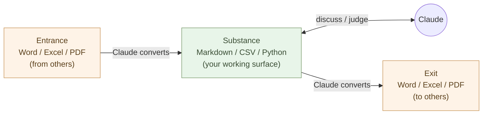
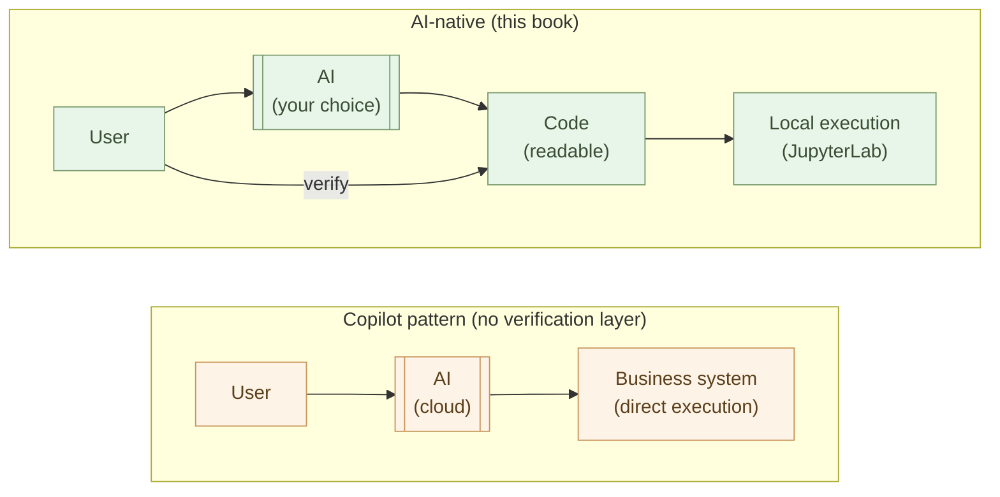

# Changing Paperwork — A Realistic Path Away from Office

For office workers.

First, don't misread the reason for leaving Office. **This is not about efficiency.**

"30 minutes of work becomes 30 seconds" — many books and articles say this. It does happen, as a side effect. But that is not the substance.

The substance is this: **inside Office, AI stays a tool. Bring things down to Markdown, CSV, and Python, and AI becomes a colleague — and you become "the person who decides."** And your work system stops being **hostage to vendor business models**.

## Inside Office, AI is not a colleague

Every time you hand Claude a Word file, conversion happens. Unzip the .docx, read the XML, strip the formatting metadata, extract the text. Excel is the same — cell coordinates, formatting metadata, merged cells, cross-sheet references all sit between AI and the substance.

The result: AI is **usable** but **not a colleague**:

- You can ask "read the whole thing and lay out the points" — *but* the layout breaks
- You can ask "analyze this table" — *but* merged cells and formatted values confuse it
- You can ask "continue this section" — *but* you spend effort matching formats
- Every time, you feel you are speaking to "an assistant on the other side of the Office wall"

The moment you drop down to Markdown and CSV, that wall disappears. AI reads structured text directly, writes it directly, returns thoughts. **It feels like working next to a colleague.**

> Not efficiency. **The relationship with AI changes** — that is the first reason to leave Office.

## Separate entrance, substance, and exit

Divide paperwork into three parts.

- **Entrance**: files arriving from others (Word, Excel, PDF, email)
- **Substance**: where you think, work, and store
- **Exit**: files going out to others (Word, Excel, PDF, email)

For most people, all three have lived in Office. A Word file arrives, you open it in Word, edit it in Word, send it back as Word.

**As long as the substance is in Office, AI cannot be a colleague.** Data trapped in formatting is hard for Claude to handle.

Don't change the organization's rules. **Change only your own substance.** This is not efficiency. It is **building, on your own desk, a place where AI can be your colleague**.

## The quality of work changes — from "processor" to "decider"

As long as paperwork happens inside Office, you remain **"the processor"**.

- The person who aggregates Excel
- The person who formats Word
- The person who tidies PowerPoint
- The person who re-pastes numbers

These are jobs AI can replace. The organization's stake in you doing them is limited — and once AI gets cheaper, the organization will withdraw you from them.

Leave Office — bring the substance down into structure — and your role changes:

- The person who decides **what should be done**
- The person who judges **how to interpret**
- The person who designs **new mechanisms**
- The person who decides **what to ask AI**

Claude takes on "drafting, processing, formatting." You spend your time on **judgment and direction**. This is not about efficiency. **The content of your work changes.**

> AI replaces "processors." AI cannot replace "deciders." Leaving Office is **moving to the side that is not replaced.**

## When you put your hopes in a vendor, you are taken hostage when their interests shift

Here comes the other essential reason — **personal autonomy**.

"Vendor lock-in" sounds abstract. It is faster to see it concretely. One story about **Excel and Python**.

### Python in Excel — the answer key, eight years later

A while back, technologists shared a hope: **"If Python lands inside Excel, data work transforms."** Aggregate with Pandas, debug in Visual Studio Code, version-control in Git, run freely on the local machine — bring a real development environment into Excel, and Excel earns its place as "the GUI for data." It was a technically reasonable vision.

Years later, Microsoft did put Python into Excel. They integrated an AI called Copilot too.

But the original hope is **not there**.

- **It does not work offline** — Python code does not run on the local machine. It is sent to Microsoft's cloud and runs there.
- **VS Code debugging is not allowed.**
- **Git version control is not possible.**
- **Free access to local files and local databases is closed.**
- "Runs on Linux servers," "connects to anything locally" — every original benefit was sealed off.

This is **not a technical constraint**. Anaconda and Docker prove sandboxed Python runs locally and safely. Microsoft has equivalent technology in-house, and yet **chose the cloud-only design**.

The reason is plain — **if local execution were allowed, Azure resources would not be consumed**. To keep prepaid monthly subscriptions metabolized, computation was deported to the cloud. User convenience became a casualty of that conversion.

> The original hope was not wrong. **The mistake was placing that hope in a massive vendor.**

Vendor interests shift. **Today's feature is tomorrow's cage.** Python did not arrive in Excel; Python was **imprisoned inside Excel** — that is what has happened in your paperwork environment.

### Copilot — AI itself taken hostage

The same structure is now unfolding around AI.

Microsoft 365 Copilot **directly integrates** AI into Word, Excel, PowerPoint, and Outlook. Convenient on the surface. Structurally:

- Your inputs **pass through Microsoft's cloud**
- The AI vendor **cannot be changed** (you use the AI Microsoft chose)
- The **verification layer is missing** for the generated code and judgments (black box → black box)
- The price is **set by Microsoft** (you absorb the increases)

LLMs are structurally prone to "confidently lying" — this is a principled property, not a bug, and it will be reduced but not eliminated. **Integrating that uncertainty directly into the core of business systems is a fundamentally wrong design.**

The classical principle of robust design is "safety not contingent on implementation": **AI-generated code runs in a sandbox, a human verifies it, tests pass, then it goes into production**. That verification layer absorbs AI's uncertainty. **Copilot's design has no such layer, structurally.**

The CrowdStrike outage, the Exchange Online compromise — concentration on a single vendor has repeatedly produced industry-wide incidents. Concentrating business systems around an AI core is **preparing more serious incidents**.

> Let the era end in which our work systems are **taken hostage** for the sake of giant vendors' business models.

### Keep it on your side — Markdown / Python / local LLM as a choice

Bring things down to Markdown / CSV / Python / OnlyOffice, and the structure changes:

- **The data is yours** — local files, versioned in Git
- **The AI vendor is a choice** — Claude / GPT / Gemini / local LLM
- **AI-written code is readable** — not a black box
- **Execution is local** — JupyterLab, scripts; you verify, then run
- **Price increases have alternatives** — exit ramps exist
- **VBA knowledge does not vanish** — translated into Python, it persists (Chapter 1)

This is not about efficiency. It is about **your tools, your data, your judgment, your verification**. Build, on your side, a structure that holds up in the Mythos era.

## For the sake of organizational diversity

"The whole organization on the same Microsoft 365" — uniform, low support costs.

But when Microsoft 365 **changes data policy**, every employee's data flows in the same direction. When Microsoft Copilot **homogenizes judgment criteria**, diversity disappears from the organization. When Microsoft **changes direction**, the whole organization is dragged along — the same structure that played out with Python in Excel, now repeating with AI.

This is the **single point of failure (SPOF) everyone is sitting on** that the prologue's "another aim" section described.

Leaving Office for paperwork — each person holding their own tools — is not only an individual matter. It connects to **the organization's diversity and society's resilience**. Distributed, when any one part goes down, the others keep moving. Each person grows judgments in their own context. **Diversity itself becomes strength.**

> Not efficiency. **Autonomy and diversity.**

## How to move — in stages, at your own pace

Now the practical side. **You don't have to do it all at once.** Move things from your own working surface, one at a time.

There is no fixed order. Start where it is easy, and gradually expand the places where dialogue with AI works.

### Move notes to Markdown

Meeting notes, personal research, task lists — start writing the documents you use alone in Markdown. Make `.md` files in a text editor (Zed, even Notepad).

That alone lets you ask AI "lay out the points in this note," "find the axes of disagreement," "list what to confirm next." **The moment you escape the open-Word / close-Word cycle, dialogue with AI begins.**

### Hold tables in CSV / SQLite

Product lists, customer lists, ledgers — simple tables belong in CSV; if there are updates, SQLite (Chapter 4). When you want to view in Excel, OnlyOffice or LibreOffice opens them.

In CSV or SQLite, you can ask AI "find the outliers," "explain the change from last month in prose," "which customer should I watch next." **Questions that were inaudible inside Excel** become askable.

### Move repeating work to Python

"Every month, take the Excel from A, total it up, normalize the format, and send to the boss" — this becomes Python. As Chapter 1 showed, Claude writes it; you run it **in your local JupyterLab — not in the cloud**.

This looks like efficiency, but the essence is different. The moment you drop to Python, a new question stands up: **"Given next month's data, what should I ask Claude?"** Your time moves from doing the aggregation to **thinking about what the aggregation means**.

### Office becomes a thing you "pass through," not "use"

The organization runs on Word and Excel. That does not change. A Word file arrives — convert it to Markdown (ask Claude). Sending back requires Word — convert Markdown to Word.

In other words, **Office becomes a tool you "pass through," not "use."** Your working surface no longer contains Office. Only the boundary with the organization runs a **compatibility layer** (pandoc / Claude / LibreOffice).

The organization's rules don't change. No one notices. But **you have changed into "the decider."** And **your system is no longer a vendor's hostage.**

## A concrete example: the monthly report — same report, different work

Take "the monthly sales report."

**Old flow** (Office-centered):

Open the sales data in Excel → build a pivot table → make a chart → paste into Word → write the prose → convert to PDF → email the boss.

The job you are doing here is **"tidying numbers."**

**New flow** (structured substance):

Read sales data as CSV (or SQLite) → aggregate with Python that Claude wrote, output as a Markdown table → draw the chart in Mermaid or Altair → embed in Markdown → Claude drafts the prose → **you add interpretation and judgment** → convert Markdown to PDF / Word.

The job you are doing here is **"thinking about what the numbers mean."**

"This month's +12% MoM — which customer caused it? Will it continue? Should sales strategy change?" — questions that did not surface while you were clicking through pivot operations in Excel **rise on their own** in front of structured local data and Claude.

And every piece of this — the data, the processing, the questions to AI — **stays on your desk**: not dependent on a cloud monthly subscription, not at risk from a vendor's policy shift.

Whether time was saved is not the substance. **The content of the work changed — and the system came back to your side.** That is the substance.

## Consideration for boss and colleagues

You may worry: "won't I look strange producing different documents?"

You won't. Convert to Word at the exit, and what reaches your boss is the same as before. **No one notices the process changed.**

What does change visibly is the **quality of judgment** in the output. "How are this month's numbers to be read," "what is the outlook for next month," "what are the risks" — thinking these through with Claude visibly deepens them.

Eventually, a boss or colleague will say "the recent monthly reports have gotten sharper." Then you can teach them.

## Handling email

Email is a large part of paperwork.

Hand a long email to Claude and ask "lay out the points," "what are the axes of disagreement," "how should I reply from my position." AI prepares the **materials for judgment**. The judgment is yours.

You can extract "last month's customer complaint count" from a mailing-list archive. But the real question is not the count — it is **"why did it rise."** With Claude alongside, you read the background of the count.

Email is not structured data, but as long as it is text, Claude can handle it. **Inside Outlook, this dialogue cannot happen.** The moment you export and bring it to your desk, the dialogue begins — and that dialogue **does not pass through Microsoft's cloud**.

## Efficiency is a side effect — it happens, but is not the goal

This chapter has insisted "not about efficiency."

In practice, **time does drop**. The monthly report from 3 hours to 30 minutes. 50 emails in 5 minutes.

These happen. But making efficiency the goal **takes you to the wrong destination**. Microsoft 365 Copilot also produces "efficiency" — and the destination is **a deeper vendor cage**.

:::compare
| Goal: efficiency only | Goal: make AI a colleague, become a decider, become autonomous |
| --- | --- |
| Get AI to do the same work faster | Your role changes |
| Stay "the processor"; just process more | Use freed time for **work you could not do before** |
| Copilot deepens the **vendor cage** | **Your system stays in your hands** |
| Only the **quantity** of work changes | The **quality** of work changes |
:::

As the prologue's "the limits of efficiency" section said — **the work AI can efficient-ize is the work AI should have been doing.** It only seemed to save you time because humans had been hoarding it inside Office.

The substance of this chapter is **beyond that**. Leave Office and spend your time, with AI, on **judgment, interpretation, design, new creation** — and **bring your system back to your own desk**. That is what changing paperwork really means.

## In summary

Move office work from Office-centered to Markdown + CSV + Python centered.

This is not about efficiency.

- **Build, on your own desk, a place where AI can be a colleague**
- **Change your role from "processor" to "decider"**
- **Hold a structure that vendors cannot hold hostage** — personal autonomy
- **Contribute to organizational diversity** — don't sit on the single point of failure

Efficiency happens as a side effect. The substance is that **the quality of work, the shape of the individual, and the location of the system all change.**

The story that sounds like "Python landed in Excel" turned out, in its content, to be "Python was imprisoned inside Excel." Don't repeat the same trap with AI. **Keep your own system on your own side** — this is, before it is a technical choice, **a choice about the autonomy of the individual and the organization**.

Office work is the easiest occupation to transition to AI-native. You don't need to be technical. **If you can read Markdown, understand CSV, and ask Claude — that is enough.** From there, drop things down at your own pace — and as you drop, the territory of "the decider" expands, and the territory of "your own system" expands.

The next chapter moves to working with business systems. For technical roles.

---

## Related

- [Chapter 01: Writing Logic — Have AI Write Python For You](/en/ai-native-ways/python/)
- [Chapter 02: Writing Documents — Markdown as the Minimal Choice](/en/ai-native-ways/markdown/)
- [Chapter 04: Holding Data — Think in JSON, CSV, YAML](/en/ai-native-ways/data-formats/)
- [Prologue: Office for paperwork, Java/C# for business systems — but AI runs on Python and text](/en/ai-native-ways/prologue/)
- [Structural Analysis 08: Removing the Enterprise IT Tax](/en/insights/enterprise-tax/)
- [Are You Still Using Windows and Office?](/en/blog/windows-office-facts/)
