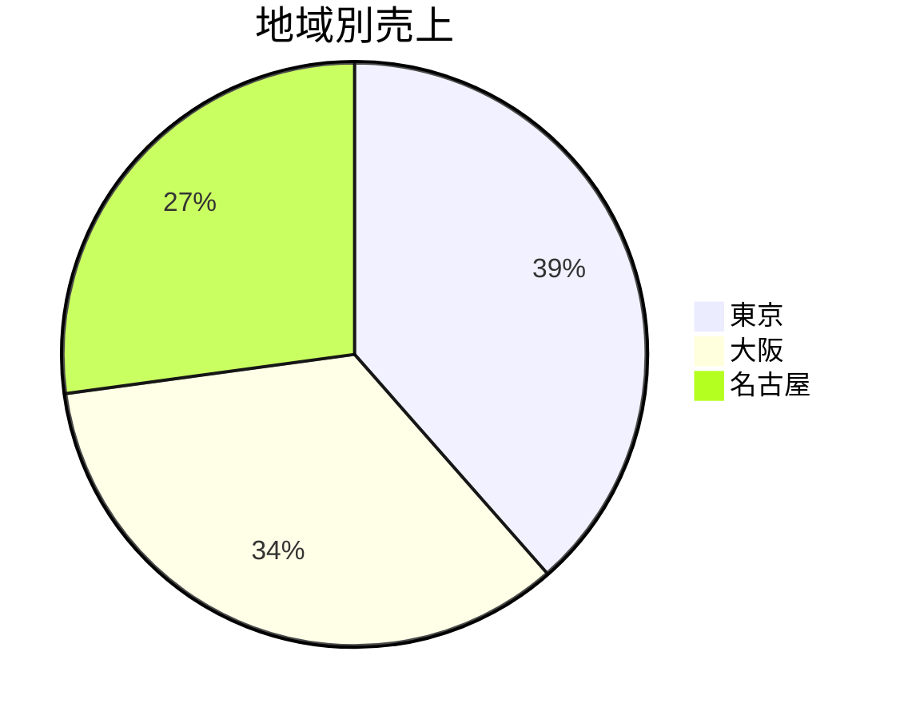
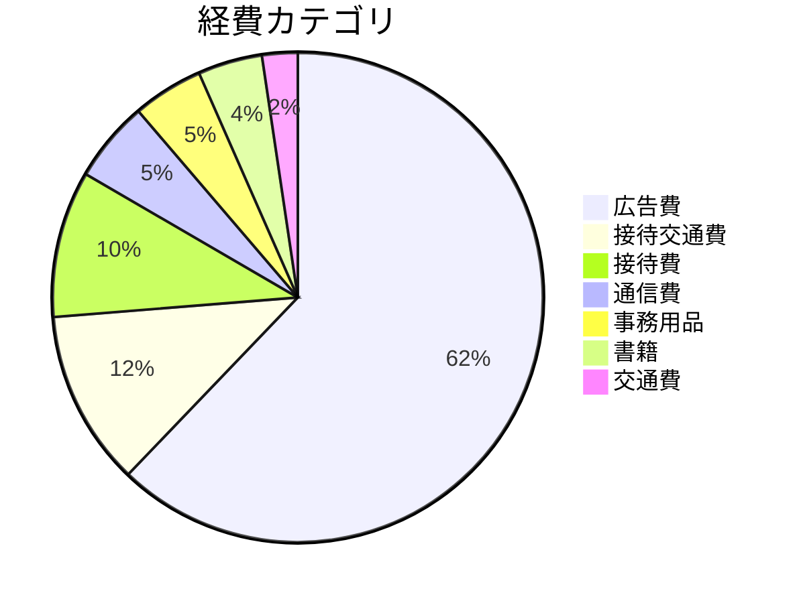

# 2026 年 4 月度 月次報告
**期間: 2026-04**  会社: 株式会社 aiseed.dev

---

## 1. 概要

| 項目 | 金額 |
|------|------|
| 売上 | **599,250 円** |
| 経費 | 289,600 円 |
| 利益 | **309,650 円** |
| 利益率 | 51.7% |

---

## 2. 売上 — 地域別

| 地域 | 売上 |
|------|------|
| 東京 | 230,850 円 |
| 大阪 | 205,700 円 |
| 名古屋 | 162,700 円 |

---

## 3. 売上 — 商品別

| 商品 | 売上 |
|------|------|
| キャベツ | 153,900 円 |
| 玉葱 | 105,450 円 |
| レタス | 103,000 円 |
| トマト | 102,500 円 |
| 白菜 | 75,000 円 |
| きゅうり | 59,400 円 |

---

## 4. 経費 — カテゴリ別

| カテゴリ | 金額 |
|----------|------|
| 広告費 | 180,000 円 |
| 接待交通費 | 33,500 円 |
| 接待費 | 28,000 円 |
| 通信費 | 15,500 円 |
| 事務用品 | 13,500 円 |
| 書籍 | 12,300 円 |
| 交通費 | 6,800 円 |

---

## 5. コメント

- 売上は前月比でデータが無いため未計算
- 広告費が経費の 62% を占める
- 東京 地域が売上全体の 39% を担う
- 来月以降のアクションは経営会議で決定

---

## 付録: 出典データ

- `data/sales.csv` — 30 件
- `data/expenses.csv` — 13 件
- このレポートは `build_report.py` が CSV から自動生成
