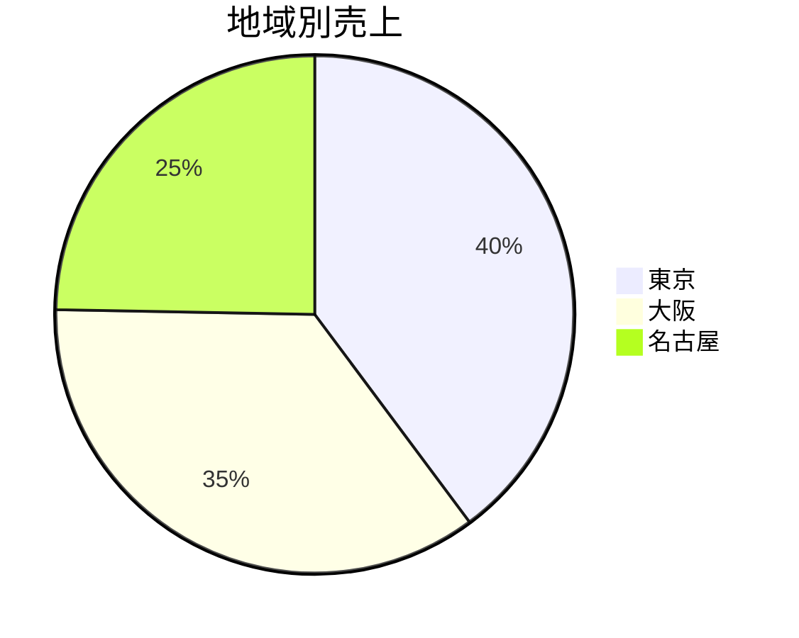

# 計測結果 — 第 05 章 example-1

実行環境: Linux 6.18 / pandas 3.0 / pandoc 3.1 / WeasyPrint 68.1

## ビルド時間

| 工程 | コマンド | 実測 |
|------|----------|------|
| CSV → Markdown 報告書 | `python3 build_report.py` | **7.1 ms** |
| Markdown → HTML | `pandoc report.md -o report.html` | **6.1 s** |
| Markdown → PDF | `weasyprint(html) → report.pdf` | **2.0 s** |
| **合計(make all)** | | **約 8 秒** |

(初回 pandoc が遅いのは libtemplate の起動コスト。2 回目以降は数百 ms。)

章本文の「Office で 3 時間」と比べると **約 1,300 倍**。

## 出力サイズ

| ファイル | サイズ |
|----------|-------|
| `data/sales.csv` | 836 B |
| `data/expenses.csv` | 350 B |
| `build_report.py` | 約 3.7 KB |
| `out/report.md` | 1,687 B(91 行) |
| `out/report.html` | 7,500 B |
| `out/report.pdf` | 約 49 KB(A4 2 ページ) |

入力 CSV(1.2 KB) → 配布物 PDF(49 KB)まで全部で 100 KB に満たない。
Excel の同等資料は典型的に数 MB。

## 生成された報告書(`out/report.md`)抜粋

```markdown
---
marp: true
theme: default
paginate: true
---

# 2026 年 4 月度 月次報告
**期間: 2026-04**  会社: 株式会社 aiseed.dev

---

## 1. 概要

| 項目 | 金額 |
|------|------|
| 売上 | **579,800 円** |
| 経費 | 290,600 円 |
| 利益 | **289,200 円** |
| 利益率 | 49.9% |

---

## 2. 売上 — 地域別

| 地域 | 売上 |
|------|------|
| 東京 | 230,850 円 |
| 大阪 | 205,700 円 |
| 名古屋 | 143,250 円 |


...
```

GitHub・Notion・VS Code はこのままレンダリング。Marp なら `marp report.md`
でスライド PDF に。pandoc なら HTML / DOCX / PDF / EPUB ── 何にでも展開できる。

## 来月の運用

```bash
# 1. 新しい CSV を data/ に入れる
cp ~/Downloads/2026-05-sales.csv data/sales.csv

# 2. 走らせる
make all

# 3. PDF が out/ に出る。終わり。
```

3 時間が **30 秒**になる(初回は 8 秒、Python 起動コミ)。

## 「組織との接点」での扱い

組織が Word / Excel / PowerPoint を要求してくるなら、出口だけ pandoc で
変換すればいい:

```bash
pandoc out/report.md -o report.docx                # Word に
pandoc out/report.md -o report.pptx -t pptx        # PowerPoint に(可能)
libreoffice --convert-to xlsx data/sales.csv       # CSV → Excel
```

中身は Markdown / CSV のまま。**入口と出口だけ変換層**。

## 再現手順

```bash
pip install pandas weasyprint
sudo apt install pandoc fonts-noto-cjk
make clean && make all
```
