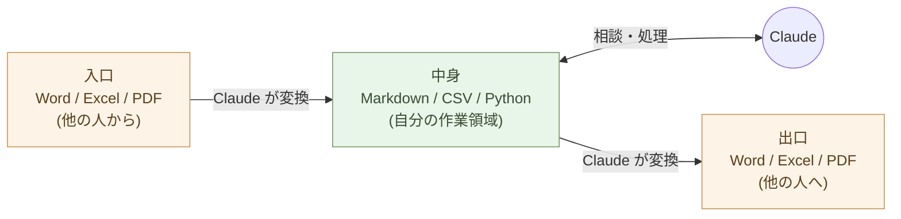

# 事務処理を変える ── Officeから離れる現実的な道筋

事務職のあなたへ。

「Office を捨てろ」と言われても、組織は動かない。Word ファイルが届く。Excel で報告を求められる。PowerPoint で発表しろと言われる。これは現実だ。

しかし、**自分の作業領域は Office から切り離せる**。中身は Markdown と CSV で持ち、Office は入口と出口の変換器として使う。この一歩で、AI が同僚になる。

## 入口・中身・出口を分ける

事務処理を三つに分ける。

- **入口**: 他の人から届くファイル(Word、Excel、PDF、メール)
- **中身**: 自分が考え、作業し、保存する場所
- **出口**: 他の人に渡すファイル(Word、Excel、PDF、メール)

これまで多くの人は、入口・中身・出口のすべてを Office で行ってきた。Word ファイルが来たら Word で開いて、Word のまま編集して、Word のまま返す。Excel が来たら Excel で開いて、Excel のまま処理する。

中身まで Office にしている限り、AI は同僚になれない。書式の檻に閉じ込められたデータは、Claude が触りにくい。

組織のルールは変えない。**自分の中身だけ変える**。

## 段階的な置き換え

一気に変える必要はない。四段階で進める。

**段階一: メモを Markdown にする**

会議のメモ、自分用の調べ物、タスクリスト ── 自分一人で使う文書を、
Markdown で書き始める。テキストエディタ(Zed、メモ帳でもいい)で
`.md` ファイルを作る。

これだけで、AI に「このメモを要約して」「論点を整理して」と頼める。Word を開く起動時間も消える。

**段階二: 表を CSV にする**

商品リスト、顧客リスト、出納帳 ── 単純な表は CSV で持つ。最初の行に列名、それ以下にデータ。Excel で見たいときは Excel で開く(CSV は Excel が普通に開ける)。

CSV にすれば、Claude に「このデータを月別に集計して」「異常値を見つけて」と頼める。

**段階三: 繰り返し作業を Python にする**

「毎月、A さんから来る Excel を集計して、フォーマットを揃えて、上司に渡す」── こういう作業は Python になる。第4章で見たように、書くのは Claude。実行するのは自分。

一度書けば、来月も再来月も使える。30 分かかっていた作業が 30 秒になる。

**段階四: 境界だけ Office 互換層として通す**

組織は Word と Excel で動いている。Word ファイルが届いたら Markdown に
変換する(Claude に頼む)。送り返すときに Word が要るなら Markdown を
Word に変換する。

つまり **Office は「使う」のではなく「通過させる」道具になる**。
自分の作業領域には Office が無い。組織との接続部だけに pandoc / Claude /
LibreOffice などの **互換層** が動いている状態。組織のルールは変えない。
**自分の中身だけ変える**。誰にも気づかれずに、自分の作業時間が劇的に減る。

## 具体例: 月次報告書

例えば「月次の売上報告書」を作る作業。

これまでの流れ:
1. Excel で売上データを開く
2. ピボットテーブルで集計
3. グラフを作る
4. Word に貼り付ける
5. 文章を書く
6. PDF に変換
7. メールで上司に送る

新しい流れ:
1. CSV で売上データを開く
2. Python(Claude が書いた)で集計し、Markdown 表として出力
3. Mermaid でグラフを書く
4. Markdown ファイルに貼る
5. Markdown で文章を書く(Claude が下書きを作る)
6. Markdown を PDF に変換(`pandoc` でも Claude でもできる)
7. メールで上司に送る

時間は半分以下になる。**しかも、同じ作業を来月もする**。Python スクリプトと Markdown テンプレートが残るからだ。

## 上司・同僚への配慮

「自分だけ変な書類を作っている」と思われたくない、という心配があるかもしれない。

その必要はない。出口で Word に変換すれば、上司には今までと同じものが届く。**プロセスが変わったことに、誰も気づかない**。

逆に、出力の品質と速さは目に見えて上がる。「いつもよりレイアウトが整っている」「数字が揃っている」「誤字が少ない」── これは Markdown と Python と Claude の組み合わせで自動的に上がる。

そしていつか、上司や同僚が「どうやってるの?」と聞いてくる。そのときに教えればいい。

## メールの扱い

メールも事務処理の大きな部分だ。

長いメールを Claude に渡して「論点を箇条書きで」と頼めば、要約が返ってくる。返信の下書きを「丁寧に」「率直に」「短く」「長く」と指定して書いてもらえる。**自分は読んで、判断して、送るだけ**。

メーリングリストの過去ログから「先月の顧客クレーム件数」を抽出することもできる(エクスポート機能でテキストファイル化してから Claude に渡す)。

メールは構造化データではないが、テキストである限り Claude が処理できる。

## 何が起きるか

この四段階を実行すると、何が起きるか。

- 同じ仕事の所要時間が、半分以下になる
- 残業がなくなる
- 余った時間で、別の仕事に挑戦できる
- 「考える仕事」と「処理する仕事」がはっきり分かれる
- 「処理する仕事」は AI に任せる
- 「考える仕事」が自分の本業になる

> AI でもやれる仕事を AI に任せれば、人間にしかできない仕事に時間を使えるようになる。

これは恐怖ではない。**解放**だ。

## 実例: 数字で見る

事務職の月次報告書作成: Word + Excel + PowerPoint で **3 時間** → Markdown + CSV + Marp で **30 分**。**6 分の 1**。

メーリングリストから過去 3 ヶ月の顧客クレーム件数を集計: 手作業で半日 → Claude にエクスポート渡して **1 分**。

Word の起動 → 書式調整 → 保存 → メール送信 のサイクル: 1 件 5 分 × 1 日 30 件 = 月 **50 時間**。Markdown + Python 自動化で月 **5 時間**。**45 時間の余裕**ができる。

メール 1 通の要約をする時間: 自分で読んで要点を書き出すと 5 分。Claude に投げて要約 + 推奨アクション付きで返す 10 秒。**30 倍の速さ**。

## まとめ

事務処理を Office 中心から、Markdown + CSV + Python 中心へ。

到達点は **「自分の作業領域から Office が消える」** 状態だ。組織との
境界では Word / Excel / PowerPoint 形式が要る ── が、それは
**Office を "使う" のではなく、"互換層" として通過させる**だけになる。
入口で Markdown に変換し、出口で要求形式に変換する。中身は構造化
テキスト。

第11章 example-1(SaaS 一式)、example-2(個人事業主の月次)、
第07章 example-2(FastAPI 業務 API)── これらはすべて **Office を
一度も開かずに完結している**。事務処理の到達点もそこだ。

事務職は AI ネイティブな働き方に最も移行しやすい職種だ。技術職である
必要はない。**Markdown が読めて、CSV を理解して、Claude に頼めれば、
それで十分**。

次の章では、業務システムと付き合う話に進む。技術職の方へ。

---

## 関連記事

- [第4章: 処理を書く ── AIにPythonで書いてもらう](/ai-native-ways/python/)
- [第1章: 文書を書く ── Markdownという最小の選択](/ai-native-ways/markdown/)
- [構造分析08: 企業ITの税を引く](/insights/enterprise-tax/)
- [それでも Windows と Office を使い続けますか?](/blog/windows-office-facts/)
