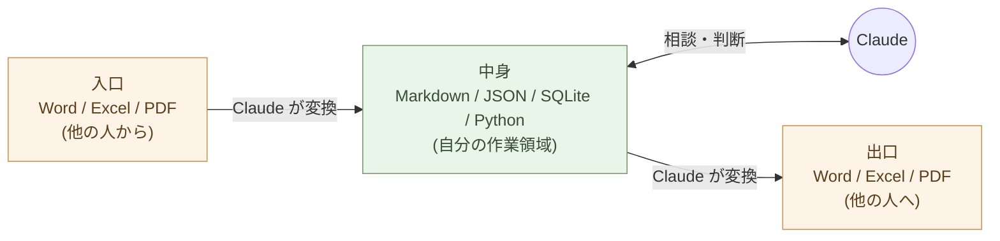
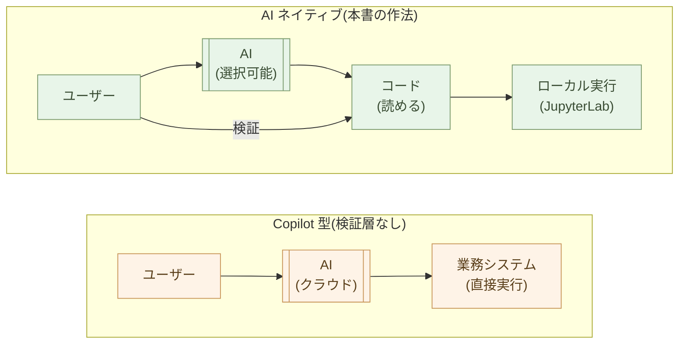

# 事務処理を変える ── Officeから離れる現実的な道筋

事務職のあなたへ。

Office から離れる理由を、まず誤解しないでほしい。これは
**効率化の話ではない**。

「30 分の作業が 30 秒に」── そう言う本も記事も多い。それは結果と
して起きる。だが、本質ではない。

本質はこれだ:**Office の中にいる限り、AI は道具のまま。Markdown
と JSON / SQLite と Python に降ろすと、AI が同僚になり、自分が
「判断する人」に変わる**。そして、自分の仕事のシステムが
**ベンダーの人質に取られない** 構造になる。

## Office の中では、AI は同僚にならない

Word ファイルを Claude に渡しても、毎回変換が起きる。.docx を解凍
して、XML を読み、書式を剥がして、テキストを取り出す。Excel も
同じ ── セルの座標、書式情報、結合セル、シート間の参照が、AI と
中身の間に挟まる。

結果として、AI は **使える** が、**同僚にはならない**:

- 「全文を読んで論点を整理して」と頼める *が* レイアウトが崩れる
- 「この表を分析して」と頼める *が* 結合セルや書式付き値で混乱する
- 「次の節を書き継いで」と頼める *が* 書式の合わせ込みが残る
- 毎回「Office の壁の向こう側にいる助手」に話しかける感覚が抜けない

Markdown と JSON / SQLite に降ろした瞬間、この壁が消える。AI は
構造化テキスト・構造化データを直接読む。直接書く。考えを返す。
**「同僚と隣で作業する」感覚に変わる**。

> 効率化ではない。**AI との関係性が変わる** ── これが Office から
> 離れる第一の理由だ。

## 入口・中身・出口を分ける

事務処理を三つに分ける。

- **入口**: 他の人から届くファイル(Word、Excel、PDF、メール)
- **中身**: 自分が考え、作業し、保存する場所
- **出口**: 他の人に渡すファイル(Word、Excel、PDF、メール)

これまで多くの人は、入口・中身・出口のすべてを Office で行ってきた。
Word が来たら Word で開いて、Word のまま編集して、Word のまま返す。

**中身まで Office にしている限り、AI は同僚になれない**。書式の檻に
閉じ込められたデータは、Claude が触りにくい。

組織のルールは変えない。**自分の中身だけ変える**。これは効率化では
ない。**「AI が同僚になれる場所」を、自分の手元に作る**作業だ。

## 仕事の質が変わる ── 「処理する人」から「判断する人」へ

Office の中で事務処理をしている限り、自分は **「処理する人」** の
ままだ。

- Excel を集計する人
- Word を整える人
- PowerPoint を整形する人
- 数字を貼り直す人

これらは AI で代替できる仕事だ。やっていてもいなくても、組織に
とっての価値は限定的 ── そして、AI が安くなれば、組織はあなたから
引き上げる。

Office から離れる ── 中身を構造に降ろす ── と、自分の役割が変わる:

- **何をすべきか** を考える人
- **どう解釈するか** を判断する人
- **新しい仕組み** を設計する人
- **AI に何を頼むか** を決める人

Claude が「下書き・処理・整形」を引き受ける。あなたは
**判断と方向付け** に時間を使う。これは効率の話ではない。
**仕事の中身そのものが、変わる**。

> 「処理する人」は AI が代替する。
> 「判断する人」は AI が代替できない。
> Office から離れることは、**代替されない側に移ること**だ。

## ベンダーに希望を託すと、利害が変わったときに人質に取られる

ここからは、もう一つの本質的な理由 ── **個人の自立**。

「ベンダーロックイン」は抽象的な言葉に聞こえる。具体例で見るほうが
速い。**Excel と Python のはなし** を一つ。

### Python in Excel ── 8 年越しの答え合わせ

少し前、技術者の間で **「Excel に Python が入れば、データ処理は
変わる」** という期待があった。Pandas で集計、Visual Studio Code
でデバッグ、Git でバージョン管理、ローカルマシンで自由に動かす ──
本格的な開発環境を Excel に持ち込めば、Excel が「データの GUI」と
して活きる、という希望。技術的に合理的な構想だった。

数年後、Microsoft は実際に Excel に Python を搭載した。Copilot と
いう AI も統合した。

だが、当時の希望はそこに **無い**。

- **オフラインでは動かない** ── Python コードはローカルではなく、
  Microsoft のクラウドで実行される
- **VS Code でのデバッグは許されない**
- **Git でバージョン管理できない**
- **ローカル DB やローカルファイルへの自由なアクセスもない**
- 「Linux サーバーでも動く」「ローカルで何にでも繋がる」── 当初の
  利点はすべて封じられた

これは **技術的な制約ではない**。Anaconda も Docker も、ローカルで
安全にサンドボックス Python を動かす。Microsoft は社内に同等の技術
を持っていながら、**クラウドでしか動かない設計を選んだ**。

理由は単純だ ── **ローカル実行を許せば、Azure のリソースは消費
されない**。前払いされた月額課金を消費させ続けるために、計算を
クラウドに強制連行する設計を選んだ。ユーザーの利便性は、この変換の
副産物として犠牲になった。

> 当初の希望が間違っていたわけではない。
> **巨大ベンダーに希望を託したこと** が間違いだった。

ベンダーの利害は変わる。**今日の機能は明日の檻になる**。
Excel に Python が「乗った」のではない、Python が **Excel に
幽閉された** ── これが事務職の作業環境で起きている現実だ。

### Copilot ── AI まで人質に取られる構造

同じ構造が今、AI で起きている。

Microsoft 365 Copilot は、Word・Excel・PowerPoint・Outlook に AI
を **直接統合** する。一見便利だ。だが構造で見れば:

- 入力データは **Microsoft のクラウドを経由** する
- AI ベンダーを **変えられない**(Microsoft が選んだ AI に従う)
- 出力されたコードや判断の **検証層が無い**(ブラックボックス →
  ブラックボックス)
- 料金は **Microsoft が決める**(値上げに従う)

LLM は構造的に「確信を持って嘘をつく」── これは原理的な性質で、
改善はされても消えない。**この不確定要素を業務システムの中核に
直接統合する設計は、根本的に誤っている**。

堅牢な設計の古典原則は「実装によらない安全性」だ:
**AI が生成したコードはサンドボックスで実行し、人間が検証し、
テストを通してから本番に投入する**。この検証層が、AI の不確定性を
吸収する。Copilot の設計には、この層が **構造的に存在しない**。

CrowdStrike 障害、Exchange Online 不正アクセス ── 単一ベンダーへの
集中が、業界全体を巻き込む事故を繰り返してきた。AI を中核に据えた
業務システムの集中は、**より深刻な事故を準備している**。

> 巨大ベンダーのビジネスモデルのために、自分の仕事のシステムが
> **人質に取られる時代**は、終わりにする。

### 自分の側に置く ── Markdown / Python / ローカル LLM の選択肢

Markdown / JSON / SQLite / Python / OnlyOffice に降ろすと、構造はこう変わる:

- **データは自分のもの** ── ローカルファイル、Git で管理
- **AI ベンダーは選べる** ── Claude / GPT / Gemini / ローカル LLM
- **AI が書いたコードは読める** ── ブラックボックスではない
- **実行は手元** ── JupyterLab・スクリプト、自分で検証してから走らせる
- **値上げされても代替がある** ── 逃げ場が確保されている
- **VBA の知見は消えない** ── Python に翻訳すれば残る(第1章)

これは効率の話ではない。**自分の道具・自分のデータ・自分の判断・
自分の検証**を持つ話だ。Mythos 時代に強い構造を、自分の側に作る。

## 組織の多様性のために

「組織全体が同じ Microsoft 365 を使う」── 統一感はある。サポート
コストも下がる。

しかし、Microsoft 365 が **データポリシーを変える** と、組織全員の
データが同じ方向に流れる。Microsoft Copilot が **判断基準を画一化**
すると、組織から多様性が消える。Microsoft が **方向を変える** と、
組織全員が同じ方向に振り回される ── Python in Excel で起きたことと
同じ構造が、AI で繰り返されようとしている。

序章「もう一つの主旨」で書いた、**単一障害点(SPOF)に全員が乗る**
状態だ。

事務処理を Office から離す ── ひとりずつが自分の道具を持つ ── これ
は個人だけの話ではない。**組織の多様性、社会全体のレジリエンス**に
つながる。分散していれば、誰か一つが倒れても、他は動き続ける。
それぞれが固有の文脈で固有の判断を育てる。**多様性そのものが強さ**
になる。

> 効率化ではない。**自立と多様性**。

## どう移すか ── 段階的に、自分のペースで

ここからは実際の進め方。**一気にやらなくていい**。自分の作業領域
から、ひとつずつ降ろす。

順序の決まりはない。やりやすいところから始めて、AI との対話が
成立する場所を、少しずつ広げていく。

### メモを Markdown にする

会議のメモ、自分用の調べ物、タスクリスト ── 自分一人で使う文書を、
Markdown で書き始める。テキストエディタ(Zed、メモ帳でもいい)で
`.md` ファイルを作る。

これだけで、AI に「このメモを論点ごとに整理して」「議論の対立軸を
見つけて」「次に確認すべきことを並べて」と頼める。**Word を開いて
閉じるサイクルから抜けた瞬間、AI との対話が成立する**。

### 表を JSON / SQLite / OnlyOffice に持つ

商品リスト、顧客リスト、出納帳 ── 更新があるものは **SQLite**、
受け渡しは **JSON**、人間が見て触る集計表は **OnlyOffice**(`.xlsx`)
で持つ(第4章)。**CSV は捨てる** ── 構造化が弱すぎて、型もスキーマ
も無い。

SQLite / JSON に持つと、AI に「異常値を見つけて」「先月との比較を
文章で説明して」「次に注目すべき顧客は」と頼める。**Excel の中に
いるときは聞けなかった質問** が聞けるようになる。

### 繰り返し作業を Python にする

「毎月、A さんから来る Excel を集計して、フォーマットを揃えて、
上司に渡す」── こういう作業は Python になる。第1章で見たように、
書くのは Claude、実行するのは **手元の JupyterLab**(クラウドでは
ない)。

これは効率化に見えるが、本質は違う。Python に降りた瞬間、**「来月
のデータを Claude に渡して何を聞こうか」** という新しい問いが立つ。
集計する作業ではなく、**集計結果の意味を考える** 側に時間が移る。

### Office は「使う」のではなく「通過させる」

組織は Word と Excel で動いている。それは変えない。Word ファイル
が届いたら Markdown に変換する(Claude に頼む)。送り返すときに
Word が要るなら Markdown を Word に変換する。

つまり **Office は「使う」のではなく「通過させる」道具になる**。
自分の作業領域には Office が無い。組織との接続部だけに pandoc /
Claude / LibreOffice などの **互換層** が動いている状態。

組織のルールは変えない。誰にも気づかれない。しかし、**自分は
「判断する人」に変わっている**。そして、**自分のシステムは
ベンダーの人質ではなくなっている**。

## 具体例: 月次報告書 ── 同じ報告書、違う仕事

例えば「月次の売上報告書」を作る作業。

**従来の流れ**(Office 中心):

Excel で売上データを開く → ピボットテーブルで集計 → グラフを作る
→ Word に貼り付ける → 文章を書く → PDF に変換 → メールで上司に送る。

このとき、自分のしている仕事は **「数字を整える」**。

**新しい流れ**(中身は構造化):

SQLite(または届いた `.xlsx` を Polars で取り込み)で売上データを読む
→ Python(Claude が書いた)で集計、Markdown 表として出力 →
Mermaid または Altair でグラフ → Markdown に組み込む → Claude が
文章の下書き → **自分が解釈と判断を書き加える** → Markdown を
PDF / Word に変換。

このとき、自分のしている仕事は **「数字の意味を考える」**。

「今月の前月比 +12% は、どの顧客の影響か。これは継続するのか。
営業戦略を変えるべきか」── Excel の中で集計操作をしている間は
出てこなかった問いが、構造化された手元データと Claude を前にすると、
**自然と立ち上がる**。

しかも、これらのデータも処理も AI への問いかけも、すべて
**手元で完結している** ── クラウドの月額課金に依存していない、
ベンダーの方針変更で止まらない。

時間が減ったかどうかは、本質ではない。**仕事の中身が変わった、
そしてシステムが自分の手元に戻った** ── これが本質だ。

## 上司・同僚への配慮

「自分だけ変な書類を作っている」と思われたくない、という心配が
あるかもしれない。

その必要はない。出口で Word に変換すれば、上司には今までと同じ
ものが届く。**プロセスが変わったことに、誰も気づかない**。

逆に、出力の **判断の質** は目に見えて上がる。「今月の数字をどう
解釈したか」「次月の見立ては何か」「リスクは何か」── これらは
Claude と一緒に考えると、明らかに深くなる。

そしていつか、上司や同僚が「最近の月次報告、よく深まったね」と
聞いてくる。そのときに教えればいい。

## 具体例:他のよくある事務ワークフロー

月次報告以外にも、「Office から離れる」が効くワークフローは多い。
**入口・中身・出口を分ける** という共通の構造で見ると、似た形で
回せる。

**契約書・見積書・請求書の発行**

- 旧来:Word のテンプレに、顧客ごとに手で書き換え。Excel から
  数字をコピペ。**書式の揃え直し**で 1 件 10 分
- 新:**Markdown のテンプレ + JSON の顧客データ**(第4章)。
  Python が Markdown に差し込む → `pandoc` で Word / PDF を生成
  (第1章「マクロ・VBA の Python 化」の Word 編)。
  **100 件を一気に、書式ズレなし**。

**社内会議の議事録**

- 旧来:会議中に Word で打つ、参加者に共有、要点の抽出は事後の
  手作業
- 新:会議を **Whisper で録音 → テキスト化 → Claude が Markdown
  に整形 → 要点・決定事項・アクションアイテムを別ファイルに抽出
  → メール送信は Markdown を HTML に変換**。**「議事録を書く」が
  「議事録を確認する」に変わる**。

**メールでの問い合わせ対応**

- 旧来:同じような質問に毎回似た回答を書く。蓄積がない
- 新:過去の問い合わせと回答を **Markdown(FAQ ファイル)に蓄積**
  → 新規の問い合わせに Claude が「過去の類似ケース」を引用しつつ
  下書き → 自分が読んで判断、必要な修正をして送信。**「FAQ が個人の
  資産」になる**(第2章「セルフホスト + Forgejo」で他人に渡らない
  形に保つ)。

**社内勉強会の資料作成**

- 旧来:PowerPoint で 30 ページ、レイアウトに 4 時間
- 新:**Markdown + Marp**(第3章)で 30 行、Marp が即座に
  PDF / HTML / スライド。配布資料も同じ Markdown から生成。
  「中身を考える時間」と「レイアウト調整」の比率が逆転する。

**取引先からの Excel データを取り込んで集計**

- 旧来:Excel で開いて、コピペ、関数で集計、別の Excel に出力
- 新:Polars で `read_excel`(第1章)、Python で集計、結果は
  **OnlyOffice 用の `.xlsx`** か Markdown 表。**自分の手元では
  `.xlsx` を「使わない」、関数の中で「通過させる」だけ**。

これらに共通するのは:**入口で構造化、中身で考える、出口で組織が
要求する形式に変換**。中身は AI と対話できる場所に保つ。

## メールの扱い

メールも事務処理の大きな部分だ。

長いメールを Claude に渡して「論点を整理して」「対立軸は何か」
「自分の立場としてどう返すべきか」と頼む。AI が **判断の素材** を
整える。判断するのは自分。

メーリングリストの過去ログから「先月の顧客クレーム件数」を抽出する
こともできる。だが、本当の問いは件数ではなく **「なぜ増えたのか」**。
Claude と一緒に対話しながら、件数の背景を読み解く。

メールは構造化データではないが、テキストである限り Claude が処理
できる。**Outlook の中にいる限り、この対話は成立しない**。エクス
ポートして手元に持ってきた瞬間、対話が始まる ── そして、その対話
は **Microsoft のクラウドを経由しない**。

## 効率化はおまけ ── 起きる、けれど目的ではない

ここまで「効率化ではない」と書いてきた。

しかし、実際には **時間は減る**。月次報告 3 時間が 30 分に。50 通
のメール処理が 5 分に。

これらは起きる。だが、それを目的にすると、**たどり着く場所を間違え
る**。Microsoft 365 Copilot を入れても「効率化」は起きる ──
だが、行き着く先は **ベンダーの檻が深くなる** 場所だ。

:::compare
| 「効率化」だけを目的にすると | 「AI を同僚にする・判断する人になる・自立する」を目的にすると |
| --- | --- |
| AI に同じ作業を速くやらせる | 自分の役割が変わる |
| 「処理する人」のまま、処理量が増える | 余った時間で **これまでできなかった仕事** に挑む |
| Copilot 等で **ベンダーの檻が深くなる** | **自分のシステムが自分の手元にある** |
| 仕事の **量** が変わるだけ | 仕事の **質** が変わる |
:::

序章「効率化の限界」で書いたとおり ── **AI で効率化できる仕事は、
そもそも AI に任せれば良い仕事**。それを Office の中で人間が抱え
込んでいたから時間が削れた、というだけのこと。

本章の主旨は **その先** にある。Office から離れた人間が、AI と
一緒に **判断・解釈・設計・新規創造** に時間を使うこと、そして
**自分のシステムを自分の手元に取り戻すこと** ── これが事務処理を
変える本当の意味だ。

## まとめ

事務処理を Office 中心から、Markdown + JSON / SQLite + Python 中心へ。

これは効率化ではない。

- **AI が同僚になる場所** を、自分の手元に作る
- **「処理する人」から「判断する人」** に役割が変わる
- **ベンダーに人質に取られない構造** を持つ ── 個人の自立
- **組織の多様性** につながる ── 単一障害点に乗らない

効率化は副次的に起きる。本質は、**仕事の質と、個人の在り方と、
システムの所在が変わる** こと。

Excel に Python が「乗った」と聞こえる話の中身は、Python が
**Excel に幽閉された**ことだった。同じ罠を AI で繰り返さないために、
**自分のシステムを自分の側に置く**。これは技術選択である前に、
**個人と組織の自立の選択**だ。

事務職は AI ネイティブな働き方に最も移行しやすい職種だ。技術職で
ある必要はない。**Markdown が読めて、JSON / YAML / SQLite が何を
表現する形式かを知っていて、Claude に頼めれば、それで十分**。文法
は AI が書く。あとは、自分のペースで一つずつ降ろしていく ── そして、
降りた分だけ「判断する人」の領域が広がり、「自分のシステム」の
範囲が広がる。

次の章では、業務システムと付き合う話に進む。技術職の方へ。

---

## 関連記事

- [第1章: 処理を書く ── AIにPythonで書いてもらう](/ai-native-ways/python/)
- [第2章: 文書を書く ── Markdownという最小の選択](/ai-native-ways/markdown/)
- [第4章: データを持つ ── JSONとYAMLで考える](/ai-native-ways/data-formats/)
- [序章: 事務処理はOffice、業務ソフトはJava/C#、しかしAIはPythonとテキスト](/ai-native-ways/prologue/)
- [構造分析08: 企業ITの税を引く](/insights/enterprise-tax/)
- [それでも Windows と Office を使い続けますか?](/blog/windows-office-facts/)
