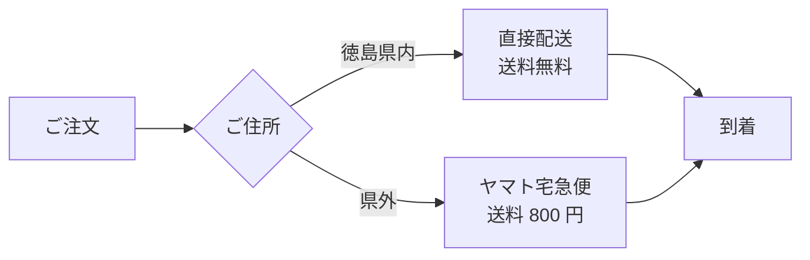

# 山田農園

徳島市で 3 代続く小さな農園です。
キャベツ、玉葱、トマト、レタスを **無農薬** で育てています。

## 取り扱い品目

| 品目 | 旬 | 価格(直販) |
|------|----|-----------|
| キャベツ | 通年 | 180 円/玉 |
| 玉葱 | 4〜6 月 | 95 円/個 |
| トマト | 6〜9 月 | 250 円/個 |
| レタス | 通年 | 200 円/玉 |

## 配送

## ご注文方法

1. メールでご連絡ください: `info@example.com`
2. 商品・数量・お届け先をお知らせください
3. 折り返し請求書をお送りします

[お知らせ一覧](news.html) ｜ [English](en/index.html)
