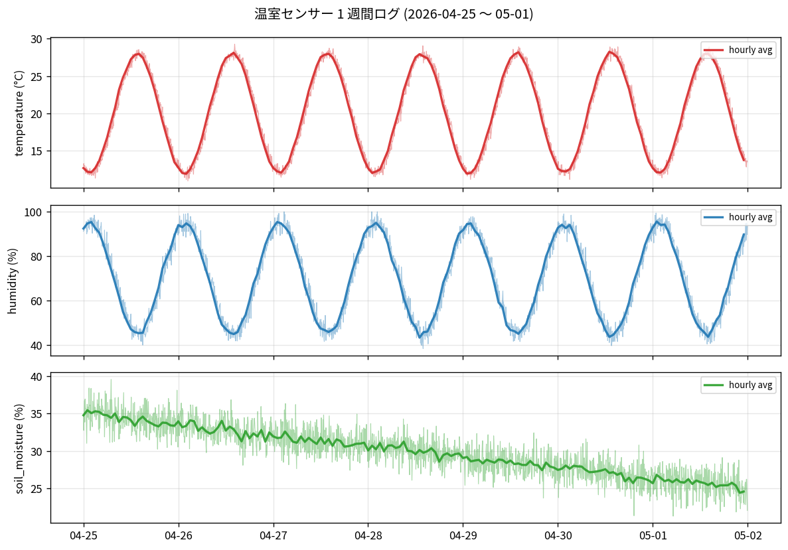

# 温室センサー週次レポート

期間: 2026-04-25 〜 2026-05-01(5 分間隔、3 センサ)

## 統計

| センサ | 最小 | 平均 | 最大 | 件数 |
|--------|------|------|------|------|
| temperature (°C) | 10.9 | 20.0 | 29.3 | 2,016 |
| humidity (%) | 38.4 | 69.9 | 100.0 | 2,016 |
| soil_moisture (%) | 21.3 | 30.0 | 39.6 | 2,016 |

## グラフ

## 観察(自動)

- 温度の日内変動が **18.3℃** ── 大きい。換気またはシェード検討。
- 土壌水分が **39.6% → 21.3%** に低下 ── 灌水が必要。
