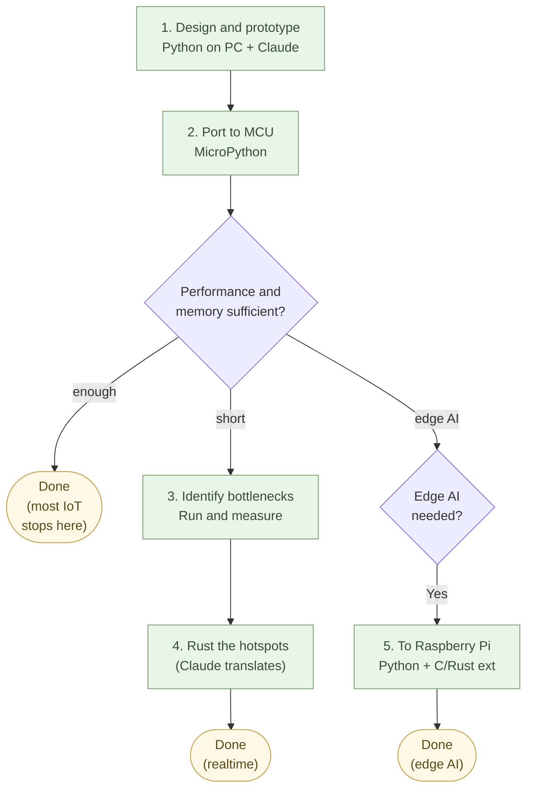

# Building Embedded — Think in Python, Have Claude Translate

For those working with embedded systems and microcontrollers.

Hardware constraints mean the final code lives in C or C++, or at lightest in Rust or MicroPython. But **design and validation can happen in Python**. Do design and validation in Python, confirm it works, then translate to C. With this, the hardest part of embedded development — "proving the logic is correct" — becomes dramatically easier.

## What is hard about embedded

Anyone who has written embedded code knows.

- Behavior cannot be checked without flashing the device
- Hardware debugging takes 10x the time of PC debugging
- Even printing a single value requires UART setup
- Memory runs out, buffers overflow, timing slips
- A one-line fix means re-flashing firmware

Logic errors and hardware instability **mix together**. When something doesn't work, you can't tell whether it's the code, the wiring, or the power supply.

This is the single biggest reason embedded development has been slow.

## Think in Python

In a new embedded project, the first thing to write is Python.

Read sensor values, apply a filter, make a decision — instead of writing this on the device, write it first in Python. Prepare sample data as JSON, load it in Python, pass through the filter, output the decision.

```python
# Validate the logic with sample data
import csv

def detect_anomaly(values):
    avg = sum(values) / len(values)
    return any(abs(v - avg) > 3 for v in values[-10:])

with open("sensor_log.csv") as f:
    rows = [float(r["value"]) for r in csv.DictReader(f)]

print("anomaly:", detect_anomaly(rows))
```

This code runs on a PC. Executes in a second. You can plot a graph for visual confirmation. You can change test data and run it many times.

You can prove the logic is correct, separated from the hardware.

## Translation is Claude's job

Once the logic works in Python, translate it to C.

Ask Claude "translate this Python code to C++ that runs on Arduino, with fixed array sizes" and the translation comes back.

```cpp
// Translated C++ for Arduino
bool detectAnomaly(float values[], int size) {
    float sum = 0;
    for (int i = 0; i < size; i++) sum += values[i];
    float avg = sum / size;
    int start = size - 10;
    if (start < 0) start = 0;
    for (int i = start; i < size; i++) {
        if (fabs(values[i] - avg) > 3) return true;
    }
    return false;
}
```

Flash it to the device and run. **Logic is already verified in Python; if it doesn't work on hardware, the cause is on the hardware side.** Debugging gets a direction.

## Choosing the language — by development phase

Don't pick the embedded language by hardware. Pick it by
**development phase and use case**. "Start in Python; reach for
Rust only when performance demands it; C/C++ is for legacy only" —
that is the AI-native embedded practice.

:::compare
| Development phase | Language | Environment | Use case |
| --- | --- | --- | --- |
| **Design and prototype** | Python (CPython) | On PC, Raspberry Pi | Algorithm validation, data-collection experiments, AI model tests |
| **Production (performance suffices)** | MicroPython | ESP32, RP2040 | Sensor control, IoT communication, light processing |
| **Production (realtime performance needed)** | Rust | STM32, RP2040, ESP32 | High-speed control, realtime, memory-constrained operation |
| **Production (edge AI, image processing)** | Python + C/Rust extensions | Raspberry Pi, Jetson Nano | Inference, image processing, Linux-based deployment |
| **Legacy maintenance only** | C, C++ | Various microcontrollers | Existing-asset maintenance, certified code |
:::

The first choice, when hardware allows, is **MicroPython or Python**. If performance or capacity rules out Python, reach for **Rust** (Claude writes it more safely than C). **C/C++ is for maintaining existing assets only** — there is almost no reason to pick C/C++ for new work.

For a Raspberry Pi class device, the final form is often Python too. **If you can ship Python, no translation needed.** Performance-sensitive parts in edge AI or image processing go into **C / Rust extension modules** (`pybind11`, `PyO3`) — Claude writes those too.

### AI-native embedded development workflow

The table above is the **static menu**; actual development moves
through it **in stages**. The workflow:

1. **Design and prototype** — Work with Claude in PC Python.
   Validate data collection, the algorithm, and AI model behavior
   on the PC.
2. **Port to the microcontroller** — Ask Claude to translate to
   MicroPython. Run on ESP32 or RP2040. **Many IoT and sensor use
   cases stop here.**
3. **Identify performance bottlenecks** — Run and measure. Pinpoint
   places where realtime performance is short, or memory is tight.
4. **Rewrite hotspots in Rust** — Ask Claude to translate only the
   bottlenecks. Decide whether to mix MicroPython + Rust, or rewrite
   the whole thing in Rust with `embassy` / `RTIC`.
5. **If edge AI is needed** — Run on a Raspberry Pi (Linux) with
   Python + C/Rust extensions. Use hardware one step above a
   microcontroller.



**The point: don't start writing in Rust or C.** Validate the
logic in Python, then translate only what needs translating
(Chapter 1's "think in Python, have Claude translate" applied to
embedded). Because Claude carries the translation, **humans don't
have to move back and forth between languages** — thinking happens
in Python; only the final form's language changes.

This is the embedded form of the prologue's
**"collaborate with Linux + Python + AI."** The same practice
reaches all the way past microcontrollers — beyond desk work, into
the hardware itself.

## MicroPython as a choice

Small microcontrollers like ESP32 or RP2040 can run MicroPython, a subset of Python.

Python code written on a PC transfers almost unchanged to the device. The edit cycle is fast (no compile, transfer in seconds). Debugging feels like PC.

When MicroPython hits its limits — memory, speed, available libraries — translate just that part to C. **You don't have to translate everything.** Keep what can stay in Python.

## Hardware is something Claude can also handle

Schematics, wiring, datasheets — Claude can help interpret these too.

"I want to connect this OLED display module to an ESP32. Tell me the wiring and the code." Pin assignments, library, init code, display code all come back.

If the datasheet is a PDF, extract the text and hand to Claude — "what does register 0x21 of this sensor do?" — and it answers.

**Hardware knowledge is also held by AI.** The era of fighting hardware alone is over.

## Sensor data analysis is also Python

When you can extract data from the embedded device, analysis happens in Python too.

Have it emit JSON or Parquet, bring it to a PC, analyze in Python. `polars` for aggregation, `matplotlib` / `altair` for graphs, `numpy` for numerics. Claude writes all of it.

"The sensor logs temperature every minute. From this JSON / Parquet, find the time of day when temperature spiked, and graph it." Code comes back.

**The embedded body runs in C, but everything around it — verification, analysis, visualization — runs in Python and AI.** That is the new shape of embedded development.

## Example: a room temperature monitor

A concrete example.

**Goal**: an ESP32 that measures room temperature and notifies when it exceeds 30 °C.

**Stage 1 (Python on PC)**:

Write the logic in Python. Prepare sample temperature data (JSON) and write the decision logic. Tune thresholds, denoise, set notification conditions — all experimented on a PC.

```python
def should_alert(temps):
    # Alert if the average of the last 5 minutes exceeds 30
    recent = temps[-5:]
    return sum(recent) / len(recent) > 30
```

**Stage 2 (MicroPython on the device)**:

Transfer the Python logic to MicroPython. Since MicroPython is a subset of Python, it runs almost as is. Wire up a real temperature sensor (DHT22, etc.) and run with real data.

**Stage 3 (translate to C if needed)**:

Battery-powered for long durations, tight memory — then translate to C. Ask Claude, the translation comes out.

In many cases, Stage 2 is the end. MicroPython is sufficient.

## Example: a farmer's field-sensor network

A second case. Farmer B wants soil-moisture, temperature, and solar
irradiance sensors at several spots in the field. Commercial
solutions cost ~$300 per unit and pool data in the vendor's cloud.

**Stage 1 (Python on PC):**
Develop the irrigation-decision logic against historical weather
data (Chapter 1's "pull from the meteorological-agency API"):
"recommend irrigation if irradiance ≥ X Wh/m² plus soil moisture
< Y % for three consecutive hours." Apply with Polars to historical
data, tune the thresholds. Claude writes the first version.

**Stage 2 (MicroPython on device):**
Port the logic to ESP32 + sensors (~$20 total). MicroPython, so the
PC code runs almost as-is. JSON log every minute to an SD card.

**Stage 3 (aggregate on the farmhouse miniPC):**
A miniPC at the farmhouse (the same machine running Forgejo from
Chapter 2, or a separate one). ESP32s send JSON via WiFi every 10
minutes; accumulate in Parquet; Altair for daily charts; SQLite
for anomaly history.

**Stage 4 (design and 3D-print the irrigation actuator):**
Housing for the solenoid valve **designed in Build123d
(Chapter 3) and 3D-printed**. ESP32 relay output drives the valve;
Python control code is translated by Claude to C only if MicroPython
memory runs out.

**Result**: a few dollars per spot, the data is yours, no vendor
cloud subscription, the decision logic is readable in Markdown, and
even repair is in your hands (3D-print a fresh part).

This is the **technical implementation** of Chapter 12's "from
silos to individual autonomy — farmer edition." Chapter 1 (Python),
Chapter 3 (CAD), Chapter 4 (Parquet), Chapter 7 (web dashboard via
FastAPI if you want one) — **the toolkit of the entire book
converges into one project**.

## Readable in ten years

C has been around for 50 years. It will run for another 50. Python has been around for 30 and will run for another 30.

Embedded knowledge that has been locked into industry-specific languages (old PLC ladder logic, automotive special standards) gets pushed out into Python and C and Markdown. **Move from vendor-specific formats to formats that cross time.**

This is a long game. But you can advance a little every day.

## In numbers

ESP32 temperature-sensor logic development:

- Old way, starting in C++: **2 weeks** (compile + flash + debug)
- New way, validate in Python first, then transfer to MicroPython: **2 days**
- **7x faster**

Re-flash cycle:

- C++ + flash: **~2 minutes**
- MicroPython transfer: **~5 seconds**
- Python simulation: **~0.1 seconds**
- C vs Python: a **1,200x gap**

20-year-old industrial PLC ladder logic, untouchable since the original engineer retired: Claude reads the ladder, translates to Python, documents in Markdown — **1 week**. By hand, half a year or more, with no guarantee even with a veteran engineer.

Sensor data visualization: building a custom web dashboard takes 1 week. With Python's `matplotlib` plus a `plot()` line, then "make this an HTML report" to Claude — practical-quality result in **30 minutes**.

## In summary

Even in embedded, think in Python.

Design and verify in Python, then translate to C if needed. Claude handles the translation. **Time spent fighting hardware decreases, and you focus on the real problem — sensors, logic, operations.**

The nine chapters so far have laid out the AI-native toolset. Python, Markdown, Mermaid, JSON / YAML / SQLite / Parquet, leaving Office, business systems, web, apps, embedded.

The next chapter moves to common practice in advanced form. "Knowing what work to hand to AI" — the judgment of what to delegate and what to keep.

---

## Related

- [Chapter 08: Building Apps — CLI Tools, Flet Apps, Flutter Apps](/en/ai-native-ways/apps/)
- [Chapter 01: Writing Logic — Have AI Write Python For You](/en/ai-native-ways/python/)
- [Structural Analysis 15: Security Design for the Mythos Era](/en/insights/security-design/)
