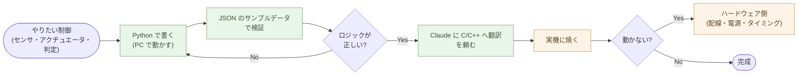
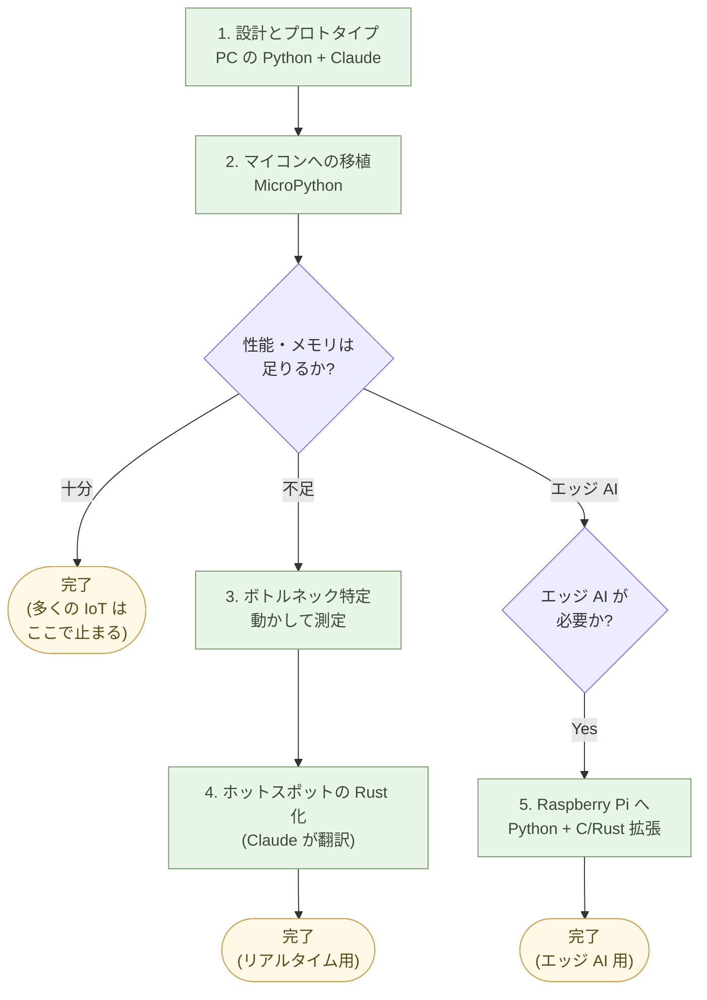

# 組み込みを作る ── Pythonで考え、Claudeに翻訳させる

組み込みやマイコンを扱うあなたへ。

ハードウェアの制約から、最終的には C か C++、軽くても Rust や MicroPython で書くことになる。しかし、**設計と検証は Python で行える**。設計と検証を Python でやって、確認できてから C に翻訳する。これで組み込み開発の最大の難所 ── 「ロジックが正しいことを確かめる」 ── が劇的に楽になる。

## 組み込みの何が難しいか

組み込みコードを書いた人なら、誰でも知っている。

- 実機に焼き込まないと動作確認できない
- ハードウェアのデバッグは PC のデバッグの 10 倍時間がかかる
- print 一つ出すのに UART を設定する
- メモリが足りない、バッファが溢れる、タイミングがずれる
- 一行の修正でファームウェアを焼き直す

ロジックの間違いとハードウェアの不安定さが**混ざる**。今うまく動かないのが、コードのせいか、配線のせいか、電源のせいか、分からない。

これが、組み込み開発を遅くしてきた一番の理由だ。

## 思考は Python で

新しい組み込みプロジェクトで、最初に書くべきは Python だ。

センサから値を読んでフィルタをかけて判定する処理 ── これを実機で書くのではなく、まず Python で書く。サンプルデータを JSON で用意して、Python で読み込んで、フィルタを通して、判定結果を出す。

```python
# サンプルデータでロジックを検証
import json

def detect_anomaly(values):
    avg = sum(values) / len(values)
    return any(abs(v - avg) > 3 for v in values[-10:])

with open("sensor_log.json") as f:
    rows = [r["value"] for r in json.load(f)]  # JSON なら float のまま

print("anomaly:", detect_anomaly(rows))
```

このコードは PC で動く。一秒で実行できる。グラフを書いて視覚的に確認することもできる。テストデータを変えて何度も実行できる。

ロジックが正しいかどうかを、ハードウェアと切り離して検証できる。

## 翻訳は Claude が

ロジックが Python で動いたら、それを C に翻訳する。

Claude に「この Python コードを、Arduino で動く C++ に翻訳して。配列のサイズは固定にして」と頼めば、翻訳されて出てくる。

```cpp
// 翻訳された C++(Arduino 用)
bool detectAnomaly(float values[], int size) {
    float sum = 0;
    for (int i = 0; i < size; i++) sum += values[i];
    float avg = sum / size;
    int start = size - 10;
    if (start < 0) start = 0;
    for (int i = start; i < size; i++) {
        if (fabs(values[i] - avg) > 3) return true;
    }
    return false;
}
```

これを実機に書き込んで動かす。**ロジックは Python で確認済みなので、ハードウェアで動かないなら原因はハードウェア側だ**。デバッグの方向が定まる。



## 言語の選択 ── 開発フェーズで決める

組み込みの言語は、ハードウェアごとに決めるのではなく、**開発フェーズと
用途で決める**。「最初は Python、性能が要るときだけ Rust、C/C++ は
レガシー対応に限る」が AI ネイティブな組み込みの作法だ。

:::compare
| 開発フェーズ | 言語 | 環境 | 用途 |
| --- | --- | --- | --- |
| **設計・プロトタイプ** | Python (CPython) | PC 上、Raspberry Pi | アルゴリズム検証、データ取得実験、AI モデル試験 |
| **本番(性能が十分な場合)** | MicroPython | ESP32、RP2040 | センサー制御、IoT 通信、軽量な処理 |
| **本番(リアルタイム性能が必要)** | Rust | STM32、RP2040、ESP32 | 高速制御、リアルタイム処理、メモリ制約下での動作 |
| **本番(エッジ AI、画像処理)** | Python + C/Rust 拡張 | Raspberry Pi、Jetson Nano | 推論、画像処理、Linux 環境での動作 |
| **レガシー対応のみ** | C、C++ | 各種マイコン | 既存資産の保守、認証済みコード |
:::

第一選択肢は、ハードウェアが許すなら **MicroPython または Python**。
性能や容量の制約で Python が無理なら **Rust**(Claude が C より
安全に書ける)。**C/C++ は既存資産の保守のみ** ── 新規に C/C++ を
選ぶ理由は、ほぼ無い。

Raspberry Pi クラスなら、最終形も Python で良い場合が多い。
**Python のまま動かせるなら、翻訳は要らない**。エッジ AI や画像
処理で性能が要る部分は **C / Rust の拡張モジュール** にする
(`pybind11`、`PyO3`)── これも Claude が書ける。

### AI ネイティブな組み込み開発のワークフロー

上の表は **静的な選択肢** だが、実際の開発は **段階的に進む**。
ワークフローはこうなる:

1. **設計とプロトタイプ** ── Claude と対話しながら、PC の Python
   で動作確認。データ取得、アルゴリズム、AI モデルの動作を PC で
   検証する。
2. **マイコンへの移植** ── Claude に MicroPython 版への翻訳を
   依頼。ESP32 や RP2040 で動かす。**多くの IoT・センサー用途は
   ここで完結する**。
3. **性能ボトルネックの特定** ── 動作させて測定。リアルタイム性能
   が不足する箇所、メモリが厳しい箇所を特定する。
4. **ホットスポットの Rust 化** ── ボトルネックだけを Claude に
   Rust 化を依頼。MicroPython と Rust を組み合わせるか、全体を
   Rust + `embassy` / `RTIC` で書き直す判断をする。
5. **エッジ AI が必要な場合** ── Raspberry Pi(Linux)上で、
   Python + C/Rust 拡張で動かす。マイコンより一段上のハードウェア
   を使う。



**重要なのは「最初から Rust や C で書かない」こと**。Python で
ロジックを確かめてから、必要な部分だけ翻訳する(第1章「Python で
考え、Claude に翻訳させる」の組み込み版)。Claude が翻訳を担う
ので、**人間が複数の言語を行き来する負担は無い** ── 思考は Python
で、最終形だけ言語が変わる。

これも序章「**Linux + Python + AI との協働**」の組み込み版だ。
「同じやり方」が、マイコンの先まで伸びる ── デスクワークだけ
でなく、その先のハードウェアまで。

## MicroPython という選択

ESP32 や RP2040 のような小型マイコンには MicroPython が動く。これは Python のサブセットだ。

PC で書いた Python コードを、ほぼそのままマイコンに転送できる。書き換えサイクルが速い(コンパイル不要、転送数秒)。デバッグが PC と同じ感覚でできる。

MicroPython の制約 ── メモリ、速度、利用可能ライブラリ ── にぶつかったら、その部分だけ C に翻訳する。**全部翻訳する必要はない**。Python のまま残せる部分は残す。

## ハードウェアは Claude も触れる

回路図、配線、データシート ── これらの読み解きも Claude に頼める。

「この OLED 表示モジュールを ESP32 に接続したい。配線とコードを教えて」と頼めば、ピン配置、ライブラリ、初期化コード、表示コードを返してくる。

データシートが PDF なら、テキスト化して Claude に渡せば「このセンサのレジスタ 0x21 は何か」を答えてくれる。

**ハードウェアの知識も AI が持っている**。一人でハードウェアと格闘する時代は終わった。

## センサデータの分析も Python で

組み込みデバイスからデータを取れたら、それを分析するのも Python だ。

JSON や Parquet で吐き出させて、PC に持ってきて、Python で分析する。`polars` で集計、`matplotlib` / `altair` でグラフ、`numpy` で数値処理。Claude が全部書ける。

「センサが温度を 1 分ごとに記録している。この JSON / Parquet から、1 日のうちで温度が急上昇した時間帯を見つけて、グラフにして」と頼めば、コードが返ってくる。

**組み込みの本体は C で動かしても、その周辺(検証・分析・可視化)は Python と AI で動かす**。これが新しい組み込み開発のかたちだ。

## 例: 室温モニター

具体例を一つ。

**目的**: ESP32 で室温を測って、30 度を超えたら通知する。

**第一段階(PC で Python)**:

ロジックを Python で書く。サンプル温度データ(JSON)を用意して、判定処理を書く。閾値の調整、ノイズ除去、通知条件 ── すべて PC で実験する。

```python
def should_alert(temps):
    # 直近 5 分の平均が 30 度を超えたらアラート
    recent = temps[-5:]
    return sum(recent) / len(recent) > 30
```

**第二段階(MicroPython で実機)**:

Python ロジックを MicroPython に転送する。MicroPython は Python のサブセットなので、ほぼそのまま動く。実機で温度センサ(DHT22 など)を繋いで、本物のデータで動かす。

**第三段階(必要なら C に翻訳)**:

電池駆動で長時間動かしたい、メモリが厳しい ── そのときに C に翻訳する。Claude に頼めば翻訳が出てくる。

多くの場合、第二段階で終わる。MicroPython で十分動く。

## 例: 農家の畑センサネットワーク

別の例。農家 B さん。畑の数箇所に土壌水分・温度・日射のセンサを
置きたい。市販品は 1 台 5 万円、データは業者のクラウドに集約。

**第一段階(PC で Python)**:
過去の気象データ(第1章「気象庁の API から取得」)で、灌水判定の
ロジックを書く。「日射 ○ Wh/m² 以上 + 土壌水分 △ % 未満が 3 時間
続いたら灌水推奨」── これを Polars で過去データに適用、しきい値を
調整。Claude が初版を書く。

**第二段階(MicroPython で実機)**:
ESP32 + センサ(合計 3,000 円)に上のロジックを移植。MicroPython
なので、PC のコードがほぼそのまま動く。SD カードに JSON で 1 分
ごとに記録。

**第三段階(母屋の miniPC に集約)**:
B さんの母屋に miniPC(第2章で立てた Forgejo の機械をそのまま再利用、
または別の miniPC)。ESP32 が WiFi で 10 分ごとに JSON を miniPC に
送信、Parquet に蓄積。Altair で日別グラフ、SQLite で異常検出履歴。

**第四段階(自動灌水アクチュエータの設計)**:
ソレノイドバルブを動かす筐体を **Build123d(第3章)で設計、3D
プリンタで印刷**。ESP32 のリレー出力でバルブ ON/OFF、Python の
制御コードを Claude が C に翻訳(MicroPython のメモリでギリギリ
動かない場合のみ)。

**結果**:1 ヶ所あたり 3,000 円 × 数ヶ所、データは自分のもの、
業者のクラウドサブスク不要、判定ロジックは Markdown で読める、
故障時の修理も自分でできる(3D プリンタで部品を刷り直す)。

これは第12章「縦割りから個人の自立へ ── 農家編」の **技術的な
実装** だ。第1章(Python)、第3章(CAD)、第4章(Parquet)、第7章
(Web ダッシュボード、見たければ FastAPI で)── **全章の道具立てが
1 つの作品にまとまる**。

## 10年後も読める

C は 50 年前からある。これからも 50 年動く。Python は 30 年前から動いていて、これからも 30 年動くだろう。

業界特有の独自言語(古い PLC のラダー、車載の特殊規格)に閉じ込められていた組み込み知識を、Python と C と Markdown に出していく。**特定ベンダーから時間を超える形式に移す**。

これは長期戦だ。しかし、毎日少しずつ進められる。

## 実例: 数字で見る

ESP32 で温度センサ判定の開発:

- C++ で書き始める従来法: **2 週間**(コンパイル + 実機焼き直し + デバッグ)
- Python で検証してから MicroPython に転送する新法: **2 日**
- **7 倍速い**

実機焼き直しサイクル:

- C++ + 書き込み: **約 2 分**
- MicroPython 転送: **約 5 秒**
- Python シミュレーション: **約 0.1 秒**
- C と Python の差は **1,200 倍**

産業用 PLC のラダー言語で書かれた 20 年前の制御ロジック: 担当者の引退で誰も触れない状態。Claude にラダーを読ませて Python に翻訳、Markdown 化で **1 週間**。同じことを人手でやるなら半年以上、ベテランエンジニアを呼んでも完了の保証はない。

センサデータの可視化: 自前で Web ダッシュボードを作ると 1 週間。Python の `matplotlib` で `plot()` 1 行 + Claude に「これを HTML レポートにして」と頼むと **30 分**で実用レベル。

## まとめ

組み込みでも、思考は Python で。

設計と検証を Python でやってから、必要なら C に翻訳する。Claude が翻訳を担う。**ハードウェアと格闘する時間が減り、本来の課題 ── センサとロジックと運用 ── に集中できる**。

ここまでの 9 章で、AI ネイティブな仕事の道具立てが揃った。Python、Markdown、Mermaid、JSON / YAML / SQLite / Parquet、Office から離れる、業務システム、Web、アプリ、組み込み。

次の章では、共通の発展に進む。「AI に任せる仕事を見極める」── 何を渡し、何を残すかの判断のはなし。

---

## 関連記事

- [第8章: アプリを作る ── CLIツール、Fletアプリ、Flutterアプリ](/ai-native-ways/apps/)
- [第1章: 処理を書く ── AIにPythonで書いてもらう](/ai-native-ways/python/)
- [構造分析15: Mythos時代のセキュリティ設計](/insights/security-design/)
