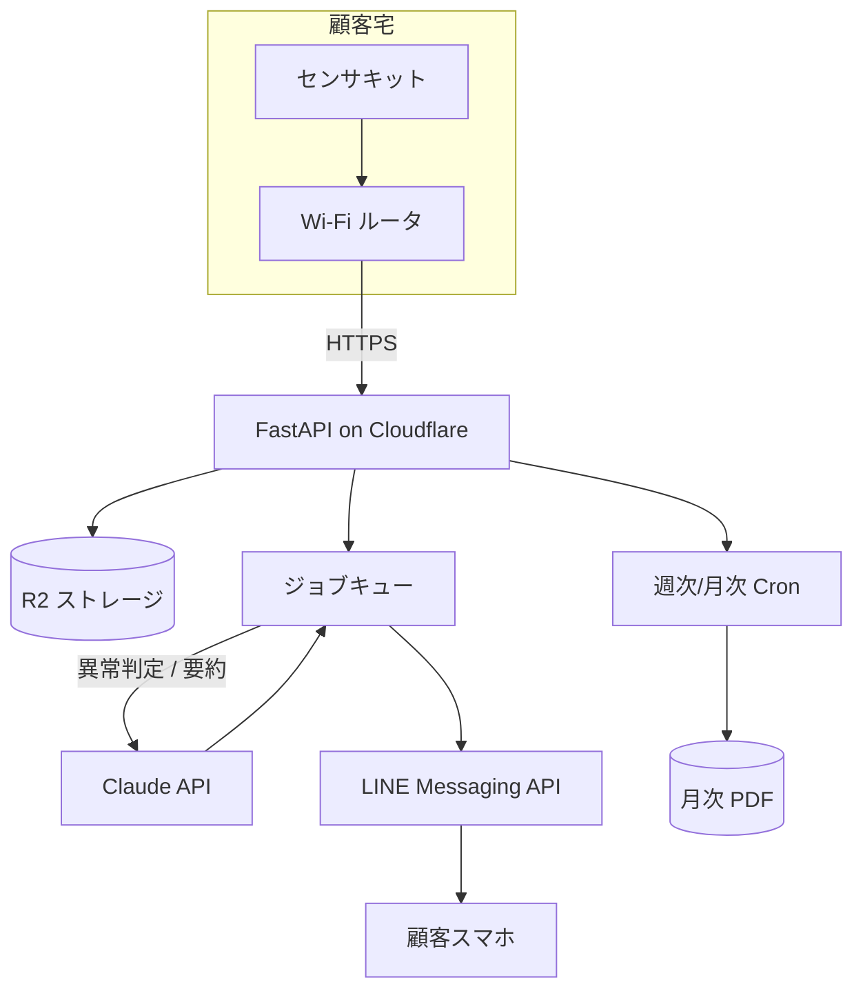

# Mochi.ai システム構成

## 各コンポーネントの役割

| コンポーネント | 役割 | コスト |
|----------------|------|-------|
| センサキット | 温湿度・人感を 5 分間隔で送信 | 仕入 1,500 円/個(顧客買い切り) |
| Cloudflare Pages + Workers | フロント + API | 無料枠 |
| R2 ストレージ | センサデータ + PDF 保存 | 200 円/月/顧客 |
| Claude API | 異常判定 + 週次/月次サマリ | 50 円/月/顧客 |
| LINE Messaging API | 通知 | 無料枠 |

## 1 人 + AI で回せる理由

- フロントは静的 HTML(このフォルダの `site/` で生成)
- API は FastAPI 1 ファイル(コードは Claude が書く)
- 月次レポートは `build_all.py` の関数 1 つ
- カスタマー対応の下書きは Claude
- 経理は freee + 週 1 回の Claude チェック

**手作業の合計時間: 週 5〜10 時間**。
