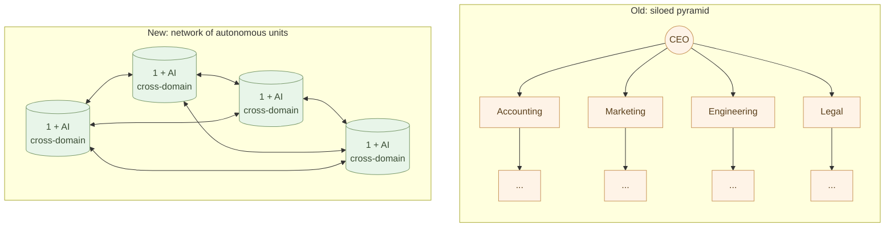
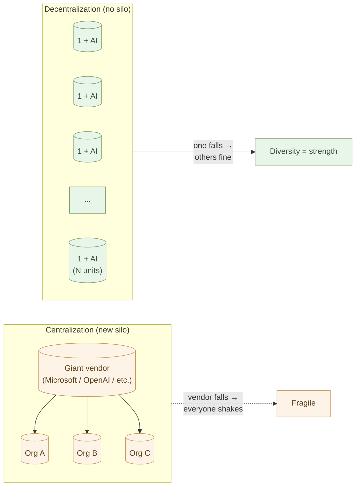

# One Person + AI — The New Unit of Work

What can a human equipped with AI-native tools do?

This chapter is the synthesis of the entire series. The theme narrows
to one thing: **from siloed organizations to individual autonomy.**

Until now, work has been organized in **silos**. Accounting in the
accounting department, marketing in the marketing department, dev in
the dev department, legal in the legal department — fences between
specializations, judgments confined inside each fence. With AI-native
tools, **those fences dissolve inside a single person**.

Organizations don't disappear. **Silos do.**

## Why silos arose

Silos are not a product of bad intent. They are a structure that arose
because **specialization was expensive**.

- One person doesn't have time to learn accounting, dev, *and* law.
- Gathering specialists requires hiring, placement, and training by
  role.
- An **organization is needed to bundle** the gathered specialists.
- Communication between departments incurs **translation cost** (slips,
  approvals, meetings).
- To reduce that translation cost, a **command hierarchy (pyramid)**
  is added.

The twentieth-century organization converged on
**"silos + pyramid"**. The majority of white-collar work has been spent
on what this structure generates: **inter-specialty translation, and
the maintenance of the command chain**.

> Silos were the compromise point between specialization's efficiency
> and coordination's cost. When AI transforms both, the shape no
> longer holds.

## The cost silos were paying

Silos came with structural side effects.

- **Siloed knowledge**: what accounting knows, engineering doesn't.
  Marketing's judgment doesn't reach engineering.
- **Translation cost**: someone, somewhere, is constantly converting
  department A's language into a form department B can read (Excel
  reformatting, approvals, reports, minutes).
- **Slow decisions**: cross-domain judgments climb the pyramid and
  descend again.
- **Diffuse, diluted responsibility**: "that isn't my role" becomes
  habit; no one holds the whole.
- **Bound individual capacity**: one person stays inside one domain;
  cross-domain perspective doesn't grow.
- **Customer and field are far away**: what sales heard goes through
  many translation stages before it reaches dev.

This isn't a story about bad organizations. **A rational structure
for an era when specialization was expensive** simply carried these
side effects with it.

## AI dissolves the fences

With AI-native tools, the domains one person can cover
**expand dramatically**:

- **Accounting** — Claude generates invoice PDFs, derives journal
  entries from CSV.
- **Legal** — Claude drafts contracts, surfaces risks, references
  precedent.
- **Marketing** — Claude drafts blog posts, social copy, newsletters,
  landing pages.
- **Engineering** — Claude writes Python, HTML, SQL.
- **Design** — Claude Design, Mermaid, Marp produce drafts.
- **Data analysis** — JupyterLab + Polars + Claude.
- **Multilingual work** — Claude translates and localizes.
- **Cross-department translation** — between structured texts, AI
  bridges directly.

One person handles these **in parallel**. You don't need to *become*
every specialist. The new individual is **"someone who knows when to
call a specialist," "someone who drafts with AI," "someone who reads
results and translates them into their own context."**

Specialists still matter. But their position shifts to
**"the consultant you can call whenever you need them"** — the tax
accountant at filing time, the lawyer when there's a dispute, the
specialist physician for specialized care. **Day-to-day work runs on
one person + AI.**

## The toolkit one person + AI carries

Lay out again the tools acquired from the prologue through Chapter 11.
They are **the gear for dissolving silos**.

- Write logic in **Python** (Claude writes it) — accounting, data,
  automation
- Write documents in **Markdown** — general documents
- Save diagrams in **Mermaid** — design, illustration, presentation
- Hold data in **JSON / CSV / YAML / SQLite / Parquet** — a common
  container across domains
- Step away from **Office** (kept as a converter layer) — escape the
  vendor silo too
- **Business systems** are not broken; you operate outside the
  boundary — coexist with existing silos
- **Web** is enough with HTML+CSS+JS — distribute yourself
- **Apps** start at CLI, then Flet / Flutter as needed — build yourself
- **Embedded** thought in Python, translated to C — cross-domain even
  into hardware
- **Responsibility for judgment** stays with the human — the
  cross-domain person's responsibility

All of these, one person can use, with Claude beside them. **Work that
was impossible without "a team of specialists"** moves with one
person.

## Concrete example: a sole proprietor — one person across all domains

A, a sole proprietor (consulting). What happens at month-end:

- **Invoicing**: Claude reads the customer master (CSV) and generates
  invoice PDFs for each client. No accounting clerk needed.
- **Expenses**: Receipt photos → Claude OCRs, classifies, exports CSV.
- **Monthly report**: Sales + expenses → Claude writes a Markdown
  report. The accountant is called only for tax filing.
- **Contracts**: New-client contracts — Claude drafts; edits go to a
  lawyer a few times a year.
- **Marketing**: Blog, social, newsletter — Claude drafts.
- **Website**: Static HTML, Markdown + Python build.

Ten years ago, accounting clerk, marketer, web agency, printer — a
dozen people across silos would have been involved. **A is running it
all alone, across domains.**

There are **no silo walls**. Accounting knowledge feeds straight into
marketing judgment. Contract wording and engineering spec connect in
one head. **Translation cost is zero.**

## Concrete example: a farmer — also "researcher, manager, broadcaster"

B, a farmer. Someone previously "the person who farms" expands domains
with AI.

- **Weather data analysis**: Ten years of temperature and rainfall in
  Python; consult Claude on "when to plant this year."
- **Field journal**: Smartphone photos journaled into Markdown by
  Claude, with disease recognition.
- **Sales management**: Direct-sales orders recorded in Markdown;
  Claude generates invoices and shipping labels.
- **Outreach**: Field blog, social media, multilingual versions
  (English, Chinese) — all Claude.
- **Learning**: Academic papers (Dr. Christine Jones et al.)
  summarized by Claude; B discusses application to his own field with
  Claude.

**A farmer plays researcher, manager, and broadcaster at once.**
Functions formerly scattered across silos — agricultural research
institutes, the cooperative, the tax accountant, the ad agency — now
sit with the farmer, with AI alongside. **The cross-domain principal
is the farmer themselves.**

This is the concrete shape of "the autonomous individual" the
structural-analysis series has been describing.

## Concrete example: the one-person startup — start with no silos

C, a programmer. A business that ten years ago needed 3–5 co-founders
(CTO + frontend + backend + designer + marketing) — **C starts it
alone**.

- **Product**: Web service in HTML+CSS+JS + Python FastAPI — Claude
  writes nearly all the code.
- **Design**: Claude Design + iteration.
- **Documentation**: Help, terms, privacy policy in Markdown + Claude.
- **Marketing**: Landing, SEO, English version — Claude.
- **Support**: Inquiry replies drafted by Claude.
- **Accounting**: Data organization and analysis — Claude.
- **Legal**: Contract drafts by Claude; critical matters to a lawyer.

What C keeps as their own domain: **"designing the product," "making
the important decisions," "talking directly with customers."** The
rest goes to AI.

Before any organization is formed, **there are no silos at all** — one
founder is the principal across every domain. Co-founder disagreements,
role-allocation negotiation, equity dilution — **frictions originating
in silos simply don't arise**.

## Concrete example: inside an organization — dissolve silos from the inside

"I work inside an organization, so 'one person + AI' isn't for me" —
no need to think that.

While inside an organization, you can still **dissolve silos in your
own area from the inside**. Take D, an office worker.

- Before: hand Excel aggregation to the accounting department, route
  approvals through legal, confirm report format with general affairs,
  ask IT for data visualization.
- After: **aggregate yourself with Polars + Claude**, have
  **Claude surface contract risks**, **generate reports with Markdown
  + pandoc**, **build your own dashboards with Altair**.

The organization's rules don't change. The official silos remain. But
**on your own desk, the silos have dissolved**. "Can't proceed without
asking that department" turns into "I can proceed with Claude."

This is individual autonomy. **Don't wait for the organization to
change.** Chapter 5 (paperwork) and Chapter 6 (business systems) both
covered this "from-the-inside" practice.

## When silos dissolve, organizations change shape

Asked "do organizations disappear?" — the answer is no. Organizations
are still needed. **But the structure of the organization changes.**

The old organization: **a device that stacks specialists vertically**.
Accounting, HR, marketing, dev — each domain has its specialists,
bundled in silos, coordinated by a pyramid.

The new organization: **a device that places autonomous units side by
side**. Each unit can run across domains on its own (one person + AI).
The organization is **a space for direction and collaboration** — a
network, not a pyramid.

A team of ten becomes three, with each person + AI producing
equivalent or greater output. But the substance isn't payroll. It is
**faster decisions**, **vanished inter-department translation cost**,
**constant cross-domain judgment**, **customers and field staying
close**.

This is not "organizational simplification." It is **the dissolution
of silos**.

## Centralization vs decentralization — two ways to dissolve silos

Seen at societal scale, "one person + AI" is one side of
**two paths the AI era can take**.

### The centralized path — the industry as the top of a new silo

- Everyone uses the same AI (Microsoft 365 Copilot, ChatGPT
  Enterprise, Google Workspace AI).
- Everyone runs on the same SaaS (Salesforce, Slack, Notion).
- Everyone's data accumulates in vendor clouds.
- Standards of judgment come from vendor AI trained on aggregated
  data.
- "Easy," "uniform," "low-support" — short-term gains are real.

This path *does* dissolve organizational silos. But it
**creates a new silo** — Microsoft / OpenAI / Google / Salesforce
become the top of an **industry-wide silo, with everyone hanging from
them**.

Organizations homogenize, vendor dependence deepens, everyone sits on
the same Mythos-era single point of failure. When one AI is wrong,
everyone is wrong in the same direction. When a data policy changes,
everyone's data flows the same way. **Diversity disappears.**

### The decentralized path — no silo at all

- **Each person holds their own tools** (Markdown / CSV / Python /
  Claude Code).
- **Each person holds their own data** (local files, history in git).
- **Each person holds their own judgment** (AI proposes; humans
  decide).
- Tools take different shapes per industry, occupation, region,
  culture, temperament — **everyone's setup differs**.
- Vendor dependence is minimized (an API call to Claude, swappable
  any time).

This path loses to centralization on short-term efficiency. Learning
costs rise. There's no uniformity. You handle support yourself.

But long-term, it is decisively stronger. **When one falls, the
others keep moving.** When a vendor falls, your data and tools are
still in your hands. Industry- and culture-specific judgments grow
without being homogenized. **Diversity itself is strength.**

**The centralized path dissolves organizational silos by building an
industry silo. The decentralized path dissolves silos themselves.**

This sits cleanly with the structural-analysis arguments
(["Subtraction Design"](/en/insights/subtraction-design/),
["Mythos-Era Security Design"](/en/insights/security-design/)).
**Redundancy, distribution, diversity — these are Mythos-era survival
strategies.**

> Not "one person + AI" for efficiency.
> **"One person + AI" for dissolving silos, freeing individuals, and
> preserving societal diversity.** That is the heart of this book's
> claim.

## "Ways of working" change too

When silos dissolve and one person + AI is the unit, ways of working
change too.

- **No commute** — no need to walk over to another department.
- **No full-time obligation** — only the hours that are needed.
- **No single-organization affiliation** — contracts with several.
- **No domain confinement** — accounting, dev, legal in one person.

"Freelance," "side jobs," "multi-jobs" become normal. **AI lets each
person operate their own office.**

Organizations, too, no longer need to insist on full-time employment.
"For this period, this deliverable, this person." Done — contract with
the next person. Organizations move project by project.
**Employment itself was a silo-dependent shape.**

## What becomes "work only humans can do"

After silos dissolve and processing is handed to AI, what remains?

- **Deciding what to do** (strategy, direction)
- **Asking why to do it** (meaning, purpose)
- **Deciding how to judge results** (evaluation, responsibility)
- **Talking directly with customers to draw out their true needs**
- **Resolving ethically difficult problems**
- **Creating new value** (first-time design)
- **Connecting people, building trust**
- **Work that uses the body** (the field, the kitchen, medical
  procedures, craftsmanship)
- **Cross-domain judgment** — judgments not possible inside silos

These cannot be delegated to AI. And these are **interesting**. Not
boring processing work, but real work.

The last one — **cross-domain judgment** — is the new human work
made possible *because* silos have dissolved. Accounting numbers,
engineering progress, legal risk, customer voice — **all held in one
head at once and weighed together**. What only the top of the
twentieth-century organization could do is now possible for one
person + AI.

> Information processing becomes simple work that AI can do. What
> remains for humans is deciding what to do, why to do it, and how to
> judge the results.

The single sentence from the prologue completes here.

## Examples — what the post-silo structure looks like

Consultancy, with silos dissolved:

- **Before (5-person silo)**: accountant + marketer + web developer +
  assistant + head.
- **After (1 + AI)**: head alone + Claude Pro + AI API.
- This isn't a payroll story. **Four silo functions are integrated
  inside the head's single perspective.** Accounting figures and
  marketing decisions connect instantly.

Startup founding team, silos collapsed:

- **Before**: CTO + frontend + backend + designer + marketing — 5
  people, functional silos.
- **After**: founder alone + Claude + time-contracted specialists
  when needed.
- Five specialty domains are **cross-domain integrated inside the
  founder**. Equity dilution, co-founder disagreements, role
  allocation — **silo-originated frictions don't arise to begin
  with**.

Farmer expanding domains:

- **Before**: farming + sales via the cooperative + accounting via
  tax accountant + outreach via ad agency — distributed across silos.
- **After**: farmer does it all with AI — **"farmer" also plays
  "researcher, manager, broadcaster"**.
- Silo translation cost (reporting to the co-op, briefing the
  accountant, instructing the ad agency) → zero.

The paperwork-disappears effect: of an 8-hour workday, the 4 hours
spent on paperwork — most of which was **inter-silo translation
(reports, approvals, handover documents)** — move to AI. The
remaining 4 hours are spent on **the real cross-domain work**.

## When to start

Asked "when do I switch to the AI-native way of working?" — the
answer is **today**.

Not tomorrow. Not next month. Today, right now.

The first step can be anything:

- The next note you write — in Markdown, not Word.
- The next table — in CSV, not Excel.
- The next diagram — in Mermaid, not PowerPoint.
- The next piece of processing — have Claude write the Python.
- The next Word file that arrives — pass to Claude, get Markdown back.
- **A thing you "ask that department to do"** — try it once with
  Claude alone.

Step by step. You don't have to change everything at once. Take one
step, and the second becomes visible. **The silos dissolve one
centimeter at a time, starting from your own desk.**

## In summary

With AI-native tools in place, the minimum unit of work changes.

**From siloed organizations to one person + AI.** That is the core
theme of this book.

- Silos were rational for an era when specialization was expensive.
- AI transformed the toolkit; one person can now cross domains.
- One person + AI can do the work that previously required a
  ten-person team of specialists.
- Organizations don't disappear; **silos do.**
- A network of autonomous units replaces the pyramid.

And one more thing. **The centralized path dissolves organizational
silos by building an industry silo** — the industry is pushing that
path. This book chooses the opposite. Each person holds their own
tools, their own data, their own judgments, and grows judgment
specific to their own context.
**The state in which silos themselves have vanished** is the Mythos
era's strength.

What remains for humans: judgment, context, responsibility, creation,
dialogue, trust, embodiment — and **cross-domain work**. This is the
real work. Hand processing to AI; humans return to the real work.

This is the conclusion of the "AI-Native Ways of Working" series.

Thank you for staying with us from the prologue through Chapter 11.
Take a step starting tomorrow — no, starting today. **One square of
the silo returns to your side** — that is where it begins.

aiseed.dev will continue publishing the practice of AI-native ways of
working.

---

## Related

- [Prologue: Office for paperwork, Java/C# for business systems — but AI runs on Python and text](/en/ai-native-ways/prologue/)
- [Chapter 05: Changing Paperwork — A Realistic Path Away from Office](/en/ai-native-ways/office-replacement/)
- [Chapter 10: Knowing What Work to Hand to AI](/en/ai-native-ways/ai-delegation/)
- [Structural Analysis 08: Removing the Enterprise IT Tax](/en/insights/enterprise-tax/)
- [Structural Analysis 12: AI and the Individual Business](/en/insights/ai-and-individual/)
- [Structural Analysis 14: Subtraction Design](/en/insights/subtraction-design/)
