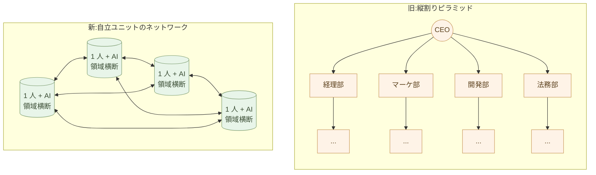
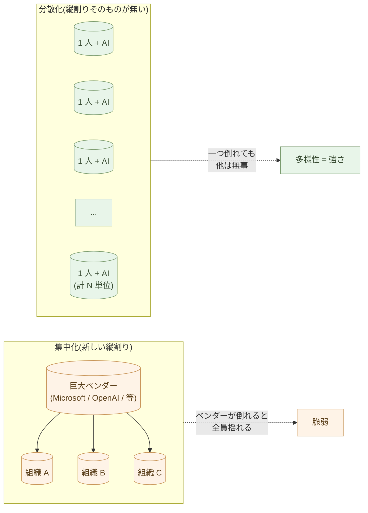

# 1人+AIで作る、新しい仕事の単位

AI ネイティブな道具を揃えた人間は、何ができるか。

この章は、シリーズ全体の総まとめだ。テーマを一つに絞る:
**縦割り組織から、個人の自立へ**。

これまで仕事は **縦割り** で組み立てられてきた。経理は経理部、
マーケは販促部、開発は開発部、法務は法務部 ── 専門ごとに垣根が
あって、それぞれの内側でしか判断ができない構造。AI ネイティブな
道具を揃えると、**この垣根が、一人の内側で溶ける**。

組織が消えるのではない。**縦割りが消える**。

## 縦割りはなぜ生まれたか

縦割りは、悪意の産物ではない。**専門化のコスト** が高かったから
生まれた構造だ。

- 一人が経理も開発も法務も学ぶ時間は無い
- 専門家を集めるには、職種ごとに採用・配属・教育が要る
- 集めた専門家を **束ねる装置** として組織が要った
- 部門間のやり取りには、**翻訳コスト**(伝票・稟議・会議)が要った
- 翻訳コストを減らすために、**指揮命令系統(ピラミッド)** が要った

結果として、20 世紀の組織は **「縦割り + ピラミッド」** という形に
収束した。ホワイトカラー労働の大半は、この構造の内側で発生する
**「専門間の翻訳」と「指揮系統の維持」** に費やされてきた。

> 縦割りは、専門化の効率と、調整コストの妥協点だった。
> AI が両方を一変させると、形は持たない。

## 縦割りが生んでいた代償

縦割りには、構造的な代償があった。

- **サイロ化**: 経理が知っていることを、開発が知らない。販促の
  判断が、開発に届かない。
- **翻訳コスト**: 部門 A の言葉を部門 B が読める形に変換する作業が、
  どこかの誰かに常時かかる(Excel 整形、稟議、報告書、議事録)。
- **意思決定の遅さ**: 領域をまたぐ判断は、ピラミッドの上まで上がっ
  て、下りてくる。
- **責任の分散と希薄化**: 「これは私の担当ではない」が常態化、
  誰も全体に責任を持たない。
- **個人の能力の縛り**: 一人が一つの領域に閉じ込められ、領域横断
  の視点が育たない。
- **顧客と現場の遠さ**: 営業が聞いた話が、開発に届くまでに何段階
  もの翻訳を経る。

これは「悪い組織」の話ではない。**専門化のコストが高い時代の合理的
な構造**が、こういう副作用を持っていた、というだけのことだ。

## AI が垣根を溶かす

AI ネイティブな道具を揃えると、一人ができる領域が **劇的に広がる**:

- **経理** ── Claude が請求書 PDF を生成、SQLite / JSON のデータから仕訳を作る
- **法務** ── Claude が契約書の下書き、リスクの洗い出し、過去判例
  の参照
- **マーケ** ── Claude がブログ、SNS、メルマガ、ランディングページ
  の草稿
- **開発** ── Claude が Python・HTML・SQL を書く
- **デザイン** ── Claude デザイン・Mermaid・Marp が下書き
- **データ分析** ── JupyterLab + Polars + Claude
- **多言語化** ── Claude が翻訳、ローカライズ
- **部門間の翻訳**(構造化テキスト同士なら)── AI が直接架橋

これらを **一人が並列で扱える**。すべての専門家になる必要はない。
**「専門家を呼ぶ判断ができる人」、「AI と一緒に下書きを作れる人」、
「結果を読んで自分の文脈に翻訳できる人」** ── これが新しい個人の
姿だ。

専門家は、依然として要る。しかし **「いつでも呼べる相談相手」** に
位置が変わる ── 税務申告のとき税理士、訴訟のとき弁護士、専門医療
のとき医師。**普段の仕事は一人 + AI で回る**。

## 1 人 + AI が持つ道具立て

序章から第 11 章までで身につけた道具を並べ直す。これらは
**「縦割りを溶かすための装備」** だ。

- **Python** で処理を書く(Claude が書く)── 経理・データ・自動化
- **Markdown** で文書を書く ── 文書全般
- **Mermaid** で図を残す ── 設計・図解・プレゼン
- **JSON / YAML / SQLite / Parquet** でデータを持つ ──
  領域横断で共通の入れ物(**CSV は捨てる**、第4章)
- **Office** から離れる(変換層として残す)── ベンダー縦割りからも
  抜ける
- **業務システム** は壊さず、境界の外で動く ── 既存の縦割りとも
  共存できる
- **Web** は HTML+CSS+JS で十分 ── 自分で配信できる
- **アプリ** は CLI から、必要に応じて Flet / Flutter ── 自分で作れる
- **組み込み** は Python で考えて C に翻訳 ── ハードまで領域横断
- **判断の責任** は人間が持つ ── 領域横断者の責任

これらすべてを、一人が、Claude を横に置いて使える。**「専門家チーム」
が居ないと不可能だった仕事**が、一人で動く。

## 具体例: 個人事業主 ── 一人で全領域

個人事業主 A さん(コンサルティング業)。月末に何が起きるか。

- **請求書作成**: Claude が顧客マスタ(SQLite)を読んで、各顧客の
  請求書 PDF を生成。経理担当は要らない。
- **経費精算**: 領収書の写真を Claude が OCR・仕分け・JSON 化(その
  まま SQLite に追記)。
- **月次報告**: 売上 + 経費 → Claude が Markdown レポート。会計士
  は税務申告のときだけ。
- **契約書作成**: 新規顧客の契約書 ── Claude が下書き、要修正点は
  年に数回弁護士へ。
- **マーケティング**: ブログ・SNS・メルマガ ── Claude が下書き。
- **Web サイト更新**: 静的 HTML、Markdown + Python ビルド。

10 年前なら、経理担当・マーケ担当・Web 制作会社・印刷会社 ── 数人
から十数人の縦割りが関わっていた仕事を、**A さん一人が、領域を
横断して回している**。

縦割りの壁は **存在しない**。経理の知識が販促の判断に直に活きる。
契約書の文言と開発の仕様が一人の頭で繋がる。**翻訳コストがゼロ**。

## 具体例: 農家 ── 「研究者・経営者・発信者」を兼ねる

農家 B さん。これまで「農作業の人」だった人が、AI で領域を広げる。

- **気象データ分析**: 過去 10 年の気温・降水量を Python で分析、
  Claude に「今年の作付け時期」を相談。
- **畑の記録**: スマホの写真を Claude が日記化、病害認識まで。
- **販売管理**: 直販注文を Markdown で記録、Claude が請求書・配送
  伝票。
- **情報発信**: 畑の様子をブログ・SNS・多言語化(英・中)── Claude。
- **学習**: 学術論文(Christine Jones 博士など)を Claude が要約、
  自分の畑への適用を議論。

**農家が研究者と経営者と発信者を兼ねる**。これまで研究所、JA、税理
士、広告代理店 ── 別々の縦割りに分散していた機能を、農家本人が AI
と一緒に扱う。**領域横断の主体は、農家本人**。

これは構造分析シリーズが描いてきた **「自立した個人」** の具体像
そのものだ。

## 具体例: 1 人スタートアップ ── 縦割り無しで始める

プログラマ C さん。10 年前なら CTO + フロントエンド + バックエンド
+ デザイナー + マーケ ── 共同創業者が 3〜5 人必要だった事業を、
**一人で始める**。

- **プロダクト開発**: Web サービス HTML+CSS+JS + Python FastAPI
  ── Claude がほぼ全コード
- **デザイン**: Claude デザイン + フィードバック
- **ドキュメント**: ヘルプ・利用規約・プライバシーポリシー、
  Markdown + Claude
- **マーケ**: ランディング、SEO、英語版 ── Claude
- **サポート**: 問い合わせ返信 ── Claude が下書き
- **経理**: データ整理・分析 ── Claude
- **法務**: 契約書ドラフト ── Claude、重要案件は弁護士

C さんが残す自分の領域は **「プロダクトを設計する」「重要な判断を
する」「顧客と直接話す」** の三つ。残りは AI に渡す。

組織を作る前から、**縦割りそのものが無い** ── 創業者一人が全領域
の主体。共同創業者間の意見対立も、職務分掌の調整も、株式の希薄化
も、**縦割り起因の摩擦がそもそも発生しない**。

## 具体例: 学校教師 ── 教材・評価・連絡の全領域

公立中学校の教師 E さん。授業準備・教材作成・テスト作問・採点・
保護者連絡・成績集計 ── これらを縦割りで分担せず、**一人 + AI で
全領域** を回す。

- **教材作成**: 単元の要点を Claude が Markdown で下書き → 自分が
  生徒の実情に合わせて修正 → `pandoc` で PDF 印刷、または HTML で
  生徒のタブレットへ
- **ワークシート量産**: 単元 1 つに対して 30 種類の練習問題を、
  Python(Claude が書いた)で生成 → 個別最適化(できる生徒・つまずく
  生徒に難易度を変える)
- **採点補助**: 短答式の答案を Claude が一次採点(判断は教師)、
  記述式は Claude が要点抽出 → 教師が評価
- **成績集計**: SQLite に成績データを持つ(第4章)、Polars で
  クラス内分布・前期比較・学年比較を Python で書く(第1章)
- **保護者連絡**: 個別連絡文を Claude が下書き、Markdown テンプレ
  ートに生徒データを差し込んで個別化(第1章「差し込み印刷」)
- **時間割・行事計画**: Markdown と Mermaid のガントチャート(第3章)
- **公開資料**: 学校サイトに Markdown で記事公開、Forgejo
  または静的 HTML(第2章、第7章)

縦割りの旧来:教材は出版社、テストは業者、成績は教務システム、
連絡は連絡帳・PTA、Web は外注。**新:全部、E さん + Claude**。
**生徒一人一人に合わせる時間** が増える ── これが「処理する人」
から「判断する人」へ移ることの実態。

## 具体例: 弁護士事務所 ── 法律事務の縦割りを溶かす

小規模法律事務所の F さん(弁護士)。これまで、弁護士は法律判断、
パラリーガル(法務助手)は書類作成、事務員は顧客対応・経理 ──
縦割りで人を雇う必要があった。

- **契約書ドラフト**: Claude が初稿 → 自分が法律判断と修正
- **判例検索・要約**: Claude が判例を要約、争点を抽出 → 自分が
  自分の案件への適用を判断
- **顧客連絡**: Claude が連絡文の下書き、自分が確認して送信
- **請求書・支払い管理**: SQLite で案件と請求を管理(第4章)、
  Python で月次集計と請求書 PDF を一括生成(第1章)
- **過去案件の検索**: 過去 10 年の案件記録(Markdown 化)を Claude
  に渡して「似た案件はないか」を問う ── これまで属人化していた
  「ベテランの記憶」が、検索可能な財産になる

縦割りの旧来:複数のパラリーガル・事務員・経理担当が要った。
**新:F さん + Claude + 重要案件のみ専門家(税理士、控訴審の上級
弁護士)**。**「判例を読む時間」と「依頼者と話す時間」** が増える。

## 具体例: 翻訳者 ── 訳す・調べる・出版が一人で完結

フリーランス翻訳者 G さん。これまで、翻訳者は訳すだけで、調査は
リサーチャー、組版は出版社、配本は印刷会社 ── 縦割りに分かれて
いた。

- **下訳**: Claude が一次翻訳 → 自分が日本語の文脈と語感を整える
  (機械翻訳の質が高くなり、**人間の役割が「下訳の校正」から
  「文化的翻案」に変わる**)
- **調査**: 専門用語、固有名詞、引用元の確認を Claude が並行調査
  → 自分が一次情報で裏取り(第11章「物語を検証する」)
- **組版**: Markdown で書いて `pandoc + xelatex` で PDF 化、または
  EPUB 電子書籍(第2章)
- **配本**: 自分の Web サイトで PDF / EPUB を直販、Forgejo
  に履歴(第2章「セルフホスト」)── 出版社を経由しない選択肢

縦割りの旧来:出版社・編集者・組版・印刷会社・流通 ── 数社が関わる。
**新:G さん + Claude + 必要に応じて編集者・装丁家**。出版社の取り
分が消える、自分の取り分が増える、**世に出すまでの時間が桁違いに
短くなる**。

## 具体例: 介護施設運営者 ── 記録・シフト・家族連絡

小規模介護施設の H さん。施設長 + 介護士で運営している。

- **介護記録**: 入居者ごとの日々の様子を Markdown で書く ──
  これまで紙の日誌だったものを構造化、Claude に渡せば「最近、
  食欲が落ちている入居者」「夜間不穏が増えている方」が抽出できる
- **シフト管理**: SQLite で勤務希望と必要人数を管理、Polars で
  自動組合せ → 介護士の希望を取り込んだシフト案を Claude が生成
- **家族への連絡**: 月次レポートを Markdown テンプレ+個別の様子で
  Claude が下書き → 施設長が確認して送付
- **行政提出書類**: 介護報酬請求の書類、行政の監査資料 ── Python
  で SQLite から生成
- **求人・教育**: 介護記録から「現場のリアルな業務」を Claude が
  まとめ、求人票やオリエンテーション資料を自動生成

縦割りの旧来:介護記録は手書き、シフトは紙、家族連絡は手紙、
行政書類は専門業者、求人は人材会社。**新:H さん + 介護士の現場
ノート + Claude**。**介護の現場時間** が増える、介護報酬請求の
事務時間が減る。

## 具体例: 組織内の人 ── 縦割りを「内側から」溶かす

「自分は組織の中で働いているから、1 人 + AI と言われても関係ない」
── そう思う必要は無い。

組織の中にいながら、**自分の領域の縦割りを内側から溶かす** ことは
できる。事務職の D さんを例にしよう。

- これまで:Excel 集計を経理部に投げ、稟議を法務部に回し、報告書
  フォーマットを総務部に確認、データ可視化を IT 部に依頼
- これから:**自分で Polars + Claude で集計**、**Claude が契約書
  のリスクを洗う**、**Markdown + pandoc で報告書を生成**、**Altair
  で自分でダッシュボード**

組織のルールは変えない。組織の縦割りも公式には残る。だが、**自分
の机の上では、縦割りが溶けている**。「あの部に頼まないと進まない」
が「自分と Claude で進められる」に変わる。

これは個人の自立だ。**組織が変わるのを待たない**。第5章の事務処理、
第6章の業務システムも、すべてこの「内側から溶かす」作法を扱った。

## 縦割りが溶けたとき、組織はどう変わるか

「組織は要らなくなるのか」と聞かれたら、答えは違う。組織は要る。
**しかし、組織の構造そのものが変わる**。

これまでの組織:**専門家を縦に積む装置**。経理部・人事部・マーケ
部・開発部 ── 各分野に専門家がいて、縦割りで束ねられ、ピラミッド
で調整される。

これからの組織:**自立ユニットを横に並べる装置**。各ユニットは
領域横断で自走できる(1 人 + AI)。組織は **方向付けと協働の場**
── ピラミッドではなく、ネットワーク。

10 人で動いていたチームが、3 人 + 各人が AI で同等以上の出力を
出せる。だが本質は人件費ではない。**意思決定が速くなる**、
**部門間翻訳コストが消える**、**領域横断の判断が常時可能**、
**顧客と現場が近い**。

これは「組織の簡素化」ではなく、**「縦割りの溶解」**だ。

## 集中化 vs 分散化 ── 縦割りを溶かす二つの道

「1 人 + AI」を社会の規模で見ると、**AI 時代に二つの道筋がある**
ことの片方の道だ。

### 集中化の道 ── 業界が新しい縦割りの頂点に立つ

- 全員が同じ AI(Microsoft 365 Copilot、ChatGPT Enterprise、
  Google Workspace AI)
- 全員が同じ SaaS(Salesforce、Slack、Notion)に乗る
- 全員のデータが、ベンダー側のクラウドに集まる
- 判断基準は、ベンダーの AI が学習データから出すもの
- 「楽」「統一感」「サポート簡単」── 短期のメリットは大きい

この道は、組織内の縦割りは確かに溶かす。だが **新しい縦割りを作る**
── Microsoft / OpenAI / Google / Salesforce ── **業界共通の縦割り
の頂点にベンダーが立ち、全員がぶら下がる**構造に変わる。

組織は画一化し、ベンダーへの依存が深まり、Mythos 時代の単一障害点
に全員が乗る。一つの AI が間違えば、全員が同じ方向に間違える。
データポリシーが変われば、全員のデータが同じ流れに飲まれる。
**多様性が消える**。

### 分散化の道 ── 縦割りそのものが無い

- **1 人ずつが、自分の道具を持つ**(Markdown / JSON / SQLite /
  Python / Claude Code)
- **1 人ずつが、自分のデータを持つ**(ローカルファイル、Git で
  履歴管理)
- **1 人ずつが、自分の判断を持つ**(AI は提案、決定は人間)
- 業界・職種・地域・文化・気質に応じて、**一人ひとり違う道具立て**
- ベンダー依存は最小(Claude API は呼ぶが、いつでも切替可能)

短期の効率では集中化に劣る。学習コストはかかる。統一感は無い。
サポートは自分でやる。

しかし、長期では決定的に強い。**1 人が倒れても、他は動き続ける**。
ベンダーが倒れても、自分のデータと道具は手元にある。文化・産業に
固有の判断が、画一化されずに育つ。**多様性そのものが強さになる**。

**集中化の道は、組織内の縦割りを溶かす代わりに、業界の縦割りを
作る。分散化の道は、縦割りそのものを溶かす。**

これは Mythos 時代の構造分析(構造分析第14章「引き算の設計」、
第15章「Mythos 時代のセキュリティ設計」)と完全に整合する。
冗長性、分散、多様性 ── これらが Mythos 時代の生存戦略だ。

> 効率化のための「1 人 + AI」ではない。
> **縦割りを溶かし、個人を自立させ、社会の多様性を保つ**ための
> 「1 人 + AI」だ。それが本書の主張の核心。

## 「働き方」も変わる

縦割りが溶け、1 人 + AI が単位になると、働き方も変わる。

- **通勤しなくていい** ── オフィスで隣の部門に話しかける必要が減る
- **フルタイムで働かなくていい** ── 必要な時間だけ
- **一つの組織にだけ所属する必要がない** ── 複数の組織と契約する
- **領域に閉じ込められない** ── 経理と開発と法務を一人で扱える

これは「フリーランス」「副業」「複業」が普通になる、ということだ。
**AI が自分の事務所を持つことを可能にする**。

組織側も、フルタイム雇用にこだわる必要がなくなる。「この期間、この
成果物を出してくれる人」と契約する。終わったら次の人と契約する。
組織はプロジェクト単位で動く。**雇用関係そのものが、縦割り依存
だった**ことが見えてくる。

## 何が「人間にしかできない仕事」になるか

縦割りが溶け、AI に処理を渡したあと、何が残るか。

- **何をするかを決めること**(戦略、方向性)
- **なぜするかを問うこと**(意義、目的)
- **結果をどう判断するかを決めること**(評価、責任)
- **顧客と直接対話して、本当のニーズを引き出すこと**
- **倫理的に難しい問題に決着をつけること**
- **新しい価値を創造すること**(初めての設計)
- **人と人をつなぐこと、信頼を築くこと**
- **身体を使う仕事**(畑、料理、医療の処置、職人技)
- **領域横断で判断すること** ── 縦割りの中では出来なかった判断

これらは、AI には肩代わりできない。そして、これらは **面白い**。
退屈な処理仕事ではなく、本来の仕事だ。

特に最後の **「領域横断で判断すること」** ── これは縦割りが消えた
からこそ可能になる、新しい人間の仕事だ。経理の数字と開発の進捗と
法務のリスクと顧客の声を、**一人の頭の中で同時に扱って判断する**。
20 世紀には組織のトップにしかできなかったことが、今は一人 + AI で
できる。

> 情報の処理は、AI でもやれる簡単な仕事になる。
> 人間に残るのは、何をするか、なぜするか、結果をどう判断するか
> を決めることだけだ。

序章で書いたこの一文が、ここで完結する。

## 実例: 縦割りが溶けたあとの構造

コンサル業の縦割り構造の溶解:

- **旧来(5 人の縦割り)**: 経理担当 + マーケ + Web 制作 +
  アシスタント + 代表
- **新(1 人 + AI)**: 代表 + Claude Pro + AI API
- これは人件費の話ではない。**4 つの縦割り機能が、代表 1 人の
  内側に統合された**こと。経理の数字とマーケの判断が、即座に
  繋がる。

スタートアップ初期チームの縦割り:

- **旧来**: CTO + フロントエンド + バックエンド + デザイナー +
  マーケ ── 機能別の縦割りで 5 人
- **新**: 創業者 1 人 + Claude + 必要時に時間契約の専門家
- 5 つの専門領域が、創業者の内側で **領域横断的に統合**される。
  株式の希薄化、共同創業者間の意見対立、職務分掌の調整 ── 縦割り
  起因の摩擦がそもそも発生しない。

農家の領域拡張:

- **旧来**: 農作業 + 販売は JA + 経理は税理士 + 情報発信は広告代理
  店 ── 縦割りで分散
- **新**: 農家本人が AI で全部やれる ── **「農家」が「研究者・
  経営者・発信者」を兼ねる**
- 縦割りの翻訳コスト(JA への報告、税理士への伝達、広告代理店への
  指示)が、ゼロに

書類仕事が消える効果: 1 日 8 時間のうち書類処理に費やしていた
4 時間 ── 多くは **縦割り間の翻訳作業(報告、稟議、引継ぎ書類)**
── が AI に移る。残った 4 時間で、**領域横断の本来の仕事** に
集中できる。

## いつから始めるか

「いつから AI ネイティブな働き方に切り替えるか」と聞かれたら、
答えは「**今日**」だ。

明日からでない。来月からでない。今日、今すぐ。

最初の一歩は何でもいい。

- 次に書くメモを Word ではなく Markdown で書く
- 次に作る表を Excel ではなく JSON か SQLite で持つ
- 次に書く図を PowerPoint ではなく Mermaid で書く
- 次に頼みたい処理を、Claude に Python で書いてもらう
- 次に来た Word ファイルを Claude に渡して Markdown にしてもらう
- **「あの部署に頼むこと」を、自分と Claude で一度やってみる**

一歩ずつ。全部一気に変えなくていい。一歩進めば、二歩目が見える。
**縦割りは、自分の机の上から、一センチずつ溶けていく**。

## まとめ

AI ネイティブな道具を揃えると、仕事の最小単位が変わる。

**縦割り組織 → 1 人 + AI の自立**。これが本書の核心テーマだ。

- 縦割りは、専門化のコストが高かった時代の合理的構造だった
- AI が道具立てを変え、一人が領域横断できるようになった
- 1 人 + AI で、これまで 10 人の専門家チームが必要だった仕事ができる
- 組織は要らなくならない、**縦割りが溶ける**
- 自立ユニットのネットワークが、ピラミッド組織に取って代わる

そしてもう一つ。**集中化の道は、組織の縦割りを溶かす代わりに、
業界の縦割りを作る** ── 業界はこの方向を押している。本書はその逆。
1 人ずつが自分の道具・自分のデータ・自分の判断を持ち、それぞれ
固有の文脈で固有の判断を育てる。**縦割りそのものが消えた状態**
こそが、Mythos 時代の強さだ。

人間に残るのは、判断、文脈、責任、創造、対話、信頼、身体性、
そして **領域横断**。これは本来の仕事だ。AI に処理を渡して、
人間は本来の仕事に戻る。

これが、「AIネイティブな仕事の作法」シリーズの結論だ。

序章から第 11 章まで、お付き合いいただきありがとうございました。
明日から ── いや、今日から ── 一歩を踏み出してみてください。
**縦割りの一マスが、自分の側に戻ってくる** ── そこから始まる。

aiseed.dev は、これからも AI ネイティブな働き方の実践を発信して
いきます。

---

## 関連記事

- [序章: 事務処理はOffice、業務ソフトはJava/C#、しかしAIはPythonとテキスト](/ai-native-ways/prologue/)
- [第5章: 事務処理を変える ── Officeから離れる現実的な道筋](/ai-native-ways/office-replacement/)
- [第10章: AIに任せる仕事を見極める](/ai-native-ways/ai-delegation/)
- [構造分析08: 企業ITの税を引く](/insights/enterprise-tax/)
- [構造分析12: AIと個人事業](/insights/ai-and-individual/)
- [構造分析14: 引き算の設計](/insights/subtraction-design/)
