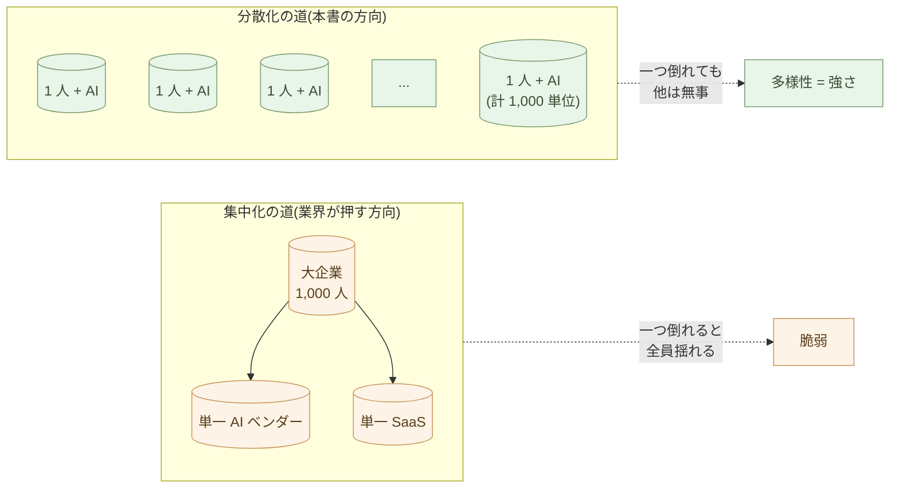

# 1人+AIで作る、新しい仕事の単位

AI ネイティブな道具を揃えた人間は、何ができるか。

この章は、シリーズ全体の総まとめだ。**仕事の最小単位が変わる**。これまで 10 人の組織が必要だった仕事を、1 人 + Claude が完結させる。これが起きると、組織の構造が根本から変わる。

## 1 人 + AI で何ができるか

序章から第 10 章までで身につけた道具を並べ直す。

- **Markdown** で文書を書く
- **JSON / CSV / YAML** でデータを持つ
- **Mermaid** で図を残す
- **Python** で処理を書く(Claude が書く)
- **Office** から離れる(変換層として残す)
- **業務システム** は壊さず、境界の外で動く
- **Web** は HTML+CSS+JS で十分
- **アプリ** は CLI から、必要に応じて Flet / Flutter
- **組み込み** は Python で考えて C に翻訳
- **判断の責任** は人間が持つ

これらすべてを、1 人が、Claude を横に置いて使える。何が起きるか。

これまで「専門家チーム」が必要だった作業が、1 人で完結する。

## 具体例: 個人事業主の月次

例えば、個人事業主 A さん。

A さんは、コンサルティング業務をやっている。月末に何が起きるか。

**請求書作成**: Claude が顧客マスタ(CSV)を読んで、各顧客への請求書 PDF を生成する。経理担当は要らない。

**経費精算**: 領収書の写真を Claude に渡せば、テキスト化して仕分けし、CSV に整理する。経理担当は要らない。

**月次報告**: 売上データと経費データから、Claude が Markdown で月次レポートを作る。会計士は税務申告のときだけ呼ぶ。

**契約書作成**: 新規顧客との契約書を Claude が下書きする。修正点は法律事務所に相談するが、それは年に数回。

**マーケティング**: ブログ記事を書く、SNS 投稿を作る、メールマガジンを送る ── すべて Claude が下書きを作る。

**Web サイト更新**: 静的 HTML で動いているので、Markdown を書いて Python ビルドを走らせれば更新完了。

これが、A さん一人で完結する。10 年前なら、経理担当・マーケティング担当・Web 制作会社・印刷会社、合わせて数人〜十数人が関わっていた仕事だ。

## 具体例: 農家の AI

別の例。農家 B さん。

**気象データ**: 過去 10 年の気温・降水量データを Python で読んで、Claude に「今年の作付けに使える時期はいつか」と聞く。

**畑の記録**: スマホで撮った写真を Claude に渡せば、Markdown で日記化。「キャベツの葉に黒い斑点」と Claude が認識して、過去の対応履歴を参照して提案。

**販売管理**: 直販の注文を Markdown で記録、Claude が請求書 PDF を生成、配送伝票も生成。

**情報発信**: 畑の様子をブログで発信、Claude が下書き。SNS 投稿も Claude が下書き。多言語化(英語、中国語)も Claude。

**学習**: Christine Jones 博士の論文を Claude が要約、自分の畑への適用を Claude と議論。

これも一人で完結する。**農家が研究者になる**。

## 具体例: 1 人スタートアップ

別の例。プログラマ C さん、1 人スタートアップを始めようとしている。

**プロダクト開発**: Web サービスを HTML+CSS+JS で作る。バックエンドは Python(FastAPI)。Claude がほぼ全コードを書く。C さんは設計判断とレビュー。

**デザイン**: Claude に「シンプルで読みやすいデザイン」と頼んで CSS を書かせる。フィードバックして調整。

**ドキュメント**: ヘルプページ、利用規約、プライバシーポリシーを Markdown で書く。Claude が下書き、C さんが確認。

**マーケティング**: ランディングページを書く、SEO 文章を書く、英語版も作る。Claude。

**サポート**: 問い合わせメールに対する返信を Claude が下書き。C さんが確認して送信。

**経理**: 小規模なので freee や Money Forward を使うが、データの整理と分析は Claude。

**法務**: 契約書のドラフトを Claude が書く。重要なものだけ弁護士に確認。

C さんは「プロダクトを設計する」「重要な判断をする」「顧客と直接話す」── ここに集中する。残りは AI に渡す。

これが新しいスタートアップの形だ。10 年前なら、共同創業者が 3〜5 人必要だった。今は 1 人で始められる。

## 組織は無くならない、構造が変わる

「組織は要らなくなるのか」と聞かれたら、答えは違う。

組織は要る。**しかし、組織の最小単位が小さくなる**。

これまで、組織は「複数の専門家を束ねる装置」だった。経理、人事、マーケティング、開発、営業、法務 ── 各分野に専門家が要り、それを統合するために組織が要った。

これからは、組織は「1 人 + AI のユニットを束ねる装置」になる。各ユニットは独立して動ける。組織は調整と方向付けの役割。**人数が少なく、自律的なユニットの集合**。

これは、これまでの「ピラミッド型組織」とはまったく違う形だ。10 人で動いていたチームが、3 人 + 各人が AI で同等以上の出力を出せる。**人件費が下がり、意思決定が速くなる**。

## 集中化 vs 分散化 ── どちらの AI 時代を選ぶか

「1 人 + AI」という単位は、効率化の話だけではない。**AI 時代に二つの
道筋がある**ことの、片方の道だ。

### 集中化の道(業界が押している方向)

- 全員が同じ AI(Microsoft 365 Copilot、ChatGPT Enterprise、Google Workspace AI)
- 全員が同じ SaaS(Salesforce、Slack、Notion)に乗る
- 全員のデータが、ベンダー側のクラウドに集まる
- 判断基準は、ベンダーの AI が学習データから出すもの
- 「楽」「統一感」「サポート簡単」── 短期のメリットは確かに大きい

しかしこの道は、**組織を画一化し、ベンダーへの依存を深め、Mythos 時代の
単一障害点に全員を乗せる**。一つの AI が間違えば、全員が同じ方向に
間違える。データポリシーが変われば、全員のデータが同じ流れに飲まれる。
**多様性が消える**。

### 分散化の道(本書が示す方向)

- **1 人ずつが、自分の道具を持つ**(Markdown / CSV / Python / Claude Code)
- **1 人ずつが、自分のデータを持つ**(ローカルファイル、Git で履歴管理)
- **1 人ずつが、自分の判断を持つ**(AI は提案、決定は人間)
- 業界・職種・地域・文化・気質に応じて、**一人ひとり違う道具立てになる**
- ベンダーへの依存は、必要最小限(Claude を呼ぶ API のみ、いつでも他社に切替可能)

この道は、**短期の効率では集中化に劣る**。学習コストはかかる。統一感は無い。
サポートは自分でやる。

しかし、長期では決定的に強い。**1 人が倒れても、他は動き続ける**。
ベンダーが倒れても、自分のデータと道具は手元にある。文化や産業に
固有の判断が、画一化されずに育つ。**多様性そのものが強さになる**。

### なぜ「1 人 + AI」が分散化なのか

「1 人 + AI が組織を置き換える」と聞くと、効率化の文脈に聞こえるかも
しれない。だが本書の意味はそうではない。

**集中化された 1,000 人組織が 1 つあるより、自立した「1 人 + AI」が
1,000 単位ある方が、社会は強い**。同じ生産性、まったく違う構造。

- 一つの大企業が傾くと、1,000 人の生計が同時に揺れる
- 1,000 人の自立した 1 人 + AI なら、誰か一つが倒れても他は無事

これは Mythos 時代の構造分析(構造分析シリーズ第14章「引き算の設計」、
第15章「Mythos 時代のセキュリティ設計」)と完全に整合する。
**冗長性、分散、多様性 ── これらが Mythos 時代の生存戦略**だ。

> 効率化のための「1 人 + AI」ではない。**自立と多様性のための
> 「1 人 + AI」**だ。それが本書の主張の核心。

## 「働き方」も変わる

1 人 + AI が単位になると、働き方も変わる。

通勤しなくていい(オフィスで隣の人に話しかける必要がない)。フルタイムで働かなくていい(必要な時間だけ)。一つの組織にだけ所属する必要がない(複数の組織と契約する)。

これは「フリーランス」「副業」「複業」が普通になる、ということだ。**AI が自分の事務所を持つことを可能にする**。

組織側も、フルタイム雇用にこだわる必要がなくなる。「この期間、この成果物を出してくれる人」と契約する。終わったら次の人と契約する。組織はプロジェクト単位で動く。

## 何が「人間にしかできない仕事」になるか

ここが本当の核心だ。AI に渡せる仕事を渡したあと、何が残るか。

- **何をするかを決めること**(戦略、方向性)
- **なぜするかを問うこと**(意義、目的)
- **結果をどう判断するかを決めること**(評価、責任)
- **顧客と直接対話して、本当のニーズを引き出すこと**
- **倫理的に難しい問題に決着をつけること**
- **新しい価値を創造すること(初めての設計)**
- **人と人をつなぐこと、信頼を築くこと**
- **身体を使う仕事(畑、料理、医療の処置、職人技)**

これらは、AI には肩代わりできない。

そして、これらは**面白い**。退屈な処理仕事ではなく、本来の仕事だ。AI ネイティブな道具を使うことで、人間は本来の仕事に時間を使えるようになる。

> 情報の処理は、AI でもやれる簡単な仕事になる。人間に残るのは、何をするか、なぜするか、結果をどう判断するかを決めることだけだ。

序章で書いたこの一文が、ここで完結する。

## いつから始めるか

「いつから AI ネイティブな働き方に切り替えるか」と聞かれたら、答えは「**今日**」だ。

明日からでない。来月からでない。今日、今すぐ。

最初の一歩は何でもいい。

- 次に書くメモを Word ではなく Markdown で書く
- 次に作る表を Excel ではなく CSV で書く
- 次に書く図を PowerPoint ではなく Mermaid で書く
- 次に頼みたい処理を、Claude に Python で書いてもらう
- 次に来た Word ファイルを Claude に渡して Markdown にしてもらう

一歩ずつ。**全部一気に変えなくていい**。一歩進めば、二歩目が見える。

## 実例: 数字で見る

コンサル業の運営コスト:

- **2025 年(5 人体制)**: 経理担当 + マーケ + Web 制作 + アシスタント + 代表 = 月額人件費 **約 200 万円**
- **2026 年(1 人 + AI)**: 代表 + Claude Pro($20)+ AI API $50 = 月額 **約 1.5 万円**
- **約 130 分の 1**(同じ売上を維持)

スタートアップの初期チーム構成:

- **2020 年**: CTO + フロントエンド + バックエンド + デザイナー + マーケ = 5 人 + 給与 + ストックオプション
- **2026 年**: 創業者 1 人 + Claude + 必要に応じて時間契約の専門家 = 給与負担なし、株式希薄化なし

農家の AI 活用:

- 旧来: 気象判定・販売管理・情報発信・経理を別々に外注、年間 **約 50 万円**
- 新: 農家自身が Claude で全部行える、AI 利用料 年間 **約 5 万円**
- **10 分の 1**、しかも自分で全プロセスを把握できる

書類仕事が消える効果: 1 日 8 時間労働のうち、書類処理に費やしていた 4 時間が AI に移る。残った 4 時間で、本来の価値を生む仕事(顧客との対話、戦略判断、創造)に集中できる。**人間にしかできない仕事の密度が 2 倍になる**。

## まとめ

AI ネイティブな道具を揃えると、仕事の最小単位が変わる。

1 人 + AI で、これまで 10 人が必要だった仕事ができる。組織は不要に
ならない。組織の構造が変わる。働き方が変わる。

人間に残るのは、判断、文脈、責任、創造、対話、信頼、身体性 ──
これは本来の仕事だ。**AI に処理を渡して、人間は本来の仕事に戻る**。

そしてもう一つ。これは効率化の話ではない。**個人の自立と、社会の
多様性のための作法**だ。集中化された AI に全員が乗る道もある ──
業界はその方向を押している ── が、本書はその逆を選ぶ。1 人ずつが
自分の道具・自分のデータ・自分の判断を持ち、それぞれ固有の文脈で
固有の判断を育てる。**多様性そのものが Mythos 時代の強さになる**。

これが、「AIネイティブな仕事の作法」シリーズの結論だ。

序章から第 11 章まで、お付き合いいただきありがとうございました。明日から ── いや、今日から ── 一歩を踏み出してみてください。

aiseed.dev は、これからも AI ネイティブな働き方の実践を発信していきます。

---

## 関連記事

- [序章: 事務処理はOffice、業務ソフトはJava/C#、しかしAIはPythonとテキスト](/ai-native-ways/prologue/)
- [第10章: AIに任せる仕事を見極める](/ai-native-ways/ai-delegation/)
- [構造分析08: 企業ITの税を引く](/insights/enterprise-tax/)
- [構造分析12: AIと個人事業](/insights/ai-and-individual/)
- [構造分析14: 引き算の設計](/insights/subtraction-design/)
