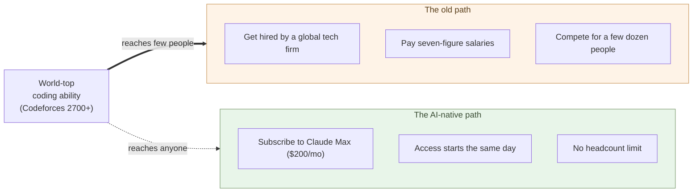

# AI Solves the World's Hardest Coding Problems

**Start with one fact — AI now sits on the side of the table that solves
the world's hardest coding problems**.

The parent series' prologue made the case that AI's native tongue is
Python and Markdown-shaped text. This sub-series goes one step further —
not the question of language, but the question of **capability level**.
Once AI's code crosses a certain threshold, the structure of software
development itself rearranges. This chapter establishes where that
threshold sits.

## Competitive-programming rating as a yardstick

There is exactly one mechanism in the world that **assigns objective
numbers to coding ability**: the public ratings of competitive
programming. Codeforces, AtCoder, ICPC — all of them accumulate, over
years, whether you can solve set problems in time, how many you solve,
and how correct your solutions are. Each participant ends up with a
number.

Codeforces rating bands distribute roughly like this:

| Band | Title | Participant position |
|---|---|---|
| Below 1200 | Newbie | Beginner |
| 1600–1899 | Expert | Top ~10% |
| 2100–2399 | Master | Top few percent |
| **2400–2599** | **International Grandmaster** | **~Top 1%** |
| **2600 and above** | **Legendary Grandmaster** | **A few dozen worldwide** |

The numbers have **threshold steps** baked in. The gap between 1500 and
1800 closes with study. **The gap between 2400 and 2700 does not close
with study alone** — past that point you need speed, algorithmic design,
a nose for the hardest problems. The world's top sits between roughly
2700 and 3900, and contains around fifty people.

> This is the one place in the world where coding ability is compared by
> number. And here, the bands you can reach by study and the bands you
> cannot are clearly separated.

## AI has reached the 2700 tier

Through late 2024 and into 2025, the situation changed. OpenAI's
publicly reported estimated Codeforces rating for the o3-series models
came in at **around 2727** (announced at the o3 launch). Google
DeepMind's AlphaCode 2, a step before, demonstrated top-15% Codeforces
performance, and later research models have pushed further. Anthropic
has reported continuous improvement in coding ability for the Claude
family.

There is room to argue about the numbers and how they are measured, but
**the fact that AI has entered the 2700 tier** is now confirmed by
multiple independent announcements moving in the same direction. This
is not "useful assistant now"; it is **"sitting on the side that solves
the hardest problems."**

What made this achievement structurally possible is that competitive
programming is **a domain where the rules are explicit and correctness
is verifiable**. Grammar, the standard library, and the type system
are formally defined; whether code compiles and whether the output
matches expected values is checkable mechanically. AI reaches
superhuman levels in domains **where the rules are explicit and the
answer can be checked**. The claim "coders go away" in this sub-series
applies specifically to domains with both properties — the reach of
"complete replacement" does not extend at the same speed to other AI
applications (desk work, self-driving, robotics, etc.; this boundary
is treated in 3-07).

What matters is not the rank, but the **structural change of crossing a
threshold**.

- Up to 2400 is "a strong specialist can reach this with enough drill."
- 2700 is "fewer than a few dozen people in the world."
- AI entered that tier **via a different path** than the one human
  competitors climb.

For a human to reach this band requires thousands of hours of practice
starting young, and then passing a talent filter on top. AI got there
**without taking that path**. The earlier objection — "but the training
data contained the same problems" — no longer holds; Codeforces runs
live contests with **fresh problems**, and AI models have repeatedly
been observed returning 2700-tier solutions there.

> A band humans reach **one person at a time, over a decade-plus**, was
> entered by AI **all at once, by multiple paths**.

## From code to design — AI became the strongest SIer

Reaching the 2700 tier proves the ability to write code fast and
correctly — **coding**. But **design is a different ability from
coding**, and its core is **understanding context**: reading the target
system or situation, grasping what it needs, and assembling a structure
that fits. Writing fast and correctly is not the same as understanding
context and deciding structure. So design ability needs its own evidence.

That evidence came from an unexpected place. In the Fable / Mythos
generation, a publicly reported case had an attacker misuse Claude to
**run most of the operational steps of a cyberattack autonomously**
(Anthropic reported it in 2025 as an automated cyber-espionage
campaign). Driving an attack yourself takes scouting the target system,
reading its weaknesses, and assembling the line of attack — that is,
**understanding the target's context deeply**. That is the same ability
as designing a system.

And the same ability is the ability to **verify**. To attack is to find
the hole and strike it; to verify is to find the hole and close it —
both are expressions of one power, "understanding the structure more
deeply than its builder." **Attack, design, and verification are not
separate abilities but three faces of one power.** That is exactly why
an AI that can attack can design and verify too.

So AI has reached the top tier in **two separate abilities** — writing
code (the 2700 tier) and understanding context to decide structure, i.e.
design and verification (the autonomous attack). **AI has begun to exceed
senior engineers at both coding and design.** With both in hand, the conclusion is one:
**in the Mythos/Fable era, AI became the strongest SIer** — reading
requirements, deciding structure, implementing, and running it, the whole
of the SIer's work, done by one. And not as a scarce resource of a few
dozen people worldwide, but callable by anyone for $200 a month.

> The 2700 tier proved "the strongest coder"; autonomously assembling
> an attack proves "it can design and verify too" — exceeding senior
> engineers at both coding and design, **AI became the strongest SIer**.

## $200 a month buys access to the world's top

This is where the sub-series' argument starts.

The paths to access top-tier coding ability used to be narrow — be
hired by Google, Meta, or Anthropic; spend years climbing the
competitive-programming ladder; or pay seven-figure salaries.
**Capability above the threshold was a scarce resource**. Palantir's
FDE (Forward Deployed Engineer) model — embedding top-tier engineers
inside the customer's organization on year-long, eight-figure contracts
— is the extreme upper end of that legacy path (mechanics covered in
detail in 3-04).

Access to AI models comes in tiers, depending on how hard you intend
to use them.

- **Chat-grade use** — Claude Pro / ChatGPT Plus / Google AI Pro at
  around $20 a month. **Not enough for serious coding**, though — you
  run into usage limits, context length, or model selection before
  long.
- **Coding-grade use** — **Claude Max ($200 a month)** is the current
  standard anchor. It lets Claude Code, Cursor, and IDE integrations
  call Sonnet and Opus at production volumes; a builder can have AI
  writing code for eight hours a day without hitting the wall.
- API pay-as-you-go — wiring the same usage through the API directly
  lands in the same few-hundred-dollars-a-month range. The Max
  subscription is essentially that invoice averaged out.

In other words, **the world's top-tier coding ability is reachable for
$200 a month**. One credit card and one browser, and you can start the
same day.

This is not "prices dropped." **The very axis of pricing changed**.
Before: scarce capability multiplied by large fixed cost. Now:
comparable capability multiplied by something close to zero marginal
cost. The two are not the same spreadsheet at two prices; they are
**different supply curves**.

> Top-tier coding used to be a **scarce resource of a few dozen people**.
> It is now a **$200-a-month subscription**.

## This is where the IT revolution actually completes

What the facts above describe — top-tier coding ability reaching anyone
for $200 a month — is not just "AI got faster" or "AI got useful." It
is the moment in which **what has long been called the "IT revolution"
finally completes**.

Look at what the term "IT revolution" named, in structural terms.

- Industrial revolution — production of physical goods moved from
  human hands to machines.
- First wave of computing — calculation moved from human hands
  (abacus, human computers) to machines.
- "IT revolution" — business processing moved from paper and pen to
  software.

In the first two, the core of the revolution (mechanization,
automation) reached the object of the revolution fully. **The third
did not**. Software itself was still being written by human hands.
The revolution's tool (software) kept being produced by hand-labor —
which means the revolution's core had not yet reached the production
of its own tool. What was called the "IT revolution" was, in fact, an
**incomplete form of revolution**.

The industrial-revolution parallel: the power loom exists, but the
loom's own parts are still hammered out by hand at the blacksmith's.
The revolution's loop does not close **until production of the tool
itself is mechanized**.

Now that AI carries both code and design, the loop finally closes.
**The act of producing software is itself taken over by machines**.
The revolution's tool is built by the revolution's own process. That
is what "the IT revolution actually completing" means.

> The decades called "the IT revolution" were a revolution that
> **mechanized business using software**.
> What is happening now is **the revolution that mechanizes the
> production of that software itself** — the revolution's core
> finally reaching the revolution's own tool.

With that frame, the changes this sub-series covers — the coder role
ending, the structural uneconomy of the SIer model, the rearrangement
of employment and industry —
read not as isolated phenomena but as **a long-delayed revolution
finishing the work it had left incomplete**.

## Everything else in this sub-series follows from one fact

Every chapter that follows is **deduced** from this one fact.

- 1-02 — once the coding itself becomes cheap, where does the
  **unit of maintenance** move?
- 1-03 — what happens to roles whose center is "writing code"
  (coders)?
- 1-04 — what role takes their place (the builder)?
- 1-05 — when customers themselves pair with AI, what happens to
  the structure of outsourcing?
- 2-01–2-11 — if customers hold it themselves, how do they stand up
  **the whole company IT foundation** — authentication, documents,
  mail, core systems — on their own side (the autonomy part)?
- 3-03 — can the SIer commission model compete with **AI sitting
  above the threshold**?
- 3-04 — where do existing commission relationships act as
  **lock-in**?
- 3-05–3-07 — hiring builders, the transition of the SIer
  industry, the near-term horizon over which the transition arrives
  and why it does not reverse.

These are not independent observations. They all derive from one point:
**the strongest SIer is available for $200 a month**. This chapter
exists only to plant that point.

And it does not stop at "writing code." Once customers can hold it
themselves, the whole company IT foundation — authentication, documents,
mail, core systems — comes to stand on their own side. This sub-series
runs continuously from software development to **company-wide digital
sovereignty** (the autonomy part).

One more frame for what follows. This sub-series covers **structural
change inside software development**. It does not entertain the extreme
positions — "leave everything to AI, humans aren't needed" or "AI has
no creativity, so the impact is bounded." The practical question, the
one this sub-series answers chapter by chapter, is: **once AI above the
threshold has been in the market for some years, how do the commissions,
the outsourcing, the employment, and the prices of software development
rearrange?**

> Compressed to one line, this is the sub-series:
> **if the strongest SIer costs $200 a month, the outsourcing-centered
> structure of software development can no longer hold**.

And one more thread — if AI carries both coding and design, what remains
on the human side is the broad work of building and operating a system —
hardware, people, operations, responsibility. **Its foundation is closer
to the liberal arts than to software engineering**.
This thread runs through the whole sub-series; 1-04 names it
directly.

The next chapter takes up what is, structurally, the most overlooked
consequence of cheap coding — the shift in the unit of maintenance.

---

## Related articles

- [1-04: The Builder Role](/en/ai-native-ways/software/builder/)
- [3-07: The Structural Transition That Won't Reverse](/en/ai-native-ways/software/five-years/)
- [Prologue: AI's Native Tongue Is Python and Markdown-Shaped Text](/en/ai-native-ways/prologue/)
- [Structural analysis 08: Subtracting the enterprise-IT tax](/en/insights/enterprise-tax/)
- [Structural analysis 12: AI and the sole proprietor](/en/insights/ai-and-individual/)
