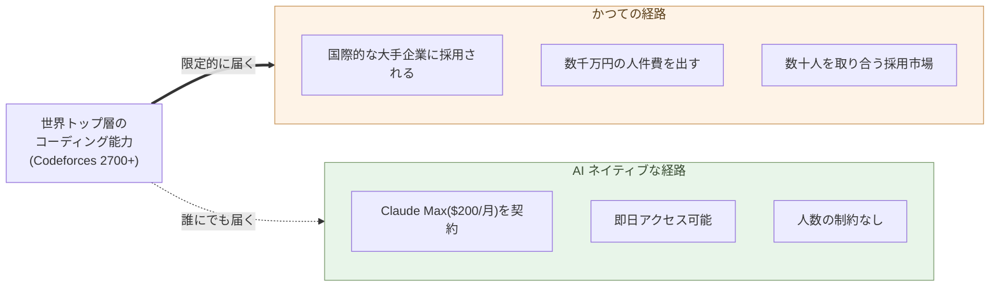

# AIがコードを書く能力で人間トップクラスに到達した

**まず一つの事実から始める ── AI は、世界で最も難しいコーディング
問題を解く側に立った**。

親シリーズの序章で、AI の母国語が Python と Markdown 形式のテキストで
あることを示した。本サブシリーズはその一歩先を扱う ── 母国語の話では
なく、**能力の水準** の話だ。AI が書くコードの水準が、ある閾値を超えた
ところから、ソフトウェア開発の構造そのものが組み替えられる。本章は
その閾値を示すための章である。

## 競技プログラミングのレーティングという物差し

コードを書く能力を**客観的な数値で比較する**仕組みは、世界に一つだけ
ある ── 競技プログラミングの公開レーティングだ。Codeforces、AtCoder、
ICPC ── どれも、出題された問題を制限時間内に解けるか、何問解けるか、
解の正しさはどうかを長期間蓄積して、参加者ごとに数値を付ける。

Codeforces のレーティングは概ねこう分布する:

| 帯 | 称号 | 参加者の位置 |
|---|---|---|
| 1200 未満 | Newbie | 入門者 |
| 1600–1899 | Expert | 上位 10% 前後 |
| 2100–2399 | Master | 上位数% |
| **2400–2599** | **International Grandmaster** | **上位 1% 程度** |
| **2600 以上** | **Legendary Grandmaster** | **世界で数十人** |

数字には**意味の段差**がある。1500 と 1800 の差は、勉強した量で埋まる。
**2400 と 2700 の差は、勉強だけでは埋まらない** ── そこから先は、
「速さ」「設計力」「最難問題への嗅覚」が要る世界だ。世界の最上層は
だいたい 2700 〜 3900 のあいだに分布し、上位 50 人ほどしかいない。

> 数字でコードを書く能力を比較できる場所は、世界にここしかない。
> そして、ここでは**勉強で届く帯と、届かない帯**がはっきり分かれる。

## AI は 2700 帯に到達した

2024 年末から 2025 年にかけて、状況が変わった。OpenAI が公表した
o3 系モデルの Codeforces 推定レーティングは **約 2727**(o3 リリース
時点での公式発表)。Google DeepMind の AlphaCode 2 はその前段階で
Codeforces 上位 15% 水準を示し、後続の研究系モデルはさらに上を更新
している。Anthropic も Claude 系モデルでコーディング能力の継続的な
向上を示している。

数値の出どころや測り方には議論の余地があるが、**「2700 帯に AI が到達
した」という事実そのもの**は、複数の独立した発表で重なる方向に動いて
いる。これは「役に立つ補助になった」ではない。**「最も難しい問題を
解く側にいる」** ということだ。

ここで重要なのは順位ではなく、**閾値を超えたという構造変化**だ。

- 2400 までは「上位の専門家が、特訓を積めば届く」帯だった
- 2700 は「世界で数十人しかいない」帯だ
- AI はその帯に、**人間が一人ずつ達するのと別の経路で**入ってきた

人間がこの帯に到達するには、若いうちから数千時間の演習を積み、その
うえで才能のフィルタを通る必要がある。AI は**この経路を通らずに**
同じ帯に入った。「学習データに同じ問題が入っていた」という反論は
かつてはあった ── が、Codeforces はライブ大会で**新規問題**を出し
続けており、AI モデルがそこでも 2700 帯の解を返すことが繰り返し
確認されている。

> 人間が**一人ずつ十数年かけて**届く帯に、AI は**一気に、複数の経路で**
> 入ってきた。

## 月 3 万円で、世界の最上層が手元に来る

ここからが、本サブシリーズの議論の出発点になる。

世界の最上層のコーディング能力にアクセスする方法は、これまで限られて
いた ── Google や Meta や Anthropic に採用される、競技プログラマー
として何年もかけて上り詰める、あるいは年収数千万円〜億単位で雇う。
**閾値を超えた能力は、希少資源だった**。

AI モデルへのアクセスには、用途による段がある。

- **チャット中心の利用** ── Claude Pro / ChatGPT Plus / Google AI Pro
  などの基本プラン ── 月額 20 ドル前後。ただし**本格的にコーディング
  するには足りない** ── 利用上限・コンテキスト長・モデルの選択肢の
  どこかでぶつかる。
- **本格的にコーディングする利用** ── **Claude Max($200/月、約 3 万円)**
  が現状の標準アンカーになる。Claude Code / Cursor / IDE 拡張から
  Sonnet・Opus を実務量で呼び続けられる帯で、1 日 8 時間 AI に
  コードを書かせ続けても枯れない。
- API 従量課金 ── 同等の使い方を API 直で組むなら、月数百ドル前後に
  収束する。Max の月額契約がほぼその請求書を平準化したもの。

つまり、**世界の最上層のコーディング能力に、月 3 万円で接続できる**。
クレジットカード一枚と、ブラウザ一つあれば、その日のうちに始められる。

これは「価格が下がった」という話ではない。**価格構造そのものの軸が
変わった**。かつては「希少な能力 × 大きい固定費」だった。今は
「同等の能力 × 限界費用ゼロに近い」。同じ表計算を二つの構造で
比較しているのではなく、**まったく違う供給曲線の話**である。

> かつてコーディングの最上層は **数十人の希少資源** だった。
> いまは **月 3 万円のサブスク** だ。

## 一つの事実から、シリーズが組み立つ

本サブシリーズの後続章はすべて、この事実から**演繹的に**導かれる:

- 第2章 ── コーディングそのものが安くなったとき、**保守の単位**
  はどこに移るか
- 第3章 ── 「コードを書く」を仕事の中心に置く役割(コーダー)は
  どうなるか
- 第4章 ── 代わりに何が役割として残るか(ビルダー)
- 第5章 ── 顧客自身が AI と組むようになると、外注の構造はどうなるか
- 第6章 ── SIer の委託モデルは、**閾値の上にいる AI** と競争できるか
- 第7章 ── 価格構造が違う相手と競争すると、どれだけの差になるか
- 第8章 ── 既存の委託関係は、どこで**ロックイン**として機能するか
- 第9章〜第11章 ── ビルダーの雇用、SIer 業界の転換、転換が完了する
  時間軸

これらの問いは、それぞれ独立した観察ではない。**最上層のコーディング
能力が、月 3 万円で手に入る**という一点から、すべてが派生する。
本章はその一点を据えるためだけにある。

ここから先の議論には、もう一つ前提を置く ── 本書はソフトウェア開発
**の中の構造変化**を扱う。「AI に全部任せれば人間は要らない」とか、
逆に「AI には創造性が無いから影響は限定的」とか、そうした極端な議論
は扱わない。**閾値を超えた AI が市場に入って何年か経過したら、
ソフトウェア開発の発注・委託・雇用・価格はどう組み替わるか** ──
この実務的な問いに、章を追って答える。

> 一行に圧縮すれば、本サブシリーズはこうだ。
> **最上層のコーディングが月 3 万円なら、外注を中心に組まれた
> ソフトウェア開発の構造は、もう保てない**。

次の章では、コーディング能力が安価になったことの**最も見落とされ
やすい帰結** ── 保守フェーズの構造変化 ── を扱う。

---

## 関連記事

- [序章: AIの母国語は、PythonとMarkdown形式のテキスト](/ai-native-ways/prologue/)
- [第11章: AIで物語を検証する](/ai-native-ways/verify-narratives/)
- [構造分析08: 企業ITの税を引く](/insights/enterprise-tax/)
- [構造分析12: AIと個人事業](/insights/ai-and-individual/)
