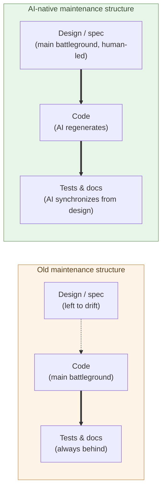

# Maintenance-Phase Shift Is the Real Story

**Faster coding is the tip of the iceberg. The bigger thing happening
below the waterline is a structural shift in the maintenance phase
itself**.

Chapter 1 established the fact that top-tier coding ability is reachable
for $200 a month on Claude Max. The first consequence to derive from
that fact is not the widely-cited "coding gets faster" — it is that
**the structure of maintenance is rearranged**. This chapter looks at
that rearrangement.

In a software system's lifetime, coding is the first few months. The
remaining seven to fifteen years are maintenance. For enterprise
systems, 60–80% of TCO lands in the maintenance phase — a fact known
for half a century. What this chapter takes up is what changes when AI
enters that picture.

## Cheaper coding is the tip of the iceberg

The usual headline about AI is "code gets written faster." That is
true, but it is **the tip**. The submerged body looks like this:

- Reading legacy code — typically half a day to several days
- Deciding how to change behavior without breaking other things —
  several days
- Tests catching up — usually deferred
- Documentation catching up — usually drifts permanently
- Spec becoming tacit knowledge — unrecoverable once people leave
- Technical debt accumulating — slowly, year on year, reliably

The dominant cost of software development is not **writing**, but
**after writing**. This has been the well-known reality since Brooks'
*The Mythical Man-Month*, fifty years ago. Anyone who reads the AI
shift as "writing got faster" is talking about **the non-dominant
cost**.

> "Coding got faster" is the entry-point story for AI.
> The exit-point story is that **the structure of the maintenance
> phase itself** is changing.

## The unit of maintenance moves from code to design and spec

This is the central claim of the chapter.

In the old structure, the **unit** of maintenance was code. A bug
appears → read the code → change the code → update tests for the code
→ update docs about the code. Every step revolves around code. Design
and spec, once written, are left to drift between code and reality.

When AI enters, the loop changes. AI takes over the reading and writing
of code. **What humans touch is now design and spec**:

- A bug appears → a human judges **where the spec has a hole**
- AI is asked to fix it → code is a generated artifact
- AI regenerates tests and docs **from the design**
- Update the design → code, tests, and docs all follow

The **main battleground** of maintenance moves from code to design and
spec. That is the structural shift.

> The unit of maintenance moves from code to design.
> When that happens, the **explicitness** of design and spec is what
> sets a system's life expectancy.

## The cost of reading legacy code evaporates

The single largest cost inside maintenance was **reading existing
code**. To absorb a 200,000-line business system, including the
intentions of a predecessor who has left — that is a several-week task
for a new joiner, and even then the recovery is never 100%.

Hand it to AI and the work finishes in seconds. Concretely:

- The call graph for a function — extracted in seconds
- The write paths into a particular DB column — traced in tens of
  seconds
- Why a particular branch exists — inferred when you let the model
  read it alongside the commit history
- Similar logic in another file — found across the entire repository
  in tens of seconds

This is not "faster." **The largest cost in maintenance has been
removed**.

Try it in practice: on a roughly 10,000-line legacy Java codebase, the
task "trace the data flow for a given feature" takes a new joiner half
a day; Claude Code returns equivalent output in 30 seconds. The gap is
not one or two orders of magnitude — it is three-plus.

In the old world, "we can't touch this" was what kept aging systems
running far past their design life: the cost of rewriting was dominated
by the cost of reading. Once that disappears, **"untouchable" becomes
"touchable."** A business system that has been running for 20 years
can take a change from a new joiner the day they arrive.

## Tests and documentation become synchronized derivatives

In the old world, tests and docs were "once written, never followed
through":

- Maintaining 60% test coverage required a dedicated owner over time
- Documentation, after initial writing, would almost certainly drift
- "The code itself is the source of truth" was the de-facto reality

When AI enters, tests and docs become **derivatives that the system
regenerates from the design automatically**:

- Change the design → AI lists the affected scope → AI updates the
  affected tests
- Change the code → AI regenerates documentation from the diff
- At review time, code, tests, and docs are **always at the same
  generation**

This removes the chronic maintenance disease of "no time to write
tests" and "the docs are out of date." This holds only when AI is
**built into the maintenance pipeline**; if you keep the old workflow
and merely ask AI to help, the same symptoms come back. Pipeline
design is treated in Chapter 4 as part of the builder's role.

## All of this collapses the moment design leadership leaves the human

The structural shift above is **conditional**. The condition is one:
**a human stays in charge of design**.

Drop that condition and the structure collapses in the opposite
direction. What happens if you ask AI to "add a feature" and accept
the output as it comes, repeatedly:

- Locally working changes break the integrity of the design
- The same concept appears in different shapes in different places
- Abstraction layers multiply and never get consolidated
- AI itself, when it returns to read, can no longer tell what the
  primary intent is
- Within a few months, **the codebase becomes unmaintainable by
  humans or AI**

This failure mode is called "vibe coding." It is the biggest trap of
AI-native development — the **negative side** of cheaper coding shows
up here in full. The faster AI writes, the faster the debt of a
design-less project piles up.

**The responsibility of the side holding the design grows, not
shrinks**. The volume of writing drops; the density of decisions rises.
What to build, how to split it, which invariants must hold — humans
must decide these explicitly and hand them to AI. That is the shape of
the new maintenance work.

> A human in charge of design, plus AI = maintenance cost collapses.
> A human not in charge of design, plus AI = unmaintainable code is
> mass-produced.

The dividing line is **not the ability to write code, but the ability
to decide the design**. Chapters 3 and 4 elaborate this as the
difference between the "coder" and the "builder" roles.

## Where the next chapter goes

Once the capability threshold for coding is removed and the main
battleground of maintenance moves to design and spec, the next
unavoidable question is: **what happens to the role whose center is
"writing code"?**

The next chapter takes up the coder as a role.

---

## Related articles

- [Chapter 1: AI Has Reached Human-Top-Class Capability in Writing Code](/en/ai-native-ways/software/coder-top/)
- [Prologue: AI's Native Tongue Is Python and Markdown-Shaped Text](/en/ai-native-ways/prologue/)
- [Structural analysis 08: Subtracting the enterprise-IT tax](/en/insights/enterprise-tax/)
