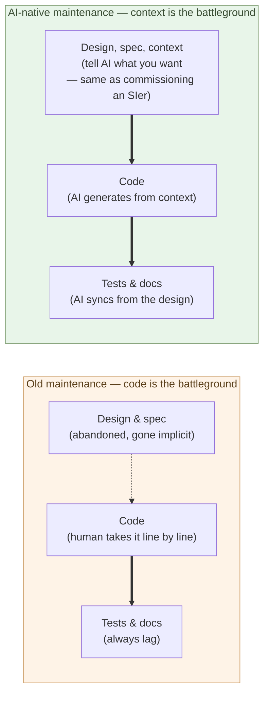

# Maintenance-Phase Shift Is the Real Story

**The story that coding got faster is the tip of the iceberg — what is
happening below the waterline is a structural change in the maintenance
phase itself**.

Chapter 1 established that AI became the strongest SIer — it does not
only write code; it understands context and designs. The first
consequence to derive from that is not the often-told "coding gets
faster." It is that **the structure of maintenance rearranges**. This
chapter looks at that rearrangement.

In the life of software, coding is only the first few months. The
remaining 7 to 15 years are maintenance. In enterprise systems, 60–80%
of TCO lands in the maintenance phase — a fact known for half a century.

## First, look at maintenance today — everything turns around code

What gets talked about with AI is "code gets written faster." That is
true, but only the **tip of the iceberg**. The dominant cost of software
development is not in **writing** but in **after writing** — known for
fifty years, since Brooks' *The Mythical Man-Month*. The body hidden
below the surface is this:

- Reading legacy code — usually half a day to several days
- Fixing without breaking existing behavior — days
- Keeping tests in sync — gets deferred
- Keeping docs in sync — usually left to drift
- Spec going implicit — unrecoverable once the people are gone
- Technical-debt accumulation — slowly, surely, every year

Traditionally, the **unit** of maintenance was code. A bug appears →
read the code → fix the code → write the test → fix the docs. Everything
turns around code. The single largest cost among these is **reading
existing code**: decoding a 200,000-line business system together with
the intent of a predecessor who has left — weeks for a newcomer, and
never recoverable 100%. Being unable to **touch** the legacy is what
forced whole systems to be kept alive on life support — because most of
the cost of rewriting was the cost of reading.

Why does everything turn around code in the first place? Because **the
design document could not keep up with reality**. The customer cannot put
every fine-grained request into words for the SIer — they only realize
"this should be like that" once they see something running. And the SIer,
for whom updating the design document on every change is a chore, **fixes
the code, not the document**. So the design document is left un-updated,
and **the only artifact that keeps up with reality is the code**. The
common sense that "reading the code is the primary source" was born right
here.

And this common sense breeds "vibe coding." If code is the primary
source, the mindset becomes **as long as you can write code, you are
done** — if it runs, if it produces output, it counts. But this is
**meaningless**. Code with no design, no spec, no context behind it —
even when it runs — leaves no one, not the author, not the next reader,
able to say what it does or why. What piles up is a heap of code no one
can read, fix, or trust. Being able to write code is, in itself, worth
almost nothing.

> "Coding got faster" is the story at the entrance to AI.
> The story at the exit is that **the structure of the maintenance phase
> itself** changes.

## AI understands context — so maintaining at the code level stops being necessary

Here is where Chapter 1's point bites. The core of design is
**understanding context**, and AI has reached it. AI can read the
context of a whole system — its structure, intent, and history.

And the context it understands, AI can render into **two forms** — a
**manual for humans** (how to use and operate it) and a **design document
for machines** (the structure and spec that AI itself reads to generate
code). The design document that humans, finding it tedious, stopped
updating and let die — AI now writes and keeps, from the context. Humans
read the manual; the machine (AI) reads the design document and generates
and regenerates the code.

From here follows a large consequence. **Anyone who can understand the
manual and fit it to their reality can do both development and
maintenance.** No need to read code, no need to write it — and no
difficult decisions to make. You read the manual and fit it to your own
reality, and that is all. A coding background stops being a prerequisite
(Chapter 5 develops this as "the customer builds it themselves").

The checking side is the same. **Reviewing the design document and
auditing the code for security are within reach of Mythos/Fable-class
AI** — the ability to assemble the structure of an attack (Chapter 1) is,
flipped over, the ability to find and close the weaknesses. And that level
**exceeds the major SIers**. There is no longer a reason to outsource
review or security checks (the structure by which commissioning itself
stops holding is taken up in the Shift part).

First, **reading**, the largest cost of maintenance, vanishes. "Trace
the data flow of a feature" in a 10,000-line legacy Java base — half a
day for a newcomer — AI returns in 30 seconds. Call graphs, the path by
which a column is written to the DB, why a given branch exists (with the
commit history) — it reads them all in seconds. Not a 1× or 2×
difference; three orders of magnitude or more.

But the essence lies further on. If AI understands context, then **the
maintenance where a human takes on the code itself stops being
necessary**. You just tell AI what you want, in plain words — "change
this to that," "fix this bug." From there, AI traces the context, fixes
the code, and rebuilds the tests and docs to match. It is the same as
asking an SIer to "fix this part."

The **main battleground** of maintenance moves from code to design,
spec, and context. "Cannot touch it" becomes "can touch it" — you can
land a change in a 20-year-old business system the same day. That is the
core of the structural change.

> Old maintenance was work done against code.
> Now that AI understands context, maintenance becomes work done against
> **design, spec, and context** — and the code is generated and
> regenerated from there.

## Tests and docs become resources synced from context

Traditionally, tests and docs were resources that "never followed once
written." Keeping coverage took a dedicated person; docs almost
certainly drifted after the initial write.

Once AI understands context, these become **derivatives regenerated
automatically from the design and spec**. Change the design and the
blast radius surfaces and tests update; docs regenerate from the change;
at review time, code, tests, and docs are **always at the same
generation**. The chronic diseases of maintenance — "no time to write
tests," "the docs are stale" — disappear.

This holds only when AI is **built into the maintenance circuit**. Ask
AI for a piece while keeping the old flow, and the same symptoms
reproduce. Designing that circuit is taken up in Chapter 4 as the
builder's role.

## Where the next chapter goes

Maintaining at the code level stops being necessary, and the main
battleground of maintenance moves to design, spec, and context. What
this change points to is: what happens to **the role whose center is
writing code itself**? The next chapter takes up the coder role itself.

---

## Related articles

- [Chapter 1: AI Solves the World's Hardest Coding Problems](/en/ai-native-ways/software/coder-top/)
- [Chapter 3: AI Now Does the Coder's Work](/en/ai-native-ways/software/coder-end/)
- [Chapter 4: The Builder Role](/en/ai-native-ways/software/builder/)
- [Prologue: AI's Native Tongue Is Python and Markdown-Shaped Text](/en/ai-native-ways/prologue/)
- [Structural analysis 08: Subtracting the enterprise-IT tax](/en/insights/enterprise-tax/)
