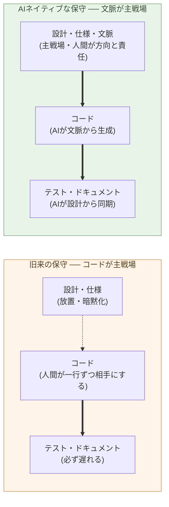

# 保守フェーズの構造変化こそ本質

**コーディングが速くなった話は、氷山の一角だ ── 水面下で起きている
のは、保守フェーズそのものの構造変化である**。

第1章で、AI が最強の SIer になった ── コードを書くだけでなく、文脈を
理解して設計までする ── という事実を据えた。ここから最初に派生する
帰結は、よく語られる「コーディングが速くなる」ではない。**保守の構造が
組み替わる**ことだ。本章はその組み替えを見る。

ソフトウェアの一生で、コーディングは最初の数ヶ月にすぎない。残りの
7 年〜15 年は保守だ。エンタープライズシステムでは TCO の 6〜8 割が
保守フェーズに落ちる ── 半世紀知られている事実である。

## まず、いまの保守を見る ── すべてがコードの周りで回る

AI の話題でよく取り上げられるのは「コードが速く書ける」だ。これは
事実だが、**氷山の一角**でしかない。ソフトウェア開発の支配的コストは、
**書くこと**ではなく**書いた後**にある ── Brooks の『人月の神話』以来、
50 年知られてきた。水面下に隠れている本体は、これだ:

- レガシーコード読解 ── 普通は半日〜数日
- 既存の挙動を壊さずに直す ── 数日
- テストの追従 ── 後回しになる
- ドキュメントの追従 ── 通常は乖離したまま
- 仕様の暗黙化 ── 関係者がいなくなったら復元不能
- 技術的負債の蓄積 ── 毎年ゆっくり、確実に

旧来、保守の **単位** はコードだった。バグが出る → コードを読む →
コードを直す → テストを書く → ドキュメントを直す。すべてがコードの
周りで回る。中でも最大の単一コストは、**既存コードの読解**だ。20 万行
の業務システムを、退職した前任者の意図ごと読み解く ── 新任者が数週間
かかり、しかも 100% は復元できない。レガシーを「触れない」ことが、
システム全体の延命を強いてきた ── 書き換えコストの大半が、読解コスト
だったからだ。

そもそも、なぜすべてがコードの周りで回るのか。**設計書が、現実に追い
つけなかったから**だ。顧客は、細かい要望を言葉で SIer に伝えきれない
── 動くものを見て初めて「ここはこうしたい」と気づく。SIer の側も、変更
のたびに設計書を直すのは手間なので、**設計書ではなくコードを直す**。
こうして設計書は更新されないまま取り残され、**現実に追いついている資料
はコードだけ**になる。「コードを読むのが一次資料」という常識は、ここ
から生まれた。

そして、この常識が「vibe coding」を生む。コードが一次資料なら、
**コードさえ書ければいい**という発想になる ── 動けばいい、出力さえ
出れば正解だ、と。だが、これでは**まるで意味がない**。設計も仕様も
文脈も持たないコードは、たとえ動いても、何のために何をしているのかが、
書いた本人にも、次に読む者にも分からない。積み上がるのは、読めず・
直せず・信頼できないコードの山だけだ ── コードが書けること自体には、
ほとんど価値がない。

> 「コーディングが速くなった」は、AI 化の入口の話だ。
> 出口の話は、**保守フェーズの構造そのもの**が変わることだ。

## AI は文脈を理解する ── だから、コードでの保守は要らなくなる

ここで第1章の一点が効いてくる。設計の核心は **文脈の理解**であり、AI は
そこに達した。AI は、システム全体の文脈 ── 構造・意図・経緯 ── を読み
解ける。

まず、保守の最大コストだった **読解** が消える。1 万行のレガシー Java で
「ある機能のデータフローを追う」── 新任者なら半日 ── を、AI は 30 秒で
返す。関数の呼び出し関係、ある列が DB に書かれる経路、なぜこの分岐が
あるのか(コミット履歴ごと) ── どれも秒で読み解く。1 桁・2 桁ではなく、
3 桁以上の差だ。

だが、本質はその先にある。AI が文脈を理解するなら、**人間がコードを
一行ずつ相手にする保守 ── 読んで、直して、テストを追従させる ── その
ものが、要らなくなる**。人間が触る単位は、コードから一段上がって、
**設計・仕様・文脈**になる:

- バグが出る → **仕様や文脈のどこに穴があるか**を、AI と一緒に突き止める
- 直す → コードは AI が文脈から生成する
- テストとドキュメントは → AI が設計から再生成する
- 設計・仕様を更新する → コード・テスト・ドキュメントが同時に追従する

保守の **主戦場** が、コードから設計・仕様・文脈へ移る。「触れない」が
「触れる」になる ── 20 年動いてきた業務システムに、その日のうちに変更
を入れられる。これが構造変化の核だ。

> 旧来の保守は、コードを相手にする作業だった。
> AI が文脈を理解するいま、保守は **設計・仕様・文脈** を相手にする作業
> に変わる ── コードは、そこから生成・再生成される。

## テストとドキュメントは、文脈から同期される資源に変わる

旧来、テストとドキュメントは「書いたが最後、追従しない」資源だった。
カバレッジを保つには専任者が要り、ドキュメントは初期執筆後にほぼ確実
に乖離した。

AI が文脈を理解すると、これらは **設計・仕様から自動的に再生成される
派生物**になる。設計を変えれば影響範囲が出てテストが更新され、変更点
からドキュメントが再生成され、レビュー時点でコード・テスト・ドキュメント
が **常に同じ世代** に揃う。「テストを書く時間がない」「ドキュメントが
古い」という保守の慢性疾患が消える。

ただしこれは、AI を **保守の回路に組み込んだ場合**の話だ。旧来のフロー
のまま AI に部分を頼んでも、同じ症状は再生産される。回路の設計は、第4章
でビルダーの役割として扱う。

## 次の章へ

コードでの保守が要らなくなり、保守の主戦場が設計・仕様・文脈へ移る。
この変化が指し示すのは、「**コードを書くこと自体を仕事の中心に置く役割**
は、どうなるか」だ。次の章では、コーダーという役割そのものを扱う。

---

## 関連記事

- [第1章: AI は、世界で最も難しいコーディング問題を解く](/ai-native-ways/software/coder-top/)
- [第3章: コーダーの仕事を AI がするようになる](/ai-native-ways/software/coder-end/)
- [第4章: ビルダーという役割](/ai-native-ways/software/builder/)
- [序章: AIの母国語は、PythonとMarkdown形式のテキスト](/ai-native-ways/prologue/)
- [構造分析08: 企業ITの税を引く](/insights/enterprise-tax/)
