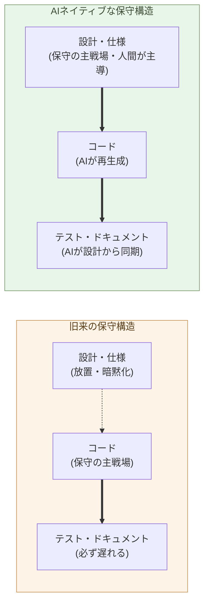

# 保守フェーズの構造変化こそ本質

**コーディングが速くなった話は、氷山の一角だ ── 水面下で起きている
のは、保守フェーズそのものの構造変化である**。

第1章で、Claude Max 月 3 万円で世界最上層のコーディング能力に接続
できる、という事実を据えた。この事実から最初に派生する帰結は、よく
語られる「コーディングが速くなる」ではない。**保守の構造が組み替わる**
ことだ。本章はその組み替えを見る。

ソフトウェアの一生で、コーディングは最初の数ヶ月にすぎない。残りの
7 年〜15 年は保守だ。エンタープライズシステムでは TCO の 6〜8 割が
保守フェーズに落ちる ── 半世紀知られている事実で、ここに AI が
入って何が変わるのか、という話を本章で扱う。

## コーディングコスト低下は氷山の一角だ

AI の話題でよく取り上げられるのは「コードが速く書ける」だ。これは
事実だが、**氷山の一角**でしかない。水面下に隠れている本体は、これだ:

- レガシーコード読解 ── 普通は半日〜数日
- 既存の挙動を壊さずに修正する判断 ── 数日
- テストの追従 ── 後回しになる
- ドキュメントの追従 ── 通常は乖離したまま
- 仕様の暗黙化 ── 関係者がいなくなったら復元不能
- 技術的負債の蓄積 ── 毎年ゆっくり、確実に

ソフトウェア開発の支配的コストは、**書くこと**ではなく**書いた後**に
ある。これは Brooks の『人月の神話』以来、50 年知られてきた。AI に
よる変化を「書くのが速くなった」だけで読む人は、**支配的でないコスト
の話**をしている。

> 「コーディングが速くなった」は、AI 化の入口の話だ。
> 出口の話は、**保守フェーズの構造そのもの**が変わることだ。

## 保守の単位は、コードから設計・仕様に移る

これが本章の中心命題だ。

旧来、保守の **単位** はコードだった。バグが出る → コードを読む →
コードを修正する → コードのテストを書く → コードのドキュメントを
直す。すべての作業がコードの周りで回る。設計や仕様は、最初に書かれた
あとは放置され、コードと現実のあいだで漂流する。

AI が入ると、この回転が変わる。コードの読み書きは AI が肩代わりする。
代わりに、**人間が触る単位は設計と仕様**になる:

- バグが出る → **仕様のどこに穴があるか**を人間が判断
- 修正を AI に書かせる → コードは生成物
- テストとドキュメントは AI が**設計から再生成**
- 設計を更新する → コード・テスト・ドキュメントが同時に追従する

保守の **主戦場** が、コードから設計・仕様に移る。これが構造変化の
核だ。

> 保守の単位が、コードから設計に移る。
> これが起きると、設計・仕様の **明示性** がソフトウェアの寿命を決める。

## レガシーコードの読解コストが消える

保守作業のうち最大の単一コストは、**既存コードの読解**だった。20 万
行の業務システムを、退職した前任者の意図ごと読み解く ── 普通は新任者
が数週間かかる作業で、しかも 100% は復元できない。

AI に渡せば、これが秒で終わる。具体的には:

- 関数の呼び出し関係 ── 数秒で抽出
- ある列が DB に書き込まれる経路 ── 数十秒で逆引き
- なぜこの分岐が入っているのか ── コミット履歴と一緒に読ませて推定
- 似た処理を別ファイルから探す ── 全リポジトリ横断で数十秒

これは「速くなった」ではない。**保守作業の最大コストが、消えた**。

実際にやってみれば、たとえば 1 万行規模のレガシー Java コードベース
で「ある機能のデータフローを追う」作業 ── 新任者なら半日 ── を、
Claude Code に与えると 30 秒で同等の出力を返す。1 桁・2 桁の話では
なく、3 桁以上の差だ。

旧来、レガシーコードを「触れない」ことが、システム全体の延命を
強いていた。書き換えコストの大半が読解コストだったからだ。それが
消えると、**「触れない」が「触れる」になる**。20 年動いてきた業務
システムに、新任者がその日のうちに変更を入れられる。

## テストとドキュメントは、同期される資源に変わる

旧来、テストとドキュメントは「書いたが最後、追従しない」資源だった。

- テストカバレッジ 60% を保つために、専任者が継続的にメンテ
- ドキュメントは初期執筆後、ほぼ確実に乖離
- 「コードを読むのが一次資料」が現実

AI が入ると、テストとドキュメントは **設計から自動的に再生成される
派生物**になる。

- 設計を変える → AI が影響範囲を出す → 影響を受けるテストを更新
- コードを変える → AI が変更点からドキュメントを再生成
- レビュー時点で、コードとテストとドキュメントが **常に同じ世代** に
  揃っている

これにより、**「テストを書く時間がない」「ドキュメントが古い」**と
いう、保守フェーズの慢性疾患が消える。ただし、これは AI を **保守
パイプラインに組み込んだ場合**の話で、保守を旧来のフローのまま AI
に頼んでも同じ症状は再生産される。パイプラインの設計は第4章で
ビルダーの役割として扱う。

## ただし、設計の主導権を失った瞬間に崩れる

ここまでの構造変化は、**条件付き**で成立する。条件は一つ ──
**人間が設計の主導権を握り続けること**。

この条件を外すと、構造は逆向きに崩れる。AI に「機能を足してくれ」と
だけ言って、出てきたコードを取り込み続けると、何が起きるか:

- ローカルには動く修正が、設計の整合性を壊す
- 同じ概念が複数の場所で別の表現になる
- 抽象層が増え続け、整理されない
- AI 自身が次に読むときに、何が一次の意図か分からなくなる
- **数ヶ月で、人間にも AI にも保守不能なコードベース**ができる

これは「vibe coding」と呼ばれる失敗形だ。AI ネイティブな開発の最大
の罠で、コーディングが速くなったことの **負の側面** がすべてここに
出る。AI が速いほど、設計を握っていない開発の負債は速く積み上がる。

**設計を握る側の責任が、むしろ重くなる**。書く量は減るが、判断の
密度は上がる。何を作るか・どう分けるか・どの不変条件を守るかを、
人間が明示的に決めて、AI に渡す ── これが新しい保守作業の形だ。

> 主導権を持つ人間 + AI = 保守コストが激減する。
> 主導権を持たない人間 + AI = 保守不能なコードが量産される。

この境目は、**コードを書く能力ではなく、設計を決める能力**にある。
これは第3章・第4章で「コーダー」と「ビルダー」の役割の違いとして
詳述する。

## 次の章へ

コーディングの能力閾値が外れ、保守の主戦場が設計・仕様に移る。
この二つが揃うと、必然的に問われるのは「**コードを書くこと自体を
仕事の中心に置く役割**は、どうなるか」だ。

次の章では、コーダーという役割そのものを扱う。

---

## 関連記事

- [第1章: AIがコードを書く能力で人間トップクラスに到達した](/ai-native-ways/software/coder-top/)
- [序章: AIの母国語は、PythonとMarkdown形式のテキスト](/ai-native-ways/prologue/)
- [構造分析08: 企業ITの税を引く](/insights/enterprise-tax/)
