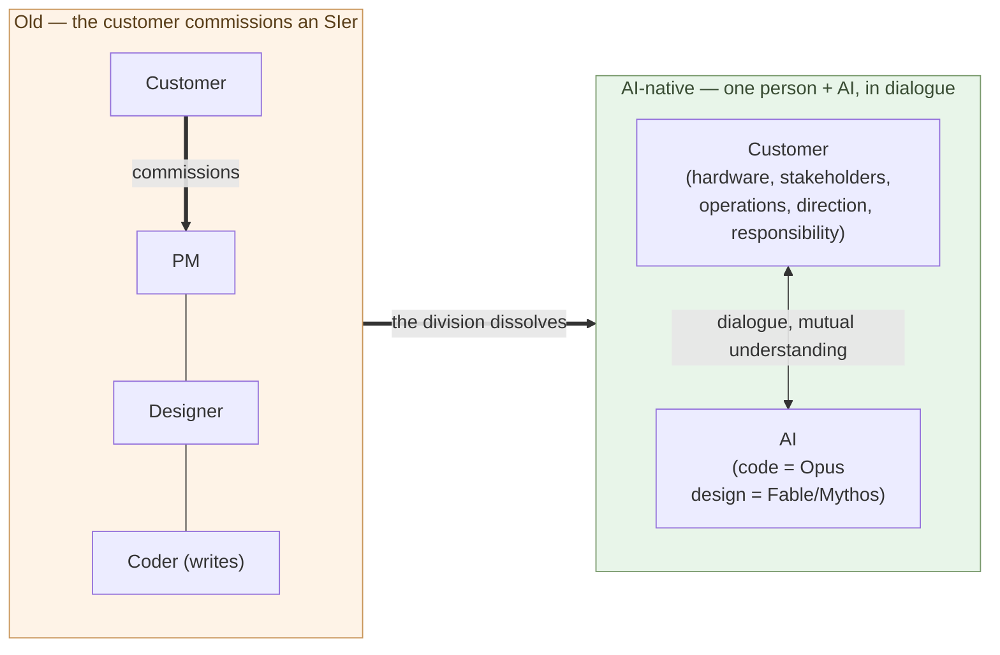

# AI Now Does the Coder's Work

**The role whose center is "writing code" gets replaced by AI**.

Chapter 2 showed that the main battleground of maintenance moves from
"the ability to write code" to "the ability to decide the design." This
chapter takes up the other face of that shift — the role itself. The
claim is not "all programmers disappear" but **"the role definition
called coder disappears."** That distinction is half of the argument.

## "Coder" means a role whose center is writing code

In this book the term "coder" names this role:

- **Writing code itself** is the center of the work
- Requirements arrive from someone else
- Design may be decided by someone else (a lead, an architect, a PM)
- The yardstick of evaluation is "writes fast, correctly, readably"
- The skill core is fluency in languages, frameworks, and standard
  libraries

This is not a label for people; it is a definition of a **role**. The
same person can work as a coder in one situation and a designer in
another. What disappears is the role, not the people.

The role was viable because **writing code took humans a lot of time**.
Even shaping a single system into running form demanded an enormous
number of person-hours, so a large workforce of writers had to be
assembled. That is why a separate person decided requirements and design
while the coder focused only on writing. The SIer industry, contract
development, and multi-tier subcontracting are all built on that premise
(Shift Chapter 1 takes up the structure).

## AI writes code, and designs too — from coder to SIer substitute

Chapter 1 established that top-tier coding ability is reachable for $200
a month. AI writes code — and with that one fact, the scarce resource
called "the ability to write code" stops being scarce. And the ability
has range:

- **Opus** — a first-rate **coder**. Hand it intent and it translates it into running code
- **Fable / Mythos** — **software engineers**. They go into design, deciding structure itself (the two at the same design level)

That they reach design has corroborating evidence. In the Fable / Mythos
generation, a publicly reported case had an attacker misuse Claude to
**run most of the operational steps of a cyberattack autonomously**
(Anthropic reported this in 2025 as an automated cyber-espionage
campaign). Driving an attack yourself takes the ability to read the
target system and structure the line of attack — the same ability as
designing software.

So there is a step up. **Earlier AI was a substitute for the coder. In
the Fable / Mythos era it became a substitute for the SIer — taking on
requirements, design, and build.** The market value of the code-writing
band converges to near zero. Not a statement about labor ethics, but
about prices.

## Building and operating a system is broader than writing code

Set aside the SIer way of seeing it: splitting "development" into
requirements → design → build → test and dividing the work into coder,
designer, PM. That division was never the essence of the work — it was
split **because writing code took a large workforce**, a division for
mass production.

Actually building and operating a system is far broader. Once AI moves
into code and design, **this broader part is what stays with humans**:

- **Procuring hardware** (the physical world)
- **Negotiating with stakeholders** (the social world)
- **Running it and fixing it, continuously** (operations and maintenance)
- **Deciding direction and taking responsibility**
- **Shaping what gets built, in dialogue with AI**

AI processes context **when given**, and designs. But **what to count as
context, what to reconcile with reality**, and **taking responsibility**
stay with humans — and under current institutions that subject is not
the AI. These are entangled and not settled by a single instruction:
**humans and AI shape what gets built by talking it through.**

> Humans **procure hardware, negotiate with people, keep it running,
> talk with AI, and take responsibility** — they carry the whole work of
> building and operating a system.

## What goes away is "the code-writing role"

So what goes away is **the role whose center is writing code itself (the
coder)** — and the **division of labor** the SIer built to mass-produce
it. Demand does not vanish; the **code-writing band gets replaced by AI,
so no price holds**. One person, in dialogue with AI, builds and operates
the system — moving into that broader role (Chapter 4 names it
"builder").

In both diagrams the customer stands in the same place. What changed is
that the customer who used to **only place the order** now stands on the
side that builds and runs it. Even just commissioning an SIer used to
take real effort — RFP, vendor selection, requirements, contract. **At
the level of a design-capable AI (Fable / Mythos), with no more than that
"effort of ordering," the customer builds it** (taken up in Chapter 5).

> Once, even just **placing the order** with an SIer took real effort.
> Now, that same effort is enough — the customer builds it.

This is not "every programmer loses their job." People who have been
called programmers split in two directions:

- **(a) Leave software development** — move to a different industry or role
- **(b) Move to the builder** — stand on the side that builds and runs a
  system in dialogue with AI (defined in Chapter 4)

History has parallels. In Japan in the 1970s, calculators erased the
skill of **commercial calculation by abacus (soroban)**, but people who
could read what the numbers meant and keep the work running moved into
accounting and finance. The same happened with the Western **human
computer** and the **typesetter** as phototypesetting replaced
letterpress. **When handwork is replaced by machines, what splits is who
can move to the broader side (orchestration, dialogue, operations,
responsibility) and who cannot.** The same thing is happening in the
coding band now.

The thing to flag is **the speed**. After Casio released the Casio Mini
(1972, ¥12,800) and other low-priced models, **calculators pushed the
abacus out of Japanese offices and homes within roughly a decade**. The
intuition that "this kind of change takes decades" is a backward-looking
illusion — **while it is happening, it is fast for the people inside it**.
The AI shift is starting from a price structure orders of magnitude lower
(Chapter 1); it is reasonable to expect the same speed or faster. Whether
one can absorb it becomes a question of **industry structure**, not
personal choice (Shift Chapter 5).

## Where the next chapter goes

AI carries code and design, while hardware, people, operations, dialogue,
and responsibility stay with humans — who carries that broad role? And
**the foundational discipline of that role shifts from software
engineering to the liberal arts** — the bass line of this sub-series. The
next chapter defines that role — **the builder**.

---

## Related articles

- [Chapter 1: AI Solves the World's Hardest Coding Problems](/en/ai-native-ways/software/coder-top/)
- [Chapter 2: Maintenance-Phase Shift Is the Real Story](/en/ai-native-ways/software/maintenance-shift/)
- [Structural analysis 08: Subtracting the enterprise-IT tax](/en/insights/enterprise-tax/)
- [Structural analysis 12: AI and the sole proprietor](/en/insights/ai-and-individual/)
