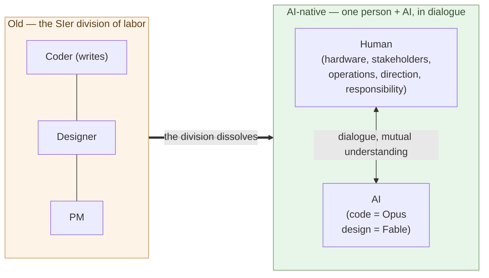

# The Coder's Job Goes Away

**The role whose center is "writing code" no longer holds together**.

Chapter 2 showed that the main battleground of maintenance moves from
"the ability to write code" to "the ability to decide the design."
This chapter takes up the other face of that shift — the role itself.
The coder role goes away, and is replaced by a broader role: building
and operating a system in dialogue with AI (Chapter 4 names it
"builder").

A note up front. This chapter is not saying "all programmers
disappear." It is saying **"the role definition called coder
disappears."** That distinction is half of the argument.

## "Coder" means a role whose center is writing code

Start with the definition. In this book the term "coder" names this
role:

- **Writing code itself** is the center of the work
- Requirements arrive from someone else
- Design may be decided by someone else (a lead, an architect, a PM)
- The yardstick of evaluation is "writes fast, correctly, readably"
- The skill core is fluency in languages, frameworks, and standard
  libraries

This is not a label for specific people; it is a definition of a
**role**. The same person can work as a coder in one situation and as
a designer in another. What this chapter says disappears is the role,
not the people.

The role was viable while **the ability to write code was a scarce
resource**. Few could write it, so writing itself carried a price. A
separate person could decide requirements and design, while the coder
focused only on writing. The SIer industry, contract development, and
multi-tier subcontracting structures are all built on that premise
(Shift Chapter 1 takes up the structure).

## Building and operating a system is broader than writing code

Set aside, for a moment, the SIer way of seeing it: splitting
"development" into requirements → design → build → test, and dividing
the work into coder, designer, PM — that division of labor.

That was never the essence of the work. It was split **because writing
code took a large workforce** — a division for mass production.
Actually building and operating a system is far broader than writing
code:

- **Procuring hardware** — servers, equipment, the physical site
- **Negotiating with stakeholders** — customers, the field, the organization, regulators
- **Running it and fixing it, continuously** — operations and maintenance never end
- **Shaping it in dialogue with AI** — not a single instruction, but back-and-forth

These lie outside code. And they are entangled — not cleanly divided
into two boxes called "execution" and "judgment." **Building and
deciding mix in dialogue.**

> Shrinking "development" to "the code-writing step" was the SIer's
> convenience. In reality it is far broader — **procure hardware,
> negotiate with people, run it, and talk with AI.**

## AI writes code, and designs too — Opus a coder, Fable an SE

Chapter 1 established that top-tier coding ability is reachable for $200
a month. AI writes code — and with that one fact, the scarce resource
called "the ability to write code" stops being scarce.

And AI is not "execution only." The ability has range:

- **Opus** — a first-rate **coder**. Hand it intent and it translates it into running code
- **Fable** — a **software engineer**. It goes into design, deciding structure itself

So AI now enters **design**, which used to be put on the "judgment
side." The line "AI executes, humans judge" breaks down here. The
market value of the code-writing band converges to near zero — not a
statement about labor ethics, but about prices.

## So what stays with humans?

"Humans only judge" is false too. What only humans can do includes
judgment, but is not just that:

- **Procuring hardware** (the physical world)
- **Negotiating with stakeholders** (the social world)
- **Running it and fixing it, continuously** (operations and maintenance)
- **Deciding direction and taking responsibility**
- **Shaping what gets built, in dialogue with AI**

AI processes context **when given**, and designs. But **what to count
as context, and what to reconcile with reality**, is decided by humans.
And humans take the responsibility — to let AI judge is to hand the
responsibility along, and no current institution provides a subject to
take that on.

What humans do does not fit in the one word "judgment." **Moving in the
physical and social world, keeping it running, talking with AI, and
carrying responsibility** — the broad work of building and operating a
system.

> Humans do not only judge.
> **They procure hardware, negotiate with people, keep it running, talk
> with AI, and take responsibility.**

## What goes away is "the code-writing role"

Put the pieces together:

- AI **writes code, and designs too** (Opus a coder, Fable an SE)
- Humans carry the **physical, social, operational, dialogic, and responsibility** work
- Building and operating a system was always broader than writing code

So what goes away is **the role whose center is writing code itself
(the coder)** — and the **division of labor** the SIer built to mass-
produce it. Not "execution or judgment." Demand does not vanish; the
**code-writing band gets replaced by AI, so no price holds**. One person,
in dialogue with AI, builds and operates the system — moving into that
broader role (Chapter 4 names it "builder").

This is not "every programmer loses their job." People who have been
called programmers split in two directions:

- **(a) Leave software development** — move to a different industry or
  a different role
- **(b) Move to the builder** — stand on the side that builds, operates,
  and runs a system in dialogue with AI, carrying the physical, social,
  and responsibility load (defined in Chapter 4).

History has parallel transitions. In Japan, when calculators arrived
in the 1970s, the execution skill of **commercial calculation by
abacus (soroban)** disappeared, but people who could judge what the
numbers meant moved into accounting and finance. The same transition
happened in the West with the **human computer**, and in printing
with the **typesetter** as phototypesetting replaced letterpress.
**When execution gets mechanized, what splits is who can move to the
broader side (orchestration, dialogue, operations, responsibility) and
who cannot**. The same thing is happening in the coding band now.

The thing to flag is **the speed of the transition**. After Casio
released the Casio Mini in 1972 at ¥12,800 and other low-priced models
followed, **calculators pushed the abacus out of Japanese offices and
homes within roughly a decade**. The intuition that "this kind of
change takes decades" is a backward-looking illusion — **while it is
happening, it is fast for the people inside it**. The AI shift, as
Chapter 1 showed, is starting from a price structure that is orders of
magnitude lower. It is reasonable to expect the same speed, or faster.
Whether the individual or the country can absorb the transition
becomes a question of **industry structure**, not personal choice
(Shift Chapter 5 takes up the Japanese SIer industry).

## Where the next chapter goes

AI writes code and designs, while hardware, people, operations,
dialogue, and responsibility stay with humans. Who carries that broad
role? And **the foundational discipline of that role shifts from
software engineering to the liberal arts** — the bass line running
through this sub-series.

The next chapter defines that role — **the builder**. The person who,
in dialogue with AI, builds and operates a system, reconciles it with
reality, and carries responsibility. We will look at how the builder
differs from the coder, and at why the builder's foundation is the
liberal arts, with concrete examples.

---

## Related articles

- [Chapter 1: AI Solves the World's Hardest Coding Problems](/en/ai-native-ways/software/coder-top/)
- [Chapter 2: Maintenance-Phase Shift Is the Real Story](/en/ai-native-ways/software/maintenance-shift/)
- [Structural analysis 08: Subtracting the enterprise-IT tax](/en/insights/enterprise-tax/)
- [Structural analysis 12: AI and the sole proprietor](/en/insights/ai-and-individual/)
