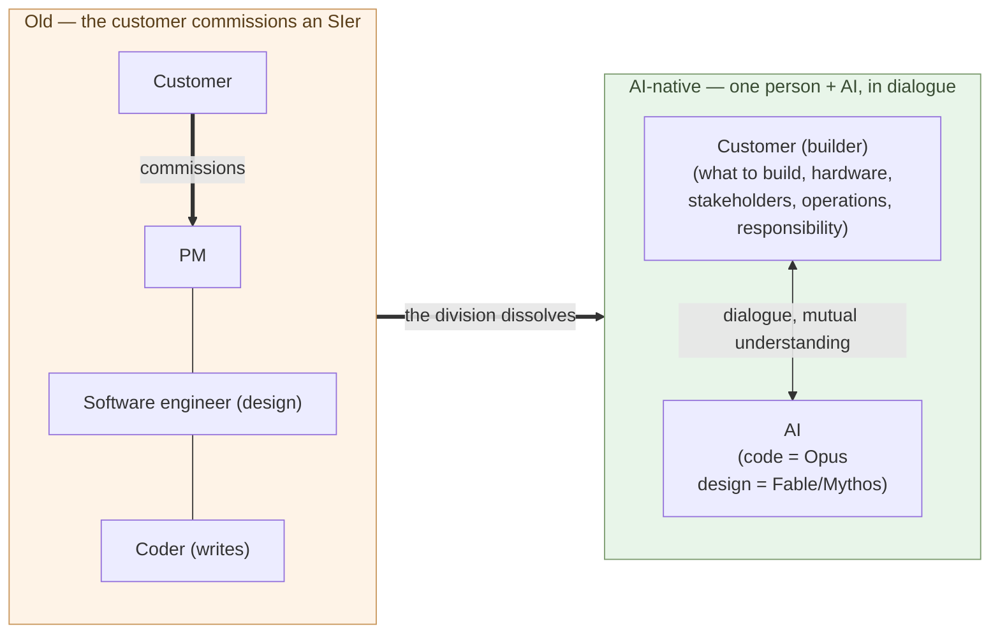

# AI Now Does the Software Engineer's Work

**The "coder" who writes code obviously, completely disappears. But the
subject of this chapter is what lies beyond — AI now does the work of the
"software engineer" who designs, too**.

1-02 showed that both maintenance and development become work done in
dialogue with AI. This chapter takes up the other face of that — the role
itself. The claim is not "all programmers disappear" but **"the role
definitions called coder and software engineer disappear."** That
distinction is half of the argument.

## The coder and the software engineer

This book distinguishes two roles.

- **Coder** — writing code itself is the center of the work.
  Requirements and design both arrive from someone else. The yardstick
  is "writes fast, correctly, readably."
- **Software engineer (SE)** — goes into design. Decides the structure
  of what to build and how, and then writes the code. Broader than the
  coder.

Both are definitions of a **role**, not labels for people. The same
person can work as a coder in one situation and an SE in another. What
disappears is the role, not the people.

These roles were viable because **writing code and designing took humans
a lot of time**. Even shaping a single system demanded an enormous number
of person-hours, and you had to assemble a workforce both to write and to
design. The SIer industry, contract development, and multi-tier
subcontracting are all built on that premise (3-02).

## AI becomes both the coder and the software engineer

1-01 established that AI became the strongest SIer — it writes code,
and it understands context and designs. The ability has range:

- **Opus** — a first-rate **coder**. Hand it intent and it translates it into running code
- **Fable / Mythos** — **software engineers**. They understand context, go into design, and decide structure themselves

So AI does **the coder's work and the software engineer's work alike**.
The coder, who only writes code, obviously disappears. But the SE, who
designs too, is the same — if AI does both the design and the code, there
is no longer a place for a human to stand in the role of "designing and
writing the code yourself." The market value of the design-and-code band
converges to near zero — not a statement about labor ethics, but about
prices.

## What stays with humans is dialogue with AI — and that is no longer the SE

So what stays with humans? Not design, not coding — **building and
operating a system in dialogue with AI**:

- **Deciding what to build** — the context is held by the human
- **Procuring hardware** (the physical world)
- **Negotiating with stakeholders** (the social world)
- **Running it and fixing it, continuously** (operations and maintenance)
- **Deciding direction and taking responsibility**

AI processes context **when given**, and designs. But **what to count as
context, what to reconcile with reality**, and **taking responsibility**
stay with humans — and under current institutions, that subject is not
the AI. This is not the "software engineer's work" of designing and
writing the code yourself. **Shaping it in dialogue with AI — that is a
different role.** 1-04 names it the builder.

> What stays with humans is not design, not coding.
> It is **building and operating a system in dialogue with AI** — and
> that is no longer the software engineer, but the builder.

## What goes away is "designing and writing the code yourself"

So what goes away is **the role of designing and writing the code
yourself (the coder and the software engineer)** — and the **division of
labor** the SIer built to mass-produce it. Demand does not vanish; **both
design and code get replaced by AI, so no price holds**. One person, in
dialogue with AI, builds and operates the system — moving into that role
(1-04 names it "builder").

In both diagrams the customer stands in the same place. What changed is
that the customer who used to **only place the order** now stands on the
side that builds and runs it. Even just commissioning an SIer used to
take real effort — RFP, vendor selection, requirements, contract. **At
the level of a design-capable AI (Fable / Mythos), with no more than that
"effort of ordering," the customer builds it** (taken up in 1-05).

> Once, even just **placing the order** with an SIer took real effort.
> Now, that same effort is enough — the customer builds it.

This is not "every programmer loses their job." People who have been
called programmers split in two directions:

- **(a) Leave software development** — move to a different industry or role
- **(b) Move to the builder** — stand on the side that builds and runs a
  system in dialogue with AI (defined in 1-04)

Conversely, builders are not drawn only from programmers. **People at the
field — those who actually know the work and the customer — can become
builders too.** What a builder needs is not the ability to write code,
but the ability to grasp the field's context and shape it in dialogue
with AI. If anything, the field people, who already hold the context, are
closer to the builder (1-05 takes this up as "the customer builds it
themselves").

History has parallels. In Japan in the 1970s, calculators erased the
skill of **commercial calculation by abacus (soroban)**, but people who
could read what the numbers meant and keep the work running moved into
accounting and finance. The same happened with the Western **human
computer** and the **typesetter** as phototypesetting replaced
letterpress. **When handwork is replaced by machines, what splits is who
can move to the broader side (orchestration, dialogue, operations,
responsibility) and who cannot.** The same thing is happening in software
development — both coding and design — now.

The thing to flag is **the speed**. After Casio released the Casio Mini
(1972, ¥12,800) and other low-priced models, **calculators pushed the
abacus out of Japanese offices and homes within roughly a decade**. The
intuition that "this kind of change takes decades" is a backward-looking
illusion — **while it is happening, it is fast for the people inside it**.
The AI shift is starting from a price structure orders of magnitude lower
(1-01); it is reasonable to expect the same speed or faster. Whether
one can absorb it becomes a question of **industry structure**, not
personal choice (3-06).

## Where the next chapter goes

AI carries both design and code, while deciding what to build, hardware,
people, operations, dialogue, and responsibility stay with humans — who
carries that role? And **the foundational discipline of that role shifts
from software engineering to the liberal arts** — the bass line of this
sub-series. The next chapter defines that role — **the builder**.

---

## Related articles

- [1-01: AI Solves the World's Hardest Coding Problems](/en/ai-native-ways/software/coder-top/)
- [1-02: Maintenance-Phase Shift Is the Real Story](/en/ai-native-ways/software/maintenance-shift/)
- [Structural analysis 08: Subtracting the enterprise-IT tax](/en/insights/enterprise-tax/)
- [Structural analysis 12: AI and the sole proprietor](/en/insights/ai-and-individual/)
