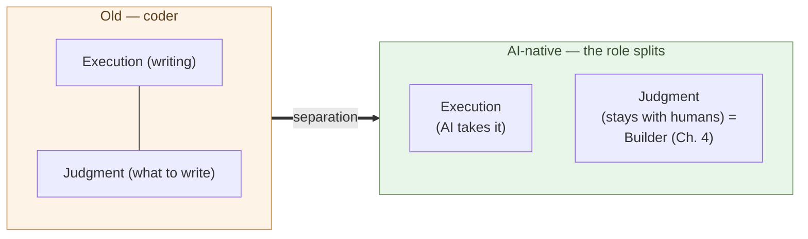

# The Coder's Job Goes Away

**The role whose center is "writing code" no longer holds together**.

Chapter 2 showed that the main battleground of maintenance moves from
"the ability to write code" to "the ability to decide the design."
This chapter takes up the other face of that shift — the role itself.
The coder role goes away, and is replaced by a role centered on
judgment (Chapter 4 names it "builder").

A note up front. This chapter is not saying "all programmers
disappear." It is saying **"the role definition called coder
disappears."** That distinction is half of the argument.

## "Coder" means a role whose center is writing code

Start with the definition. In this book the term "coder" names this
role:

- **Writing code itself** is the center of the work
- Requirements arrive from someone else
- Design may be decided by someone else (a lead, an architect, a PM)
- The yardstick of evaluation is "writes fast, correctly, readably"
- The skill core is fluency in languages, frameworks, and standard
  libraries

This is not a label for specific people; it is a definition of a
**role**. The same person can work as a coder in one situation and as
a designer in another. What this chapter says disappears is the role,
not the people.

The role was viable while **the ability to write code was a scarce
resource**. Few could write it, so writing itself carried a price. A
separate person could decide requirements and design, while the coder
focused only on writing. The SIer industry, contract development, and
multi-tier subcontracting structures are all built on that premise
(Chapter 6 takes up the structure).

## Execution and judgment were always different abilities

Make one terminology distinction explicit. The work of writing code
splits into two abilities:

- **Execution** — translating a decided intent into running code.
  Knowledge of grammar, standard libraries, patterns; handling edge
  cases; debugging fluency; writing tests.
- **Judgment** — deciding what to build, how to split it, which
  invariants must hold. Outlining the shape of the problem, picking
  trade-offs, taking responsibility, calling "stop here."

Historically these two were bundled in one person. The same training,
the same evaluation, the same "good engineer" umbrella. But **the two
are different abilities by nature**. Code review, architecture review,
design meetings — these are judgment work, not writing work.

> Execution and judgment were always different abilities.
> The fact that one person carried both is a by-product of an era in
> which carrying both was the efficient arrangement.

## AI takes execution completely

Chapter 1 established the fact that top-tier coding ability is reachable
for $200 a month on Claude Max. "Top-tier" there means specifically the
top tier of **execution ability**.

Concretely:

- Knowledge of standard libraries and language specs — every language,
  every version
- Pattern recall — instant citation from large public codebases
- Edge-case coverage — handling the cases humans tend to forget
- Tests and debugging — guessing and reproducing failure modes
- Refactoring — moving structure while preserving invariants

These are the levels that the best human coders reach over ten or
twenty years. AI sits at those levels in the $200/month band.

In other words, **the market value of execution converges to near
zero**. It carried a price because it was scarce; if it is no longer
scarce, no price holds. This is not a statement about labor ethics; it
is a statement about **prices**.

## AI cannot take over judgment

While AI takes execution, judgment stays with humans. Why?

Judgment does not close inside code:

- **What to build** — carve a problem out of customer and field
  context
- **Which invariants to protect** — pick the conditions that cannot be
  traded
- **Which trade-off to take** — speed, cost, extensibility, portability
- **What not to build** — decide the subtraction in spec
- **When to stop** — draw the line at "done"
- **Who takes responsibility** — when something fails, who carries it

These are not visible just by reading code. They need **external
context** — customer, business, organization, regulation, history.
AI can process context **when given**, but **deciding what counts as
context** is a job only humans can do.

And judgment carries **responsibility**. To let AI judge is to hand
the responsibility along with it. No current institution — technical,
ethical, or legal — provides a subject to take that on. **The boundary
of judgment is the boundary of responsibility**.

> AI matches human top-tier in execution.
> But judgment needs **a subject who takes responsibility**, and AI
> cannot stand there.

## The role definition called "coder" goes away

Put the pieces together:

- "Coder" = the role centered on execution
- The market value of execution → converges to near zero with AI
- The market value of judgment → stays, in fact rises
- Judgment lies outside the definition of "coder"

The conclusion is simple. **The role centered on execution stops
being economically viable**. Demand does not vanish; **supply gets
replaced by AI, so no price holds**.

This is not "every programmer loses their job." People who have been
called programmers split in two directions:

- **(a) Leave software development** — move to a different industry or
  a different role
- **(b) Move to a judgment-centered role** — stand on the side of
  design, integration, and responsibility. This book names that role
  the "builder" (defined in Chapter 4).

History has parallel transitions. In Japan, when calculators arrived
in the 1970s, the execution skill of **commercial calculation by
abacus (soroban)** disappeared, but people who could judge what the
numbers meant moved into accounting and finance. The same transition
happened in the West with the **human computer**, and in printing
with the **typesetter** as phototypesetting replaced letterpress.
**When execution gets mechanized, what splits is who can move to the
judgment side and who cannot**. The same thing is happening in the
coding band now.

The thing to flag is **the speed of the transition**. After Casio
released the Casio Mini in 1972 at ¥12,800 and other low-priced models
followed, **calculators pushed the abacus out of Japanese offices and
homes within roughly a decade**. The intuition that "this kind of
change takes decades" is a backward-looking illusion — **while it is
happening, it is fast for the people inside it**. The AI shift, as
Chapter 1 showed, is starting from a price structure that is orders of
magnitude lower. It is reasonable to expect the same speed, or faster.
Whether the individual or the country can absorb the transition
becomes a question of **industry structure**, not personal choice
(Chapter 10 takes up the Japanese SIer industry).

## Where the next chapter goes

Execution moves to AI; judgment stays with humans. Who carries the
judgment side?

The next chapter defines that role — **the builder**. The person who
decides what to build, has AI build it, evaluates the output, and
integrates the structure. We will look at how the builder differs
from the coder, with concrete examples.

---

## Related articles

- [Chapter 1: AI Has Reached Human-Top-Class Capability in Writing Code](/en/ai-native-ways/software/coder-top/)
- [Chapter 2: Maintenance-Phase Shift Is the Real Story](/en/ai-native-ways/software/maintenance-shift/)
- [Structural analysis 08: Subtracting the enterprise-IT tax](/en/insights/enterprise-tax/)
- [Structural analysis 12: AI and the sole proprietor](/en/insights/ai-and-individual/)
