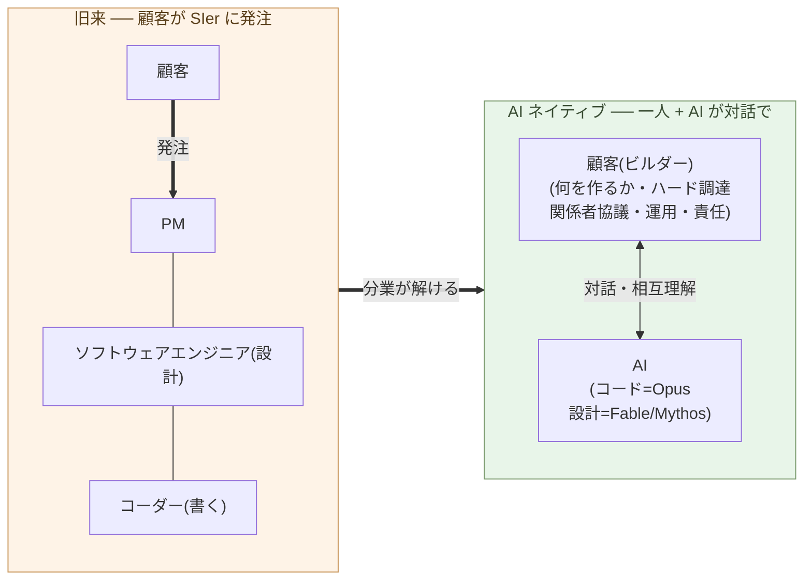

# ソフトウェアエンジニアの仕事を AI がするようになる

**コードを書く「コーダー」は、当然、完全に消える。だが本章の主題は
その先だ ── 設計までする「ソフトウェアエンジニア」の仕事も、AI が
するようになる**。

1-02で、保守も開発も AI と対話する作業に変わることを見た。本章は
その裏面 ── 役割の側 ── を扱う。言っているのは「プログラマー全員が
消える」ではなく、**「コーダーとソフトウェアエンジニアという役割定義
が消える」**だ。この区別が本章の半分である。

## コーダーとソフトウェアエンジニア

本書では、二つの役割を区別する。

- **コーダー** ── コードを書くこと自体が仕事の中心。要件も設計も
  別の人から降りてくる。評価軸は「速く、正しく、読みやすく書く」。
- **ソフトウェアエンジニア(SE)** ── 設計まで踏み込む。何をどう作るか
  の構造を自分で決め、そのうえでコードを書く。コーダーより広い。

どちらも、具体的な人ではなく **役割の定義**だ。同じ人がある場面では
コーダー、別の場面では SE として働くことは普通にある。消えるのは、
人ではなく役割の方だ。

これらの役割が成立してきたのは、**人間がコードを書き、設計するのに
時間がかかった**からだ。一つのシステムを形にするだけで膨大な工数が
要り、書く人手も設計する人手も揃える必要があった。SIer・受託開発・
元請け下請け構造は、すべてこの前提の上に建っている(3-01で扱う)。

## AI が、コーダーにもソフトウェアエンジニアにもなる

1-01で、AI が最強の SIer になった ── コードを書き、文脈を理解して
設計もする ── という事実を据えた。能力には幅がある:

- **Opus** ── 一流の **コーダー**。意図を渡せば、動くコードに翻訳する
- **Fable / Mythos** ── **ソフトウェアエンジニア**。文脈を理解して
  設計まで踏み込み、構造を自分で決められる

つまり AI は、**コーダーの仕事も、ソフトウェアエンジニアの仕事も
する**。コードを書くだけのコーダーは、当然消える。だが、設計までする
SE も同じだ ── 設計もコードも AI がやるなら、人間が「自分で設計して
コードを書く」役割で立つ場所は、なくなる。設計とコードの帯の市場価値
は、ほぼゼロに収束する ── 労働観ではなく、価格の話だ。

## 人間に残るのは、AI と対話する仕事 ── それはもう SE ではない

では、人間に何が残るのか。設計でもコーディングでもない ── **AI と
対話して、システムを作り・動かす仕事**だ。

- **何を作るかを決める** ── 文脈は、人間が持っている
- **ハードを調達する**(物理の世界)
- **関係者と協議する**(社会の世界)
- **動かし、直し続ける**(運用・保守)
- **方向を決め、責任を取る**

AI は文脈を **与えられれば** 処理し、設計もする。だが、**何を文脈に
含め、現実と何をすり合わせるか** を決め、**責任を取る**のは人間だ ──
その主体は、現状の制度では AI ではない。これは、自分で設計しコードを
書く「ソフトウェアエンジニアの仕事」ではない。**AI と対話して形にする
── これは別の役割だ**。1-04で「ビルダー」と呼ぶ。

> 人間に残るのは、設計でもコーディングでもない。
> **AI と対話して、システムを作り・動かす仕事** ── それはもう
> ソフトウェアエンジニアではなく、ビルダーだ。

## 消えるのは「自分で設計し、コードを書く役割」だ

だから消えるのは、「**自分で設計し、コードを書く役割**(コーダーと
ソフトウェアエンジニア)」と、SIer がそれを量産するために組んだ
**役割分業**だ。需要が消えるのではなく、**設計もコードも AI に
置き換わって価格が立たなくなる**。一人が AI と対話してシステムを
作り・動かす ── その役割(1-04で「ビルダー」と呼ぶ)に移る。

二つの図で、顧客は同じ場所にいる。違うのは、かつて SIer に**発注する
だけ**だった顧客が、いまは自分で作り・動かす側に立つことだ。かつては
発注するだけでも、RFP 作成・業者選定・要件すり合わせ・契約交渉と相当の
手間がかかった。**設計までする AI(Fable / Mythos)の水準では、その
「発注する手間」があれば、顧客自身が作り上げてしまう**(1-05で扱う)。

> かつては、SIer に**発注するだけ**でも相当の手間がかかった。
> いまは、その手間があれば ── 顧客自身が作ってしまう。

これは「すべてのプログラマーが失業する」ではない。呼ばれてきた人々は
二つに分かれる:

- **(a) ソフトウェア開発から離れる** ── 別の業界・別の役割へ
- **(b) ビルダーに移る** ── AI と対話してシステムを作り・動かす側に
  立つ(1-04で定義)

逆に、ビルダーになるのはプログラマーだけではない。**現場の人 ──
業務や顧客を実際に知っている人 ── も、ビルダーになれる**。ビルダーに
要るのは、コードを書く力ではなく、現場の文脈を掴み、AI と対話して
形にする力だからだ。むしろ、文脈を手元に持っている現場の人のほうが
ビルダーに近い(1-05で「顧客自身が作る」として詳しく扱う)。

歴史も同じだ。日本では 1970 年代、電卓が**算盤による商業計算**の技能を
消したが、数字の意味を読み業務を回せる人は経理・会計に残った。欧米の
**計算手**(human computer)、活版から写植への**組版工**も同じ。
**手作業が機械に置き換わると、より広い側(段取り・対話・運用・責任)に
移れる人と移れない人で分かれる**。同じことが、ソフトウェア開発 ──
コーディングも設計も ── で起きている。

注意したいのは**スピード**だ。電卓は Casio Mini(1972 年、¥12,800)
など低価格機種が出てから、**およそ十年で**そろばんをオフィスと家庭から
押し出した。「この種の変化は数十年かかる」という直感は、振り返ると
ゆっくりに見えるだけで、**渦中の当事者には速い**。今回の AI 化は価格が
桁違いに低い段階で始まっている(1-01)。同じか、それ以上の速度で進む
と見るのが妥当だ。耐えられるかどうかは個人の選択ではなく、**業界構造**
の問題になる(3-05)。

## 次の章へ

設計もコードも AI が担う一方、何を作るか・ハード・人・運用・対話・責任
は人間に残る ── この役割を、誰が担うのか。そしてその役割の **基盤と
なる学問が、ソフトウェア工学からリベラルアーツへ移る** ── これが本サブ
シリーズの通奏低音だ。次章で、その役割 ── **ビルダー** ── を定義する。

---

## 関連記事

- [1-01: AI は、世界で最も難しいコーディング問題を解く](/ai-native-ways/software/coder-top/)
- [1-02: 保守フェーズの構造変化こそ本質](/ai-native-ways/software/maintenance-shift/)
- [構造分析08: 企業ITの税を引く](/insights/enterprise-tax/)
- [構造分析12: AIと個人事業](/insights/ai-and-individual/)
