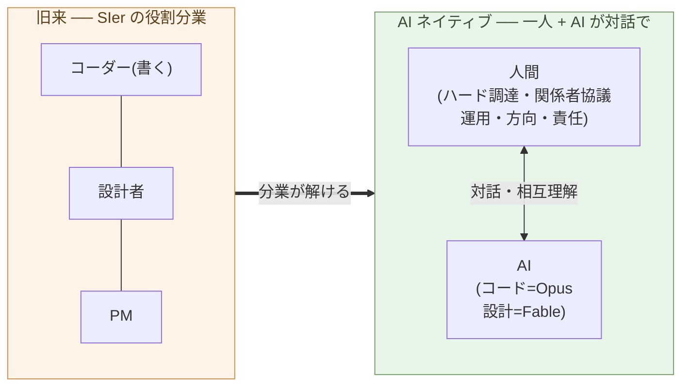

# コーダーの仕事はなくなる

**「コードを書くこと」を仕事の中心に置く役割は、もう成立しない**。

第2章で、保守の主戦場が「コードを書く能力」ではなく「設計を決める
能力」に移ることを示した。本章はその裏面 ── 役割の側 ── を扱う。
コーダーという役割が消える。代わりに、AI と対話してシステムを作り・
動かす、もっと広い役割(第4章で「ビルダー」と呼ぶ)に移る。

最初に注意を一つ。本章は「プログラマー全員が消える」と言っている
のではない。**「コーダーという役割定義が消える」**と言っている。
この区別が本章の半分だ。

## コーダーとは「コードを書くことが中心の役割」だ

まず定義から始める。本書で「コーダー」と呼ぶのは、こういう役割だ:

- **コードを書くこと自体**が仕事の中心
- 要件は誰かから降りてくる
- 設計は別の人(リーダー・アーキテクト・PM)が決めることもある
- 評価軸は「速く、正しく、読みやすく書く」
- スキルの中心は、言語・フレームワーク・標準ライブラリの習熟

これは具体的な人を指す呼び名ではなく、**役割の定義**だ。同じ人が
ある場面ではコーダーとして働き、別の場面では設計者として働く、と
いうことは普通にある。本章で消えると言っているのは、人ではなく、
役割の方だ。

この役割が成立してきたのは、**コードを書く能力が希少資源だった
時代**の話だ。コードが書ける人は限られていて、書くこと自体に値段
が付いた。仕様や設計を別の人が決め、書くことだけに専念する人が
要った。SIer・受託開発・元請け下請け構造は、すべてこの前提の上に
建てられている(転換編 第1章で構造を扱う)。

## システムを作り、動かすことは、コードを書くことより広い

ここで、SIer 的な見方を一度外す。「開発」を 要件 → 設計 → 実装 →
テスト の工程に分け、コーダー・設計者・PM と役割を割る ── あの分業だ。

あれは、作業の本質ではない。**コードを書くのに大量の人手が要ったから**、
量産のために分けただけだ。実際にシステムを作り、動かすことは、コードを
書くことよりずっと広い:

- **ハードを調達してくる** ── サーバ、機材、現場の物理
- **関係者と協議する** ── 顧客、現場、組織、規制
- **動かし、直し続ける** ── 運用・保守は終わらない
- **AI と対話して、作るものを形にする** ── 一度の指示ではなく、やり取り

これらは、コードの外にある。そして互いに絡み合っていて、「実行」と
「判断」の二つの箱にきれいに分けられるものではない。**作ることと
決めることは、対話の中で混ざる**。

> 開発を「コードを書く工程」に縮めるのは、SIer の都合だった。
> 実際は ── **ハードを調達し、人と協議し、動かし、AI と対話する**、
> ずっと広い仕事だ。

## AI はコードを書き、設計もする ── Opus はコーダー、Fable は SE

第1章で、月 3 万円で世界最上層のコーディング能力に接続できる事実を
据えた。AI がコードを書く ── この一点で、「コードを書く能力」という
希少資源は、希少でなくなる。

しかも AI は「実行だけ」ではない。能力には幅がある:

- **Opus** ── 一流の**コーダー**。意図を渡せば、動くコードに翻訳する
- **Fable** ── **ソフトウェアエンジニア**。設計まで踏み込み、構造を
  自分で決められる

つまり、かつて「判断側」とされた **設計**にも、AI は入ってくる。
「AI は実行、人間は判断」という線引きは、ここで崩れる。コードを書く
帯の市場価値は、ほぼゼロに収束する ── これは労働観ではなく、価格の
話だ。

## では、人間に何が残るのか

「人間は判断だけ」も、嘘だ。人間にしかできないことは、判断を含むが、
それだけではない:

- **ハードを調達してくる**(物理の世界)
- **関係者と協議する**(社会の世界)
- **動かし、直し続ける**(運用・保守)
- **方向を決め、責任を取る**
- **AI と対話して、作るものを一緒に形にする**

AI は、文脈を**与えられれば**処理し、設計もする。だが、**何を文脈に
含めるか、現実と何をすり合わせるか**を決めるのは人間だ。そして責任は
人間が取る ── AI に判断させるとは、責任ごと渡すことだが、それを
引き受ける主体は、現状の制度に存在しない。

人間がやるのは「判断」の一語には収まらない。**物理と社会の中で動き、
動かし続け、AI と対話し、責任を負う** ── システムを作り、運用する、
広い仕事だ。

> 人間は、判断だけをするのではない。
> **ハードを調達し、人と協議し、動かし、AI と対話し、責任を取る**。

## 消えるのは「コードを書く役割」だ

ここまでを組み合わせる:

- AI が **コードを書き、設計もする**(Opus=コーダー、Fable=SE)
- 人間は **物理・社会・運用・対話・責任** を担う
- システムを作り、動かす仕事は、もともとコードを書くより広い

だから消えるのは、「**コードを書くこと自体を中心に置く役割**(コーダー)」
であり、SIer がそれを量産するために組んだ **役割分業**だ。実行か判断か、
ではない。需要が消えるのではなく、**コードを書く帯が AI に置き換わって
価格が立たなくなる**。一人が AI と対話して、システムを作り・動かす ──
その広い役割(第4章で「ビルダー」と呼ぶ)に移る。

これは「すべてのプログラマーが失業する」ではない。プログラマーと
呼ばれてきた人々は、二つの方向に分かれる:

- **(a) ソフトウェア開発から離れる** ── 別の業界・別の役割に移る
- **(b) ビルダーに移る** ── AI と対話して、システムを作り・動かし・
  運用する側に立つ。物理と社会と責任を引き受ける(第4章で定義)

歴史的に類似の転換はあった。日本では電卓が出た 1970 年代、
**算盤(そろばん)による商業計算**という実行スキルが消えたが、数字
の意味を判断できる人は経理・会計の側に残った。同じ転換が、欧米
では **計算手**(human computer)で、活版印刷から写植への移行
では **組版工**で起きた。**実行が機械化されると、より広い側(段取り・
対話・運用・責任)に移れる人と移れない人で分かれる**。それと同じこと
が、コーディングの帯で起きている。

注意したいのは、**転換のスピード**だ。電卓は 1970 年代前半に
Casio Mini(1972 年、¥12,800)など低価格機種が出てから、**およそ
十年で**日本のオフィスと家庭からそろばんを押し出した。「この種の
変化は数十年かかる」という直感は、振り返るとゆっくりに見えるだけで、
**起きている最中の当事者にとっては速い**。今回の AI 化は、第1章で
見たとおり、価格が桁違いに低い段階で始まっている。同じか、それ
以上の速度で進むと考えるのが妥当だ。転換期に経済的に耐えられる
かどうかは、個々人の選択ではなく、**業界構造**の問題になる
(転換編 第5章で日本の SIer 業界を扱う)。

## 次の章へ

AI がコードを書き、設計もする一方、ハード・人・運用・対話・責任は
人間に残る ── この広い役割を、誰が担うのか。そしてその役割の **基盤
となる学問が、ソフトウェア工学からリベラルアーツへと移る** ── これが
本サブシリーズの通奏低音だ。

次の章では、その役割 ── **ビルダー** ── を定義する。AI と対話して
システムを作り・動かし、現実とすり合わせ、責任を負う人。コーダーとの
構造的な違い、そしてビルダーの基盤がリベラルアーツであることを、
具体例とともに見ていく。

---

## 関連記事

- [第1章: AI は、世界で最も難しいコーディング問題を解く](/ai-native-ways/software/coder-top/)
- [第2章: 保守フェーズの構造変化こそ本質](/ai-native-ways/software/maintenance-shift/)
- [構造分析08: 企業ITの税を引く](/insights/enterprise-tax/)
- [構造分析12: AIと個人事業](/insights/ai-and-individual/)
