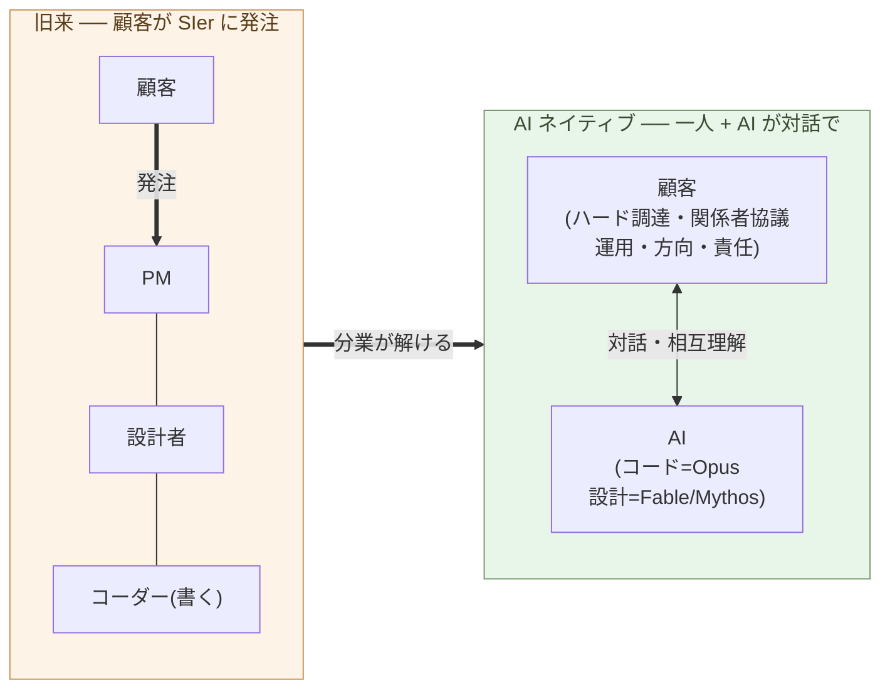

# コーダーの仕事を AI がするようになる

**「コードを書くこと」を仕事の中心に置く役割は、AI に置き換わる**。

第2章で、保守の主戦場が「コードを書く能力」から「設計を決める能力」へ
移ることを示した。本章はその裏面 ── 役割の側 ── を扱う。言っているのは
「プログラマー全員が消える」ではなく、**「コーダーという役割定義が消える」**
だ。この区別が本章の半分である。

## コーダーとは「コードを書くことが中心の役割」だ

本書で「コーダー」と呼ぶのは、こういう役割だ:

- **コードを書くこと自体**が仕事の中心
- 要件は誰かから降りてくる
- 設計は別の人(リーダー・アーキテクト・PM)が決めることもある
- 評価軸は「速く、正しく、読みやすく書く」
- スキルの中心は、言語・フレームワーク・標準ライブラリの習熟

これは具体的な人ではなく、**役割の定義**だ。同じ人がある場面では
コーダー、別の場面では設計者として働くことは普通にある。消えるのは、
人ではなく役割の方だ。

この役割が成立してきたのは、**人間がコードを書くのに時間がかかった**
からだ。一つのシステムを形にするだけで膨大な工数が要り、書く人手を
大量に揃える必要があった。だから仕様や設計を別の人が決め、書くことだけ
に専念する人が要った。SIer・受託開発・元請け下請け構造は、すべてこの
前提の上に建っている(転換編 第1章で扱う)。

## AI はコードを書き、設計もする ── コーダーから SIer の代わりへ

第1章で、月 3 万円で世界最上層のコーディング能力に接続できる事実を
据えた。AI がコードを書く ── この一点で、「コードを書く能力」という
希少資源は希少でなくなる。しかも能力には幅がある:

- **Opus** ── 一流の**コーダー**。意図を渡せば、動くコードに翻訳する
- **Fable / Mythos** ── **ソフトウェアエンジニア**。設計まで踏み込み、
  構造を自分で決められる(両者は設計能力で同水準)

設計まで踏み込めることは、第1章で見たとおりだ ── 自律的にサイバー攻撃
まで組み立てられることが、その証拠だった。だから段が一つ上がる。**以前
の AI は「コーダーの代わり」、Fable / Mythos の世代では「SIer の代わり」
ができる** ── 要件を読み、構造を決め、実装し、動かす。コードを書く帯の
市場価値は、ほぼゼロに収束する ── 労働観ではなく、価格の話だ。

## システムを作り、動かすことは、コードより広い

ここで SIer 的な見方を外す。「開発」を 要件 → 設計 → 実装 → テスト に
分け、コーダー・設計者・PM と役割を割る ── あの分業は、作業の本質では
ない。**コードを書くのに大量の人手が要ったから**、量産のために分けた
だけだ。

実際にシステムを作り、動かすことは、ずっと広い。AI がコードと設計に
入った後、**この広い部分が人間に残る**:

- **ハードを調達する**(物理の世界)
- **関係者と協議する**(社会の世界)
- **動かし、直し続ける**(運用・保守)
- **方向を決め、責任を取る**
- **AI と対話して、作るものを形にする**

AI は文脈を**与えられれば**処理し、設計もする。だが、**何を文脈に
含め、現実と何をすり合わせるか**を決め、**責任を取る**のは人間だ ──
その主体は、現状の制度では AI ではない。これらは互いに絡み合い、一度の
指示では片付かない。**人間と AI が対話しながら、形にしていく**。

> 人間は、**ハードを調達し、人と協議し、動かし、AI と対話し、責任を
> 取る**。システムを作り、運用する仕事の全体を担う。

## 消えるのは「コードを書く役割」だ

だから消えるのは、「**コードを書くこと自体を中心に置く役割**(コーダー)」
と、SIer がそれを量産するために組んだ **役割分業**だ。需要が消えるの
ではなく、**コードを書く帯が AI に置き換わって価格が立たなくなる**。
一人が AI と対話してシステムを作り・動かす ── その広い役割(第4章で
「ビルダー」と呼ぶ)に移る。

二つの図で、顧客は同じ場所にいる。違うのは、かつて SIer に**発注する
だけ**だった顧客が、いまは自分で作り・動かす側に立つことだ。かつては
発注するだけでも、RFP 作成・業者選定・要件すり合わせ・契約交渉と相当の
手間がかかった。**設計までする AI(Fable / Mythos)の水準では、その
「発注する手間」があれば、顧客自身が作り上げてしまう**(第5章で扱う)。

> かつては、SIer に**発注するだけ**でも相当の手間がかかった。
> いまは、その手間があれば ── 顧客自身が作ってしまう。

これは「すべてのプログラマーが失業する」ではない。呼ばれてきた人々は
二つに分かれる:

- **(a) ソフトウェア開発から離れる** ── 別の業界・別の役割へ
- **(b) ビルダーに移る** ── AI と対話してシステムを作り・動かす側に
  立つ(第4章で定義)

歴史も同じだ。日本では 1970 年代、電卓が**算盤による商業計算**の技能を
消したが、数字の意味を読み業務を回せる人は経理・会計に残った。欧米の
**計算手**(human computer)、活版から写植への**組版工**も同じ。
**手作業が機械に置き換わると、より広い側(段取り・対話・運用・責任)に
移れる人と移れない人で分かれる**。同じことが、コーディングの帯で起きて
いる。

注意したいのは**スピード**だ。電卓は Casio Mini(1972 年、¥12,800)
など低価格機種が出てから、**およそ十年で**そろばんをオフィスと家庭から
押し出した。「この種の変化は数十年かかる」という直感は、振り返ると
ゆっくりに見えるだけで、**渦中の当事者には速い**。今回の AI 化は価格が
桁違いに低い段階で始まっている(第1章)。同じか、それ以上の速度で進む
と見るのが妥当だ。耐えられるかどうかは個人の選択ではなく、**業界構造**
の問題になる(転換編 第5章)。

## 次の章へ

AI がコードと設計を担う一方、ハード・人・運用・対話・責任は人間に残る
── この広い役割を、誰が担うのか。そしてその役割の **基盤となる学問が、
ソフトウェア工学からリベラルアーツへ移る** ── これが本サブシリーズの
通奏低音だ。次章で、その役割 ── **ビルダー** ── を定義する。

---

## 関連記事

- [第1章: AI は、世界で最も難しいコーディング問題を解く](/ai-native-ways/software/coder-top/)
- [第2章: 保守フェーズの構造変化こそ本質](/ai-native-ways/software/maintenance-shift/)
- [構造分析08: 企業ITの税を引く](/insights/enterprise-tax/)
- [構造分析12: AIと個人事業](/insights/ai-and-individual/)
