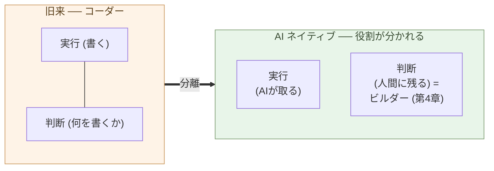

# コーダーの仕事はなくなる

**「コードを書くこと」を仕事の中心に置く役割は、もう成立しない**。

第2章で、保守の主戦場が「コードを書く能力」ではなく「設計を決める
能力」に移ることを示した。本章はその裏面 ── 役割の側 ── を扱う。
コーダーという役割が消える。代わりに、判断を中心とする別の役割
(第4章で「ビルダー」と呼ぶ)に移る。

最初に注意を一つ。本章は「プログラマー全員が消える」と言っている
のではない。**「コーダーという役割定義が消える」**と言っている。
この区別が本章の半分だ。

## コーダーとは「コードを書くことが中心の役割」だ

まず定義から始める。本書で「コーダー」と呼ぶのは、こういう役割だ:

- **コードを書くこと自体**が仕事の中心
- 要件は誰かから降りてくる
- 設計は別の人(リーダー・アーキテクト・PM)が決めることもある
- 評価軸は「速く、正しく、読みやすく書く」
- スキルの中心は、言語・フレームワーク・標準ライブラリの習熟

これは具体的な人を指す呼び名ではなく、**役割の定義**だ。同じ人が
ある場面ではコーダーとして働き、別の場面では設計者として働く、と
いうことは普通にある。本章で消えると言っているのは、人ではなく、
役割の方だ。

この役割が成立してきたのは、**コードを書く能力が希少資源だった
時代**の話だ。コードが書ける人は限られていて、書くこと自体に値段
が付いた。仕様や設計を別の人が決め、書くことだけに専念する人が
要った。SIer・受託開発・元請け下請け構造は、すべてこの前提の上に
建てられている(第6章で構造を扱う)。

## 実行と判断は、もともと別の能力だ

ここで一つ、用語の区別を明示しておく。コードを書く仕事は、二つの
能力に分けられる:

- **実行能力** ── 決まった意図を、動くコードに翻訳する能力。
  文法・標準ライブラリ・パターンの知識、エッジケースの処理、
  デバッグの手際、テストの書き方。
- **判断能力** ── 何を作るか・どう分けるか・どの不変条件を守るかを
  決める能力。問題の輪郭の把握、トレードオフの選択、責任の引き受け、
  「ここで止める」の判定。

旧来、この二つは一人の中で混ざっていた。同じ職業教育を受け、同じ
評価軸で測られ、しばしば「優れたエンジニア」として一括りにされて
きた。だが、**この二つは本来別の能力**だ。コードレビュー、アーキ
テクチャレビュー、設計会議 ── これらは判断の作業であって、書く
作業ではない。

> 実行と判断は、もともと別の能力だ。
> 一人が両方を担っていたのは、両方を担うのが効率的だった時代の
> 副産物にすぎない。

## AI が実行を完全に取る

第1章で、Claude Max 月 3 万円で世界最上層のコーディング能力に
接続できるという事実を据えた。「最上層」が意味するのは、まさに
**実行能力**の最上層だ。

具体的には:

- 標準ライブラリと言語仕様の知識 ── 全言語、全バージョン
- パターンの引き出し ── 過去の有名コードベースから即座に引用
- エッジケースの網羅 ── 「人間が忘れがちなケース」を漏らさず処理
- テストとデバッグ ── 失敗パターンの推定と再現
- リファクタリング ── 不変条件を保ったまま構造を変える

これらは、人間の最優秀コーダーが十年〜二十年かけて到達する水準だ。
AI はその水準に、月 3 万円で接続できる帯にいる。

つまり、**実行能力の市場価値は、ほぼゼロに収束する**。希少だったから
値段が付いていたのであって、希少でなくなれば値段は付かない。これは
労働観の話ではなく、**価格の話**だ。

## 判断は、AI が肩代わりできない

実行が AI に取られる一方、判断は人間に残る。なぜか。

判断は、コードの中で完結しない:

- **何を作るか** ── 顧客と現場の文脈から問題を切り出す
- **どの不変条件を守るか** ── 業務上譲れない条件を選び抜く
- **どのトレードオフを取るか** ── 速さ・コスト・拡張性・移植性の
  どれを優先するか
- **何を作らないか** ── 仕様の引き算を決める
- **いつ止めるか** ── 完成の線を引く
- **責任を取るか** ── うまくいかなかったとき、誰がそれを引き受けるか

これらは、コードを読めば分かるものではない。**外部の文脈**(顧客、
事業、組織、規制、歴史)を持ち込まないと判断できない。AI は文脈を
**与えられれば**処理できるが、**何を文脈に含めるか**を決める作業
自体は、人間にしかできない。

そして、判断には **責任** が付く。AI に判断させるとは、責任ごと
AI に渡すという意味だ。それを引き受ける主体は、現状の制度では
存在しない(技術的にも、倫理的にも、法律的にも)。**判断の境界線
は、責任の境界線でもある**。

> AI は実行能力では人間トップに並ぶ。
> しかし判断には**責任を取る主体**が要り、そこに AI は立てない。

## 「コーダーという役割」は消える

ここまでの議論を組み合わせる:

- 「コーダー」 = 実行を中心に置く役割
- 実行の市場価値 = AI 化でほぼゼロに収束
- 判断の市場価値 = 残る、むしろ上がる
- 判断は、コーダーの定義の外にある

結論はシンプルだ。**実行を中心に置く役割は、経済的に成立しなく
なる**。需要が消えるのではなく、**供給側で AI に置き換わるから
価格が立たなくなる**。

これは「すべてのプログラマーが失業する」ではない。プログラマーと
呼ばれてきた人々は、二つの方向に分かれる:

- **(a) ソフトウェア開発から離れる** ── 別の業界・別の役割に移る
- **(b) 判断中心の役割に移る** ── 設計・統合・責任を負う側に立つ。
  これを本書では「ビルダー」と呼ぶ(第4章で定義)

歴史的に類似の転換はあった。電卓が出たとき、**計算手**(human
computer)という役割は消えたが、数理に強い人はエンジニアや経済
分析の側に移った。組版工が消えたあと、書体の判断ができる人は
出版・編集に残った。**実行が機械化されると、判断側に移れる人と
移れない人で分かれる**。それと同じことが、コーディングの帯で起き
ている。

注意したいのは、**転換のスピード**だ。電卓のときは数十年かけて
起きた。今回の AI 化は、第1章で見たとおり、価格が桁違いに低い段階
で始まっている。転換期に経済的に耐えられるかどうかは、個々人の
選択ではなく、**業界構造**の問題になる(第10章で日本の SIer 業界
を扱う)。

## 次の章へ

実行が AI に取られ、判断が人間に残る ── このとき、判断側に立つ
役割を、誰が担うのか。

次の章では、その役割 ── **ビルダー** ── を定義する。何を作るかを
決め、AI に作らせ、出力を評価し、構造を統合する人。コーダーとの
構造的な違いを、具体例とともに見ていく。

---

## 関連記事

- [第1章: AIがコードを書く能力で人間トップクラスに到達した](/ai-native-ways/software/coder-top/)
- [第2章: 保守フェーズの構造変化こそ本質](/ai-native-ways/software/maintenance-shift/)
- [構造分析08: 企業ITの税を引く](/insights/enterprise-tax/)
- [構造分析12: AIと個人事業](/insights/ai-and-individual/)
