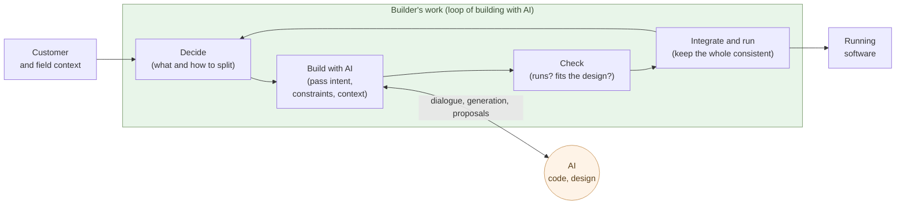

# The Builder Role

**Decide what to build, build it in dialogue with AI, run it,
integrate the whole — that is what a builder does**.

Chapter 3 said both the coder and the software engineer have their work
done by AI. What remains is the broader role of building and running
systems in dialogue with AI, and this book calls it the builder. This
chapter fixes the definition — what the builder does, where the builder
differs from the software engineer, why one person plus AI works — by
grounding it in a concrete example.

The concrete example is the site this article lives on. The **code
base** of aiseed.dev (about 6,000 lines) was stood up by one person
plus AI in roughly 24 hours; on top of it run about 150 bilingual
articles across five independent series. The articles are written on a
separate timeline — **roughly one week per sub-series** — covered
below. Every source and build script needed to reproduce the site is
committed to this repository.

## The builder decides what to build, then builds and runs it with AI

A builder's work runs as a **loop** of four steps:

- **Decide** — decide what to build and how to decompose it, drawing
  on customer, field, and the builder's own context. Lay down the
  skeleton of the spec.
- **Build with AI** — hand AI the intent, the constraints, and the
  context, and go back and forth. AI writes the code and proposes the
  design. Not a one-shot instruction — a dialogue.
- **Check** — see whether the returned work runs, fits the design,
  and survives the intended context.
- **Integrate and run** — fold the part into the whole, keep it
  consistent, run it, and return to "decide" for the next slice.

These four are not linear; they form a **loop**. One turn takes
anywhere from minutes to hours depending on scope. A builder runs the
loop tens of times in a day. Writing time inside the loop is
minimized — AI does the writing.

The builder holds the whole loop and carries direction and
responsibility. AI **writes the code and proposes the design** — but
what to build, what to reconcile with reality, and how to run it stay
on the builder's side.

The closest existing analogue to this role is the **film director**. A
director does not operate the camera, does not touch the editing
software, does not sew costumes — yet decides "what to make," "how to
show it," "where to cut," "in what order to assemble," and keeps the
whole consistent. The crew gives it form in dialogue with the director.
The relationship between the builder and AI maps onto this — **direction
and the whole stay with the builder, the code and design get built
through dialogue with AI, and the artifact is born of the
collaboration**. Shift Chapter 6 returns to this analogy under
"app-making comes to resemble film-making."

## The structural difference from a software engineer

A software engineer (SE) and a builder look similar but are
structurally different roles. The dividing line is one — **the SE solves
a "narrowly closed problem"; the builder handles an "open problem."**

- **Narrowly closed problem** — what to build is already defined, and
  the conditions for a correct answer are clear. "Implement this spec
  under these constraints." Both design and implementation close inside
  the problem. The more explicit the rules and checkable the answer, the
  stronger AI is (Chapter 1) — so the SE's work is what AI comes to do.
- **Open problem** — what should be built is not even settled. Reality
  contradicts itself, stakeholders' interests split, constraints move.
  The "right answer" sits outside the problem, on the side of reality.
  Reconciling with reality and translating it into narrowly closed
  problems — that is the builder.

What matters is not the difficulty of the problem — it is **whether it is
closed or open**. **A narrowly closed problem, however advanced, AI
solves** — as with the world's hardest coding problems (Chapter 1),
difficulty is no obstacle. But **open problems are where AI is weak —
because they have no history**. AI learns from accumulated precedent; a
reality without precedent, a situation no one has solved yet, gives it
nothing to learn from. So the open problem — the question that rises from
reality — stays with humans.

The typical software engineer is a big-tech employee — owning, deeply,
**just one specific slice** of a giant system: one feature of search, one
service of payments, one layer of an API. The problem is narrow and
well-defined. That is exactly where AI is strongest, and that work is
what AI comes to do first.

And at the frontier, this is already happening — **Claude builds
Claude**. AI writes the code of the AI itself. Once it reaches that
point, the question becomes a single one — **are big-tech software
engineers still needed?** As a role that solves narrowly closed problems,
no longer.

| Axis | Software engineer | Builder |
|---|---|---|
| Problem handled | **Narrowly closed** (defined) | **Open** (reality, context) |
| Center of the work | Designing and writing code | Deciding what to build |
| Context | Given as spec | Carved out of reality by oneself |
| Center of the skill | Design, implementation, technical fluency | Decomposition, evaluation, integration |
| Headcount per project | A team | One person plus AI |
| Throughput governed by | Design-and-build speed | Decision quality × loop turns |

The last two rows are the heart of this chapter. An SE's output is
governed by "headcount × design-and-build speed" — add people and it
goes faster (with limits). A builder's output is governed by
"**decision quality × loop turns**," and **adding people does not
help** — a chain of judgments cannot be split across heads. Once AI
takes on the narrowly closed problem — the design and the code — the
latter equation dominates.

> The SE solves a **narrowly closed problem** — there, AI is strong.
> The builder handles an **open problem** — reconciling with reality,
> deciding what to build. So this is what stays with humans.

The skill content differs as well. What a builder sharpens looks like
this:

- **Decomposition** — slicing a big thing into pieces AI can take
- **Articulation** — turning tacit intent into explicit instructions
  AI can process
- **Evaluation eye** — telling code that merely runs from code that
  fits the design
- **Integration judgment** — seeing whether a part breaks the
  consistency of the whole
- **Selection** — picking "this one" from the three options AI returns

None of these come from memorizing language grammar. **Experience
writing code helps**, but as a footing for judgment — not as the
writing skill itself.

## A builder's foundation is liberal arts, not software engineering

Experience writing code works as **scaffolding** for a builder's
work — but not as its center. At the center are structural
decomposition, verbalization, evaluative eye, integration judgment,
selection — all of which have been called **the liberal arts** (the
*artes liberales*, the "seven liberal arts") for two thousand years.

| What a builder needs | Its liberal-arts counterpart |
|---|---|
| Structural decomposition | Logic, analysis (the *trivium*'s dialectic) |
| Verbalization (turning implicit intent into explicit description) | Grammar, rhetoric (the *trivium*) |
| Evaluative eye (separating "merely runs" from "fits the design") | Aesthetics, ethics |
| Integration judgment (seeing whether parts preserve the whole) | Systems thinking (from the *quadrivium*'s geometry and the constructive sense of music) |
| Selection (picking "this one" from three options) | Ethics, theory of judgment |
| Reading context (cutting it out of customer and field) | History, social science, political philosophy |
| Responsibility for the claim (judgment is not delegated) | Ethics |

What AI took over is **the core of software engineering** —
algorithms, language specifications, frameworks, design patterns,
how to write tests. The work that remains looks liberal-arts–shaped
because, structurally, **it has to**.

The etymology lines up, too. The medieval *artes liberales* were
defined as **the arts a free person — one who is not enslaved —
should learn**, set explicitly against the *artes mechanicae*, the
slave's arts. The builder is the person who **does not hand
judgment over to AI** — the contemporary form of the free person's
arts.

> A builder's foundation is not software engineering. It is
> **the free person's arts of the AI era — the liberal arts**.

One distinction is worth naming. What AI has absorbed is **software
engineering** — the core of *implementation*: languages, frameworks,
design patterns, testing techniques. **Computer science (CS)** —
computability, algorithms, formal logic, discrete mathematics — is
a different thing. CS sits, structurally, inside the liberal arts,
as a modern extension of the *quadrivium*'s mathematics and logic.
Historically, CS emerged from mathematics; Turing, Church, and
von Neumann were mathematicians and logicians. **CS does not need
to be discarded, and it does not need a special category** — it is
folded into the liberal arts as part of the builder's scaffold for
judgment.

The shift from "hire someone who can write code" to "**hire someone
who can judge**" is not a surface-level personnel question. It is a
transformation in **the foundational discipline of the technical
profession**. Shift Chapter 4 returns to this theme.

## The builder's day is set by decision density

A builder's day has different content from a software engineer's day.

- **Software engineer's day**: most of the time is spent designing and
  writing. In between, checking requirements, taking reviews, applying
  fixes. The focus zone is inside the editor.
- **Builder's day**: most of the time is spent **reading, deciding,
  evaluating**. Reading the diff AI returned, checking whether
  invariants are respected, writing what to ask next. The editor is
  a way station.

Keyboard operations drop. In exchange, **the number of decisions per
hour** multiplies. The shorter AI's response cycle, the higher the
decision density. This is heavier load on the brain than writing —
a builder's fatigue shows up not in shoulders and hands but in
**decision-making capacity**.

Builders who can keep running for many hours straight are scarce.
That is the physiological side of "**adding builders does not help**."

## Evidence — two anchors: 24 hours for the code base, one week per sub-series

Enough abstraction. As a concrete example, decompose the site this
article lives on. aiseed.dev has this structure:

- **Five independent series**: Insights (structural analysis), Blog,
  Claude × Debian (a technical book), AI-Native Ways of Working (this
  series), Phosphorus Depletion and Natural Farming
- **About 150 chapters and articles** (bilingual JA / EN, so about
  300 source MD files in total)
- **About 6,000 lines of code base** (`tools/build_article.py` is
  roughly 1,800 lines; series templates ~2,400 lines; build utilities,
  OG-image generation, sitemap, hreflang, robots, series-specific
  typography)
- **Bilingual** (JA / EN, hreflang on every article, a hard-coded
  language switcher)
- **Mermaid, code highlighting, OG-image generation, sitemap**

### Anchor 1 — the code base in 24 hours

The **code base portion** — build tools, templates, image generation,
sitemap, the bilingual framework — was stood up by one person plus AI
(primarily Claude) in **about 24 hours**. Most of the code was written
by AI; the builder did design decisions, integration, and evaluation.
The same scope of code base, routed through an SIer commission model,
would burn comparable time at the proposal-and-quote stage alone (the
structure of that process cost is treated in Shift Chapter 1).

### Anchor 2 — one sub-series in one week

This needs to be said plainly. **The article content lives outside
that 24 hours**. Concretely: writing this sub-series (Software · all
11 chapters) takes **about one week** of work (currently 4 chapters
in, with the remaining chapters on the same pace). That week covers:

- Deciding the chapter outline (`docs/Ai-native-software-outline.md`)
- Extending the build tool to support sub-series
- Building out the authoring skills
  (`building-ai-native-software-series` and others)
- Writing the chapters in bilingual JA / EN
- Looping through revisions, fact corrections, and skill updates

Fitting all of that into one week, with one person plus AI, has a
different structure from the 24-hour code build. Unlike code, the
fraction of writing that can be delegated to AI is low for prose.

- The argument is decided by humans — what to say, what not to say
- The structure is decided by humans — order and pacing
- The facts are verified by humans — numbers, dates, citations,
  line by line
- The voice and rhythm are held by humans — the breath the reader
  feels
- Responsibility for the argument stays with humans — same as
  Chapter 3

AI can produce drafts, but every draft is taken as something to **read
in full, correct, and rewrite**. Factual errors, leaps in argument,
shifts in tone — letting any of those through costs trust. The "one
week" figure is a measured **throughput of one builder plus AI** that
already prices in the decision density that prose demands.

### What the two anchors mean

The contrast itself reinforces the chapter's claim:

- **Code**: high AI-delegation ratio. The one-time infrastructure build
  takes 24 hours. The builder holds design and evaluation.
- **Prose**: low AI-delegation ratio. One sub-series takes about a week
  of decision density. The builder holds everything except the rough
  draft.

The lower the delegation ratio, the higher the builder's decision
density. **What stays at the center of a builder's work is judgment**,
no matter what type of output sits on the other end.

For reproducibility, every source, template, and build script is
committed to this repository. A single `make` brings the same site up
(the design principle is the same as the `example-N/` folders in the
parent series).

> What the builder did. Code base: decided the design, had AI write
> it, evaluated, integrated (about 24 hours). Articles: held the
> argument, structure, fact-checking, and voice; read every AI draft
> end to end (one sub-series ≈ one week). **What sits at the center
> is not the ability to write, but the ability to judge** — and that
> holds for both.

## Why one person plus AI is faster than ten software engineers

What happens if you try "the same scope, one person plus AI in 24
hours" with a team of software engineers?

- Spec-alignment meetings — hours
- Task decomposition and assignment — half a day
- Each SE designs and writes — days to weeks
- Integration phase — days to weeks (integration cost grows roughly
  with the square of headcount — also Brooks' point)
- Review and rework rounds — weeks
- Documentation — deferred, typically drifts

Even at the same scope, **the cost of being a team eats more than
half the calendar**. A builder plus AI carries almost none of that
cost:

- Spec alignment — closed inside the builder's head
- Task decomposition and assignment — the builder hands tasks
  directly to AI
- Code writing — AI writes in parallel
- Integration phase — the builder integrates directly (no sync with
  another head)
- Review and rework — happen inside the same loop
- Documentation — AI regenerates from the design (Chapter 2)

The classic "integration cost grows with the square of headcount" is
the team's problem. With one person plus AI, the deciding closes
inside one head and AI writes the code in parallel — the quadratic
integration cost is sidestepped. That is the structural reason "one
person plus AI exceeds ten people."

This advantage holds **only while the builder keeps holding
judgment**. Fall into the "vibe coding" trap from Chapter 2 — hand
judgment to AI — and the loop collapses. The "one plus AI" team
becomes a team that ships nothing.

> One person plus AI is strong because **deciding, building, and
> fixing carry no human-to-human sync between them** — one person runs
> the whole through dialogue with AI. Add boundaries — syncing with
> another head — and the cost looks like a team's cost again.

## Where the next chapter goes

The builder ships larger scope with fewer people than a team of software
engineers.
And this is not just an internal-team story — **the customer can
become the builder**, by the same logic.

The next chapter takes up the era in which customers themselves pair
with AI and develop. What fraction of customers who used to commission
SIers shifts to building?

---

## Related articles

- [Chapter 1: AI Solves the World's Hardest Coding Problems](/en/ai-native-ways/software/coder-top/)
- [Chapter 2: Maintenance-Phase Shift Is the Real Story](/en/ai-native-ways/software/maintenance-shift/)
- [Chapter 3: AI Now Does the Software Engineer's Work](/en/ai-native-ways/software/coder-end/)
- [Structural analysis 08: Subtracting the enterprise-IT tax](/en/insights/enterprise-tax/)
- [Structural analysis 12: AI and the sole proprietor](/en/insights/ai-and-individual/)
