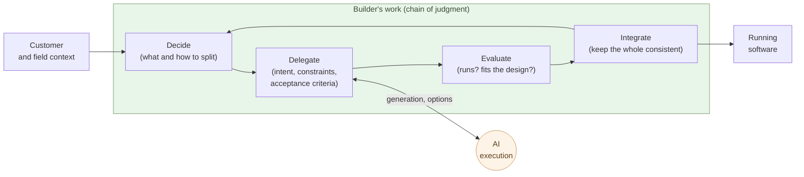

# The Builder Role

**Decide what to build, have AI write it, evaluate the output,
integrate the structure — that is what a builder does**.

Chapter 3 said the coder role (centered on execution) stops being
economically viable. What remains is a role centered on judgment, and
this book calls it the builder. This chapter fixes the definition —
what the builder does, where the builder differs from the coder, why
one person plus AI works — by grounding it in a concrete example.

The concrete example is the site this article lives on. The **code
base** of aiseed.dev (about 30,000 lines) was stood up by one person
plus AI in roughly 24 hours; on top of it run about 150 bilingual
articles (roughly 40 long-form pages of content) across five
independent series. The articles were written on a separate timeline —
covered below. Every source and build script needed to reproduce the
site is committed to this repository.

## The builder decides what to build and hands the writing to AI

A builder's work runs as a chain of four steps:

- **Decide** — judge what to build and how to decompose it, drawing
  on customer, field, and the builder's own context. Lay down the
  skeleton of the spec.
- **Delegate** — hand AI the intent, the constraints, and the
  acceptance criteria. AI writes the code.
- **Evaluate** — judge whether the returned output runs, fits the
  design, and survives the intended context.
- **Integrate** — fold the part into the whole, keep the whole
  consistent, and return to "decide" for the next slice.

These four are not linear; they form a **loop**. One turn takes
anywhere from minutes to hours depending on scope. A builder runs the
loop tens of times in a day. Writing time inside the loop is
minimized — AI does the writing.

The whole loop is held by the builder. AI enters as **one edge of the
loop** only. Judgment, conditions of delegation, evaluation criteria,
and integration policy all stay on the builder's side.

## The structural difference from a coder

Coder and builder look similar but are structurally different roles.

| Axis | Coder | Builder |
|---|---|---|
| Center of the work | Writing code | Deciding what to build |
| Center of the skill | Fluency in languages / frameworks | Decomposition, evaluation, integration |
| Evaluation yardstick | Writes fast, correctly, readably | Produces the right thing in the right structure |
| Context | Arrives as spec | The builder carves it out |
| Range | Depth in one technology | Breadth across technologies |
| Headcount per project | A team | One person plus AI |
| Throughput governed by | Writing speed | Decision quality × loop turns |

The last two rows are the heart of this chapter. A coder's output is
governed by "headcount × writing speed." A builder's output is
governed by "**decision quality × loop turns**." Once AI takes
execution, the latter equation dominates.

> In the coder world, "add more people and it goes faster" worked
> (with limits).
> In the builder world, **adding people does not help** — a chain of
> judgments cannot be split across heads.

The skill content differs as well. What a builder sharpens looks like
this:

- **Decomposition** — slicing a big thing into pieces AI can take
- **Articulation** — turning tacit intent into explicit instructions
  AI can process
- **Evaluation eye** — telling code that merely runs from code that
  fits the design
- **Integration judgment** — seeing whether a part breaks the
  consistency of the whole
- **Selection** — picking "this one" from the three options AI returns

None of these come from memorizing language grammar. **Experience
writing code helps**, but as a footing for judgment — not as the
writing skill itself.

## The builder's day is set by decision density

A builder's day has different content from a coder's day.

- **Coder's day**: most of the time is spent writing. In between,
  checking requirements, taking reviews, applying fixes. The focus
  zone is inside the editor.
- **Builder's day**: most of the time is spent **reading, deciding,
  evaluating**. Reading the diff AI returned, checking whether
  invariants are respected, writing what to ask next. The editor is
  a way station.

Keyboard operations drop. In exchange, **the number of decisions per
hour** multiplies. The shorter AI's response cycle, the higher the
decision density. This is heavier load on the brain than writing —
a builder's fatigue shows up not in shoulders and hands but in
**decision-making capacity**.

Builders who can keep running for many hours straight are scarce.
That is the physiological side of "**adding builders does not help**."

## Evidence — aiseed.dev's code base: one person plus AI, 24 hours

Enough abstraction. As a concrete example, decompose the site this
article lives on. aiseed.dev has this structure:

- **Five independent series**: Insights (structural analysis), Blog,
  Claude × Debian (a technical book), AI-Native Ways of Working (this
  series), Phosphorus Depletion and Natural Farming
- **About 150 chapters and articles** (bilingual JA / EN, so about
  300 source MD files in total)
- **About 40 long-form pages** of content (each series, taken
  together, runs to the equivalent of a small book or booklet)
- **About 30,000 lines of code** (`tools/build_article.py` is roughly
  1,600 lines; series templates, build utilities, OG-image generation,
  sitemap, hreflang, robots, series-specific typography)
- **Bilingual** (JA / EN, hreflang on every article, a hard-coded
  language switcher)
- **Mermaid, code highlighting, OG-image generation, sitemap**

Of these, the **code base portion** — build tools, templates, image
generation, sitemap, the bilingual framework — was stood up by **one
person plus AI** (primarily Claude) in **about 24 hours**. Most of
the code was written by AI; the builder did design decisions,
integration, and evaluation. The same scope of code base, routed
through an SIer commission model, would burn comparable time at the
proposal-and-quote stage alone (the structure of that process cost is
treated in Chapter 6).

### The article content is not inside that 24 hours

This needs to be said plainly. **The article content lives outside
that 24 hours**. Unlike code, the fraction of writing that can be
delegated to AI is low for prose.

- The argument is decided by humans — what to say, what not to say
- The structure is decided by humans — order and pacing
- The facts are verified by humans — numbers, dates, citations,
  line by line
- The voice and rhythm are held by humans — the breath the reader
  feels
- Responsibility for the argument stays with humans — same boundary
  of judgment as Chapter 3

AI can produce drafts, but every draft is taken as something to **read
in full, correct, and rewrite**. Factual errors, leaps in argument,
shifts in tone — letting any of those through costs trust. Each of
the 150 articles carries a chunk of high-decision-density time from
its writer. The total is not "24 hours."

The contrast itself reinforces the chapter's claim:

- **Code**: high AI-delegation ratio. The builder holds design and
  evaluation.
- **Prose**: low AI-delegation ratio. The builder holds everything
  except the rough draft.

The lower the delegation ratio, the higher the builder's decision
density. **What stays at the center of a builder's work is judgment**,
no matter what type of output sits on the other end.

For reproducibility, every source, template, and build script is
committed to this repository. A single `make` brings the same site up
(the design principle is the same as the `example-N/` folders in the
parent series).

> What the builder did. Code base: decided the design, had AI write
> it, evaluated, integrated. Articles: held the argument, structure,
> fact-checking, and voice; read every AI draft end to end. **What
> sits at the center is not the ability to write, but the ability to
> judge** — and that holds for both.

## Why one person plus AI is faster than ten coders

What happens if you try "the same scope, one person plus AI in 24
hours" with a coder team?

- Spec-alignment meetings — hours
- Task decomposition and assignment — half a day
- Each coder writes — days to weeks
- Integration phase — days to weeks (integration cost grows roughly
  with the square of headcount — also Brooks' point)
- Review and rework rounds — weeks
- Documentation — deferred, typically drifts

Even at the same scope, **the cost of being a team eats more than
half the calendar**. A builder plus AI carries almost none of that
cost:

- Spec alignment — closed inside the builder's head
- Task decomposition and assignment — the builder hands tasks
  directly to AI
- Code writing — AI writes in parallel
- Integration phase — the builder integrates directly (no sync with
  another head)
- Review and rework — happen inside the same loop
- Documentation — AI regenerates from the design (Chapter 2)

The classic "integration cost grows with the square of headcount" is
the team's problem. With one person plus AI, judgment is not
splittable but execution is parallelized inside AI — the quadratic
integration cost is sidestepped. That is the structural reason "one
person plus AI exceeds ten people."

This advantage holds **only while the builder keeps holding
judgment**. Fall into the "vibe coding" trap from Chapter 2 — hand
judgment to AI — and the loop collapses. The "one plus AI" team
becomes a team that ships nothing.

> One person plus AI is strong because **the boundary between
> judgment and execution closes inside one head**. Add boundaries and
> the cost looks like a team's cost again.

## Where the next chapter goes

The builder ships larger scope with fewer people than a coder team.
And this is not just an internal-team story — **the customer can
become the builder**, by the same logic.

The next chapter takes up the era in which customers themselves pair
with AI and develop. What fraction of customers who used to commission
SIers shifts to building?

---

## Related articles

- [Chapter 1: AI Has Reached Human-Top-Class Capability in Writing Code](/en/ai-native-ways/software/coder-top/)
- [Chapter 2: Maintenance-Phase Shift Is the Real Story](/en/ai-native-ways/software/maintenance-shift/)
- [Chapter 3: The Coder's Job Goes Away](/en/ai-native-ways/software/coder-end/)
- [Structural analysis 08: Subtracting the enterprise-IT tax](/en/insights/enterprise-tax/)
- [Structural analysis 12: AI and the sole proprietor](/en/insights/ai-and-individual/)
