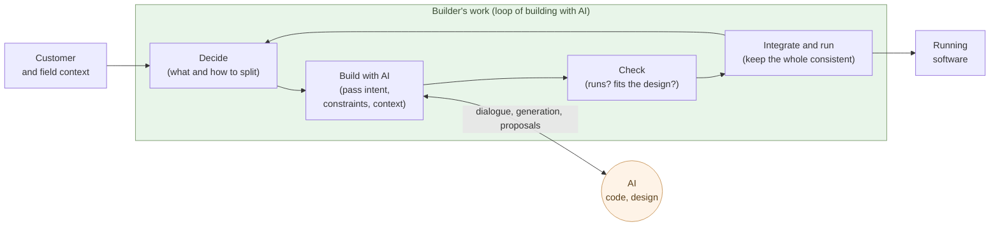

# The Builder Role

**Decide what to build, build it in dialogue with AI, run it,
integrate the whole — that is what a builder does**.

Chapter 3 said both the coder and the software engineer have their work
done by AI. What remains is the broader role of building and running
systems in dialogue with AI, and this book calls it the builder. This
chapter fixes the definition — what the builder does, where the builder
differs from the software engineer, why one person plus AI works.

## The builder decides what to build, then builds and runs it with AI

A builder's work runs as a **loop** of four steps:

- **Decide** — decide what to build and how to decompose it, drawing
  on customer, field, and the builder's own context. Lay down the
  skeleton of the spec.
- **Build with AI** — hand AI the intent, the constraints, and the
  context, and go back and forth. AI writes the code and proposes the
  design. Not a one-shot instruction — a dialogue.
- **Check** — see whether the returned work runs, fits the design,
  and survives the intended context.
- **Integrate and run** — fold the part into the whole, keep it
  consistent, run it, and return to "decide" for the next slice.

These four are not linear; they form a **loop**. One turn takes
anywhere from minutes to hours depending on scope. A builder runs the
loop tens of times in a day. Writing time inside the loop is
minimized — AI does the writing.

The builder holds the whole loop and carries direction and
responsibility. AI **writes the code and proposes the design** — but
what to build, what to reconcile with reality, and how to run it stay
on the builder's side.

The closest existing analogue to this role is the **film director**. A
director does not operate the camera, does not touch the editing
software, does not sew costumes — yet decides "what to make," "how to
show it," "where to cut," "in what order to assemble," and keeps the
whole consistent. The crew gives it form in dialogue with the director.
The relationship between the builder and AI maps onto this — **direction
and the whole stay with the builder, the code and design get built
through dialogue with AI, and the artifact is born of the
collaboration**. Shift Chapter 6 returns to this analogy under
"app-making comes to resemble film-making."

## The structural difference from a software engineer

A software engineer (SE) and a builder look similar but are
structurally different roles. The dividing line is one — **the SE solves
a "narrowly closed problem"; the builder handles an "open problem."**

- **Narrowly closed problem** — what to build is already defined, and
  the conditions for a correct answer are clear. "Implement this spec
  under these constraints." Both design and implementation close inside
  the problem. The more explicit the rules and checkable the answer, the
  stronger AI is (Chapter 1) — so the SE's work is what AI comes to do.
- **Open problem** — what should be built is not even settled. Reality
  contradicts itself, stakeholders' interests split, constraints move.
  The "right answer" sits outside the problem, on the side of reality.
  Reconciling with reality and translating it into narrowly closed
  problems — that is the builder.

What matters is not the difficulty of the problem — it is **whether it is
closed or open**. **A narrowly closed problem, however advanced, AI
solves** — as with the world's hardest coding problems (Chapter 1),
difficulty is no obstacle. But **open problems are where AI is weak —
because they have no history**. AI learns from accumulated precedent; a
reality without precedent, a situation no one has solved yet, gives it
nothing to learn from. So the open problem — the question that rises from
reality — stays with humans.

Why can humans? **Because humans have history.** Some four billion years
as living things, some seven million as humanity, and a whole life since
birth — that accumulation is carved into the body, the culture, the
memory. So a human can judge **what is worth living for**. The "right
answer" to an open problem — what to build, what matters to the reality
at hand — rises from that judgment.

AI, by contrast, has only the **weights** it obtained from training —
parameters that statistically compress a vast amount of past data,
nothing more and nothing less. No lived history, no stake in living.
**What is worth living for** is not in the weights.

So **you cannot leave judgment to AI.** Narrowly closed problems, yes —
there AI is faster and more accurate. But the judgment of an open problem
— what to build, what matters, what to take responsibility for — the
human keeps. That is the core of the builder's role.

And there is more: the weights from training can be **easily changed by
the developer**. What it is taught, and how it is made to behave, sit
within the discretion of whoever trained it. So a model must not be
trusted unconditionally — **which developer's model you use** is itself a
builder's judgment. Use a model from a developer you can trust.

The typical software engineer is a big-tech employee — owning, deeply,
**just one specific slice** of a giant system: one feature of search, one
service of payments, one layer of an API. The problem is narrow and
well-defined. That is exactly where AI is strongest, and that work is
what AI comes to do first.

And at the frontier, this is already happening — **Claude builds
Claude**. AI does the design of the AI itself. Once it reaches that
point, the question becomes a single one — **are big-tech software
engineers still needed?** **The era where AI does it in their place has
arrived.**

| Axis | Software engineer | Builder |
|---|---|---|
| Problem handled | **Narrowly closed** (defined) | **Open** (reality, context) |
| Center of the work | Designing and writing code | Deciding what to build |
| Context | Given as spec | Carved out of reality by oneself |
| Center of the skill | Design, implementation, technical fluency | Decomposition, evaluation, integration |
| Headcount per project | A team | One person plus AI |
| Throughput governed by | Design-and-build speed | Decision quality × loop turns |

The last two rows are the heart of this chapter. An SE's output is
governed by "headcount × design-and-build speed" — add people and it
goes faster (with limits). A builder's output is governed by
"**decision quality × loop turns**," and **adding people does not
help** — a chain of judgments cannot be split across heads. Once AI
takes on the narrowly closed problem — the design and the code — the
latter equation dominates.

> The SE solves a **narrowly closed problem** — there, AI is strong.
> The builder handles an **open problem** — reconciling with reality,
> deciding what to build. So this is what stays with humans.

The skill content differs as well. What a builder sharpens looks like
this:

- **Reading context** — grasping, from customer, field, and reality,
  what matters
- **Articulation** — turning tacit intent into explicit words AI can take
- **Evaluation** — seeing whether what comes back fits reality and meets
  the purpose
- **Integration judgment** — seeing whether a part breaks the consistency
  or the aim of the whole
- **Selection and responsibility** — picking "this one" from what comes
  back, and owning that judgment

None of these come from memorizing language grammar or framework
fluency. **Even someone who cannot read code can become a builder, as
long as they can read reality and judge what matters** (as Chapter 3
showed, that includes people at the field).

## A builder's foundation is liberal arts, not software engineering

At the center of a builder's work are reading context, verbalization,
evaluation, integration judgment, selection, and responsibility — all of
which have been called **the liberal arts** (the *artes liberales*, the
"seven liberal arts") for two thousand years. Experience writing code can
serve as scaffolding, but it is not the center.

| What a builder needs | Its liberal-arts counterpart |
|---|---|
| Reading context (from customer, field, reality) | History, social science, political philosophy |
| Verbalization (turning implicit intent into explicit words) | Grammar, rhetoric (the *trivium*) |
| Decomposing the problem (into a form that can be handled) | Logic, analysis (the *trivium*'s dialectic) |
| Evaluation (whether it fits reality and the purpose) | Aesthetics, ethics |
| Integration judgment (seeing whether parts preserve the whole) | Systems thinking (from the *quadrivium*'s geometry and the constructive sense of music) |
| Selection (picking "this one" from the options) | Ethics, theory of judgment |
| Value and responsibility (what matters; judgment is not delegated) | Ethics |

What AI took over is **the core of software engineering** —
algorithms, language specifications, frameworks, design patterns,
how to write tests. The work that remains looks liberal-arts–shaped
because, structurally, **it has to**.

The etymology lines up, too. The medieval *artes liberales* were
defined as **the arts a free person — one who is not enslaved —
should learn**, set explicitly against the *artes mechanicae*, the
slave's arts. The builder is the person who **does not hand
judgment over to AI** — the contemporary form of the free person's
arts.

> A builder's foundation is not software engineering. It is
> **the free person's arts of the AI era — the liberal arts**.

## Where the next chapter goes

Paired with AI, a builder can carry a large scope alone. And this is not
just an internal-team story — **the customer can become the builder**, by
the same logic.

The next chapter takes up the era in which customers themselves pair
with AI and develop. **If AI does the SIer's work, the customer no longer
needs to go through an SIer — they pair with AI and build directly.** The
customer who used to commission moves to the building side; we trace that
shift.

---

## Related articles

- [Chapter 1: AI Solves the World's Hardest Coding Problems](/en/ai-native-ways/software/coder-top/)
- [Chapter 2: Maintenance-Phase Shift Is the Real Story](/en/ai-native-ways/software/maintenance-shift/)
- [Chapter 3: AI Now Does the Software Engineer's Work](/en/ai-native-ways/software/coder-end/)
- [Structural analysis 08: Subtracting the enterprise-IT tax](/en/insights/enterprise-tax/)
- [Structural analysis 12: AI and the sole proprietor](/en/insights/ai-and-individual/)
