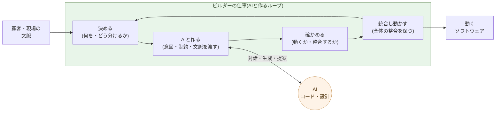

# ビルダーという役割

**何を作るかを決め、AI と対話して作り、動かし、全体を統合する ──
これがビルダーの仕事だ**。

1-03で、コーダーもソフトウェアエンジニアも、その仕事を AI が
するようになると書いた。残るのは、AI と対話してシステムを作り・動かす、
もっと広い役割で、これを本書ではビルダーと呼ぶ。本章はその定義 ──
何をする人か、どこがソフトウェアエンジニアと違うか、なぜ 1 人 + AI で
動くか ── を固定する。

## ビルダーは「何を作るかを決め、AIと作り動かす」役割だ

ビルダーの仕事は、四つのループで動く。

- **決める** ── 顧客・現場・自分の文脈から、何を作るかとどう分ける
  かを決める。仕様の骨格を書き出す。
- **AIと作る** ── 意図と制約と文脈をAIに渡し、やり取りする。AIは
  コードを書き、設計を提案する。一度の指示ではなく、対話だ。
- **確かめる** ── 返ってきたものが、動くか、設計と整合するか、想定
  した文脈で破綻しないかを見る。
- **統合し、動かす** ── 部分を全体に組み込み、整合を保ち、動かす。
  次の「決める」に戻る。

この四つは線形ではなく **ループ** だ。一周まわす時間は、規模により
数分から数時間。一日に何十周も回す。コードを書く時間はその中で
最小化される ── 書くのは AI だからだ。

このループの全体を握り、方向と責任を負うのが、ビルダーだ。AIは
**コードを書き、設計を提案する** ── だが、何を作り、現実と何を
すり合わせ、どう動かすかは、ビルダーの側にある。

この役割の最も近い既存職能は、**映画監督** だ。監督はカメラを操作
しない、編集ソフトも触らない、衣装も作らない ── しかし「何を作るか」
「どう見せるか」「どこを切るか」「どの順で繋ぐか」を決め、全体の
整合を保つ。スタッフは監督とやり取りしながら形にする。ビルダーと
AI の関係はこれに重なる ── **方向と全体はビルダー、コードと設計の
作り込みは AI との対話で、artifact は両者の協同が生む**。3-06で「アプリ作りは映画作りに似てくる」としてこの並列を改めて扱う。

## ソフトウェアエンジニアとの構造的な違い

ソフトウェアエンジニア(SE)とビルダーは、似て見えて構造的に別の
役割だ。境目は一つ ── **SE は「狭く閉じた課題」を解き、ビルダーは
「開いた課題」を扱う**。

- **狭く閉じた課題** ── 何を作るかが定義済みで、正解の条件がはっきり
  している。「この仕様を、この制約で実装せよ」。設計も実装も、課題の
  内側で完結する。ルールが明確で答え合わせができる課題ほど AI は
  強い(1-01)── だから、SE の仕事は AI がするようになる。
- **開いた課題** ── そもそも何を作るべきかが定まっていない。現実は
  矛盾し、関係者の利害は割れ、制約は動く。「正解」は課題の外、現実の
  側にある。これを現実とすり合わせ、狭く閉じた課題へ翻訳していくのが、
  ビルダーだ。

効いてくるのは、課題の難しさではない ── **閉じているか、開いているか**
だ。**狭く閉じた課題なら、どれほど高度でも AI は解く**。世界最難の
コーディング問題(1-01)がそうだったように、難易度は障害にならない。
だが、**開いた課題は苦手だ ── そこには歴史がないから**。AI は過去の
蓄積から学ぶ。前例のない現実、まだ誰も解いていない状況には、学ぶ材料が
ない。だから、開いた課題 ── 現実から立ち上がる問い ── は、人間に残る。

なぜ人間にできるのか。**人間には歴史があるからだ**。生物としての約 40 億
年、人類としての約 700 万年、そして個人として生まれてからの一生 ── その
積み重ねが、体と文化と記憶に刻まれている。だから人間は、**何が生きるに
値するか**を判断できる。開いた課題の「正解」── 何を作るべきか、何が現実
にとって大事か ── は、この判断から立ち上がる。

一方、AI が持つのは、学習で得た **重み** だけだ。膨大な過去のデータを
統計的に圧縮したパラメータ ── それ以上でも以下でもない。生きてきた歴史
も、生きることへの利害もない。**何が生きるに値するか**は、重みの中には
ない。

だから、**AI に判断をまかせることはできない**。狭く閉じた課題は任せて
いい ── そこは AI のほうが速く、正確だ。だが、何を作るか・何が大事か・
何に責任を負うかという開いた課題の判断は、人間が握り続ける。これが、
ビルダーという役割の芯だ。

さらに言えば、学習で得た重みは、**開発者の手で簡単に変えられる**。何を
学ばせ、どう振る舞わせるかは、訓練した側の裁量の中にある。だから、
モデルを無条件に信用してはいけない ── **どの開発者のモデルを使うか**を
選ぶこと自体が、ビルダーの判断だ。信頼できる開発者のモデルを使う。

ソフトウェアエンジニアの典型は、ビッグテックの社員だ ── 巨大なシステム
の **特定の一分野だけ** を深く受け持つ。検索の一機能、決済の一サービス、
ある API の一層。問題は狭く、よく定義されている。だからこそ AI が最も
得意とする領域で、その仕事から先に AI がするようになる。

そして、それは最先端ですでに起きている ── **Claude が Claude を作る**。
AI 自身の設計を、AI がする時代だ。こうなると、問いは一つになる ──
**ビッグテックのソフトウェアエンジニアは、まだ必要か**。**AI が代わりを
する時代になった**。

| 軸 | ソフトウェアエンジニア | ビルダー |
|---|---|---|
| 扱う問題 | **狭く閉じた課題**(定義済み) | **開いた課題**(現実・文脈) |
| 仕事の中心 | 設計してコードを書く | 何を作るかを決める |
| 文脈 | 仕様として与えられる | 自分で現実から切り出す |
| スキルの中心 | 設計・実装・技術習熟 | 構造分解・評価眼・統合 |
| 一案件の人数 | チーム(複数人) | 1 人 + AI |
| スループット | 設計・実装の速度に比例 | 判断の質 × ループの回転数 |

特に最後の二行が、本章の中心だ。SE は「人数 × 設計・実装の速度」で
出力が決まる ── 人を増やせば速くなる(上限はあったが)。ビルダーは
「**判断の質 × ループの回転数**」で決まり、**人を増やしても速くならない**
── 判断の連鎖は、頭の数では分散できない。AI が狭く閉じた課題 ── 設計とコード
── を引き受けた世界では、後者の式が支配的になる。

> SE は、**狭く閉じた課題**を解く ── そこは AI が強い。
> ビルダーは、**開いた課題**を扱う ── 現実とすり合わせ、何を作るかを
> 決める。だから、ここが人間に残る。

スキルの中身も別物だ。ビルダーが磨くのは、こういう能力:

- **文脈を読む** ── 顧客・現場・現実から、何が大事かを掴む
- **言語化** ── 暗黙の意図を、AI に渡せる明示的な言葉に変える
- **評価** ── 返ってきたものが、現実に合うか、目的を満たすかを見る
- **統合判断** ── 部分が全体の整合や狙いを壊していないかを見る
- **取捨選択と責任** ── 返ってきた案から「これでいく」を選び、その判断
  に責任を負う

これらは、言語の文法やフレームワークの習熟ではない。**コードを読めなく
ても、現実を読み、何が大事かを判断できる人なら、ビルダーになれる**
(1-03で見たとおり、現場の人もそうだ)。

## ビルダーの基盤は、ソフトウェア工学ではなくリベラルアーツだ

ビルダーの中心にあるのは、文脈の読み・言語化・評価・統合判断・取捨選択・
責任 ── これらはすべて、伝統的に **リベラルアーツ(自由七科)** と呼ばれて
きた技芸だ。コードを書いてきた経験が足場になることはあるが、中心では
ない。

| ビルダーに求められる能力 | リベラルアーツに対応する分野 |
|---|---|
| 文脈の読み(顧客・現場・現実から) | 歴史学・社会科学・政治哲学 |
| 言語化(暗黙の意図を明示の言葉に) | 文法・修辞学(trivium) |
| 課題の分解(開いた課題を扱える形に) | 論理学・分析(trivium の弁証法) |
| 評価(現実・目的に合うかを見る) | 美学・倫理学 |
| 統合判断(全体の整合を見る) | 体系的思考(quadrivium の幾何・音楽の構成感覚) |
| 取捨選択(案から「これでいく」を選ぶ) | 倫理学・判断論 |
| 価値と責任(何が大事か・判断は手放さない) | 倫理学 |

AI が代わりに引き受けたのは、**ソフトウェア工学の核心** ── アルゴ
リズム、言語仕様、フレームワーク、設計パターン、テストの書き方。
残った仕事がリベラルアーツ的な能力にしか見えないのは、**構造的な
必然**だ。

歴史的にも符号する。中世のリベラルアーツは「**自由人(隷属していない
人)が学ぶべき技芸**」と定義された ── 奴隷の技芸(mechanical arts)
と対になる概念だ。ビルダーは「AI に判断を手放さない人」── つまり
**自由人の技芸の現代版** である。

> ビルダーの基盤は、ソフトウェア工学ではない。
> **AI 時代の自由人の技芸 ── リベラルアーツ** だ。

## 次の章へ

ビルダーは、AI と組めば、一人でも大きなスコープを担える。これは社内の
話だけではない ── **顧客が直接ビルダーをやる**ことも、同じ理屈で可能に
なる。

次の章では、顧客自身が AI と組んで開発する時代を扱う。**SIer の仕事を
AI がするなら、顧客は SIer を介さず、AI と直接組んで作ればいい**。発注
していた顧客が、作る側に回る ── その移行を見ていく。

---

## 関連記事

- [1-01: AI は、世界で最も難しいコーディング問題を解く](/ai-native-ways/software/coder-top/)
- [1-02: 保守フェーズの構造変化こそ本質](/ai-native-ways/software/maintenance-shift/)
- [1-03: ソフトウェアエンジニアの仕事を AI がするようになる](/ai-native-ways/software/coder-end/)
- [構造分析08: 企業ITの税を引く](/insights/enterprise-tax/)
- [構造分析12: AIと個人事業](/insights/ai-and-individual/)
