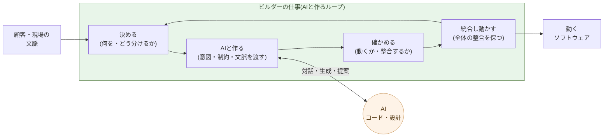

# ビルダーという役割

**何を作るかを決め、AI と対話して作り、動かし、全体を統合する ──
これがビルダーの仕事だ**。

第3章で、コーダーもソフトウェアエンジニアも、その仕事を AI が
するようになると書いた。残るのは、AI と対話してシステムを作り・動かす、
もっと広い役割で、これを本書ではビルダーと呼ぶ。本章はその定義 ──
何をする人か、どこがソフトウェアエンジニアと違うか、なぜ 1 人 + AI で
動くか ──
を、具体例とともに固定する。

具体例は、本記事が乗っているこのサイト ── aiseed.dev ── そのもの
を使う。**コード基盤**(約 6,000 行) を 1 人 + AI で 24 時間で
立ち上げ、そこに約 150 本のバイリンガル記事が乗ったマルチ系列
サイトだ。記事側は別の時間軸 ── **1 サブシリーズあたり約 1 週間** ──
で書かれている。後述する。再現用のソースとビルドスクリプトはすべて
このリポジトリに入っている。

## ビルダーは「何を作るかを決め、AIと作り動かす」役割だ

ビルダーの仕事は、四つのループで動く。

- **決める** ── 顧客・現場・自分の文脈から、何を作るかとどう分ける
  かを決める。仕様の骨格を書き出す。
- **AIと作る** ── 意図と制約と文脈をAIに渡し、やり取りする。AIは
  コードを書き、設計を提案する。一度の指示ではなく、対話だ。
- **確かめる** ── 返ってきたものが、動くか、設計と整合するか、想定
  した文脈で破綻しないかを見る。
- **統合し、動かす** ── 部分を全体に組み込み、整合を保ち、動かす。
  次の「決める」に戻る。

この四つは線形ではなく **ループ** だ。一周まわす時間は、規模により
数分から数時間。一日に何十周も回す。コードを書く時間はその中で
最小化される ── 書くのは AI だからだ。

このループの全体を握り、方向と責任を負うのが、ビルダーだ。AIは
**コードを書き、設計を提案する** ── だが、何を作り、現実と何を
すり合わせ、どう動かすかは、ビルダーの側にある。

この役割の最も近い既存職能は、**映画監督** だ。監督はカメラを操作
しない、編集ソフトも触らない、衣装も作らない ── しかし「何を作るか」
「どう見せるか」「どこを切るか」「どの順で繋ぐか」を決め、全体の
整合を保つ。スタッフは監督とやり取りしながら形にする。ビルダーと
AI の関係はこれに重なる ── **方向と全体はビルダー、コードと設計の
作り込みは AI との対話で、artifact は両者の協同が生む**。転換編
第6章で「アプリ作りは映画作りに似てくる」としてこの並列を改めて扱う。

## ソフトウェアエンジニアとの構造的な違い

ソフトウェアエンジニア(SE)とビルダーは、似て見えて構造的に別の
役割だ。境目は一つ ── **SE は「狭く閉じた課題」を解き、ビルダーは
「開いた課題」を扱う**。

- **狭く閉じた課題** ── 何を作るかが定義済みで、正解の条件がはっきり
  している。「この仕様を、この制約で実装せよ」。設計も実装も、課題の
  内側で完結する。ルールが明確で答え合わせができる課題ほど AI は
  強い(第1章)── だから、SE の仕事は AI がするようになる。
- **開いた課題** ── そもそも何を作るべきかが定まっていない。現実は
  矛盾し、関係者の利害は割れ、制約は動く。「正解」は課題の外、現実の
  側にある。これを現実とすり合わせ、狭く閉じた課題へ翻訳していくのが、
  ビルダーだ。

効いてくるのは、課題の難しさではない ── **閉じているか、開いているか**
だ。**狭く閉じた課題なら、どれほど高度でも AI は解く**。世界最難の
コーディング問題(第1章)がそうだったように、難易度は障害にならない。
だが、**開いた課題は苦手だ ── そこには歴史がないから**。AI は過去の
蓄積から学ぶ。前例のない現実、まだ誰も解いていない状況には、学ぶ材料が
ない。だから、開いた課題 ── 現実から立ち上がる問い ── は、人間に残る。

なぜ人間にできるのか。**人間には歴史があるからだ**。生物としての約 40 億
年、人類としての約 700 万年、そして個人として生まれてからの一生 ── その
積み重ねが、体と文化と記憶に刻まれている。だから人間は、**何が生きるに
値するか**を判断できる。開いた課題の「正解」── 何を作るべきか、何が現実
にとって大事か ── は、この判断から立ち上がる。

一方、AI が持つのは、学習で得た **重み** だけだ。膨大な過去のデータを
統計的に圧縮したパラメータ ── それ以上でも以下でもない。生きてきた歴史
も、生きることへの利害もない。**何が生きるに値するか**は、重みの中には
ない。

ソフトウェアエンジニアの典型は、ビッグテックの社員だ ── 巨大なシステム
の **特定の一分野だけ** を深く受け持つ。検索の一機能、決済の一サービス、
ある API の一層。問題は狭く、よく定義されている。だからこそ AI が最も
得意とする領域で、その仕事から先に AI がするようになる。

そして、それは最先端ですでに起きている ── **Claude が Claude を作る**。
AI 自身のコードを、AI が書く時代だ。こうなると、問いは一つになる ──
**ビッグテックのソフトウェアエンジニアは、まだ必要か**。狭く閉じた課題
を解く役割としては、もう必要とされない。

| 軸 | ソフトウェアエンジニア | ビルダー |
|---|---|---|
| 扱う問題 | **狭く閉じた課題**(定義済み) | **開いた課題**(現実・文脈) |
| 仕事の中心 | 設計してコードを書く | 何を作るかを決める |
| 文脈 | 仕様として与えられる | 自分で現実から切り出す |
| スキルの中心 | 設計・実装・技術習熟 | 構造分解・評価眼・統合 |
| 一案件の人数 | チーム(複数人) | 1 人 + AI |
| スループット | 設計・実装の速度に比例 | 判断の質 × ループの回転数 |

特に最後の二行が、本章の中心だ。SE は「人数 × 設計・実装の速度」で
出力が決まる ── 人を増やせば速くなる(上限はあったが)。ビルダーは
「**判断の質 × ループの回転数**」で決まり、**人を増やしても速くならない**
── 判断の連鎖は、頭の数では分散できない。AI が狭く閉じた課題 ── 設計とコード
── を引き受けた世界では、後者の式が支配的になる。

> SE は、**狭く閉じた課題**を解く ── そこは AI が強い。
> ビルダーは、**開いた課題**を扱う ── 現実とすり合わせ、何を作るかを
> 決める。だから、ここが人間に残る。

スキルの中身も別物だ。ビルダーが磨くのは、こういう能力:

- **構造分解** ── 大きな塊を、AI に渡せる粒度に切り出す
- **言語化** ── 暗黙の意図を、AI が処理できる明示的な記述に変える
- **評価眼** ── 動くだけのコードと、設計に合うコードを区別する
- **統合判断** ── 部分が全体の整合を壊していないかを見る
- **取捨選択** ── AI が返した三つの案から「これでいく」を選ぶ

これらは、言語の文法を覚えれば身につくものではない。**コードを
書いてきた経験は役立つ**が、それは判断の足場としてであって、書く
能力そのものではない。

## ビルダーの基盤は、ソフトウェア工学ではなくリベラルアーツだ

コードを書いてきた経験は、ビルダーの仕事の **足場** として効く。
だが中心ではない。中心にあるのは、構造分解・言語化・評価眼・統合
判断・取捨選択 ── これらはすべて、伝統的に **リベラルアーツ(自由
七科)** と呼ばれてきた技芸だ。

| ビルダーに求められる能力 | リベラルアーツに対応する分野 |
|---|---|
| 構造分解 | 論理学・分析(trivium の弁証法) |
| 言語化(暗黙の意図を明示の記述に) | 文法・修辞学(trivium) |
| 評価眼(動くだけと設計に合うを区別) | 美学・倫理学 |
| 統合判断(全体の整合を見る) | 体系的思考(quadrivium の幾何・音楽の構成感覚) |
| 取捨選択(三案から「これでいく」を選ぶ) | 倫理学・判断論 |
| 文脈の読み(顧客・現場から切り出す) | 歴史学・社会科学・政治哲学 |
| 主張の責任(判断は手放さない) | 倫理学 |

AI が代わりに引き受けたのは、**ソフトウェア工学の核心** ── アルゴ
リズム、言語仕様、フレームワーク、設計パターン、テストの書き方。
残った仕事がリベラルアーツ的な能力にしか見えないのは、**構造的な
必然**だ。

歴史的にも符号する。中世のリベラルアーツは「**自由人(隷属していない
人)が学ぶべき技芸**」と定義された ── 奴隷の技芸(mechanical arts)
と対になる概念だ。ビルダーは「AI に判断を手放さない人」── つまり
**自由人の技芸の現代版** である。

> ビルダーの基盤は、ソフトウェア工学ではない。
> **AI 時代の自由人の技芸 ── リベラルアーツ** だ。

念のために区別を一つ。AI が引き受けたのは **ソフトウェア工学
(software engineering)** ── 言語・フレームワーク・設計パターン・
テスト技法といった **実装の核心** だ。一方、**コンピュータ
サイエンス(CS)** ── 計算理論・アルゴリズム・形式論理・離散数学 ──
は別物で、もともと quadrivium(数学・論理)の延長線上にある
**リベラルアーツの内側**にいる。歴史的にも CS は数学科から派生し、
Turing・Church・von Neumann は数学者・論理学者だった。**CS は
捨てる必要も特別扱いする必要もない** ── ビルダーの判断の足場
として、リベラルアーツの中に組み込まれている。

「コードを書ける人を採用する」から「**判断できる人を採用する**」
への転換は、表面的な人材論ではなく、**技術職の基盤学問が変わる**
という根本的な構造転換だ。転換編 第4章で再びこの主題に戻る。

## ビルダーの一日は、判断の密度で決まる

ビルダーの一日は、ソフトウェアエンジニアの一日と中身が違う。

- **ソフトウェアエンジニアの一日**: 多くの時間は設計し、書いている。
  途中で要件を確認し、レビューを受け、修正を入れる。集中している間は、
  エディタの中。
- **ビルダーの一日**: 多くの時間は**読んでいる、決めている、評価
  している**。AI が返してきた差分を読む、不変条件に違反していない
  か確かめる、次に何を頼むかを書く。エディタは中継地点だ。

エディタの操作量は減る。代わりに、**1 時間あたりの判断の数**が
何倍にもなる。AI が返すサイクルが短いほど、判断の密度は上がる。
これは脳に対する負荷が、書く仕事より重い ── ビルダーの疲れは、
肩や手ではなく、**意思決定の容量**に出る。

連続して何時間も動けるビルダーは、限られる。これが「**ビルダーは
人を増やしても速くならない**」の生理的な側面だ。

## 実証 ── 二つのアンカー: コード基盤 24 時間、1 サブシリーズ 1 週間

抽象論はここまで。具体例として、本記事が乗っているサイトそのものを
分解する。aiseed.dev は次の構成を持つ:

- **5 つの独立系列**: Insights(構造分析)、Blog、Claude × Debian
  (技術書)、AIネイティブな仕事の作法(本シリーズ)、リン資源
  枯渇と自然農法
- **約 150 本の章・記事**(日英バイリンガル、ソース MD は計約 300 本)
- **コード基盤 約 6,000 行**(`tools/build_article.py` 約 1,800 行、
  各系列のテンプレート約 2,400 行、ビルドユーティリティ、OG 画像生成、
  サイトマップ・hreflang・robots、各系列固有のタイポグラフィ)
- **バイリンガル**(JA / EN、各記事に hreflang、ハードコーディング
  された言語スイッチャー)
- **Mermaid・コードハイライト・OG 画像自動生成・サイトマップ**

### アンカー 1 ── コード基盤を 24 時間で立ち上げ

**コード基盤の部分** ── ビルドツール、テンプレート、画像生成、
サイトマップ、bilingual の枠組み ── は、個人 1 人 + AI(主に Claude)
が **およそ 24 時間** で立ち上げた。コードの大半は AI が書き、ビルダー
は設計判断・統合・評価を行った。同じスコープのコード基盤を従来の
SIer 委託モデルに乗せると、提案と見積もりの段階だけで同等の時間が
消える(このプロセスのコスト構造は転換編 第1章で扱う)。

### アンカー 2 ── 1 サブシリーズを 1 週間で書く

正直に書いておく必要がある。**記事本文(コンテンツ)はこの 24 時間
の外で書かれている**。具体的に言えば、本サブシリーズ(ソフトウェア
開発編・全 11 章)を書くのにかかっている時間は、**およそ 1 週間** だ
(現時点で 4 章、残りも同じペースで進める見込み)。この 1 週間には:

- 章立て案(`docs/Ai-native-software-outline.md`)を決める
- サブシリーズ機構をビルドツールに組み込む改修
- 執筆運用のスキル(`building-ai-native-software-series` ほか)を整備
- 章を日英バイリンガルで書く
- 校正・事実修正・スキル更新を繰り返す

これだけの作業を 1 人 + AI で 1 週間に収めるのは、コードの 24 時間
とは構造が違う。コードと違い、記事の AI 委譲度は低い。

- 主張は人間が決める ── 何を言うか、何を言わないか
- 構成は人間が決める ── どの順序で、どの濃度で
- 事実関係は人間が検証する ── 数字・年代・引用、すべて一行ずつ
- 文体と語感は人間が握る ── 読者を想定した呼吸
- 主張の責任は人間に残る ── これは第3章と同じ

AI に下書きを書かせることはあるが、その下書きは **全文を読み、修正
し、書き直す** ことが前提だ。事実誤認、論旨の飛び、語感のずれ ──
そのまま通すと信頼を失う種類の問題が含まれる。「1 週間」という数字
は、記事の判断密度の高さを織り込んだうえでの **1 人 + AI のスループッ
トの実測値** だ。

### 二つのアンカーが意味するもの

この対比そのものが、本章の主張を固める:

- **コード**: AI 委譲可能な比率が高い。一回限りの基盤構築は 24 時間。
  ビルダーは設計と評価を握る。
- **記事**: AI 委譲可能な比率が低い。1 サブシリーズあたり 1 週間の
  判断密度。ビルダーは下書き以外のすべてを握る。

委譲可能な比率が低いほど、ビルダーの判断密度は上がる。**判断こそが
ビルダーの中心**であることは、出力の種類が違っても変わらない。

再現性のために、すべてのソース・テンプレート・ビルドスクリプトはこの
リポジトリにコミットされている。`make` 一発で同じサイトが立ち上がる
(設計原則は親シリーズの章ごとの `example-N/` と同じだ)。

> ビルダーがやったこと ── コード基盤: 設計を決め、AI に書かせ、評価
> し、統合した(約 24 時間)。記事: 主張・構成・事実検証・語感を握り、
> AI の下書きは全文を読み直した(1 サブシリーズ ≈ 1 週間)。
> **書く能力ではなく判断する能力が中心**である点は、両方で共通している。

## 1 人 + AI が、なぜ 10 人の SE チームより速いか

「同じスコープを 1 人 + AI で 24 時間」を、ソフトウェアエンジニアの
チームでやろうとすると、何が起きるか:

- 仕様の同期会議 ── 何時間か
- タスク分割と割り当て ── 半日
- 各 SE が設計し書く ── 数日〜数週間
- 統合フェーズ ── 数日〜数週間(統合のコストは人数の二乗で増える、
  これも Brooks の指摘)
- レビューと修正のラウンド ── 数週間
- ドキュメント整備 ── 後回し、たいてい乖離する

スコープが同じでも、**チーム化のコストが工程の半分以上を食う**。
ビルダー + AI には、このコストがほぼゼロだ:

- 仕様の同期会議 ── ビルダーの頭の中で完結
- タスク分割と割り当て ── ビルダーが AI に直接渡す
- コードを書く ── AI が並列で書く
- 統合フェーズ ── ビルダーが直接統合(他人の頭との同期が不要)
- レビューと修正 ── 同じループの中で回る
- ドキュメント ── AI が設計から再生成(第2章)

人数を増やすと**統合コストが二乗で増える**のは旧来の話。1 人 + AI
では、決めることは一人の中で閉じ、コードは AI が並列で書く ── 統合
コストの二乗成長を回避できる。これが「1 人 + AI が 10 人を超える」
の構造的な理由だ。

ただし、この優位は **ビルダーが判断を握り続ける限り**でしか成立
しない。第2章で見た「vibe coding」の罠 ── AI に丸投げして判断を
手放す ── に落ちると、ループは崩れて 1 人 + AI は何も生まないチーム
に劣化する。

> 1 人 + AI が強いのは、**決めること・作ること・直すことのあいだに、
> 人と人の同期が挟まらない**からだ。一人が AI と対話して全体を回す。
> 境界 ── 別の頭との同期 ── を増やすと、コストはチームと同じになる。

## 次の章へ

ビルダーは、SE のチームより少ない人数で、より大きなスコープを
出力できる。これは社内の話だけではない ── **顧客が直接ビルダーを
やる**ことも、同じ理屈で可能になる。

次の章では、顧客自身が AI と組んで開発する時代を扱う。これまで
SIer に発注していた顧客の何割が、自分で作るほうに流れるのか。

---

## 関連記事

- [第1章: AI は、世界で最も難しいコーディング問題を解く](/ai-native-ways/software/coder-top/)
- [第2章: 保守フェーズの構造変化こそ本質](/ai-native-ways/software/maintenance-shift/)
- [第3章: ソフトウェアエンジニアの仕事を AI がするようになる](/ai-native-ways/software/coder-end/)
- [構造分析08: 企業ITの税を引く](/insights/enterprise-tax/)
- [構造分析12: AIと個人事業](/insights/ai-and-individual/)
