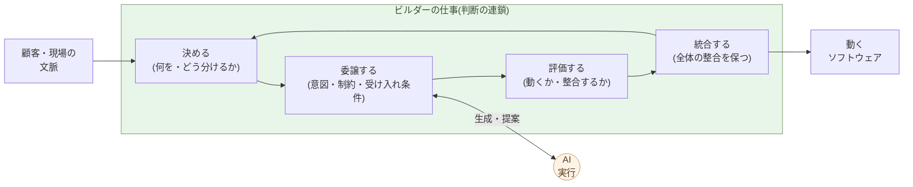

# ビルダーという役割

**何を作るかを決め、AIに作らせ、出力を評価し、構造を統合する ──
これがビルダーの仕事だ**。

第3章で、コーダー(実行を中心に置く役割)が経済的に成立しなく
なる、と書いた。残るのは判断側の役割で、これを本書ではビルダー
と呼ぶ。本章はその定義 ── 何をする人か、どこがコーダーと違うか、
なぜ 1 人 + AI で動くか ── を、具体例とともに固定する。

具体例は、本記事が乗っているこのサイト ── aiseed.dev ── そのもの
を使う。1 人 + AI で 24 時間で立ち上げた、約 30,000 行のコード、
40 ページ規模の出版物に相当するテキスト、5 つの独立系列を持つ
バイリンガルサイト。再現用のソースとビルドスクリプトはすべてこの
リポジトリに入っている。

## ビルダーは「何を作るかを決め、AIに作らせる」役割だ

ビルダーの仕事は、四つの連鎖で動く。

- **決める** ── 顧客・現場・自分の文脈から、何を作るかとどう分ける
  かを判断する。仕様の骨格を書き出す。
- **委譲する** ── AIに、意図と制約と受け入れ条件を渡す。コードは
  AIが書く。
- **評価する** ── 返ってきた出力が、動くか、設計と整合するか、想定
  した文脈で破綻しないかを判断する。
- **統合する** ── 部分を全体に組み込み、整合を保つ。次の「決める」
  に戻る。

この四つは線形ではなく **ループ** だ。一周まわす時間は、規模により
数分から数時間。一日に何十周も回す。コードを書く時間はその中で
最小化される ── 書くのは AI だからだ。

このループの全長を握っているのが、ビルダーだ。AIは**ループの中の
一辺**にしか入らない。判断・委譲条件・評価基準・統合方針は、ビルダー
の側にある。

## コーダーとの構造的な違い

コーダーとビルダーは、似て見えて構造的に別の役割だ。

| 軸 | コーダー | ビルダー |
|---|---|---|
| 仕事の中心 | コードを書く | 何を作るかを決める |
| スキルの中心 | 言語・フレームワーク習熟 | 構造分解・評価眼・統合 |
| 評価軸 | 速く・正しく・読みやすく書けるか | 正しいものを正しい構造で出せるか |
| 文脈 | 仕様として降りてくる | 自分で切り出す |
| 守備範囲 | 単一技術の深さ | 複数技術の横断 |
| 一案件の人数 | チーム(複数人) | 1 人 + AI |
| スループット | 書く速度に比例 | 判断の質 × ループの回転数 |

特に最後の二行が、本章の中心だ。コーダーは「人数 × 書く速度」で
出力が決まる。ビルダーは「**判断の質 × ループの回転数**」で出力が
決まる。AI が実行を取った世界では、後者の式が支配的になる。

> コーダーの世界では「人を増やせば速くなる」が成立した
> (上限はあったが)。
> ビルダーの世界では **人を増やしても速くならない** ── 判断の
> 連鎖は、頭の数では分散できない。

スキルの中身も別物だ。ビルダーが磨くのは、こういう能力:

- **構造分解** ── 大きな塊を、AI に渡せる粒度に切り出す
- **言語化** ── 暗黙の意図を、AI が処理できる明示的な記述に変える
- **評価眼** ── 動くだけのコードと、設計に合うコードを区別する
- **統合判断** ── 部分が全体の整合を壊していないかを見る
- **取捨選択** ── AI が返した三つの案から「これでいく」を選ぶ

これらは、言語の文法を覚えれば身につくものではない。**コードを
書いてきた経験は役立つ**が、それは判断の足場としてであって、書く
能力そのものではない。

## ビルダーの一日は、判断の密度で決まる

ビルダーの一日は、コーダーの一日と中身が違う。

- **コーダーの一日**: 多くの時間は書いている。途中で要件を確認し、
  レビューを受け、修正を入れる。集中している間は、エディタの中。
- **ビルダーの一日**: 多くの時間は**読んでいる、決めている、評価
  している**。AI が返してきた差分を読む、不変条件に違反していない
  か確かめる、次に何を頼むかを書く。エディタは中継地点だ。

エディタの操作量は減る。代わりに、**1 時間あたりの判断の数**が
何倍にもなる。AI が返すサイクルが短いほど、判断の密度は上がる。
これは脳に対する負荷が、書く仕事より重い ── ビルダーの疲れは、
肩や手ではなく、**意思決定の容量**に出る。

連続して何時間も動けるビルダーは、限られる。これが「**ビルダーは
人を増やしても速くならない**」の生理的な側面だ。

## 実証 ── aiseed.dev は 1 人 + AI で 24 時間

抽象論はここまで。具体例として、本記事が乗っているサイトそのものを
分解する。

aiseed.dev は次の構成を持つ:

- **5 つの独立系列**: Insights(構造分析)、Blog、Claude × Debian
  (技術書)、AIネイティブな仕事の作法(本シリーズ)、リン資源
  枯渇と自然農法
- **約 150 本の章・記事**(日英バイリンガル、ソース MD は計約 300 本)
- **約 40 ページ規模の長尺出版物**(各系列の章を集めると単行本〜
  小冊子に相当)
- **約 30,000 行のコード**(`tools/build_article.py` 約 1,600 行、
  各系列のテンプレート、ビルドユーティリティ、OG 画像生成、サイト
  マップ・hreflang・robots、各系列固有のタイポグラフィ)
- **バイリンガル**(JA / EN、各記事に hreflang、ハードコーディング
  された言語スイッチャー)
- **Mermaid・コードハイライト・OG 画像自動生成・サイトマップ**

これを **個人 1 人 + AI**(主に Claude)が、**およそ 24 時間**で
立ち上げた。

「24 時間」はキーボードに向かっていた実時間で、決断はその外側でも
行われている。だが、ソフトウェアの実装フェーズが 24 時間で済む、と
いう事実は重い。同じスコープを従来の SIer 委託モデルに乗せると、
提案と見積もりの段階だけで同等の時間が消える ── このプロセスの
コスト構造は第6章で扱う。

再現性を担保するために、すべてのソース・テンプレート・ビルドスクリプト
はこのリポジトリにコミットされている。`make` 一発で同じサイトが立ち
上がる(設計原則は親シリーズの章ごとの `example-N/` と同じだ)。

> ビルダーがやったこと: 何を作るかを決め、構造を分解し、AI に
> 書かせ、出力を評価し、統合した。**書いたコードの大半は AI、
> 設計判断のすべては人間**。

## 1 人 + AI が、なぜ 10 人のコーダーチームより速いか

「同じスコープを 1 人 + AI で 24 時間」を、コーダーチームでやろうと
すると、何が起きるか:

- 仕様の同期会議 ── 何時間か
- タスク分割と割り当て ── 半日
- 各コーダーが書く ── 数日〜数週間
- 統合フェーズ ── 数日〜数週間(統合のコストは人数の二乗で増える、
  これも Brooks の指摘)
- レビューと修正のラウンド ── 数週間
- ドキュメント整備 ── 後回し、たいてい乖離する

スコープが同じでも、**チーム化のコストが工程の半分以上を食う**。
ビルダー + AI には、このコストがほぼゼロだ:

- 仕様の同期会議 ── ビルダーの頭の中で完結
- タスク分割と割り当て ── ビルダーが AI に直接渡す
- コードを書く ── AI が並列で書く
- 統合フェーズ ── ビルダーが直接統合(他人の頭との同期が不要)
- レビューと修正 ── 同じループの中で回る
- ドキュメント ── AI が設計から再生成(第2章)

人数を増やすと**統合コストが二乗で増える**のは旧来の話。1 人 + AI
では、判断は分割不能だが、実行は AI 内部で並列化される ── 統合
コストの二乗成長を回避できる。これが「1 人 + AI が 10 人を超える」
の構造的な理由だ。

ただし、この優位は **ビルダーが判断を握り続ける限り**でしか成立
しない。第2章で見た「vibe coding」の罠 ── AI に丸投げして判断を
手放す ── に落ちると、ループは崩れて 1 人 + AI は何も生まないチーム
に劣化する。

> 1 人 + AI が強いのは、**判断と実行の境界が一人の中で閉じる**から
> だ。境界を増やすと、コストはチームと同じになる。

## 次の章へ

ビルダーは、コーダーチームより少ない人数で、より大きなスコープを
出力できる。これは社内の話だけではない ── **顧客が直接ビルダーを
やる**ことも、同じ理屈で可能になる。

次の章では、顧客自身が AI と組んで開発する時代を扱う。これまで
SIer に発注していた顧客の何割が、自分で作るほうに流れるのか。

---

## 関連記事

- [第1章: AIがコードを書く能力で人間トップクラスに到達した](/ai-native-ways/software/coder-top/)
- [第2章: 保守フェーズの構造変化こそ本質](/ai-native-ways/software/maintenance-shift/)
- [第3章: コーダーの仕事はなくなる](/ai-native-ways/software/coder-end/)
- [構造分析08: 企業ITの税を引く](/insights/enterprise-tax/)
- [構造分析12: AIと個人事業](/insights/ai-and-individual/)
