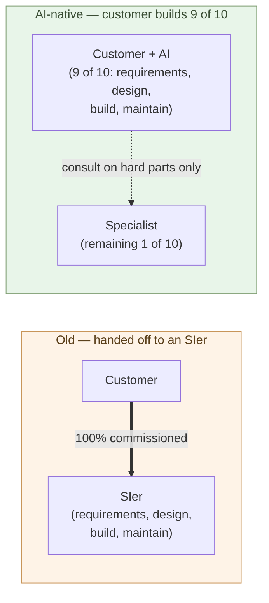

# Customers Co-Develop with AI

**Nine-tenths of software development moves to the customer plus AI.
The remaining tenth is consulted to a specialist**.

Chapter 4 showed why a builder runs as one person plus AI: the
boundary between judgment and execution closes inside one head. That
structure does not require the builder to be on the company's payroll
— **the customer can become the builder**, by the same logic.

This chapter takes up that transition. Why customers can do
nine-tenths themselves, what stays in the one-tenth, and the fact that
breaks the old commissioning premise: **what AI cannot do, the SIer
cannot do either**.

## A new structure — the customer builds nine-tenths

Software commissioning used to be all-or-nothing. The customer hired
an SIer to handle the whole bundle — requirements, design, build,
test, operations and maintenance. That was the SIer commission model
(the structure is covered in detail in the next chapter).

In the AI-native structure this splits in two:

- **Nine-tenths is built by the customer in partnership with AI** —
  requirements come from the customer's own context, design is decided
  by the customer, code is written by AI, maintenance runs as
  customer + AI.
- **One-tenth is outsourced** — genuinely new technical territory,
  specialized regulation or compliance, cross-organizational
  authority issues, or advisory help on the kind of pitfall you only
  learn from experience.

"Nine-tenths" is not a precise figure. But as structure, **the order
of magnitude changes** — from old-style 100% commissioning to AI-
native 9 : 1 internal build. That difference redraws the entire map
of software commissioning.

> Old: "the customer hands requirements over, and the SIer does the
> rest."
> AI-native: "**customer + AI does nine-tenths; only the hard parts
> go to a specialist**."

## Why customers can do nine-tenths themselves

Three forces lined up at the same time.

**(1) AI took execution** (Chapters 1 and 3) — "you cannot build it
unless you hire someone who can write code" no longer holds. Claude
Max at $200 a month gets you the world's top-tier coding ability.

**(2) The customer always had the context**. The real difficulty of
requirements gathering is the business context, the dynamics among
stakeholders, the regulatory constraints, the organizational history
— translating all of those into something a coder can act on. The
SIer has to **listen from the outside** and then translate; if the
customer pairs with AI, the **context is on hand from the beginning**.
The round-trip cost of translation drops to zero. **The builder's
foundation is the liberal arts** (Chapter 4) — meaning that doctors,
lawyers, executives, researchers, anyone whose professional life
centers on judgment and verbalization, can move directly into the
builder role on top of that foundation when paired with AI.
A coding history is not a prerequisite.

**(3) The cost of learning fell by orders of magnitude** (next
section) — the wall of "you have to study before you can build
anything" is dramatically lower with AI.

These three came together only in the last few years. Ten years ago
you had (2) but not (1) or (3), and in-house development was
effectively impossible. So commissioning was the only option. **"We
had to hire the SIer" was a structural fact, not a fact about
capability** — two of the three forces were missing, no more, no
less.

## The cost of learning fell by orders of magnitude

The biggest barrier to "doing it yourself" used to be the learning
cost.

The old learning cycle:

- Read a book or take a course (weeks to months)
- Wrestle with the official docs (days to weeks)
- Run the sample code (hours to days)
- Apply it to your own problem and get stuck (days to weeks)
- Eventually, the first working code

With AI in the loop:

- Ask AI, in plain language, "I want to do this"
- AI returns a working sample (seconds to minutes)
- Run it, look at the result, ask the next thing
- Unclear bits get answered on the spot
- A working first version in a few hours

The old "six months to a year for an entry-level grasp" becomes "**a
few hours to a few days and you have something running**." This is
not a speed story; it is a story about **the decision of whether to
do it yourself or hand it off**. If it takes half a year, you
outsource. If it takes a few days, you do it. **The line moved**.

> When the cost of learning falls by orders of magnitude,
> **the break-even point between outsourcing and doing it yourself**
> moves with it.

## The starting point is not writing code

"The customer builds nine-tenths" makes people brace for writing
nine-tenths of the code themselves. That is not it. **The builder's work
begins, before writing any code from scratch, with assembling proven OSS
to replace the vendor's products.**

Most of a company's software was never something you "build" — it was
something you "buy": Microsoft 365, Azure, the vendor packages under the
core systems. What replaces them already runs all over the world.
Authentication is PocketBase, documents OnlyOffice, sharing and
versioning Forgejo, the database PostgreSQL, analysis DuckDB, the AI
Command A+ — all open, free, and running on your own machine (the parent
series' Chapter 14 untied Microsoft 365 into eleven OSS pieces).

What the builder does is **choose, wire, and fit to the company's
context.** This is the most concrete form of Chapter 4's builder
definition — "decide what to make, have AI make it, evaluate the output,
integrate the structure." A great deal of it moves forward without
writing a single line of code.

The order matters too. **First, untie the vendor with OSS and put the
foundation — identity, data, sharing — on your own side.** Then, and only
then, write **the logic that is genuinely your own** together with AI.
Writing code comes in the later half, after the foundation is laid — and
the amount shrinks to your company-specific part.

This lowers the barrier further. Assembling running OSS is easier than
implementing from scratch. "The customer builds nine-tenths" is decided
not by coding ability but by **the design judgment of replacement** — and
that is exactly what professionals grounded in the liberal arts do best
(Chapter 4).

> Most of "building nine-tenths yourself" is not "writing code."
> It is **assembling proven OSS and untying the vendor.**
> Code is only the thin final layer that sits on top.

There is an overlooked inversion here. **Generic functionality is already
shared with the world as OSS** — authentication, documents, the database,
video conferencing; someone built each, released it, and tens of thousands
hardened it. The builder need not write any of it from scratch. So the
magnitudes swap. **The attention goes to AI, but nine-tenths of the work is
actually carried by shared OSS — the effect of OSS is greater than the
effect of AI.** AI is only the tool that quickly writes the
company-specific one-tenth that sits on top.

This asymmetry is what holds up "the customer builds nine-tenths." **Share
the generic as OSS, and write only the specific with AI** — if you had to
write all of it from scratch, building nine-tenths in-house would be
impossible. It is precisely because builders the world over pool the
generic part as OSS that one person + AI can run a company's software.

## What AI cannot do, the SIer cannot do either

This is the strongest claim of the chapter.

The old reason to hire an SIer was "we cannot build it ourselves."
The SIer had **specialist capability**, the customer did not — that
was the premise of commissioning.

Look at that premise in the AI-native world. **The AI the SIer uses
and the AI the customer uses is the same AI**. Claude, GPT, Gemini —
there is no SIer-only edition. The SIer's coder using Claude Code and
the customer using Claude Code are using the same tool.

In that situation, **what AI cannot do, the SIer cannot do either**:

- Problems AI cannot solve → people at the SIer using the same AI
  get stuck the same way.
- Technical areas AI does not know → SIer staff using the same AI
  fumble similarly.
- Domains where AI errs → if the SIer uses AI, the SIer errs the
  same.

The SIer's real remaining advantage sits in "experience and judgment
in areas AI cannot handle." This is important — it does remain — but
it is **the one-tenth**. The nine-tenths "AI can do" work, if
commissioned to an SIer, only ends with AI writing it on the back
end. **The customer asking AI directly produces nearly the same
result**.

There is an exception. **Lock-in**. The SIer's proprietary
frameworks, custom abstraction layers, multi-year human dependence —
these are designed so that the customer cannot substitute by pairing
with AI (the structure is covered in Chapter 8). But for new
projects, for customers with lock-in-free options, **the SIer's
advantage shrinks to the one-tenth territory**.

> The SIer's distinctive capability lives **only in the one-tenth
> where AI does not reach**.
> In the other nine-tenths, the SIer was already just having AI write
> it.

## The remaining one-tenth — what customers do hire out

What stays in the "1" of "9 : 1"?

- **Genuinely new technical territory** — areas AI does not have
  enough examples for (frontier research applications, novel protocol
  design)
- **Specialized regulation or compliance** — medical, financial,
  legal, construction, where a misjudgment is catastrophic
- **Cross-organizational authority** — multi-organization
  negotiation, on-site consensus, contract terms
- **Scale-driven design decisions** — problems that only surface at
  tens of millions to hundreds of millions of users
- **Pitfalls you only learn from experience** — specialists who have
  failed at this before and know "do not build it that way, you will
  regret it"

These are sensibly bought **as advice**. Hours to weeks of consulting
per engagement, or specialists hired by the hour. **Not multi-year
SIer commissions**.

No one hires a lawyer or a tax accountant to do their ordinary
business. They consult them when a hard issue arises. In the
AI-native world, software-development specialists move to **the same
position lawyers and accountants occupy** — Chapter 9 takes this up
in detail.

## Where the next chapter goes

Once customers build nine-tenths in-house, nine-tenths of the orders
that used to flow to SIers disappear. Why does the SIer commission
model fail to absorb that loss? Where, structurally — in price, in
process, or in organization — is the inefficiency that breaks down?

The next chapter dissects the SIer commission model itself.

---

## Related articles

- [Chapter 1: AI Solves the World's Hardest Coding Problems](/en/ai-native-ways/software/coder-top/)
- [Chapter 3: The Coder's Job Goes Away](/en/ai-native-ways/software/coder-end/)
- [Chapter 4: The Builder Role](/en/ai-native-ways/software/builder/)
- [Parent series, Chapter 14: Replacing Microsoft 365 Wholesale (untying 11 layers with OSS)](/en/ai-native-ways/microsoft-365/)
- [Chapter 8: The Lock-In Problem](/en/ai-native-ways/software/lockin/)
- [Chapter 9: Companies Hire Builders](/en/ai-native-ways/software/hiring-builders/)
- [Structural analysis 08: Subtracting the enterprise-IT tax](/en/insights/enterprise-tax/)
- [Structural analysis 12: AI and the sole proprietor](/en/insights/ai-and-individual/)
